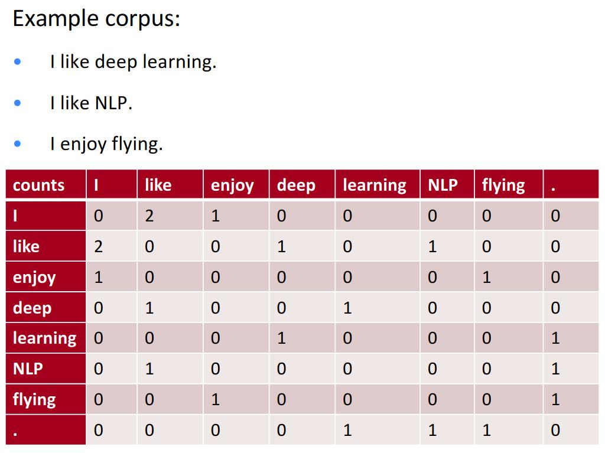

# solution

## node2vec

## Approach2: co-occurrence matrix

The drawbacks:

* Increase in size with vocabulary

* Very high dimensional: requires a lot of storage

* Symmetric matrix to the diagonal (irrelevant whether left or right context)

* Sparsity

  

Solution to those drawbacks

* Idea: store “most” of the important information in a fixed, small
number of dimensions: a dense vector

* Usually 25–1000 dimensions, similar to word2vec

* We can apply Dimensionality Reduction on X such as SVD

* SVD is a classic linear algebra result. Expensive to compute for large matrice

[Link](https://web.stanford.edu/class/cs224n/slides/cs224n-2019-lecture02-wordvecs2.pdf)
