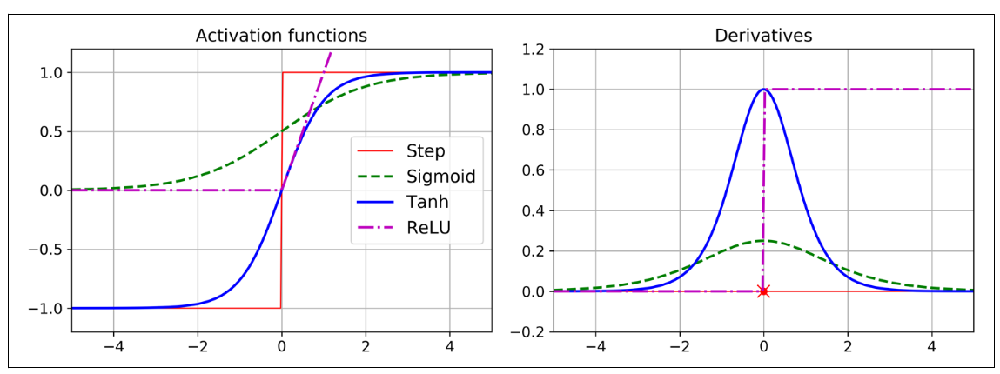
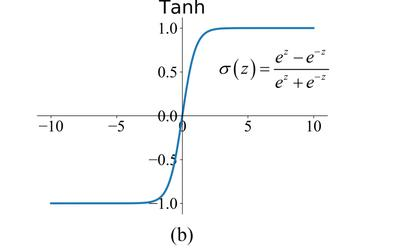
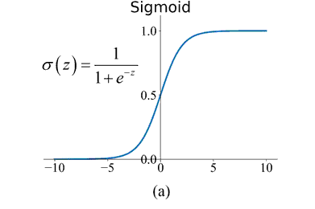
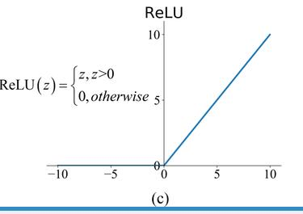
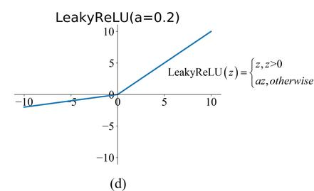
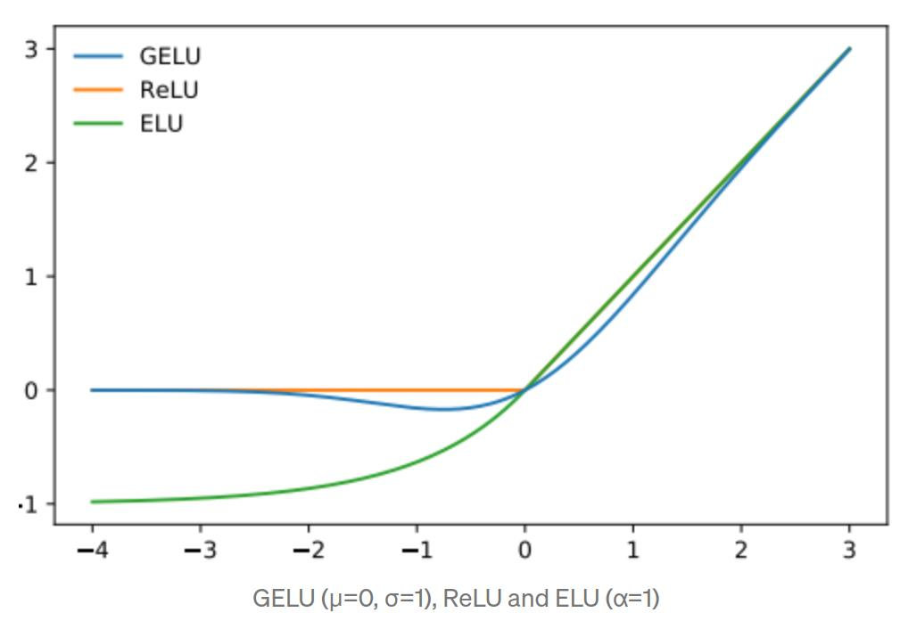

<!--ts-->
   * [Activation functions](#activation-functions)
      * [Why to use activation functions?](#why-to-use-activation-functions)
      * [Type of Activation Layers](#type-of-activation-layers)
         * [Tanh (Hyperbolic Tangent)](#tanh-hyperbolic-tangent)
         * [Sigmoid](#sigmoid)
         * [ReLU (Rectified Linear Unit)](#relu-rectified-linear-unit)
         * [LeakyReLU](#leakyrelu)
         * [Gelu (Gaussian Error Linear Unit)](#gelu-gaussian-error-linear-unit)
         * [Application activation functions usage](#application-activation-functions-usage)
      * [Nicely summary table](#nicely-summary-table)

<!-- Added by: gil_diy, at: Wed 06 Apr 2022 12:40:10 IDT -->

<!--te-->

# Activation functions

## Why to use activation functions?

For example, if f(x) = 2x + 3 and g(x) = 5x – 1, then chaining these two linear functions
gives you another linear function: f(g(x)) = 2(5x – 1) + 3 = 10x + 1. So if you don’t
have some nonlinearity between layers, then even a deep stack of layers is equivalent
to a single layer, and you can’t solve very complex problems with that. Conversely, a
large enough DNN with nonlinear activations can theoretically approximate any continuous function.

[Great explanation: The need for nonlinear activation functions](https://stats.stackexchange.com/questions/275358/why-is-increasing-the-non-linearity-of-neural-networks-desired)

---------------------------------------------------------------------------------

  

[activation functions](https://keras.io/api/layers/activations/)

## Type of Activation Layers

### Tanh (Hyperbolic Tangent)

  

### Sigmoid

* 2012 paper on **automatic speech recognition** uses a logistic **sigmoid activation function**.

  

### ReLU (Rectified Linear Unit)

* **AlexNet** computer vision architecture uses the **ReLU** activation function, as the computer vision architecture **ResNet**.

  

### LeakyReLU

  

### Gelu (Gaussian Error Linear Unit)

* Language processing model **BERT** uses a smooth version of the ReLU, the **GELU**.

* GELU is a smoother version of the RELU.

* It is Non convex, non-monotonic function is not linear in the positive axis and exhibits curvature at all points.

  

[Link](https://medium.com/@shoray.goel/gelu-gaussian-error-linear-unit-4ec59fb2e47c)

### Application activation functions usage

 Activation function | Used in models
------------|-----
 ReLU | Used in AlexNet
 GELU | Used in BERT

## Nicely summary table

[Wikipedia Activation functions](https://en.wikipedia.org/wiki/Activation_function#Table_of_activation_functions)