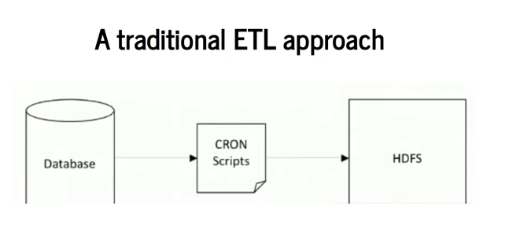

<!--ts-->
   * [Airflow](#airflow)
      * [What is airflow?](#what-is-airflow)
      * [How things has been done without Airflow?](#how-things-has-been-done-without-airflow)
         * [Problems](#problems)
      * [Airflow features](#airflow-features)
      * [Code examples](#code-examples)
      * [Setup airflow with python](#setup-airflow-with-python)
      * [Reference](#reference)

<!-- Added by: gil_diy, at: Sun 03 Apr 2022 19:07:51 IDT -->

<!--te-->


# Airflow

Was developed by Airbnb. help to write production data pipeline.

## What is airflow?

A platform to programmatically author, schedule, and monitor workflows.

Use Airflow to author workflows as directed acyclic graphs (DAGs) of tasks. The Airflow scheduler executes your tasks on an array of workers while following the specified dependencies.

[Link](https://github.com/apache/airflow)


## How things has been done without Airflow?

**Traditional ETL approach**

<p align="center">
  
</p>

Example of a naive approach:

* Writing a script to pull data from database and send it to HDFS to process

* Schedule the script as cronjob


[Well video](https://youtu.be/AHMm1wfGuHE)

### Problems

* **Failures** - Retry if failure happens (how many times? how often? )

* **Monitoring** - Success or failure status, how long does the process runs?

* **Dependencies** 
```
      1) Data dependecies: Upstream data is missing
      2) Execution dependencies: job 2 runs after job 1 is finished
```
* Scalability: There is **no centralized scheduler** betweeen different cron machines.

* Deployment: Deploy new changes constantly

* Process historic data: Backfill/Rerun historical data


## Airflow features

* The project joined the Apache Software Foundation's incubation program 2016

*  A workflow (data-pipeline) managment system developed by Airbnb

* The features:

* A framework to define tasks & dependencies by Airbnb

* Executing, schedualing, distributing tasks across worker nodes.

* View of present and past runs, logging feature

* Extensible through plugins

* Nice UI, possibilty to define REST interface

* Interact well with database


* A framework to define tasks & dependencies by Airbnb


## Code examples

[Link](https://github.com/apache/airflow/tree/main/airflow/example_dags)

## Setup airflow with python

[Link](https://youtu.be/fRZaJU1HJnk)


## Reference

[Introduction to Apache Airflow](https://www.youtube.com/watch?v=AHMm1wfGuHE&list=PLYizQ5FvN6pvIOcOd6dFZu3lQqc6zBGp2)