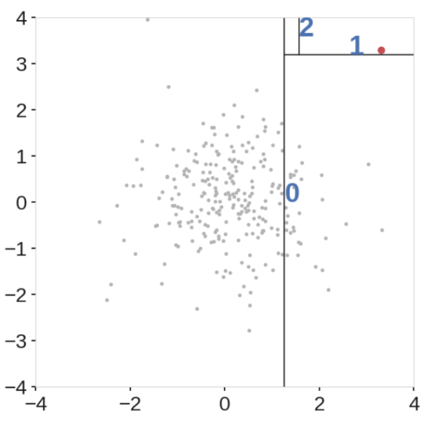
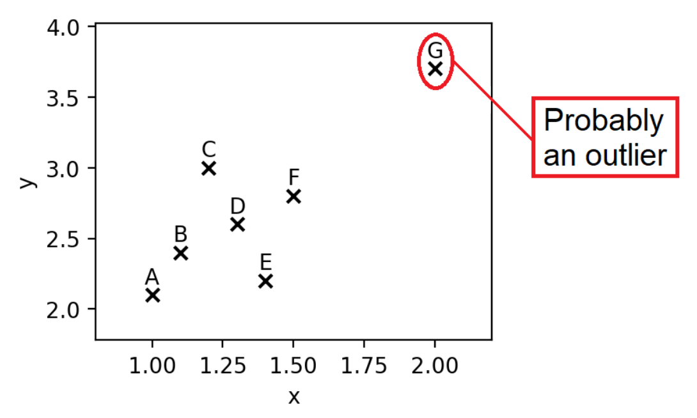
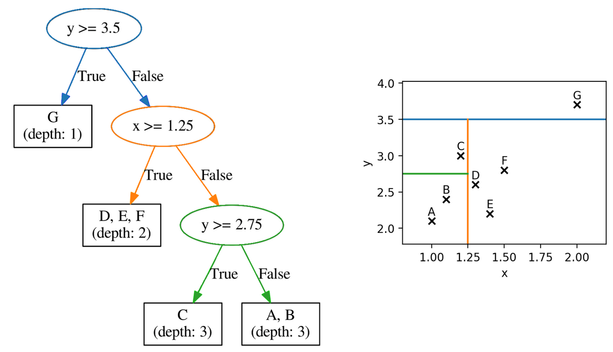
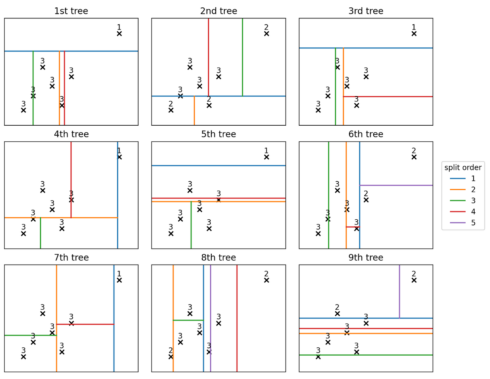
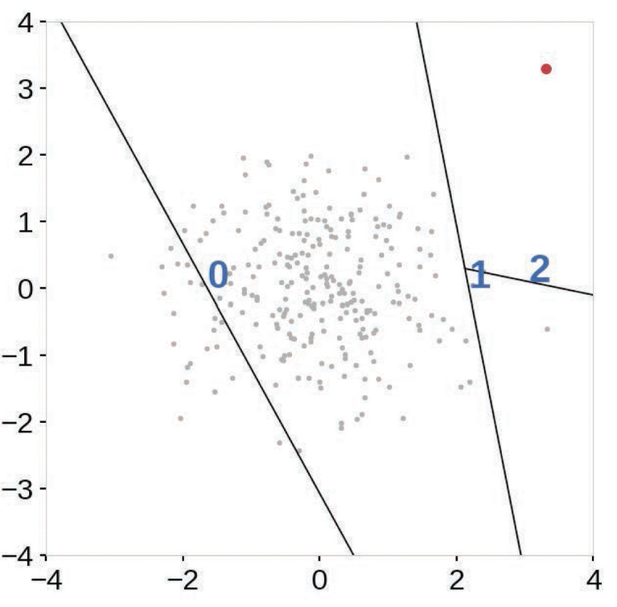

<!--ts-->
   * [Anomaly Detection](#anomaly-detection)
   * [Methods](#methods)
      * [Classical Approaches](#classical-approaches)
         * [Density based](#density-based)
            * [DBSCAN (Density-based spatial clustering)](#dbscan-density-based-spatial-clustering)
            * [LOF (Local Outlier Factor)](#lof-local-outlier-factor)
         * [Distance based](#distance-based)
            * [K-NN](#k-nn)
            * [K-MEANS](#k-means)
            * [Regression hyperplan distance](#regression-hyperplan-distance)
         * [Parametric](#parametric)
            * [GMM](#gmm)
            * [One Class SVMs](#one-class-svms)
            * [One-Class SVM (SGD)](#one-class-svm-sgd)
            * [Extreme value theory](#extreme-value-theory)
      * [Isolation Forest](#isolation-forest)
         * [Drawbacks](#drawbacks)
         * [Example](#example)
      * [Extended Isolation Forests](#extended-isolation-forests)
      * [Deep Learning approaches](#deep-learning-approaches)
         * [Autoencoder](#autoencoder)
            * [LSTM Autoencoder -  to capture the temporal dependencies of the data](#lstm-autoencoder----to-capture-the-temporal-dependencies-of-the-data)
      * [PyOD (Useful Package)](#pyod-useful-package)

<!-- Added by: gil_diy, at: Tue 19 Apr 2022 16:12:03 IDT -->

<!--te-->

# Anomaly Detection

The real challenge in anomaly detection is to construct the right data model to seperate outliers from noise and normal data.


# Methods

## Classical Approaches
### Density based

#### DBSCAN (Density-based spatial clustering)

* DBSCAN is a density-based and unsupervised machine learning algorithm.

* Density as a measure of the number of data points in a specified area. 

* The most exciting feature of DBSCAN clustering is that it is robust to outliers.

* It also does not require the number of clusters to be told beforehand, unlike K-Means, where we have to specify the number of centroids.

`eps` - Maximum distance between two samples for one to be considered to be connected to the other.
And the distance can be defined by any type of distance function, the “Euclidean distance” for example.


```python
from sklearn.cluster import DBSCAN

from sklearn.cluster import DBSCAN
dbscan=DBSCAN()
dbscan.fit(df[[“sepal_length”, “sepal_width”]])

```
#### LOF (Local Outlier Factor)

* The local outlier factor computes an anomaly score called anomaly score that measures how isolated the point is with **respect to the surrounding neighborhood**.

* Distance techniques can't identify Local Outlier, hence we switch to **density based techniques**
like the local Outlier factor algorithm.

* Basic idea of LOF: comparing the local density of a point with the densities of its neighbors. A has a much lower density than its neighbors.


```python
import numpy as np
from sklearn.neighbors import LocalOutlierFactor

X = [[-1.1], [0.2], [101.1], [0.3]]
clf = LocalOutlierFactor(n_neighbors=2)
clf.fit_predict(X)
array([ 1,  1, -1,  1])
```

### Distance based

#### K-NN


Many distance-based techniques (e.g. KNNs) suffer the **curse of dimensionality** when they compute distances of every data point in the full feature space.

#### K-MEANS

#### Regression hyperplan distance

### Parametric

#### GMM

#### One Class SVMs

```python
from sklearn.svm import OneClassSVM

ocsvm = OneClassSVM(kernel='rbf', gamma=0.00005, random_state = 42, nu=0.1)
ocsvm.fit(x_train)
```

#### One-Class SVM (SGD)

#### Extreme value theory


## Isolation Forest

Isolation Forest is an unsupervised anomaly detection algorithm that uses a **random forest algorithm** (decision trees), under the hood to **detect outliers** in the dataset. 

* Isolation Forests are computationally efficient and have been proven to be very effective in Anomaly detection.

* In an Isolation Forest, randomly sub-sampled data is processed in a tree structure based on randomly selected features.

* The samples that travel deeper into the tree are **less likely to be anomalies as they required more cuts to isolate them**.

* Similarly, the samples which end up in **shorter branches indicate anomalies** as it was easier for the tree to separate them from other observations.

[isolation-forest well explained](https://towardsdatascience.com/isolation-forest-the-anomaly-detection-algorithm-any-data-scientist-should-know-1a99622eec2d)

[Reference]([Link](https://youtu.be/qNDcPUeCEPI))

<p align="center">
  
</p>

```python
from sklearn.ensemble import IsolationForest


iso_forest = IsolationForest(contamination=0.1)
iso_forest.fit(X_train)

anomaly_scores = iso_forest.decision_function(x_validate)
```

* In sklearn an anomaly score of `-1` is assigned to anomalies and `1` to normal points.

* The range of output from  IsolationForest `decision_function` is between -0.5 and 0.5, where smaller values mean more anomalous. The predict function then applies a threshold to this function to get either -1 (anomaly) or 1 (not anomaly). 
The `decision threshold` is stored as model.threshold_ and defaults to `0.0`.

* The funciton `decision_function(X)` - **Average anomaly score** of X of the base classifiers.

**Contamination** - percentage of anomalies present in the data

Isolation Forests are computationally efficient and have been proven to be very effective in Anomaly detection.


### Drawbacks

* The final anomaly score depends on the **contamination parameter**, provided while training the model. This implies that we **should have an idea of what percentage of the data is anomalous beforehand** to get a better prediction.

* The model suffers from a bias due to the way the branching takes place.


### Example

```python
import pandas as pddf = pd.DataFrame({
    'x': [1.0, 1.1, 1.2, 1.3, 1.4, 1.5, 2.0],
    'y': [2.1, 2.4, 3.0, 2.6, 2.2, 2.8, 3.7]
}, index = ['A', 'B', 'C', 'D', 'E', 'F', 'G'])
```

<p align="center">
  
</p>

As we know Isolation forest, uses number of trees (i.e: `n_estimators = 100`):

```python
from sklearn.ensemble import IsolationForest

iforest = IsolationForest(n_estimators = 100).fit(df)
```

<p align="center">
  
</p>

Here are the 9 trees out of the 100 trees:

<p align="center">
  
</p>


## Extended Isolation Forests

Extension to Isolation Forests called **‘Extended Isolation Forests’**. In EIF, horizontal and vertical cuts were replaced with cuts with **Random Slopes**.

<p align="center">
  
</p>


## Deep Learning approaches

### Autoencoder

Why Do We Apply Dimensionality Reduction to Find Outliers?

* Recall that in an autoencoder model the number of the neurons of the input and output layers corresponds to the number of variables.

* The number of neurons of the hidden layers is always less than that of the outside layers

```python
threshold = np.mean(train_loss) + np.std(train_loss)
print('Threshold: ', threshold)
```

#### LSTM Autoencoder -  to capture the temporal dependencies of the data


## PyOD (Useful Package)

[pyod Github](https://github.com/yzhao062/pyod)

[Github - Examples](https://github.com/yzhao062/pyod/tree/master/examples)

* Pycaret uses under the hood PyOD too.

* Unsupervised techniques can detect many outliers. But due to its unspervised nature it is not stable, meaning overfitting to a specific dataset - Achieve Model Stability by Aggregating Multiple Models.


* binary labels (0: inliers, 1: outliers)

```python
y_train_scores = clf1.decision_scores_  # raw outlier scores

# get the prediction on the test data
y_test_pred = clf1.predict(X_test_scaled)  # outlier labels (0 or 1)
# clf.decision_function: Predict raw anomaly score of X using the fitted detector.
y_test_scores = clf1.decision_function(X_test_scaled)  # outlier scores

y_test_pred = pd.Series(y_test_pred)
y_test_scores = pd.Series(y_test_scores)

```


