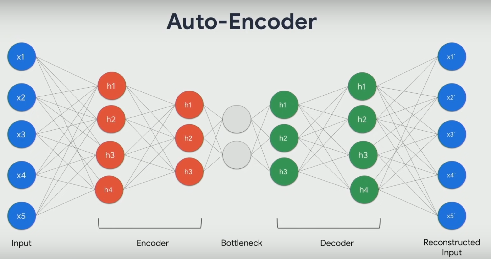

<!--ts-->
   * [Autoencoders](#autoencoders)
      * [Why Do We Apply Dimensionality Reduction to Find Outliers?](#why-do-we-apply-dimensionality-reduction-to-find-outliers)
      * [Reconstruction loss](#reconstruction-loss)
      * [Usage of Autoencoders](#usage-of-autoencoders)
      * [LSTM Autoencoder](#lstm-autoencoder)

<!-- Added by: gil_diy, at: Wed 20 Apr 2022 09:46:07 IDT -->

<!--te-->

# Autoencoders

  

  

* Recall that in an autoencoder model the number of the neurons of the input and output layers corresponds to the number of variables.

* We train the autoencoder using only the normal dataset no the abnormal part (excluding the anomaly during training)

[Google colab notebook regarding Autoencoders usage](https://colab.research.google.com/github/tensorflow/docs/blob/master/site/en/tutorials/generative/autoencoder.ipynb) 

## Why Do We Apply Dimensionality Reduction to Find Outliers?

* once the main patterns are identified, the **outliers are revealed**. Many distance-based techniques (e.g. KNNs) suffer the **curse of dimensionality** when they compute distances of every data point in the full feature space. High dimensionality has to be reduced.

* Interestingly, during the process of dimensionality reduction outliers are identified. We can say outlier detection is a by-product of dimension reduction.

## Reconstruction loss

When training an **Autoencoder**, the objective is to reconstruct the input as best as possible. This is done by minimizing a loss function (just like in supervised learning).
This function is known as **reconstruction loss**.

Cross-entropy loss and Mean squared error are common examples.

[Reconstruction loss explained](https://youtu.be/qN3n0TM4Jno?t=2098)

## Usage of Autoencoders

1) Compressing Data

2) Image Colorization using Convolutional Autoencoders

2) Denoising Data

3) Anomaly detection

## LSTM Autoencoder

* We’ll have a look at how to feed Time Series data to an Autoencoder. We’ll use a couple of **LSTM layers** (hence the LSTM Autoencoder) to capture the **temporal dependencies** of the data.

To classify a sequence as normal or an anomaly, we’ll pick a threshold above which a heartbeat is considered abnormal.

[time-series-anomaly-detection-ecg.ipynb in Pytorch](https://colab.research.google.com/drive/1_J2MrBSvsJfOcVmYAN2-WSp36BtsFZCa#scrollTo=3RY_N3gOmfDi)
