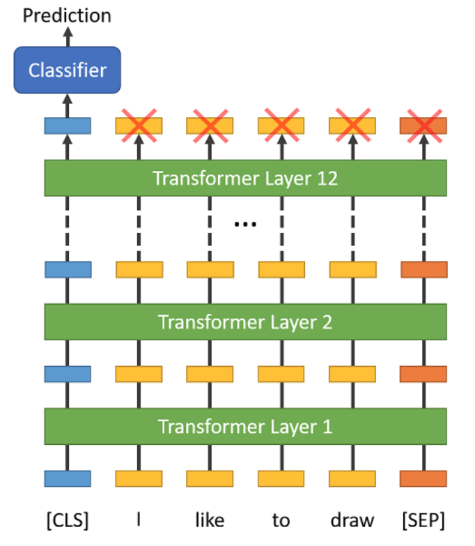

<!--ts-->
   * [Bert](#bert)
      * [DistilBERT](#distilbert)
      * [Getting to know WordPiece Embeddings](#getting-to-know-wordpiece-embeddings)
      * [Special Tokens](#special-tokens)
      * [Map the token strings to their vocabulary indeces](#map-the-token-strings-to-their-vocabulary-indeces)
      * [Preprocessing data](#preprocessing-data)
      * [Tokenizers](#tokenizers)
         * [Tokenizer](#tokenizer)
            * [BertTokenizer](#berttokenizer)
            * [encode](#encode)
            * [encode_plus](#encode_plus)
      * [Bert tasks](#bert-tasks)
         * [Classification](#classification)
         * [BertTokenizerFast](#berttokenizerfast)
      * [Other](#other)
      * [Datasets shared in HuggingFace](#datasets-shared-in-huggingface)
   * [Reference](#reference)

<!-- Added by: gil_diy, at: Sun 27 Mar 2022 12:26:02 IDT -->

<!--te-->


# Bert

<p align="center">
  
</p>


The BERTBase model uses **12 layers of transformers block** with a hidden size of 768 and number of self-attention heads as 12 and has around 110M trainable parameters.

**Bert shortcomings**

Layer | Weights
------------|-----
Embeding layer | ~24M
Transformers Layer | ~7M x 12 transformers =  ~85M

1. BERT is very large

  a. Slow fine-tuning
  
  b. Slow inferencing

Research is been done to address this problem,
there is a technique **"Distillation"**, you try to remove as many of the weights 
as possible from the model while still retaining most of the accuracy.

Bert is capable of:

* Classification
* NER
* POS (Part Of Speech)
* Question Answering

Bert is not capable of:
* Language model
* Text generation

## DistilBERT
Let’s use a variant of BERT called DistilBERT. DistilBERT is a lightweight version of
BERT that is 60% faster and 40% smaller while preserving 97% of BERT’s language
understanding capabilitie


## Getting to know WordPiece Embeddings

BERT tokenizer was created with a WordPiece model. This model greedily creates a fixed-size vocabulary of:

1) Individual characters
2) Subwords, and words that best fits our language data

Since the vocabulary limit size of our BERT tokenizer model is 30,000, the WordPiece model generated a vocabulary that contains all English characters plus the ~30,000 most common words and subwords found in the English language corpus the model is trained on. 


Each words has 768 features in it's embedding.

<p align="center">
  
</p>

```python
with open("vocabulary_Bio_ClinicalBERT.txt", 'w') as f:
  # For each token...
  for token in tokenizer.vocab.keys():
      # Write it out and escape any unicode characters.
      f.write(token + '\n')
```


This vocabulary contains four things:

* Whole words

* Individual characters

* Subwords occuring at the front of a word or in isolation (“em” as in “embeddings” is assigned 
the same vector as the standalone sequence of characters “em” as in “go get em” )
Subwords not at the front of a word, which are preceded by `##` to denote this case


## Special Tokens

Token | Explanantion
------------|-----
  `[CLS]` | Classification
  `[PAD]` | Padding
  `[MASK]` | Padding
  `[SEP]`  | Differentiate sentences
  `##` | Two hash signs, preceding some of these subwords are just our tokenizer’s way to denote that this subword or character is part of a larger word and preceded by another subword
  `OOV`| Out of vocabulary
  `UNK`| Unknown Token

The "Attention Mask" is simply an array of 1s and 0s indicating which tokens are padding and which aren't (seems kind of redundant, doesn't it?!). This mask tells the "Self-Attention" mechanism in BERT not to incorporate these PAD tokens into its interpretation of the sentence.

##  Map the token strings to their vocabulary indeces

```python
# Split the sentence into tokens.
tokenized_text = tokenizer.tokenize(marked_text)

# Map the token strings to their vocabulary indeces.
indexed_tokens = tokenizer.convert_tokens_to_ids(tokenized_text)

# Display the words with their indeces.
for tup in zip(tokenized_text, indexed_tokens):
    print('{:<12} {:>6,}'.format(tup[0], tup[1]))

# Output:

# [CLS]           101
# after         2,044
# stealing     11,065
# money         2,769
# from          2,013
# the           1,996
```

[Reference WordPiece Embeddings in Bert](https://www.youtube.com/watch?v=zJW57aCBCTk&list=PLam9sigHPGwOBuH4_4fr-XvDbe5uneaf6&index=2)  

## Preprocessing data

## Tokenizers 

### Tokenizer


#### BertTokenizer
```python
    tokenizer = BertTokenizer.from_pretrained('bert-base-cased')

    example_text = 'I will watch Memento tonight'

    bert_tokenizer_output = tokenizer(example_text,
                           padding='max_length',
                           max_length=10,  
                           truncation=True,
                           return_tensors="pt")  
```

* The maximum length of each sequence. In this example we use 10, but for our actual dataset we will use 512, which is the maximum length of a sequence allowed for BERT.

* Since we’re using Pytorch, then we use pt. If you use Tensorflow, then you need to use tf.

* The output of the bert_tokenizer_output is a dictionary which consists of:

`input_ids` , `token_type_ids`, `attention_mask`

**input_ids** - mapping the tokens to uninque input IDs (Token IDs)

**token_type_ids** - Add segment IDs which are used to distinguish one sentence
from the other. All the tokens from the first sentence will be mapped to 0 and all the tokens from the second sentence will be mapped to 1.

**attention_mask** - is used to differentiate the actual tokens and [PAD] tokens. I will map all the actual tokens to 1 and the [PAD] tokens to 0.

#### encode

1. Split the sentence into tokens.
2. Add the special [CLS] and [SEP] tokens.
3. Map the tokens to their IDs.
4. Pad or truncate all sentences to the same length.

```python
for sent in sentences:

    # Tokenize the text and add `[CLS]` and `[SEP]` tokens.
    input_ids = tokenizer.encode(sent, add_special_tokens=True)
```

#### encode_plus

```python
# Tokenize all of the sentences and map the tokens to thier word IDs.
input_ids = []
attention_masks = []

# For every sentence...
for sent in sentences:
    # `encode_plus` will:
    #   (1) Tokenize the sentence.
    #   (2) Prepend the `[CLS]` token to the start.
    #   (3) Append the `[SEP]` token to the end.
    #   (4) Map tokens to their IDs.
    #   (5) Pad or truncate the sentence to `max_length`
    #   (6) Create attention masks for [PAD] tokens.
    encoded_dict = tokenizer.encode_plus(
                        sent,                      # Sentence to encode.
                        add_special_tokens = True, # Add '[CLS]' and '[SEP]'
                        max_length = 64,           # Pad & truncate all sentences.
                        pad_to_max_length = True,
                        return_attention_mask = True,   # Construct attn. masks.
                        return_tensors = 'pt',     # Return pytorch tensors.
                   )
    
    # Add the encoded sentence to the list.    
    input_ids.append(encoded_dict['input_ids'])
    
    # And its attention mask (simply differentiates padding from non-padding).
    attention_masks.append(encoded_dict['attention_mask'])
```


5. Create the attention masks which explicitly differentiate real tokens from [PAD] tokens.


The first four features are in tokenizer.encode, but I'm using tokenizer.encode_plus to get the fifth item (attention masks). 

The tokenizer.encode_plus function combines multiple steps for us:


## Bert tasks

### Classification

For classification tasks, we must prepend the special `[CLS]` token to the beginning of every sentence.

This token has special significance. BERT consists of 12 Transformer layers. Each transformer takes in a list of token embeddings, and produces the same number of embeddings on the output (but with the feature values changed, of course!).

<p align="center">
  
</p>

On the output of the final (12th) transformer, **only the first embedding**
(corresponding to the [CLS] token) is used by the classifier.

### BertTokenizerFast


## Other

The BERT model is a deep neural network with 12 layers! Explaining the layers and their functions is outside the scope of this post, and you can skip over this output for now.


model.eval() puts our model in evaluation mode as opposed to training mode. In this case, evaluation mode turns off dropout regularization which is used in training.

```python
# Load pre-trained model (weights)
model = BertModel.from_pretrained('bert-base-uncased',
                                  output_hidden_states = True, # Whether the model returns all hidden-states.
                                  )

# Put the model in "evaluation" mode, meaning feed-forward operation.
model.eval()
```

## Datasets shared in HuggingFace

There are more than 3150 datsets in huggingface

```python
from datasets import list_datasets, load_dataset, list_metrics, load_metric

# Print all the available datasets
for idx, datset_name in enumerate(list_datasets()):
    print(idx, ') ', datset_name)
```

[github's Repo](https://github.com/huggingface/datasets)

# Reference	

[Bert's Book Github Repo](https://github.com/PacktPublishing/Getting-Started-with-Google-BERT)


