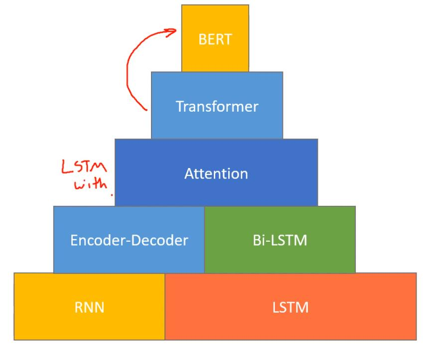
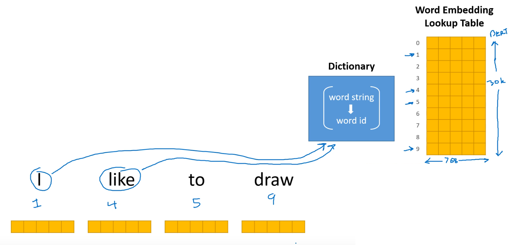

<!--ts-->
   * [Bert](#bert)
      * [Getting to know WordPiece Embeddings](#getting-to-know-wordpiece-embeddings)
      * [Special Tokens](#special-tokens)
      * [Map the token strings to their vocabulary indeces](#map-the-token-strings-to-their-vocabulary-indeces)
      * [Preprocessing data](#preprocessing-data)
      * [Tokenizers](#tokenizers)
         * [Tokenizer](#tokenizer)
            * [BertTokenizer](#berttokenizer)
         * [BertTokenizerFast](#berttokenizerfast)
      * [Other](#other)
      * [Datasets shared in HuggingFace](#datasets-shared-in-huggingface)
   * [Reference](#reference)

<!-- Added by: gil_diy, at: Sun 20 Mar 2022 11:53:50 IST -->

<!--te-->


# Bert

<p align="center">
  
</p>

## Getting to know WordPiece Embeddings

BERT tokenizer was created with a WordPiece model. This model greedily creates a fixed-size vocabulary of:

1) Individual characters
2) Subwords, and words that best fits our language data

Since the vocabulary limit size of our BERT tokenizer model is 30,000, the WordPiece model generated a vocabulary that contains all English characters plus the ~30,000 most common words and subwords found in the English language corpus the model is trained on. 


Each words has 768 features in it's embedding.

<p align="center">
  
</p>

```python
with open("vocabulary_Bio_ClinicalBERT.txt", 'w') as f:
  # For each token...
  for token in tokenizer.vocab.keys():
      # Write it out and escape any unicode characters.
      f.write(token + '\n')
```


This vocabulary contains four things:

* Whole words

* Individual characters

* Subwords occuring at the front of a word or in isolation (“em” as in “embeddings” is assigned 
the same vector as the standalone sequence of characters “em” as in “go get em” )
Subwords not at the front of a word, which are preceded by `##` to denote this case


## Special Tokens

Token | Explanantion
------------|-----
  `[CLS]` | Classification
  `[PAD]` | Padding
  `[MASK]` | Padding
  `[SEP]`  | Differentiate sentences
  `##` | Two hash signs, preceding some of these subwords are just our tokenizer’s way to denote that this subword or character is part of a larger word and preceded by another subword
  `OOV`| Out of vocabulary
  `UNK`| Unknown

##  Map the token strings to their vocabulary indeces

```python
# Split the sentence into tokens.
tokenized_text = tokenizer.tokenize(marked_text)

# Map the token strings to their vocabulary indeces.
indexed_tokens = tokenizer.convert_tokens_to_ids(tokenized_text)

# Display the words with their indeces.
for tup in zip(tokenized_text, indexed_tokens):
    print('{:<12} {:>6,}'.format(tup[0], tup[1]))

# Output:

# [CLS]           101
# after         2,044
# stealing     11,065
# money         2,769
# from          2,013
# the           1,996
```

## Preprocessing data

## Tokenizers 

### Tokenizer

#### BertTokenizer
```python
    tokenizer = BertTokenizer.from_pretrained('bert-base-cased')

    example_text = 'I will watch Memento tonight'

    bert_tokenizer_output = tokenizer(example_text,
                           padding='max_length',
                           max_length=10,  
                           truncation=True,
                           return_tensors="pt")  
```

* The maximum length of each sequence. In this example we use 10, but for our actual dataset we will use 512, which is the maximum length of a sequence allowed for BERT.

* Since we’re using Pytorch, then we use pt. If you use Tensorflow, then you need to use tf.

* The output of the bert_tokenizer_output is a dictionary which consists of:

`input_ids` , `token_type_ids`, `attention_mask`

**input_ids** - mapping the tokens to uninque input IDs (Token IDs)

**token_type_ids** - Add segment IDs which are used to distinguish one sentence
from the other. All the tokens from the first sentence will be mapped to 0 and all the tokens from the second sentence will be mapped to 1.

**attention_mask** - is used to differentiate the actual tokens and [PAD] tokens. I will map all the actual tokens to 1 and the [PAD] tokens to 0.


### BertTokenizerFast


## Other

The BERT model is a deep neural network with 12 layers! Explaining the layers and their functions is outside the scope of this post, and you can skip over this output for now.


model.eval() puts our model in evaluation mode as opposed to training mode. In this case, evaluation mode turns off dropout regularization which is used in training.

```python
# Load pre-trained model (weights)
model = BertModel.from_pretrained('bert-base-uncased',
                                  output_hidden_states = True, # Whether the model returns all hidden-states.
                                  )

# Put the model in "evaluation" mode, meaning feed-forward operation.
model.eval()
```

## Datasets shared in HuggingFace

There are more than 3150 datsets in huggingface

```python
from datasets import list_datasets, load_dataset, list_metrics, load_metric

# Print all the available datasets
for idx, datset_name in enumerate(list_datasets()):
    print(idx, ') ', datset_name)
```

[github's Repo](https://github.com/huggingface/datasets)

# Reference	

[Bert's Book Github Repo](https://github.com/PacktPublishing/Getting-Started-with-Google-BERT)


