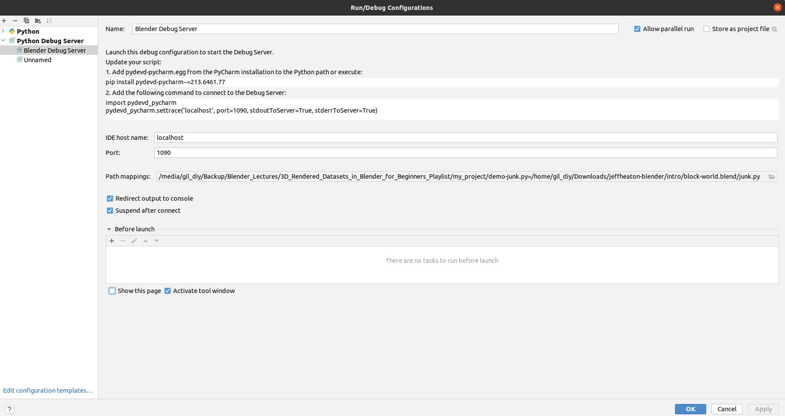

<!--ts-->
   * [Blender](#blender)
      * [Search in blender](#search-in-blender)
      * [Increase UI size](#increase-ui-size)
         * [Transforms Hotkeys](#transforms-hotkeys)
      * [What is edit mode?](#what-is-edit-mode)
      * [Main hotkey conventions](#main-hotkey-conventions)
         * [How to rotate in 45 degrees in the y axis?](#how-to-rotate-in-45-degrees-in-the-y-axis)
         * [How to grab and move up by 1m on the z axis?](#how-to-grab-and-move-up-by-1m-on-the-z-axis)
      * [What is edit mode?](#what-is-edit-mode-1)
      * [What is object mode?](#what-is-object-mode)
      * [Operations in object mode](#operations-in-object-mode)
      * [Reset position to the origin axis](#reset-position-to-the-origin-axis)
      * [Materials](#materials)
      * [Give color to objects](#give-color-to-objects)
      * [Pick all loop](#pick-all-loop)
      * [Apply scale](#apply-scale)
      * [Add Bevel](#add-bevel)
      * [Modifiers](#modifiers)
      * [Draw path](#draw-path)
      * [Walk with Camera](#walk-with-camera)
      * [Applying shade smooth](#applying-shade-smooth)
      * [Adding Subdivision surface](#adding-subdivision-surface)
      * [Render images with transparent background](#render-images-with-transparent-background)
      * [Shader Editor (Node)](#shader-editor-node)
      * [Annotate in Blender](#annotate-in-blender)
      * [Installing addon in Blender](#installing-addon-in-blender)
      * [Python with Blender](#python-with-blender)
         * [Show all python operations done under the hood](#show-all-python-operations-done-under-the-hood)
         * [Adding Scripts to Blender For the Templates Menu](#adding-scripts-to-blender-for-the-templates-menu)
         * [Executing External Scripts](#executing-external-scripts)
         * [Get the datapath from GUI (Very useful)](#get-the-datapath-from-gui-very-useful)
         * [Debugging with Pycharm](#debugging-with-pycharm)
            * [How to set Breakpoint and debug in pycharm code in Blender?](#how-to-set-breakpoint-and-debug-in-pycharm-code-in-blender)
      * [Animation](#animation)
         * [Interpolation](#interpolation)
      * [Jeff Heaton explaines](#jeff-heaton-explaines)
      * [Useful web pages](#useful-web-pages)

<!-- Added by: gil_diy, at: Sun 06 Feb 2022 12:30:42 IST -->

<!--te-->

# Blender


## Search in blender

A pop-up menu with access to all Blender tools is available press `F3`

## Increase UI size

[Link](https://www.youtube.com/watch?v=Py9CHZkHh4U)

### Transforms Hotkeys


 Description | Hotkey
------------|-----
Grab | G (pick axis and press: x,y,z)
Rotate | R (pick axis and press: x,y,z)
Scale | S (pick axis and press: x,y,z)
Orbiting (Rotating the view) | press the middle button on the mouse
Pan | press the middle button on the mouse and Shift


## What is edit mode?

Description | Hotkey
------------|-----
vertex | `1`
Edge | `2`
Phase | `3`
Adding Loop Cut | `Ctrl + R`
on `Phase` you can press `i` ([Link](https://youtu.be/3cM2eUaSAPQ?t=1064)) | internal
on `Phase` you can press `e` ([Link](https://youtu.be/3cM2eUaSAPQ?t=1064))| external


## Main hotkey conventions

`Alt` key is the opposite operation

for example:

`h` vs `Alt + h`

`r` vs `Alt + r`

`s` vs `Alt + s`

`s` vs `Alt + s`


### How to rotate in 45 degrees in the y axis?

* Pressing r for `rotate`,  afterwards press `y` (focus on the y axis)

* Pressing `45` as for degrees


### How to grab and move up by 1m on the z axis?

* Pressing `g` and `m`,  afterwards press `z` (focus on the y axis)

* Pressing `1` as for 1 meter


## What is edit mode?

You'll be edit vertices, edges, phaces and to change the
shape of your mesh


## What is object mode?

You'll be able to move, rotate, and resize

## Operations in object mode

Description | Hotkey | Reference
------------|--------|------------
Duplicate | `Shift+d` | Duplicates an object

## Reset position to the origin axis

press on the object and press `alt+g`


Description | Hotkey | Reference
------------|--------|------------
Add object | `Shift+a` | 
different type of views (Wireframe/Solid/Rendered) | press `z` and pick
X-ray mode | `Alt + z`
reset to position (0,0,0) | `Alt+g`
Parenting object to another object | `Ctrl + p` | [Link](https://youtu.be/LMA3S2EGM6U?t=93)
focus on single object | click on the object and press `/` |
Return to simple view after focusing an object | press `/` |
hide object | pick object and press `h` |
unhide object | press `Alt + h` |
Show properties | press `n` |
Move and orbit | press down the Middle button mouse |
Focus on object in the horizon | click on the object and press period key `.` |
Add Object | `Shift+A` | 
Search Bar | `F3` | 
Switch between `Edit mode` to `Object mode` | tab |

Seperate | `p` |
Xray | `Alt+z` |
See properies (Rotate/Position) | `n` |
See Toolbox | `t` | 
Wireframe mode | `Shift + z` | 
Apply transfrom | `Ctrl + a` | 
Duplicate Object | `Shift + d` |
Duplicate Linked (All properties are inherited) | `Alt + d` | 
Inherit  | `Ctrl + l` |
Reset to scale | `Alt+s`
Extrude | `e`
Edge Slide | `gg`
Zoom region | `Shift + b` | [Link](https://docs.blender.org/manual/en/latest/editors/3dview/navigate/navigation.html#zoom-region)
reset view (in case you get lost) | `Home`
round edge loop in a sphere shape | `Shift+Alt+s`


## Materials


## Give color to objects

`color +l` => link material

[Link](https://youtu.be/kVXTmUWK_nI?t=2070)


## Pick all loop

Enter `edit mode` (press tab) and pick `1/2/3` (vertex/edge/phase),
after this press `Alt` and click on the phase you would like to get all phases which create a 
loop.

## Apply scale

Press `Ctrl+a` the Apply menu will popup and choose `scale` -> now all scale x,y,z will be 1,1,1

## Add Bevel

Press `Ctrl+b`, will add bevel

## Modifiers

Modifiers are automatic operations that affects geometry in non destructive way.
This means you can apply many modeling operation automatically without changing the base geometry of your object.

[Link](https://youtu.be/idcFMhoSdIc)


## Draw path

Press `Shift+a` pick `Curve` and choose `path` or other.

## Walk with Camera

`Shift+w` - I have assigned this hotkey

## Applying shade smooth

Pick  `Object Mode` and right click your mesh, and pick `shade smooth`

## Adding Subdivision surface

Click on the rench icon in the properties -> press add modifier -> Pick 'subdivision surface'

## Render images with transparent background 

Simple render would be press `F12`

To set `render properties` (Left sidebar) -> Film -> Mark the checkbox `Transparent`

Then press again `F12`


[Reference](https://www.youtube.com/watch?v=Z6UrNz6Pvz0)

## Shader Editor (Node)

Materials, lights and backgrounds are all defined using a network of shading nodes. These nodes output values, vectors, colors and shaders.

[Blender documnetation about shader](https://docs.blender.org/manual/en/latest/render/shader_nodes/index.html)


## Annotate in Blender

To annotate easily: [Youtube](https://youtu.be/99M_TypmX3k)

## Installing addon in Blender

Edit -> Preferences... -> Addons (Press 'Install' button)

## Python with Blender

### Show all python operations done under the hood

Enabling the debug option before running Blender:

```python
blender --debug-wm
```

### Adding Scripts to Blender For the Templates Menu

All Templates are well orginized in the following directory:

```bash
/opt/blender-3.0.0-linux-x64/3.0/scripts/templates_py
```

### Executing External Scripts
```python
import bpy
import os
 
dir_path = "/media/gil_diy/Backup/Blender_Lectures/3D_Rendered_Datasets_in_Blender_for_Beginners_Playlist/my_project"
filename = os.path.join(dir_path, "main.py")

exec(compile(open(filename).read(), filename, 'exec'))
```


[Reference](https://docs.blender.org/api/current/info_tips_and_tricks.html#executing-external-scripts)

### Get the datapath from GUI (Very useful)

[Link](https://blender.stackexchange.com/a/34592/140491)

### Debugging with Pycharm

[Link](https://code.blender.org/2015/10/debugging-python-code-with-pycharm/)

#### How to set Breakpoint and debug in pycharm code in Blender?

I'm assuming you have installed an Addon for Debugging in Blender ([Link](https://github.com/sybrenstuvel/random-blender-addons/blob/main/remote_debugger.py))

**Step 1:**
Re-open Blender
(Because sometimes the server on pycharm doesn't catches Blender)

**Step 2:**
Make sure in the blender python code is:
```python
import pydevd_pycharm

# Position the settrace invoke where you would like to start debugging in pycharm
pydevd_pycharm.settrace('localhost', port=1090, stdoutToServer=True, stderrToServer=True)
```

**Step 3:**
Run the Debugger Server in pycharm with `Debug icon`

<p align="center"> <!-- style="width:400px;" -->
  
</p>

You should see in the console:

```
Starting debug server at port 1,090
Use the following code to connect to the debugger:
import pydevd_pycharm
pydevd_pycharm.settrace('localhost', port=1090, stdoutToServer=True, stderrToServer=True)
Waiting for process connection…
```

**Step 4:**
In Blender press `F3` and choose:
`Connect to remote PyCharm Debugger`

After this you you can notice 
two new lines in pycharm's console were added:

```
Connected to pydev debugger (build 213.6461.77)
Expected: /home/gil_diy/Downloads/pycharm-2021.3.1/debug-eggs/pydevd-pycharm.egg/pydevd_attach_to_process/attach_linux_amd64.so to exist.
```

**Step 5:**

Run the script in Blender (you'll notice Blender is kinda stuck),
and then go to Pycharm.


**Step 6:**

You should make sure the mapping is configured well 
from remote path (Blender) to local path (Pycharm Project).

**For example:**

in case I'm working on in blender:

`/home/gil_diy/Downloads/jeffheaton-blender/intro/block-world.blend/junk.py`

Then in your Local path you should refer to:

`/media/gil_diy/Backup/Blender_Lectures/3D_Rendered_Datasets_in_Blender_for_Beginners_Playlist/my_project/demo-junk.py`

<p align="center"> <!-- style="width:400px;" -->
  
</p>

**Attention:** If Pycharm doesn't detect the mapping from remote path (Blender)
to local path (Python) then choose:

`Auto-detect` path mapping settings

**Step 7:**
Now you can debug code in pycharm flawllesly, 
with F8 and F7.


## Animation

### Interpolation

```python
bpy.ops.graph.interpolation_type(type = 'BEZIER')
```

[Link](https://docs.blender.org/api/current/bpy.ops.graph.html#bpy.ops.graph.interpolation_type)

## Jeff Heaton explaines 

[Link](https://youtu.be/EaXy-m2I5hs?t=895)

## Useful web pages

[Blender Documentation](https://docs.blender.org/manual/en/latest/)

[Blender Best practice](https://docs.blender.org/api/current/info_best_practice.html)

[Blender Python API](https://docs.blender.org/api/current/)

[Pycharm with Blender](https://b3d.interplanety.org/en/using-external-ide-pycharm-for-writing-blender-scripts/)

[Add Autocomplete](https://github.com/Korchy/blender_autocomplete)
