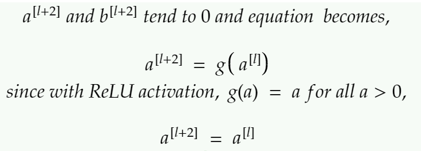
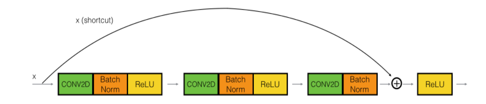
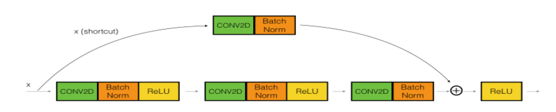
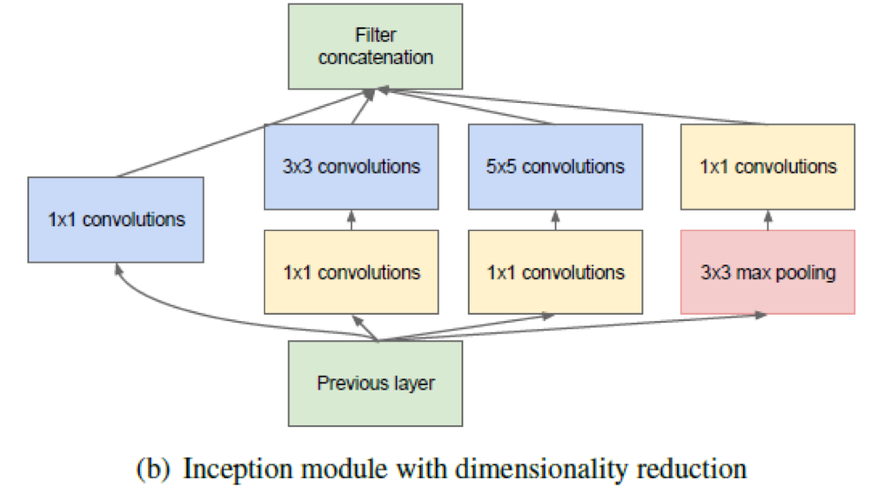

<!--ts-->
   * [Architecture Networks](#architecture-networks)
      * [Comprehensive look at 1X1 Convolution in Deep Learning](#comprehensive-look-at-1x1-convolution-in-deep-learning)
         * [Usages](#usages)
      * [VGG](#vgg)
      * [ResNet](#resnet)
         * [Residual block](#residual-block)
      * [Branch pruning - explained](#branch-pruning---explained)
      * [Inception Block/module](#inception-blockmodule)
         * [What does 1x1 convolution mean in a neural network?](#what-does-1x1-convolution-mean-in-a-neural-network)
      * [GAN - Generative Adversial Networks](#gan---generative-adversial-networks)
         * [Desciminator](#desciminator)
         * [Generator](#generator)

<!-- Added by: gil_diy, at: Thu 07 Apr 2022 00:20:19 IDT -->

<!--te-->

# Architecture Networks

 <!-- style="width:400px;" -->
  

## Comprehensive look at 1X1 Convolution in Deep Learning

* 1X1 Conv was used to reduce the number of channels while introducing non-linearity

* In 1X1 Convolution simply means the filter is of size 1X1 (Yes — that means a single number as opposed to matrix like, say 3X3 filter). This 1X1 filter will convolve over the ENTIRE input image pixel by pixel.

* Staying with our example input of 64X64X3, if we choose a 1X1 filter (which would be 1X1X3), then the output will have the same Height and Weight as input but only one channel — 64X64X1

* Now consider inputs with large number of channels — 192 for example. If we want to reduce the depth and but keep the Height X Width of the feature maps (Receptive field) the same, then we can choose 1X1 filters (remember Number of filters = Output Channels) to achieve this effect. This effect of cross channel down-sampling is called ‘Dimensionality reduction’.

  

[Article](https://arxiv.org/pdf/1312.4400.pdf)

[Link](https://medium.com/analytics-vidhya/talented-mr-1x1-comprehensive-look-at-1x1-convolution-in-deep-learning-f6b355825578)

### Usages

1. **Dimensionality Reduction**

GoogleNet, used 1X1 convolution layer for **dimension reduction** “to compute reductions before the expensive 3×3 and 5×5 convolutions

2.  **Building DEEPER Network (“Bottle-Neck” Layer)**

ResNet, had least error rate and swept aside the competition by using very deep network using ‘Residual connections’ and **‘Bottle-neck Layer’**.
using a sequence of 3 convolutional layers with filters the size of 1X1, 3X3, followed by 1X1 respectively to **reduce and restore dimension**.

The down-sampling of the input happens in 1X1 layer thus funneling a smaller feature vectors (reduced number of parameters) for the 3X3 conv to work on. Immediately after that 1X1 layer restores the dimensions to match input dimension so identity shortcuts can be directly used.

## VGG

## ResNet

* The [well known article](https://arxiv.org/pdf/1512.03385.pdf) was published in 2015 Dec, got more than 20,000 citations.

* We would assume stacking more layers would make the learning better,
but we can see in the accuracy result the comparison between 20-layer and 56-layer of "plain" networks.

  

In the context of residual neural networks, a `non-residual network` may be described as a `plain network`

### Residual block

  

The very first thing we notice to be different is that there is a direct connection which skips some layers(may vary in different models) in between.
This connection is called **’skip connection’** and is the core of residual blocks.

The formulation of `F(x)+x` can be realized by feedforward neural networks with "shortcut connections", shortcut connections are those skipping one or more layers. the shortcut connections simply perform `identity mapping`, and their outputs are added to the outputs of the stacked layers.

  

  

* This identity mapping created by these residual blocks is the reason why the addition of extra layers does not affect a residual network’s performance. Performance improvement is achieved whenever the extra layers learn some meaningful information from the data. While, the presence of the residual blocks prevents the loss of performance whenever, the activations tend to vanish or explode.

**Reminder:** identity map is a function that always returns the value that was used as its argument, unchanged.

It is worth mentioning, that for this technique to work the dimension of z[l+2] and a[l] should be similar as they need to be summed up. 

Depending on dimension of z[l+2] and a[l], there are two kinds of residual blocks: 

The type of residual blocks:

1) **Identical residual block**

In an identical residual block, the output of the shortcut path and the main path is of the same dimensions. This is achieved by **padding the input to each convolutional layer in the main path in such a way that the output and input dimensions remain the same**.

  

2) **Convolutional residual block**

  

In this type of residual block, the skip-connection consists of a convolutional layer to resize the output of the shortcut path to be of the same dimension as that of the main path. The layer can also make use of different filter sizes, including 1×1, padding, and strides to control the dimension of the output volume.

[Great reference](https://towardsdatascience.com/resnets-residual-blocks-deep-residual-learning-a231a0ee73d2)

------------------------------------------------------------

The **skip connections** in ResNet **solve the problem of vanishing gradient** in deep neural networks by allowing this alternate shortcut path for the gradient to flow through.

* Using ResNet has significantly enhanced the performance of neural networks with more layers and here is the plot of error when comparing it with neural networks with plain layers.

  

You can see the boost of performance of the **Skip connection**:

  

[Pytorch ResNet implementation from Scratch](https://youtu.be/DkNIBBBvcPs)

[Research paper](https://arxiv.org/pdf/1512.03385.pdf)

[ResNet and its Variants](https://towardsdatascience.com/an-overview-of-resnet-and-its-variants-5281e2f56035)

## Branch pruning - explained

[Link](https://towardsdatascience.com/pruning-neural-networks-1bb3ab5791f9)

## Inception Block/module

  

[Article](https://arxiv.org/pdf/1409.4842.pdf)

### What does 1x1 convolution mean in a neural network?

[Inception Network Motivation](https://youtu.be/C86ZXvgpejM)

[Link](https://youtu.be/KfV8CJh7hE0)

[Reference](https://medium.com/analytics-vidhya/talented-mr-1x1-comprehensive-look-at-1x1-convolution-in-deep-learning-f6b355825578)

## GAN - Generative Adversial Networks

The Neural Network consist of 'Desciminator' and 'Genearator'

When training the descriminator, hold the generator values constant;
and when training the generator, hold the discrimiantor constant. Each Should train against a static adversary.

### Desciminator 

For Desciminator, any CNN based classifier with 1 class (real) at the output
can be used (e.g VGG, Resnet, etc.).
So the **output of the discriminator** will not have softmax it will have only single neuron which will give zero or one (Real or Fake).

 <!-- style="width:400px;" -->
  

### Generator

* Generators try to generate Fake images.

* Each Generator starts with a **Random Noise Seed** (Latent Vector)

* Along the network the generator network upscales the image by using **transpose convolution** and fractional-strided convolutions.

Reminder: Transpose Convolution are **upscaler**, used for Encoder-Decoder architectures as **"Decomprossor"**.

[Link](file:///home/gil_diy/my_documentation_helper/pytorch/pytorch.html#transpose-convolution,-what-is-it?)

 <!-- style="width:400px;" -->
  

**Architecture guidelines for stable Deep Convolutions GANs:**

* Using batchnorm in both the **generator** and the **discriminator**.

* Remove fully connected hidden layers for deeper architectures.

* Use ReLU activation in generator for all layers except for the output, which uses tanh hyperbolic tangent function).

* Use LeakyReLU activation in the discriminator for all layers

[Link](https://github.com/jantic/DeOldify)