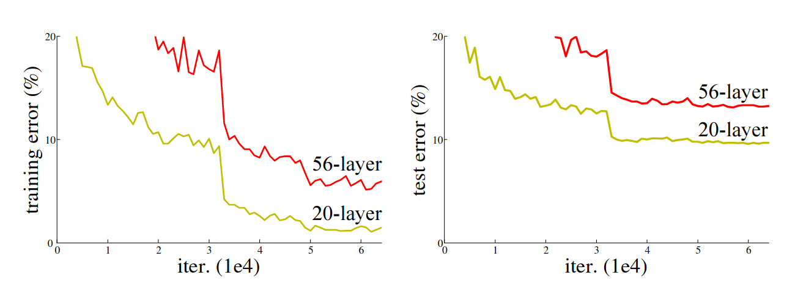
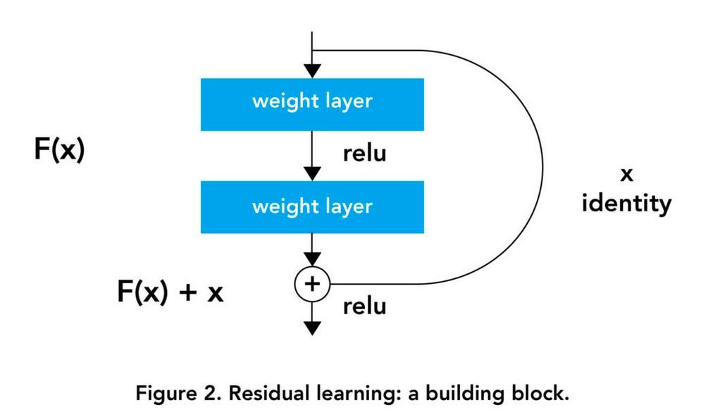
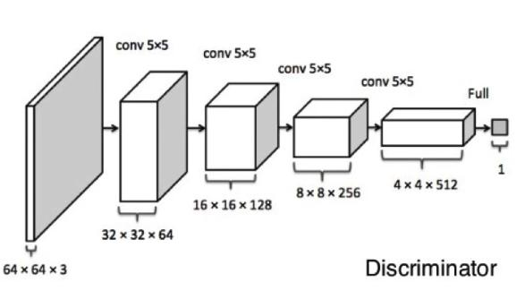
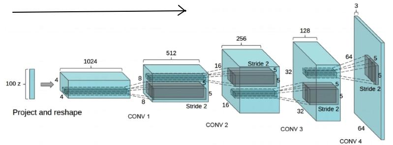

<!--ts-->
   * [Architecture Networks](#architecture-networks)
      * [VGG](#vgg)
      * [ResNet](#resnet)
         * [Residual block](#residual-block)
      * [GAN - Generative Adversial Networks](#gan---generative-adversial-networks)
         * [Desciminator](#desciminator)
         * [Generator](#generator)

<!-- Added by: gil_diy, at: Thu 24 Mar 2022 15:51:54 IST -->

<!--te-->

# Architecture Networks

 <!-- style="width:400px;" -->
  

## VGG

## ResNet

* The [well known article](https://arxiv.org/pdf/1512.03385.pdf) was published in 2015 Dec, got more than 20,000 citations.

* We would assume stacking more layers would make the learning better,
but we can see in the accuracy result the comparison between 20-layer and 56-layer of "plain" networks.

  

### Residual block

  

<!-- 

  

 -->

The very first thing we notice to be different is that there is a direct connection which skips some layers(may vary in different models) in between.
This connection is called **’skip connection’** and is the core of residual blocks.

The **skip connections** in ResNet **solve the problem of vanishing gradient** in deep neural networks by allowing this alternate shortcut path for the gradient to flow through.

* Using ResNet has significantly enhanced the performance of neural networks with more layers and here is the plot of error% when comparing it with neural networks with plain layers.

  

You can see the boost of performance of the **Skip connection**:

  

The formulation of `F(x)+x` can be realized by feedforward neural networks with "shortcut connections", shortcut connections are those skipping one or more layers. the sortcut connections simply perform `identity napping`, and their outputs are added to the outputs of the stacked layers.

[Pytorch ResNet implementation from Scratch](https://youtu.be/DkNIBBBvcPs)

[Research paper](https://arxiv.org/pdf/1512.03385.pdf)

[ResNet and its Variants](https://towardsdatascience.com/an-overview-of-resnet-and-its-variants-5281e2f56035)

## GAN - Generative Adversial Networks

The Neural Network consist of 'Desciminator' and 'Genearator'

When training the descriminator, hold the generator values constant;
and when training the generator, hold the discrimiantor constant. Each Should train against a static adversary.

### Desciminator 

For Desciminator, any CNN based classifier with 1 class (real) at the output
can be used (e.g VGG, Resnet, etc.).
So the **output of the discriminator** will not have softmax it will have only single neuron which will give zero or one (Real or Fake).

 <!-- style="width:400px;" -->
  

### Generator

* Generators try to generate Fake images.

* Each Generator starts with a **Random Noise Seed** (Latent Vector)

* Along the network the generator network upscales the image by using **transpose convolution** and fractional-strided convolutions.

Reminder: Transpose Convolution are **upscaler**, used for Encoder-Decoder architectures as **"Decomprossor"**.

[Link](file:///home/gil_diy/my_documentation_helper/pytorch/pytorch.html#transpose-convolution,-what-is-it?)

 <!-- style="width:400px;" -->
  

**Architecture guidelines for stable Deep Convolutions GANs:**

* Using batchnorm in both the **generator** and the **discriminator**.

* Remove fully connected hidden layers for deeper architectures.

* Use ReLU activation in generator for all layers except for the output, which uses tanh hyperbolic tangent function).

* Use LeakyReLU activation in the discriminator for all layers

[Link](https://github.com/jantic/DeOldify)