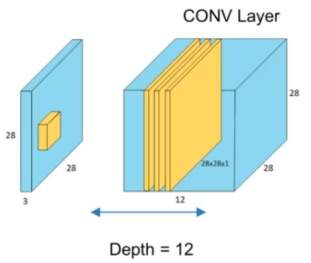
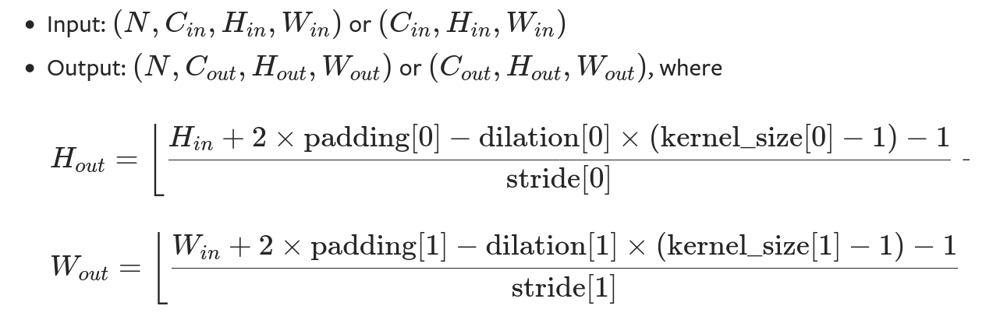
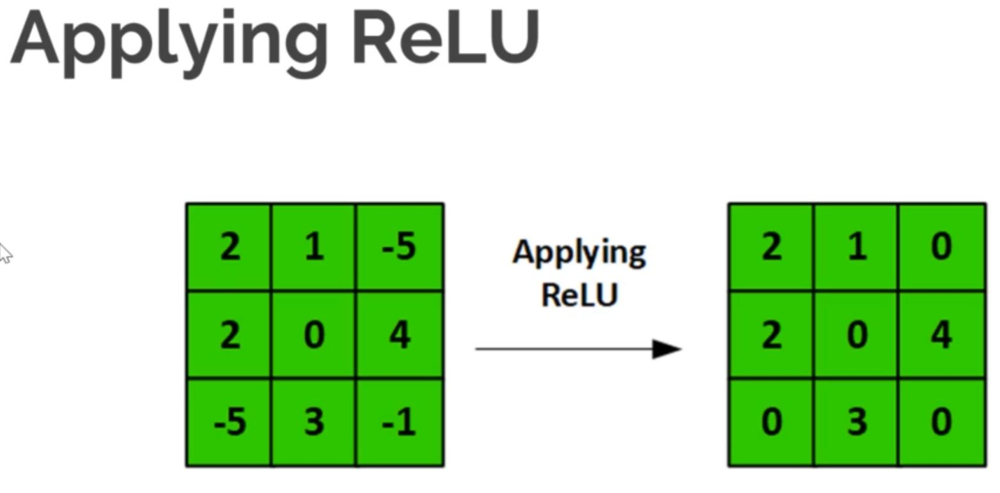
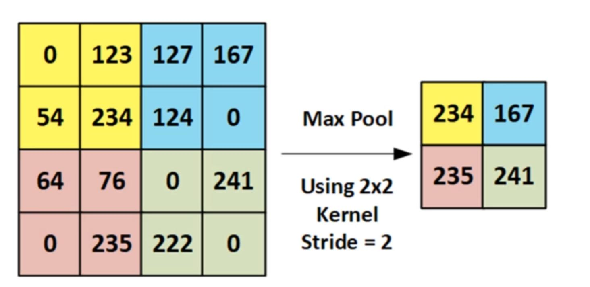
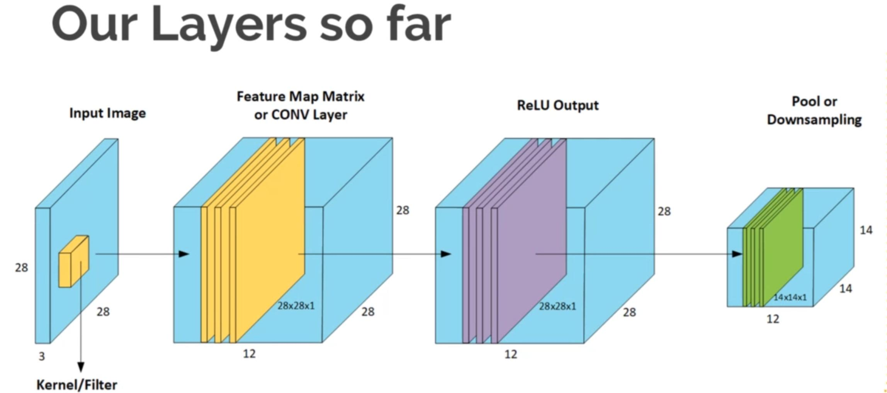
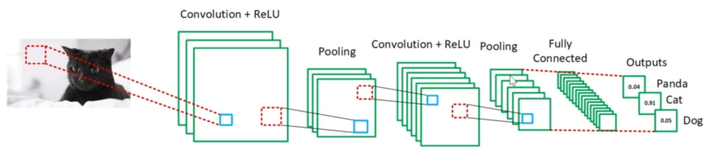
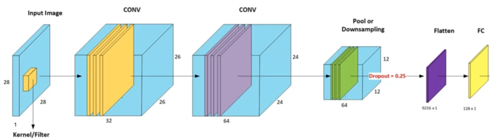

<!--ts-->
- [CNN](#cnn)
  - [What are the effects of the kernel?](#what-are-the-effects-of-the-kernel)
  - [Features/Activation maps and image features](#featuresactivation-maps-and-image-features)
  - [Designing feature maps](#designing-feature-maps)
    - [Depth](#depth)
    - [Stride](#stride)
    - [Zero-Padding](#zero-padding)
    - [Calculating our Convolution Output](#calculating-our-convolution-output)
      - [**Formula for the size of our feature maps (Non Square kernel)**](#formula-for-the-size-of-our-feature-maps-non-square-kernel)
      - [Number of parameters for convolution layer](#number-of-parameters-for-convolution-layer)
      - [Number of parameters for Dense Layer](#number-of-parameters-for-dense-layer)
  - [ReLU the Activation layer of choice for CNNs](#relu-the-activation-layer-of-choice-for-cnns)
  - [Pooling](#pooling)
  - [Recap](#recap)
  - [The Fully connected (FC) Layer (final Layer)](#the-fully-connected-fc-layer-final-layer)
  - [Training CNNs](#training-cnns)
  - [Basic CNN Design Rules](#basic-cnn-design-rules)
  - [Building a CNN in Keras](#building-a-cnn-in-keras)
    - [Loading out data](#loading-out-data)
    - [Hot One Encoding](#hot-one-encoding)
    - [building \& compiling our model](#building--compiling-our-model)
      - [Demo](#demo)
    - [Compile our model](#compile-our-model)
    - [Training our classifier](#training-our-classifier)
    - [Evaluate our Model and Generate Predictions](#evaluate-our-model-and-generate-predictions)
    - [Plotting loss and accuracy Charts](#plotting-loss-and-accuracy-charts)
    - [Saving and loading your model](#saving-and-loading-your-model)
    - [Displaying your model visually](#displaying-your-model-visually)
    - [Visualizing the effect of convolutions](#visualizing-the-effect-of-convolutions)
  - [Data Augmentation](#data-augmentation)
    - [Benefits of Data Augmentation](#benefits-of-data-augmentation)
    - [Displaying our misclassified data](#displaying-our-misclassified-data)
    - [Displaying the misclassfications](#displaying-the-misclassfications)
  - [Types of optimizers available in Keras](#types-of-optimizers-available-in-keras)
    - [Optimizers](#optimizers)
      - [Stochastic Gradient Descent](#stochastic-gradient-descent)
  - [Keras Checkpoint models and Callbacks](#keras-checkpoint-models-and-callbacks)
    - [Creating checkpoint models](#creating-checkpoint-models)
    - [Early stopping](#early-stopping)
    - [Reducing Learning rate on plateau](#reducing-learning-rate-on-plateau)
    - [Transfer learning](#transfer-learning)
  - [Annotation tools for image segmentation and drawing bbox](#annotation-tools-for-image-segmentation-and-drawing-bbox)
  - [Tool for finding duplicates images](#tool-for-finding-duplicates-images)
  - [Augmentation library](#augmentation-library)
  - [Quickdraw download images (handwritten)](#quickdraw-download-images-handwritten)
  - [Resources](#resources)
  - [Well known CNN Architectures](#well-known-cnn-architectures)
  - [Videos of handwritten flowchart](#videos-of-handwritten-flowchart)

<!-- Added by: gil_diy, at: Thu 07 Apr 2022 11:21:03 IDT -->

<!--te-->
# CNN

## What are the effects of the kernel?

- Depending on the values on the kernel,
we produce different maps. Applying our kernel produces scalar ourput as we just saw.

- Concolcing with different kernels produces intresting feature maps that can be used to detect different features.

- Convolution keeps rhe spatial relationships between pixels by learning image features over the small segments we pass of the input image


[Types of kernels](https://en.wikipedia.org/wiki/Kernel(image_processing))


## Features/Activation maps and image features

* Each cell in our activation matrix can be considered a feature extractor or neuron that looks at specific region of the image.

* In the first few layers, our neurons activation when edges or other.
 low level features are detected in Deeper layers, our neurons will be able to detect high level or big picture features or patterns such as bicycle, face. cat etc

 * The neurons in the first hidden layer have
learned simple patterns, while the neurons in the second hidden layer have
learned to combine the simple patterns of the first hidden layer into more
complex patterns. In general, the more layers there are, the more complex the
patterns can be


 ## Designing feature maps

  - Remember feature or activation maps were output of applying convolution operator.
  - We applied a 3x3 filter or kernel in our example
  - But, does the filter have to be 3x3? How many filters to we need? Do we need to pass over pixel by 
    pixel?
  - By tweaking the following **parameters** to control the size of our **feature maps**.

### Depth

- Depth describes the number of filters used it does not relate the image depth (3 channels) nor does it describe the number of hidden layers in our CNN.

- Each filter learns different feature maps that are activated in the presence of different image  features (edges, patterns, colors layouts)

<p align="center"> <!-- style="width:400px;" -->
  
</p>

* Remark: Zero padding is applied too.

### Stride

- Stride simply refers to the **step size** we take when we slide our kernel on the input image.
- Stride controls the size of the convolution Layer output.

- Using a larger Stride produce less overlaps in kernels, which means you end small features maps because you lose information that's  being passed from layer to layer.

- Stride is one of the methods we can control the spatial input size i.e the volume of the inputs into the other layers of our CNN.

### Zero-Padding
-  padding might be required to process inputs with a shape that does not perfectly fit kernel size and stride of the pooling layer. 

- Zero padding is a very simple concept that refers to a border we apply to the input volume.
  We haven't discussed deep networks much yet. but imagine we had multiple Convolution layers. You can quickly see that even with a stride of 1, we end up with a tiny output matrix quickly.
 - We add a border of 0's around our input. basically this is equivalent of adding a black border around an image (we can set our padding to 2 if needed)


**Keras supports these types of padding:**

  Valid padding, which means no padding

  Same padding, which means zero padding

  Causal padding, which applys to your Conv1D model to pad zeroes to the front of your inputs.

### Calculating our Convolution Output

Symbol | Descripton
------------|-----
K | Kernel/Filter Size
D | Depth
S | Stride
P | Zero Padding
I | Input Image Size

To ensure our filters cover the full input image symetrically, we used the following equation to do this sanity check. Once the result of this equation is an integer, out setting are valid.


#### **Formula for the size of our feature maps (Non Square kernel)**

Taken from pytorch documentation [Reference](https://pytorch.org/docs/stable/generated/torch.nn.Conv2d.html#torch.nn.Conv2d)

<p align="center"> <!-- style="width:400px;" -->
  
</p>

[Link](https://youtu.be/cin4YcGBh3Q?list=PLZbbT5o_s2xrfNyHZsM6ufI0iZENK9xgG)

#### Number of parameters for convolution layer

```python
param_number = output_channel_number * (input_channel_number*kernel_height*kernel_width + 1 )
```

* The **number 1** denotes the bias that is associated with each filter that we’re learning

[Well explained](https://youtu.be/bikmA-VmSbY)

#### Number of parameters for Dense Layer

```python
param_number = output_channel_number * (input_channel_number + 1)
```

[Reference](https://towardsdatascience.com/how-to-calculate-the-number-of-parameters-in-keras-models-710683dae0ca)

## ReLU the Activation layer of choice for CNNs

After we have applied the kernel we got feature map,
now we have applied the activation function. 
<p align="center"> <!-- style="width:400px;" -->
  
</p>


## Pooling 

- Pooling, also known as **subsampling** or **downsampling**, is a simple process where we reduce the size or dimensionality of Feature Map.

- The purpose of this reduction is to reduce the number of parameters needed to train . while retaining the most important features and information in the image.

- There are 3 types of Pooling we can apply: (1) Max , (2) Average, (3) Sum

**Example of max pooling:**
<p align="center"> <!-- style="width:400px;" -->
  
</p>

## Recap

<p align="center"> <!-- style="width:400px;" -->
  
</p>


## The Fully connected (FC) Layer (final Layer)

In Keras it is called Dense layer,
The FC Layer outputs the class probabilities, where each class is assigned a probabilty.
- All probabilties must sum to 1 .
The activation function used to produce these probabilties is the **Soft Max** Function as it turns the outputs of the FC layer (last layer) into probabilities.


* The more hidden layers the more features. praticularly high level features a CNN can learn.
I like to use a minimum of 2. which is shown in the diagram below.

The flow is: input -> Conv -> ReLU -> Pool -> Conv -> ReLU -> Pool -> FC -> Output

<p align="center"> <!-- style="width:400px;" -->
  
</p>

## Training CNNs
Just like NN, training CNNs is essentialy the same once we setup out Network layers. the flow follows the following steps:

1. Random weight initialization in the Convolution Kernels

2. forward propagates an image through our network (input -> CON -> ReLU -> Pooling -> FC)

3. Calculate the Total Error e.g say we got an output of (0.2, 0.4 , 0.4) while the true probabilties were [0,1,0]

4. Use Back Propogation to update our gradients (i.e the weights in the kernel filters) via gradient descent.

5. Keep propogating akk images through our network till Epoch is complete

6. Keep completing epochs till our loss and accuracy are satisfactory.

## Basic CNN Design Rules

* Input Layer typically Square e.g 28x28x3 or 64x64x3 (this isn't necessary but simplifies our design and speeds up our matrix calculations)

* Input should be divisible by at least 4 which allows for downsampling.

* **Filters (kernels)** are typically small either 3x3 or 5x5.

* As our output spatial volume is decreasing our number of filters learned is increasing, this is a common practice in designing CNN architectures.

* As far as choosing the appropriate number of filters, I nearly always recommend using powers of 2 as the values.

* Tune the exact value depending on (1) the complexity of your dataset and (2) the depth of your neural network, start with filters in the range [32, 64, 128] in the earlier and increasing up to [256, 512, 1024] in the deeper layers.

* **So, how should you choose your filter_size?**

First, examine your input image — is it larger than 128×128?
If so, consider using a 5×5 or 7×7 kernel to learn larger features and then quickly reduce spatial dimensions — then start working with 3×3 kernels:

If your images are smaller than 128×128 you may want to consider sticking with strictly 1×1 and 3×3 filters.

* **Stride** is typically 1 or 2 if inputs are large.

Typically you’ll see strides of 2×2 as a replacement to max poolin

* **Zero padding** is used typically to allow the output Conv layer to the same size as input.

* **Pool kernel** size is typically 2x2.

* **Dropout** is a very useful technique to avoid over fitting in CNNs.


## Building a CNN in Keras

Keras is a high level neural network API for **Python**
It has the abilty to use TensorFlow, CNTK or Theano backends

### Loading out data
### Hot One Encoding
### building & compiling our model

* Sequential model is a linear stack of layers

```python
from keras.models import Sequential

model = Sequential()
```

#### Demo

Example of bringing up a simple model without zero padding:

```python
from keras.layers import Dense, Dropout, Flatten
from keras.layers import Conv2D, MaxPooling2D

# First layer:
model.add(Con2D(32, kernel_size = (3,3), activation = 'relu', input_shape = input_shape))
# The output of the first layer moves towards the following layer
model.add(Con2D(64, (3,3), activation = 'relu')
model.add(MaxPooling2D(pool_size = (2,2)))

# Flatten is a function to feed a dense layer or fully connected layer.
model.add(Flatten())
model.add(Dense(128, activation = 'relu'))
model.add(Dense(num_classes, activation = 'softmax'))

```
<p align="center"> <!-- style="width:400px;" -->
  
</p>

### Compile our model

```python
model.compile(loss = 'categorical_crossentropy',
	optimizer = SGD(0.01), # Stochastic Gradient descent
	metrics = ['accuracy'])
```
### Training our classifier

```python
model.fit(x_train, y_train, epochs = 5, batch_size = 32)
```

### Evaluate our Model and Generate Predictions

```python
loss_and_metrixs = model.evaluate(x_test, y_test, batch_size = 120)
```
```python
classes = model.predict(x_test, batch_size = 120)
``` 

### Plotting loss and accuracy Charts


### Saving and loading your model

You can save manualy like this:
```python
model.save('my_model.h5')  # creates a HDF5 file 'my_model.h5'
```

or autosave can be done with `ModelCheckpoint`:

```python
checkpoint = ModelCheckpoint("./trained_models/fruits_fresh_cnn_1.h5",
                             monitor="val_loss",
                             mode="min",
                             save_best_only=True,
                             verbose=1)
```

Loading the model:

```python
from keras.models import load_model

# load model
model = load_model('model.h5')

# summarize model.
model.summary()
```

### Displaying your model visually


### Visualizing the effect of convolutions

The name of API that allows you to inspect the impact of convolutions on the images is **`model.layers` API.**


## Data Augmentation

In deep learning, the more training data/examples we have the better our model will be on unseen data (test data)

however, what if we had less than 1000 examples per image class?
Therefore we can use Keras Data Augementation to generate multiple version of our original image (shearing/shifting/zooming/skewing).
Adding variations such as rotations, shifts,zooming etc make our classifier much more invariant to chnages in our images. Thus making it far more robust.

Reduces overfitting due to the increased varity in the training dataset.

### Benefits of Data Augmentation
* Take a small dataset and make it much larger!

Keras' built-in **Data Augmentation API** performs a just-in-time augumented image dataset. This means images aren't created and dumped to a directory (which will be wasteful storage). Instead it generates this dataset during the training process.


[Types of Data Augmentation](https://keras.io/preprocessing/image/)

* We use the above code to create our generator with types of augementation to perform specified in the input arguments

```python

TRAINING_DIR = "/tmp/cats-v-dogs/training/"

train_detection = ImageDataGenerator(
  rescale = 1./255,
  rotation_range = 40, # The image will rotate by an angle between 0 to 40 degrees
  width_shift_range = 0.2, # Randomally shift the image by most 20 percent horizontally
  height_shift_range = 0.2, # Randomally shift the image by 20 most percent vertically
  shear_range = 0.2,
  zoom_range = 0.2,
  horizontal_flip = True, # Mirroring at random
  fill_mode = 'nearest' # For the pixels that have might been lost by those augemtaion's operations
  )

train_generator = train_datagen.flow_from_directory(TRAINING_DIR,
                                                    batch_size=100,
                                                    class_mode='binary',
                                                    target_size=(150, 150))

test_datagen = ImageDataGenerator(rescale = 1. / 255)
```


### Displaying our misclassified data

```python
import cv2
import numpy as np

# use numpy to create an array that stores a value of 1 when missclassification accurs

result = np.absolute(y_test - y_pred)
result_indices = np.nonzero(result > 0)

# Display the indices of misclassifications
print("Indices of misclassified data are: \n\n", str(result_indices))
```

### Displaying the misclassfications
```python
import cv2

def draw_test(name, pred, input_im, true_label):
  BLACK = [0,0,0]
  expanded_image = cv2.c
```


## Types of optimizers available in Keras

### Optimizers
Optimizers are the actual algorithm we use to **minimize our Loss** for example:

*  Gradient Descent
*  Stochastic Gradient Descent
*  Mini Batch Gradient Descent

**Keras's build in optimizers:**

*  Stochastic Gradient Descent
*  RMSprop
*  AdaGrad
*  AdaDelta
*  Adam
*  Adamax
*  Nadam

The main difference in these algorithms is how they **manipulate** the **learning rate** to allow for faster convergence and better validation accuracy.

Some require manual setting of parameters to adjust our **learning rate schedule**

Some use a heuristic approach to provide adaptive learning rates.

#### Stochastic Gradient Descent

* By default Keras uses a constant learing rate in the SGD optimizers. However, we can set:
1)  **momentum**

2)  **decay **

3) Enabling **Nesterov Momentum**


**Momentum**
Is a tecnique that accelarates SGD by pushing the gradient steps aling rhe relabelmat direction but reducing the jump in oscilatrions away from the relevant ditections.

**Decay** 
is setting decays the learning rate every batch update (not epoch, so be aware of how you set your batch size)
A good rule of thunb for setting decay is (**learning rate / epochs**)

**Nesterov**
solves the problem of oscillating around our minima when momentum is high and unable to slow down. it first makes a big jump then a small correction after the gradient is calculated.


[Keras optimizers](https://keras.io/optimizers/)

## Keras Checkpoint models and Callbacks

* This is a simple but very useful way saving your best model before it starts overfitting (i.e LOSS on our test/validation data starts increases as our Epochs increase)
 
* **Checkpointing** allows us to keep saving our weights/models after each epoch.

* Keras then allows us to keep saving the 'best' model by monitoring validation loss (we can monitor accuarcy if you desire)


### Creating checkpoint models

```python
from keras.callbacks import ModelCheckpoint
```

```python
checkpoint = ModelCheckpoint('trained_models/fruits_fresh_cnn_1.h5',
                              monitor = 'val_loss',
                              mode = "min",
                              save_best_only = True,
                              verbose = 1)

callbacks = [checkpoint]
```

* so we have created a callback that monitors validation loss. Here we look at the lowest value and |ave only the best model:

```python
history = model.fit(x_train, y_train, 
  batch_size = 64,
  epochs = 3,
  verbose = 2,
  callbacks = callbacks,
  validation_data = (x_test, y_test)
  )


history = model.fit(train_generator,
                              epochs=15,
                              verbose=1,
                              validation_data=validation_generator)

# Or you can do this in case you have used flow_from_directory() function before
# for train_generator and validation_generator.

history = model.fit_generator(train_generator,
                              epochs=2,
                              verbose=1,
                              validation_data=validation_generator)


```

### Early stopping 

Early Stopping is another Keras Callback that allows us to stop training once the value being monitored (e.g: val_loss) has stopped getting better (decreasing).

We can even use a "patience" parameter to wait X amount of epochs before stopping.

```python
earlystop = EarlyStopping(monitor = 'val_loss', # value being monitored for improvement
                          min_delta = 0, # 
                          patience = 3, # number of epochs we wait before stopping
                          verbose = 1,
                          restore_best_weights = True) # keep the best weights once stopped

# We put our callbacks into a callback list
callbacks = [earlystop, checkpoint]
```

### Reducing Learning rate on plateau

* Keras also comes with a Learning rate adjusment callback

* We can avoid having our loss oscilate around the global minimum by attempting to reduce the Learn Rate by a certain fact. if no improvment is seen in our monitored metric (val_loss typically), we wait a certain number of epochs (patience) then this callback reduces the learning rate by a factor.

```python
from keras.callbacks import ReducceLROnPlateau

reduce_learning_rate = ReducceLROnPlateau(monitor = 'val_loss', factor = 0.2, patience = 3, verbose = 1, min_delta = 0.0001)
```

### Transfer learning

Transfer learning is useful because you can use the features that were learned from the large datasets that you may not have access to.

Can you use Image augmentation with Transfer Learning? 
Yes. it's pre-trained layers that are frozen, So you can augment your images as **you train the bottom layers of the DNN with them**.

You're going to add a DNN a deep neural network underneath that,
and then you're just going to retrain for those lower levels,
and as a result using all of these. you're going to be doing all that to be able
to make the classifiers that you've been building in the course to date
much more efficient and maybe even quicker to be able to reach higher levels of
accuracy than if you're training it from scratch.

When you add your DNN at the bottom of the network, you specify your output layer with the number of classes you want.


* Dropouts avoid overfitting because neighbor neurons can have similar weights, and thus can skew the final training.

* The symptom of a dopout rate being too high would be the network would lose specialization to the effect that it would be inefficient or ineffective at learning, driving accuracy down.

```python

from tensorflow.keras.applications.inceptions_v3 import inceptions_v3

local_weights_file = '/tmp/inceptions_v3_weights_tf_dim_ordering_tf_kernels_notop.h5'

# specify that you don't want to use the built-in weights,
# but the snapshot that you've just downloaded
pre_trained_model = InceptionV3(input_shape = (150,150,3),
                                  include_top = False,
                                  weights = None)

pre_trained_model.load_weights(local_weights_file)

# Now that I have my pretrained model instantiated, 
# I can iterate through its layers and lock them, 
# saying that they're not going to be trainable with this code.
for layer in pre_trained_model.layers:
  layer.trainable = False


## You can then print a summary of your pretrained model
pre_trained_model.summary()
```

```python
# grabbing the layer called mixed7 and take it to output
last_layer = pre_trained_model.get_layer('mixed7')
last_output = last_layer.output

x = layers.Flatten()(last_output)
x = layers.Dense(1024, activation = 'relu')(x)

# The idea behind the dropout is that layers in a neural network can sometimes
# end up having similar weights and possible impact each other leading to # over-fitting. By dropping some out that has the effect of neighbors not affecting each other too much and and potentially removing overfitting
x = layers.Dropout(0.2)(x) ## Adding dropout 0.2 means I'll loose 20% nodes
x = layers.Dense(1, activation = 'sigmoid')(x)

model = Model(pre_trained_model.input, x)
model_compile(optimizer = RMSprop(lr=0.0001),
              loss = 'binary_crossentropy', # or `categorical_crossentropy`
                                            # or `sparse_categorical_crossentropy`
              metrics = ['acc'])
```

## Annotation tools for image segmentation and drawing bbox

[labelme](https://github.com/wkentaro/labelme) - Easy tool I been using it

[PixelAnnotationTool](https://github.com/abreheret/PixelAnnotationTool)

[VGG Image Annotator](https://www.robots.ox.ac.uk/~vgg/software/via/)


## Tool for finding duplicates images

A python package that simplifies the task of finding exact and near duplicates in an image collection:

[imagededup](https://github.com/idealo/imagededup)

## Augmentation library

[Link](https://github.com/albumentations-team/albumentations)


## Quickdraw download images (handwritten)

```
pip install quickdraw
```

```python
from quickdraw import QuickDrawDataGroup
from quickdraw import QuickDrawData

if __name__ == '__main__':
    circles = QuickDrawDataGroup("circle")
    num_circles = circles.drawing_count
    print(circles.get_drawing())
    qd = QuickDrawData()

    for idx in range(num_circles):
        circle = qd.get_drawing("circle", index=idx)
        circle.image.save(f"/home/gil_diy/PycharmProjects/nn_andrej_karpathy_tutorials/circles/circle_{idx}.png")
```

## Resources

[Sparse_categorical_crossentropy vs categorical_crossentropy (keras, accuracy)](https://datascience.stackexchange.com/questions/41921/sparse-categorical-crossentropy-vs-categorical-crossentropy-keras-accuracy)

[image-classification vs object-detection vs-image-segmentation](https://medium.com/analytics-vidhya/image-classification-vs-object-detection-vs-image-segmentation-f36db85fe81#:~:text=Image%20Classification%20helps%20us%20to,each%20object%20in%20the%20images.)

[Very nice notes](https://indoml.com/2018/03/07/student-notes-convolutional-neural-networks-cnn-introduction/)

[Google images downloader](https://github.com/hardikvasa/google-images-download)

[Quick Draw Dataset is a collection of 50 million drawings](https://github.com/googlecreativelab/quickdraw-dataset)

[Download](https://console.cloud.google.com/storage/browser/quickdraw_dataset/sketchrnn)

[hanwritten flowchart database](http://ivc.univ-nantes.fr/en/databases/Flowchart/)

[Annotated database of on-line sketched diagrams from FlowChart domain.](http://cmp.felk.cvut.cz/~breslmar/flowcharts/)

[Google Open Images V6](https://storage.googleapis.com/openimages/web/index.html)

[Large Vocabulary Instance Segmentation (LVIS)](https://www.lvisdataset.org/explore)

[List of datasets for machine learning research](https://en.wikipedia.org/wiki/List_of_datasets_for_machine-learning_research)

[converts the mathematical equations in an image into LaTex](https://keerthigowda.github.io/Im2LaTex/)

[Reference pytorch Quick Draw](https://github.com/uvipen/QuickDraw)

[25 Open Datasets](https://www.analyticsvidhya.com/blog/2018/03/comprehensive-collection-deep-learning-datasets/)


[ handwritten-mathematical-expressions datset](https://www.kaggle.com/rtatman/handwritten-mathematical-expressions)

[Handwritten math symbols dataset](https://www.kaggle.com/xainano/handwrittenmathsymbols)

[Link](https://www.csd.uwo.ca/~watt/pub/reprints/2007-icdar-inkml.pdf)

[Great Reference](https://towardsdatascience.com/applied-deep-learning-part-4-convolutional-neural-networks-584bc134c1e2)

[CNN Explained](https://tiefenauer.github.io/ml/deep-learning/4)


## Well known CNN Architectures


[CNN Architectures](https://towardsdatascience.com/illustrated-10-cnn-architectures-95d78ace614d)

[CNN Architectures #2](https://medium.com/analytics-vidhya/cnns-architectures-lenet-alexnet-vgg-googlenet-resnet-and-more-666091488df5)

[Feature pyramid networks well explained ](https://medium.com/@jonathan_hui/understanding-feature-pyramid-networks-for-object-detection-fpn-45b227b9106c)

[Mask Region based Convolution Neural Networks](https://www.youtube.com/watch?v=4tkgOzQ9yyo)

## Videos of handwritten flowchart

[Link](https://www.youtube.com/watch?v=7qclxWFkIAk)
[Link](https://www.youtube.com/watch?v=_2miUEt81nI)
[Link](https://www.youtube.com/watch?v=6nTme9tpJzg&list=RDQMnzc2AmtpVL0&index=12)
[Link](https://www.youtube.com/watch?v=Y5MMwQxM4wI)
[Link](https://youtu.be/_kPuHPKpCP0?t=261)