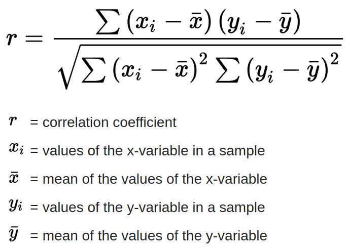
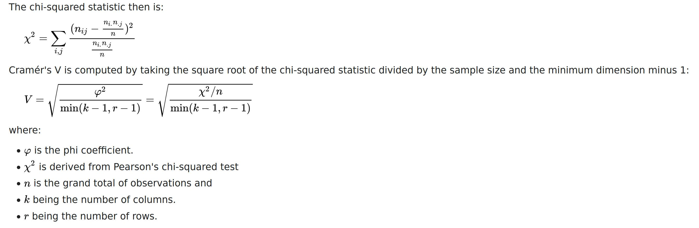
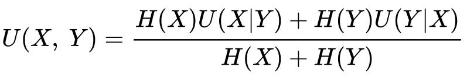

<!--ts-->
   * [Correlations and Associations](#correlations-and-associations)
      * [Corrleation between numerical features](#corrleation-between-numerical-features)
         * [Pearson](#pearson)
         * [Spearman](#spearman)
         * [Matthews correlation coefficient - MCC](#matthews-correlation-coefficient---mcc)
      * [Association between two categorical features](#association-between-two-categorical-features)
         * [Cramér's phi ()](#cram\xC3\xA9rs-phi-)
         * [Theil's U (Uncertainty coefficient)](#theils-u-uncertainty-coefficient)
      * [Association between categorical to numerical](#association-between-categorical-to-numerical)
         * [Correlation ratio](#correlation-ratio)
   * [Reference](#reference)

<!-- Added by: gil_diy, at: Sun 20 Mar 2022 17:26:30 IST -->

<!--te-->

# Correlations and Associations


## Corrleation between numerical features

### Pearson


<p align="center">
  
</p>

### Spearman


### Matthews correlation coefficient - MCC


supports multiclass:
https://en.wikipedia.org/wiki/Phi_coefficient#Multiclass_case


When there are more than two labels the MCC will no longer range between −1 and +1. Instead the minimum value will be between −1 and 0 depending on the true distribution. The maximum value is always +1.


```python
from sklearn.metrics import matthews_corrcoef
y_true = [+1, +1, +1, -1]
y_pred = [+1, -1, +1, +1]
print("Output: ", matthews_corrcoef(y_true, y_pred))

# -0.33
```

## Association between two categorical features


### Cramér's phi ()

Using `Cramér's phi`, the properties are:

* Cramer’s V is symmetrical — it is insensitive to swapping x and y. which means:
 `cramer_phi(x,y)` is equivalent to: `cramer_phi(y,x)` therefore we are losing valueable information due to the symmetry of it.

 * The value of the `Cramér's phi` is between 0 to 1, unlike perason and spearman correlation between -1 to 1.


<p align="center">
  
</p>

```python
def cramers_v(x, y):
    confusion_matrix = pd.crosstab(x,y)
    chi2 = ss.chi2_contingency(confusion_matrix)[0]
    n = confusion_matrix.sum().sum()
    phi2 = chi2/n
    r,k = confusion_matrix.shape
    phi2corr = max(0, phi2-((k-1)*(r-1))/(n-1))
    rcorr = r-((r-1)**2)/(n-1)
    kcorr = k-((k-1)**2)/(n-1)
    return np.sqrt(phi2corr/min((kcorr-1),(rcorr-1)))
```


[Wikipedia](https://en.wikipedia.org/wiki/Cram%C3%A9r%27s_V)


### Theil's U (Uncertainty coefficient)

<p align="center">
  
</p>


* Is asymmetric measure of association between categorical features.

* Meaning U(x,y)≠U(y,x) (while V(x,y)=V(y,x), where V is Cramer’s V)

* Exactly like `Cramer’s V`, the output value is on the range of [0,1] too.

* Theil’s U indeed gives us much more information on the true relations between the different features.


[Wikipedia](https://en.wikipedia.org/wiki/Uncertainty_coefficient)

## Association between categorical to numerical

### Correlation ratio


* The output is on the range of [0,1].

```python
def correlation_ratio(categories, measurements):
    fcat, _ = pd.factorize(categories)
    cat_num = np.max(fcat)+1
    y_avg_array = np.zeros(cat_num)
    n_array = np.zeros(cat_num)
    
    for i in range(0,cat_num):
        cat_measures = measurements[np.argwhere(fcat == i).flatten()]
        n_array[i] = len(cat_measures)
        y_avg_array[i] = np.average(cat_measures)

    y_total_avg = np.sum(np.multiply(y_avg_array,n_array))/np.sum(n_array)
    numerator = np.sum(np.multiply(n_array,np.power(np.subtract(y_avg_array,y_total_avg),2)))
    denominator = np.sum(np.power(np.subtract(measurements,y_total_avg),2))

    if numerator == 0:
        eta = 0.0
    else:
        eta = np.sqrt(numerator/denominator)
    return eta
```

# Reference

[Link](https://towardsdatascience.com/the-search-for-categorical-correlation-a1cf7f1888c9)
