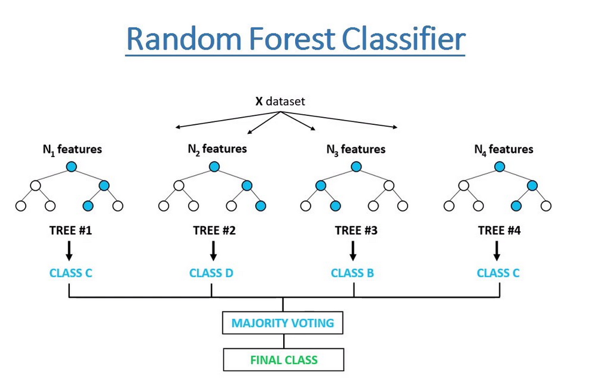
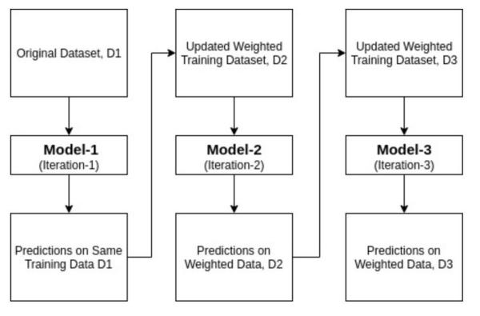

<!--ts-->
   * [Ensembles](#ensembles)
      * [Ensemble](#ensemble)
         * [Bagging technique (Bootstrap aggregation)](#bagging-technique-bootstrap-aggregation)
            * [When should I use booststrap sampling?](#when-should-i-use-booststrap-sampling)
            * [Random Forest](#random-forest)
         * [Boosting techniques](#boosting-techniques)
            * [Adaboost (Adaptive boosting)](#adaboost-adaptive-boosting)
            * [Gradient Boosting](#gradient-boosting)
            * [XGboost (Extreme Gradient boosted trees)](#xgboost-extreme-gradient-boosted-trees)
            * [LightGBM (LGBM) - gradient boosting framework developed by <strong>Microsft</strong>](#lightgbm-lgbm---gradient-boosting-framework-developed-by-microsft)
            * [Catboost](#catboost)
         * [The difference between Random Forest to Adaboost](#the-difference-between-random-forest-to-adaboost)
         * [The difference between Adaboost to Gradient Boost](#the-difference-between-adaboost-to-gradient-boost)
   * [Reference](#reference)

<!-- Added by: gil_diy, at: Mon 14 Mar 2022 12:45:51 IST -->

<!--te-->

# Ensembles

They don't overfit as easily as the other mathods.
Ensemble methods are the most important and powerful machine learning tool and they don't suffer from the drawbacks of the other machine learning methods.


## Ensemble

Ensemble is a learning technique in which multiple individual model combines together to create a master model.

They don't overfit as easily as the other methods.
Ensemble methods are the most important and powerful machine learning tool and they don't suffer from the drawbacks of the other machine learning methods.

Bagging and boosting are ways to implement ensemble models. 

### Bagging technique (Bootstrap aggregation)

The step of we are using the row sampling with replacement is called `Boostrap`
In statistics, **Bootstrap Sampling** is a method that involves **drawing of sample data repeatedly with replacement** from a data source to estimate a population parameter.


Allow training instances to be sampled several times across multiple predictors, but only bagging allows training instances to be sampled several times for the same predictor.

Each individual predictor has a higher bias than if it were trained on the original training set, but
aggregation reduces both bias and variance.  Generally, the net result is that the ensemble has a similar bias but a **lower variance** than a single predictor trained on the original training set.


* When sampling is performed **without replacement**, it is called **pasting** .

[Youtube explanation](https://youtu.be/KIOeZ5cFZ50)

#### When should I use booststrap sampling?

Let’s say we want to find the mean height of all the students in a school (which has a total population of 1,000). So, how can we perform this task?

One approach is to measure the height of all the students and then compute the mean height. I’ve illustrated this process below:

<p align="center">
  
</p>

However, this would be a **tedious task**. Just think about it, **we would have to individually measure the heights of 1,000 students and then compute the mean height**. It will take days! We need a smarter approach here.


This is where **Bootstrap Sampling** comes into play.

Instead of measuring the heights of all the students, we can draw a random sample of 5 students and measure their heights. We would repeat this process 20 times and then average the collected height data of 100 students (5 x 20). This average height would be an estimate of the mean height of all the students of the school.


#### Random Forest

* Random Forest is **ensemble technique**

* Random Forest is an implementation of **bagging technique**

* Using **multiple desicion trees**

* Each desicion tree is built based on random sampled rows and random sampled columns (Features sampled)- Row sampling and Feature sampling.

* Using the majority vote for deciding the 

<p align="center"> <!-- style="width:400px;" -->
  
</p>


* **Has low Bias**
* As we we discussed of desicion tree, we mentioned it has a high variance, BUT when we combine all the decision trees with the respect to the majority vote the high variance will be converted to **low variance**.

* **classifier uses majority vote** and in case of **Regressor it will actually find the mean or median of the praticular output of all the decision trees**.


```python
from sklearn.ensemble import RandomForestClassifier

classifier = RandomForestClassifier(n_estimators=20, random_state=42)
classifier.fit(X_train,y_train)
```

* Hyperparameter for random forest is how many decision trees to use.

[Youtube explanation](https://youtu.be/nxFG5xdpDto)


### Boosting techniques

**Boosting is an ensemble technique** that attempts to create a strong classifier from a number of weak classifiers (weak learners).

In other words a set of low accurate classifier to create a highly accurate classifier.


<p align="center"> <!-- style="width:400px;" -->
  
</p>


* Boosting algorithms consist of **iteratively learning weak classifiers** with respect to a distribution and adding them to a final strong classifier.

* When they are added, they are weighted in a way that is related to the weak learners' accuracy. After a weak learner is added, **the data weights are readjusted**, known as "re-weighting".

* Misclassified input data gain a higher weight and examples that are classified correctly lose weight.

* Thus, future weak learners focus more on the examples that previous weak learners misclassified. 

#### Adaboost (Adaptive boosting)

* Adaboost is ensemble technique spcefically it's a Boosting technique

* The output of **weak learners** is combined into a weighted sum that represents the final output of the boosted classifier.

* AdaBoost is **adaptive** in the sense that subsequent weak learners are tweaked in favor of those instances misclassified by previous classifiers

* AdaBoost is an **iterative ensemble** method

* All the base learners are decision trees will consist of a **single node with two leaves** (Thet are called** stumps**)


The stump with the **lowest entropy/gini** will be first.


* It iteratively corrects the mistakes of the weak classifier and improves accuracy by combining weak learners.

* The **weights of the records gets updated**, **all the missclasiffied records/entries** (all the records which the praticular weak model did not perform well), **thier weights are increased**, which means more weight is given to those records for the next weak model.

* You can use many base classifiers with AdaBoost. AdaBoost is not prone to overfitting.

* AdaBoost algorithms can be used for both classification and regression problem.


* The cons: AdaBoost is **sensitive to noise data**. It is highly affected by outliers because it tries to fit each point perfectly

<p align="center"> <!-- style="width:400px;" -->
  
</p>


The weak learners in AdaBoost are decision trees with a single split, called **decision stumps** for their shortness. AdaBoost works by weighting the observations, putting **more weight on difficult to classify instances** and less on those already handled well. New weak learners are added sequentially that **focus their training on the more difficult patterns**.
This means that **samples that are difficult to classify receive increasing larger weights** until the algorithm identifies a model that correctly classifies these samples.

```python
from sklearn.ensemble import AdaBoostClassifier
from sklearn.tree import DecisionTreeClassifier


# base_estimator: It is a weak learner used to train the model.
#                 It uses DecisionTreeClassifier as default weak learner
#				  for training purpose. You can also specify different 
#                 machine learning algorithms.
#
# n_estimators: Number of weak learners to train iteratively.
# 
# learning_rate: It contributes to the weights of weak learners.
#                It uses 1 as a default value.

clf = AdaBoostClassifier(DecisionTreeClassifier(max_depth=1),
                         n_estimators=200)

# Train Adaboost Classifer
clf.fit(X_train, y_train)
y_pred = clf.predict(X_test)
```

Or we can use different base learners, such as SVM:

```python
from sklearn.ensemble import AdaBoostClassifier

# Import Support Vector Classifier
from sklearn.svm import SVC
#Import scikit-learn metrics module for accuracy calculation
from sklearn import metrics
svc=SVC(probability=True, kernel='linear')

# Create adaboost classifer object
abc =AdaBoostClassifier(n_estimators=50, base_estimator=svc,learning_rate=1)

# Train Adaboost Classifer
model = abc.fit(X_train, y_train)

#Predict the response for test dataset
y_pred = model.predict(X_test)


# Model Accuracy, how often is the classifier correct?
print("Accuracy:",metrics.accuracy_score(y_test, y_pred))
```

[Youtube explanation](https://www.youtube.com/watch?v=HRBMlBiOo7Q)

[Youtube explanation](https://youtu.be/NLRO1-jp5F8)


#### Gradient Boosting

* Generalization of AdaBoost as Gradient Boosting

* In differ to Adaboost the trees depth in Gradient Boost is between 8 to 32.

* The learning is done by optimizing the loss function.

*  Gradient boosting is an approach where new models are created that predict the residuals or errors of prior models and then added together to make the final prediction.
It is called gradient boosting because **it uses a gradient descent algorithm to minimize the loss when adding new
models** . This approach supports both regression and classification predictive modeling problems.

* Thus, to prevent overfitting, we introduce a **hyperparameter called learning rate**. When we make a prediction, each residual is multiplied by the learning rate. This forces us to use more decision trees, each taking a small step towards the final solution.

* The generalization allowed **arbitrary differentiable loss functions** to be used, expanding the technique beyond binary classification problems to support regression, multiclass classification and more.

**Gradient boosting involves three elements:**

**1.** A loss function to be optimized.

**2.** A weak learner to make predictions.

**3.** An additive model to add weak learners to minimize the loss function.


```python
from sklearn.ensemble import GradientBoostingRegressor

gbrt = GradientBoostingRegressor(max_depth=2, n_estimators=1, learning_rate=1.0)
gbrt.fit(X,y)
```

[Youtube explanation](https://youtu.be/j034-r3O2Cg)

[Youtube explanation](https://youtu.be/Nol1hVtLOSg)

#### XGboost (Extreme Gradient boosted trees)

* **XGboost** is ensemble technique

* Each tree boosts attributes that led to misclassifications of previous tree

* Regularized boosting (prevents overfitting)

* Can handle missing values automatically, Sparse Aware implementation with automatic handling of missing data values.

* Parallel processing (Scale well on multiple machine/cores)

* Block Structure to support the parallelization of tree construction.

* Can cross-validate at each iteration (Enables early stopping, finding optimal number of iterations)

* Tree pruning (generally results in deeper, but optimized trees)

* Continued Training so that you can further boost an already fitted model on new data.

[Link](https://youtu.be/OQKQHNCVf5k)
```python
from numpy import loadtxt
from xgboost import XGBClassifier
from sklearn.model_selection import train_test_split
from sklearn.metrics import accuracy_score
# load data
dataset = loadtxt('pima-indians-diabetes.csv' , delimiter=",")
# split data into X and y
X = dataset[:,0:8]
Y = dataset[:,8]
# split data into train and test sets
seed = 7
test_size = 0.33
X_train, X_test, y_train, y_test = train_test_split(X, Y, test_size=test_size,
random_state=seed)
# fit model on training data
model = XGBClassifier()
model.fit(X_train, y_train)
# make predictions for test data
predictions = model.predict(X_test)
# evaluate predictions
accuracy = accuracy_score(y_test, predictions)
print("Accuracy: %.2f%%" % (accuracy * 100.0))
```


```python
    
from sklearn.datasets import load_iris
from sklearn.model_selection import train_test_split
from sklearn.metrics import accuracy_score
import xgboost as xgb

iris = load_iris()

num_samples, num_features = iris.data.shape
print("num_samples = ", num_samples)
print("num_features = ", num_features)
print("iris.target_names = ", list(iris.target_names))

X_train, X_test, y_train, y_test = train_test_split(iris.data,
                                                    iris.target,
                                                    test_size=0.2,
                                                    random_state=0)

train_data = xgb.DMatrix(X_train, label=y_train)
test_data = xgb.DMatrix(X_test, label=y_test)

# Let's define our hyperparameters, we are choosing softmax since this
# is a multiple classification problem, but the other parameters should
# ideally be tuned through experimentation.

# Take a look here:
# https://xgboost.readthedocs.io/en/latest/parameter.html

my_params = {
    "max_depth": 4,
    "eta": 0.3,  # Step size - Shrinks the feature weights
    # to make the boosting process more conservative
    "objective": "multi:softmax",
    "num_class": 3
}

num_epochs = 10

model = xgb.train(params=my_params, dtrain=train_data, num_boost_round=num_epochs)
predictions = model.predict(test_data)
print(predictions)

print("accuracy_score: ", accuracy_score(y_test, predictions))
```

#### LightGBM (LGBM) - gradient boosting framework developed by **Microsft**

* Fast, distributed, high-performance gradient boosting framework based on decision 
 tree algorithm.

[Reference](https://lightgbm.readthedocs.io/en/latest/)

#### Catboost

[Reference](https://catboost.ai/)


### The difference between Random Forest to Adaboost

Random Forest | Adaboost
------------|-----
 **Parallel** - The individual Decision Trees are built from the main data parallelly independently from each other   | **Sequential** - model2 is depend on model1 and similary model3 is depend on model2 etc.
All models have **equal say** or equall vote in the final model | All the models **don't have equal say** (weights)
Uses fully **grown trees** | Each weak model uses **Stumps - one root node and two leaf nodes** 


### The difference between Adaboost to Gradient Boost

Adaboost | Gradient boost
------------|-----
Many weak models are get trained sequentially (one by one) The **weights** of the records of all missclassfied records are get updated | Learning by **optimizing the loss function**
The trees are **Stumps**| The **trees are much bigger**, the number of leaf nodes is in the range 8 to 32.


# Reference

[Brute Force all scikit-learn models](https://github.com/ypeleg/HungaBunga)