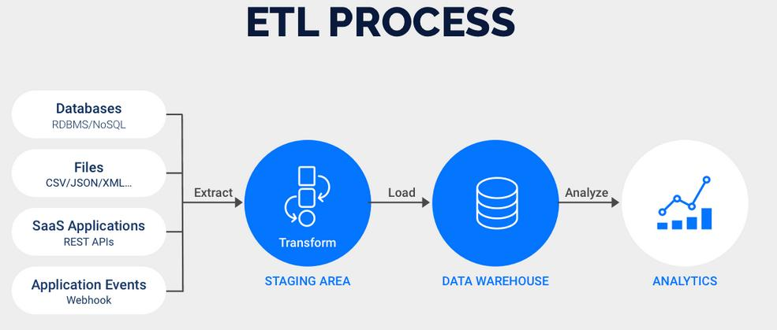

<!--ts-->
   * [ETL](#etl)
      * [ETL process](#etl-process)
      * [Tools for ETL](#tools-for-etl)
         * [PySpark](#pyspark)
         * [Luigi](#luigi)

<!-- Added by: gil_diy, at: Sun 06 Mar 2022 09:10:59 IST -->

<!--te-->

# ETL

## ETL process

  

* Extract

* Transform

* Load

## Tools for ETL

### PySpark

* Houses robust features that allow users to set up ETL Using Python along with support for various other functionalities such as Data Streaming (Spark Streaming), Machine Learning (MLib), SQL (Spark SQL), and Graph Processing (GraphX).

* One of the most significant advantages of using PySpark is the ability to process large volumes of data with ease. Hence, if your ETL requirements include creating a pipeline that can process Big Data easily and quickly, then PySpark is one of the best options available.

### Luigi

Luigi is an Open-Source Python-based ETL tool that was created by Spotify to handle its workflows that processes terabytes of data every day. It is considered to be one of the most sophisticated tools that house various powerful features for creating complex ETL data pipelines. It also comes with a web dashboard that allows users to track all ETL jobs. Luigi is considered to be suitable for creating Enterprise-Level ETL pipelines