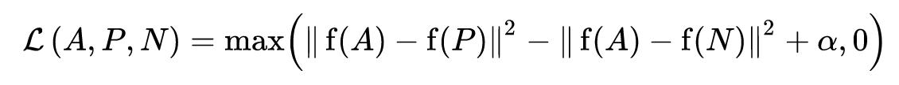
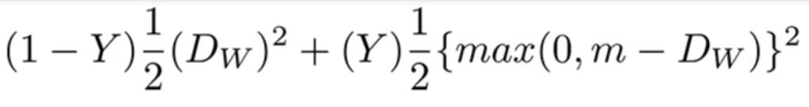

<!--ts-->
   * [Face Recognition](#face-recognition)
      * [Loss Function](#loss-function)
         * [Triplet Loss function](#triplet-loss-function)
      * [Contrastive loss](#contrastive-loss)
   * [Siamese Networks](#siamese-networks)
      * [Usage of this kind of network](#usage-of-this-kind-of-network)
      * [Network topolgy](#network-topolgy)
      * [Great datasets for Siements network](#great-datasets-for-siements-network)
   * [Reference](#reference)
   * [Academia papers](#academia-papers)

<!-- Added by: gil_diy, at: Fri 11 Mar 2022 10:02:28 IST -->

<!--te-->

# Face Recognition

Is not a classification problem because the number of faces in the world is not bounded.
We don't train a neural network to classify me, we just use the existing network which was already trained on thousands of thousands faces of people to doing this, to put me somwhere in the latent space (aka latent feature space) and I record the location. 
when I try again to unlock the phone does my new image goes to the same place in the space as the last one.

What happens is that you get an architecture capable of doing **one shot learning**,  we have only single image per class.

* We want to check check if the person is familar for us, the photo of the person is called **Query**

* Basic idea is based of similarity function sim(x,x')

* The name of the network is [Siamese Networks](https://towardsdatascience.com/a-friendly-introduction-to-siamese-networks-85ab17522942) (sometimes called a twin neural network) 

* The set of images which we compare to is called **Support Set** .

* The network uses a special type of loss function called `triplet loss`.
  The name triplet loss since the loss function recieves 3 variables:

## Loss Function

### Triplet Loss function

  <p align="center" style="width:400px;" >
  
</p>

  * $A$ is an **Anchor** input
  * $P$ is a **Positive** input of the same class as $A$
  * $N$ is a **Negative** input of a different class from $A$
  * $/alpha$ is a margin between positive and negative pairs
  * $f$ is an after embedding to the latent space

* A and P the same person, N is different person than A.

<p align="center" style="width:550px;" >
  
</p>


We can use the pytorch built-in function `torch.nn.TripletMarginLoss`.

```python
triplet_loss = nn.TripletMarginLoss(margin=1.0, p=2)
anchor = torch.randn(100, 128, requires_grad=True)
positive = torch.randn(100, 128, requires_grad=True)
negative = torch.randn(100, 128, requires_grad=True)
output = triplet_loss(anchor, positive, negative)
output.backward()
```
 
[Triplet Loss well exaplained](https://omoindrot.github.io/triplet-loss)
[Triplet Loss](https://youtu.be/d2XB5-tuCWU)

## Contrastive loss

[Link](https://towardsdatascience.com/contrastive-loss-explaned-159f2d4a87ec)


Using `contrastive loss function`

<p align="center">
  
</p>


[Excellent implementation of Siamese Network in pytorch well explained](https://youtu.be/9hLcBgnY7cs)

[Link](https://medium.com/visionwizard/research-for-all-in-defense-of-triplet-loss-for-person-re-identification-9cce5616fb6)


[Few-Shot Learning](https://youtu.be/hE7eGew4eeg)


# Siamese Networks

## Usage of this kind of network

Siemense Network are used for 

## Network topolgy


## Great datasets for Siements network

* Example of dataset is [**Omniglot**](https://github.com/brendenlake/omniglot),
holds 1000 classes and from each class we have only few images.

* Well known dataset can be taken form here `AT&T`: [Link](https://www.kaggle.com/kasikrit/att-database-of-faces)

# Reference

[Detecting Faces - Viola Jones Algorithm](https://youtu.be/uEJ71VlUmMQ)

[How Face ID Works (Face recognition)](https://youtu.be/mwTaISbA87A)

[FaceID ](https://towardsdatascience.com/how-i-implemented-iphone-xs-faceid-using-deep-learning-in-python-d5dbaa128e1d)


# Academia papers

[FaceNet](https://arxiv.org/pdf/1503.03832.pdf)

[Dlib](http://dlib.net/dnn_face_recognition_ex.cpp.html)