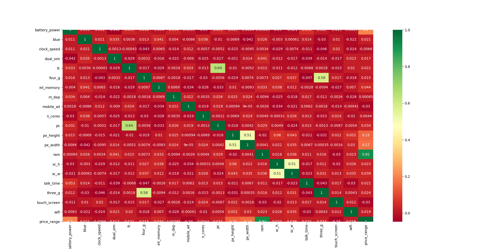

<!--ts-->
   * [Feature Selection Techniques in Machine Learning](#feature-selection-techniques-in-machine-learning)
      * [Statistical test](#statistical-test)
      * [Feature importance](#feature-importance)
      * [Correlation Matrix with Heatmap](#correlation-matrix-with-heatmap)

<!-- Added by: gil_diy, at: 2019-09-23T16:17+03:00 -->

<!--te-->


# Feature Selection Techniques in Machine Learning

**Feature Selection is one of the core concepts in machine learning which hugely impacts the performance of your model**
I'd like to demostrate which features are affecing the actual price of a smartphone, so we will be taking a dataset about smartphones.

Column number |feature name | Description
--|----------|-----
0 | **battery_power** | Total energy a battery can store in one time measured in mAh
1 | **blue** | Has Bluetooth or not
2 | **clock_speed** |  the speed at which microprocessor executes instructions
3 | **dual_sim** | Has dual sim support or not
4 | **fc** | Front Camera megapixels
5 | **four_g** | Has 4G or not
6 | **int_memory** | Internal Memory in Gigabytes
7 | **m_dep** | Mobile Depth in cm
8 | **mobile_wt** | Weight of mobile phone
10| **n_cores** | Number of cores of the processor
11| **pc** | Primary Camera megapixels
12| **px_width** | Pixel Resolution Width
13| **ram** | Random Access Memory in MegaBytes
14| **sc_h** | Screen Height of mobile in cm
15| **sc_w** | Screen Width of mobile in cm
16| **talk_time** | the longest time that a single battery charge will last when you are
17| **three_g** | Has 3G or not
18| **touch_screen** | Has touch screen or not
19| **wifi** | Has wifi or not

**Target column**: **price_range**: This is the target variable with a value of:

 0(low cost), 1(medium cost), 2(high cost) and 3(very high cost).

## Statistical test

Statistical tests can be used to select those features that have
the strongest relationship with the output variable.
The example below uses the chi-squared ( **chi²** ) statistical test **for non-negative features** to select 10 of the best features.

```python
import pandas as pd
import numpy as np
from sklearn.feature_selection import SelectKBest
from sklearn.feature_selection import chi2

data = pd.read_csv("/home/gil_diy/PycharmProjects/feature_selection/mobile-price-classification/train.csv")
X = data.iloc[:, 0:20]  # independent columns

# target column i.e price range (price_range: This is the target variable with a value:
#  0 (low cost),
#  1 (medium cost)
#  2 (high cost)
#  3 (very high cost)
y = data.iloc[:, -1]

bestfeatures = SelectKBest(score_func=chi2, k=10)
fit = bestfeatures.fit(X, y)
dfscores = pd.DataFrame(fit.scores_)
dfcolumns = pd.DataFrame(X.columns)
# concat two dataframes for better visualization
featureScores = pd.concat([dfcolumns, dfscores], axis=1)
featureScores.columns = ['Specs', 'Score']  # naming the dataframe columns

# Print 10 best features, the left column presenting the numbers are the actual
# column number in our data
print(featureScores.nlargest(10, 'Score'))

```
Output:

<p align="center">
  
</p>


## Feature importance

You can get the feature importance of each feature of your dataset by using the feature importance property of the model.

Feature importance gives you a score for each feature of your data, **the higher the score more important or relevant is the feature towards your output variable** .

```python
from sklearn.ensemble import ExtraTreesClassifier
import matplotlib.pyplot as plt

model = ExtraTreesClassifier()
model.fit(X, y)
print(model.feature_importances_)  # use inbuilt class feature_importances of tree based classifiers
# plot graph of feature importances for better visualization
feat_importances = pd.Series(model.feature_importances_, index=X.columns)
feat_importances.nlargest(10).plot(kind='barh')
plt.show()
```
<p align="center">
  
</p>

## Correlation Matrix with Heatmap

Correlation states how the features are related to each other or the target variable.

Correlation can be positive (increase in one value of feature increases the value of the target variable)
or negative (increase in one value of feature decreases the value of the target variable).

[Correlation reminder](https://en.wikipedia.org/wiki/Pearson_correlation_coefficient)

```python
import pandas as pd
import numpy as np
import seaborn as sns

X = data.iloc[:,0:20]  #independent columns
y = data.iloc[:,-1]    #target column i.e price range
#get correlations of each features in dataset
corrmat = data.corr()
top_corr_features = corrmat.index
plt.figure(figsize=(20,20))
#plot heat map
g=sns.heatmap(data[top_corr_features].corr(),annot=True,cmap="RdYlGn")
```
<p align="center">
  
</p>

Based on this heatmap we can see easily notice about the last row
price range, see how the price range is correlated with other features, ram is the highly correlated
with price range followed by battery power, pixel height and width while m_dep, lock_speed and
n_cores seems to be least correlated with price_range.
