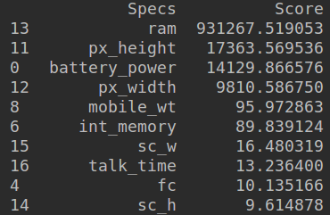
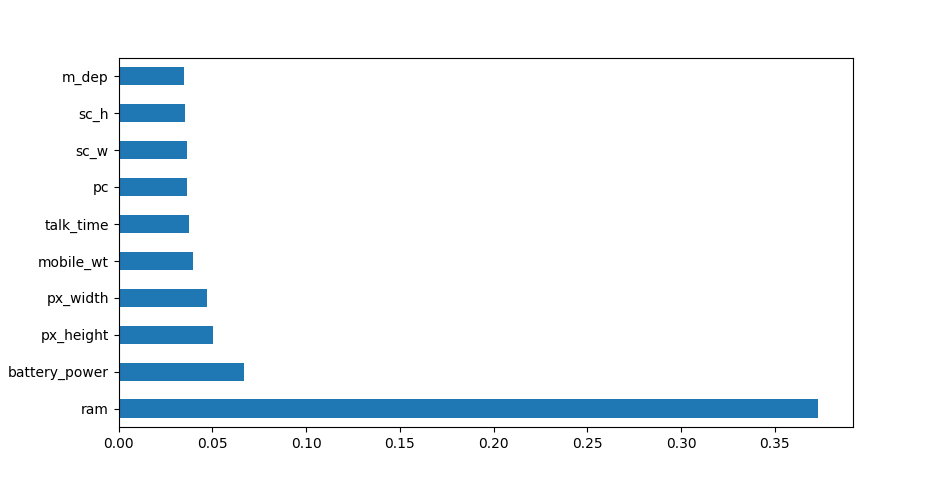

<!--ts-->
   * [Feature Selection Techniques in Machine Learning](#feature-selection-techniques-in-machine-learning)
      * [Statistical test](#statistical-test)
      * [Feature importance](#feature-importance)

<!-- Added by: gil_diy, at: 2019-09-23T15:35+03:00 -->

<!--te-->


# Feature Selection Techniques in Machine Learning

**Feature Selection is one of the core concepts in machine learning which hugely impacts the performance of your model**

## Statistical test

Statistical tests can be used to select those features that have
the strongest relationship with the output variable.
The example below uses the chi-squared ( **chi²** ) statistical test **for non-negative features** to select 10 of the best features.

```python
import pandas as pd
import numpy as np
from sklearn.feature_selection import SelectKBest
from sklearn.feature_selection import chi2

data = pd.read_csv("/home/gil_diy/PycharmProjects/feature_selection/mobile-price-classification/train.csv")
X = data.iloc[:, 0:20]  # independent columns

# target column i.e price range (price_range: This is the target variable with a value:
#  0 (low cost),
#  1 (medium cost)
#  2 (high cost)
#  3 (very high cost)
y = data.iloc[:, -1]

bestfeatures = SelectKBest(score_func=chi2, k=10)
fit = bestfeatures.fit(X, y)
dfscores = pd.DataFrame(fit.scores_)
dfcolumns = pd.DataFrame(X.columns)
# concat two dataframes for better visualization
featureScores = pd.concat([dfcolumns, dfscores], axis=1)
featureScores.columns = ['Specs', 'Score']  # naming the dataframe columns

# Print 10 best features, the left column presenting the numbers are the actual
# column number in our data
print(featureScores.nlargest(10, 'Score'))

```
Output:

<p align="center">
  
</p>


## Feature importance

You can get the feature importance of each feature of your dataset by using the feature importance property of the model.

Feature importance gives you a score for each feature of your data, **the higher the score more important or relevant is the feature towards your output variable** .

```python
from sklearn.ensemble import ExtraTreesClassifier
import matplotlib.pyplot as plt

model = ExtraTreesClassifier()
model.fit(X, y)
print(model.feature_importances_)  # use inbuilt class feature_importances of tree based classifiers
# plot graph of feature importances for better visualization
feat_importances = pd.Series(model.feature_importances_, index=X.columns)
feat_importances.nlargest(10).plot(kind='barh')
plt.show()
```
<p align="center">
  
</p>
