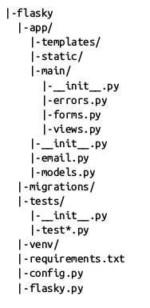
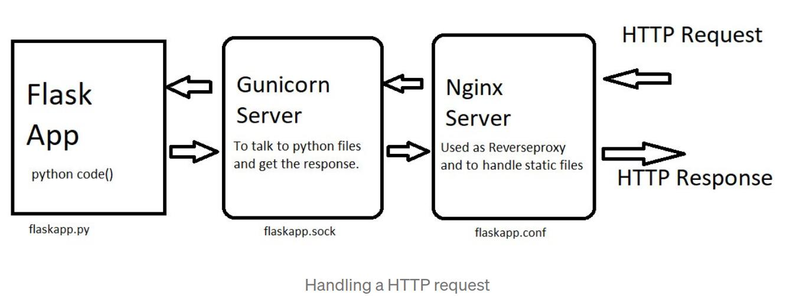

<!--ts-->
   * [Flask](#flask)
      * [A simple Flask application](#a-simple-flask-application)
      * [Running flask](#running-flask)
      * [Poject structure](#poject-structure)
      * [Template](#template)
         * [Rendering Templates](#rendering-templates)
         * [Flask forms](#flask-forms)
         * [Flask](#flask-1)
         * [How to prepare Flask in production?](#how-to-prepare-flask-in-production)

<!-- Added by: gil_diy, at: Sun 06 Mar 2022 10:18:12 IST -->

<!--te-->

# Flask

## A simple Flask application

for example `my_flask_app.py`:

```python
from flask import Flask
app = Flask(__name__)

@app.route('/')
def index():
	return '<h1>Hello World!</h1>'
```

## Running flask

* Enable debug mode so it would be easy to refresh on flow the app.
Either Using Environment variables:

```bash
export FLASK_APP=my_flask_app.py
export FLASK_DEBUG=1
flask run
```

The command `flask run`, this command looks for the name of the Python script that contains the application instance in the FLASK_APP environment variable.


The Flask development web server can also be started programmatically by invoking the app.run() method. the app.run() method can be useful on certain occasions, such as unit testing.

```bash
if __name__ == '__main__':
    app.run(debug=True) # To enable debug mode programmatically
```


## Poject structure
Here below is an example of basic multiple-file Flask application structure




top-level folders:
* The Flask application lives inside a package generically named app
* The migrations folder contains the database migration scripts, as before.
* Unit tests are written in a tests package.

Moreover there are some essentials files:
* config.py stores the configuration settings.
* flasky.py defines the Flask application instance, and also includes a few tasks that help manage the application.

## Template

A template is a file that contains the text of a response, with placeholder variables for the dynamic parts that will be known only in the context of a request. The process that replaces the variables with actual values and returns a final response string is called rendering. For the task of rendering templates, Flask uses a powerful template engine called Jinja2.


### Rendering Templates

By default Flask looks for templates in a templates subdirectory located inside the main application directory.

```python
posts = [
	{
		'author': 'Cookie monster',
		'title':'My first post',
		'content':'First post content',
		'date_posted':'July 12,2019'

	},
	{
		'author': 'Gil',
		'title':'My second post',
		'content':'Second post content',
		'date_posted':'April 15,2019'
	}
]
```

Passing the list of `posts` into the template:

```python
@app.route("/home")
def home()
	return render_template('home.html', my_posts=posts)
```

The html template (jinja):

```html
<body>
	
		<h1>{{ post.title }}</h1>
		<p>By {{ post.author }} on {{ post.date_posted }}</p>
		<p>{{ post.content }}</p>
	
</body>
```

Many more examples are shown here: [Link](http://jinja.pocoo.org/docs/2.10/templates/)

### Flask forms

[Registration Form](https://youtu.be/UIJKdCIEXUQ?t=153)
[Login Form](https://youtu.be/UIJKdCIEXUQ?t=528)


### Flask 

[Flask Production Recipes](https://www.toptal.com/flask/flask-production-recipes)


### How to prepare Flask in production?

Although Flask has a built-in web server, as we all know, it’s not suitable for production and needs to be put behind a real web server able to communicate with Flask through a **WSGI protocol**
A common choice for that is **Gunicorn—a Python WSGI HTTP server**.

The Web Server Gateway Interface (WSGI, pronounced whiskeyWIZ-ghee) is a simple calling convention for web servers to forward requests to web applications or frameworks written in the Python programming language.

* Serving static files and proxying request with Nginx. While being an HTTP web server, Gunicorn, in turn, is an application server not suited to face the web.
That’s why we need Nginx as a reverse proxy and to serve static files. In case we need to scale up our application to multiple servers, Nginx will take care of load balancing as well.


<p align="center">
  
</p>


[How to deploy ML models using Flask + Gunicorn + Nginx + Docker](https://towardsdatascience.com/how-to-deploy-ml-models-using-flask-gunicorn-nginx-docker-9b32055b3d0)


