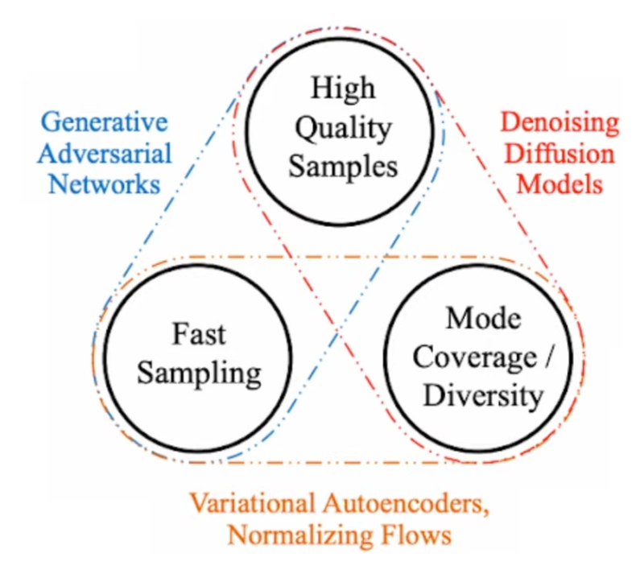

<!--ts-->

<!-- Created by https://github.com/ekalinin/github-markdown-toc -->
<!-- Added by: gil_diy, at: Sat 25 Mar 2023 03:41:03 PM IDT -->

<!--te-->

In order to generate new data there are already lots of model
architectures available to generate new data for example:
GAN -  Generative Adversarial Networks
VAE - Variational Autoencoders

  

 

* VAEs have shown to produce diverse samples quickly but usually the quality is not great compared to GANs.

* VAEs compresses an input into a latent distribution and then samples from this distribution
  to recover the inputs after training we can sample from the latent space to generate
  new data points usually vies are quite easy to train but as mentioned the outputs can be blurry gans