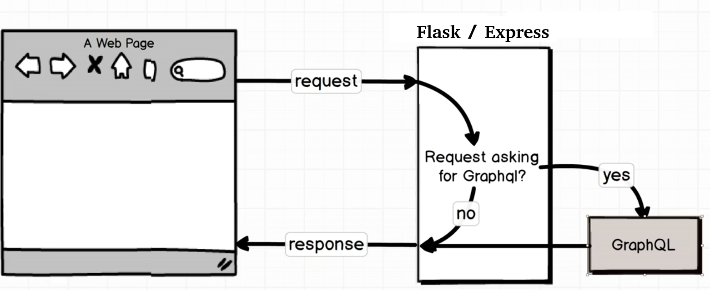
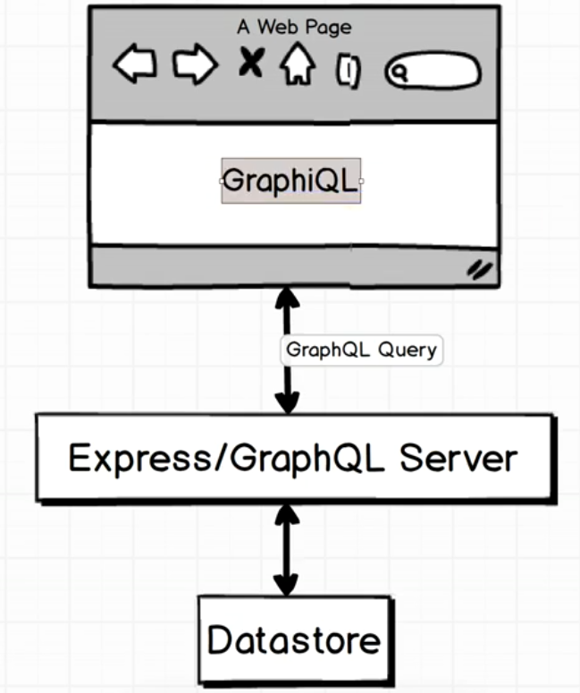
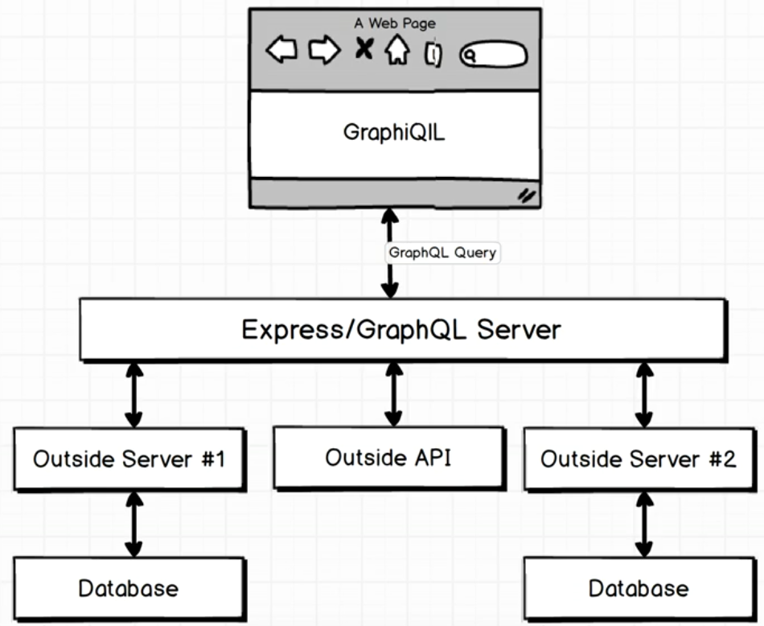
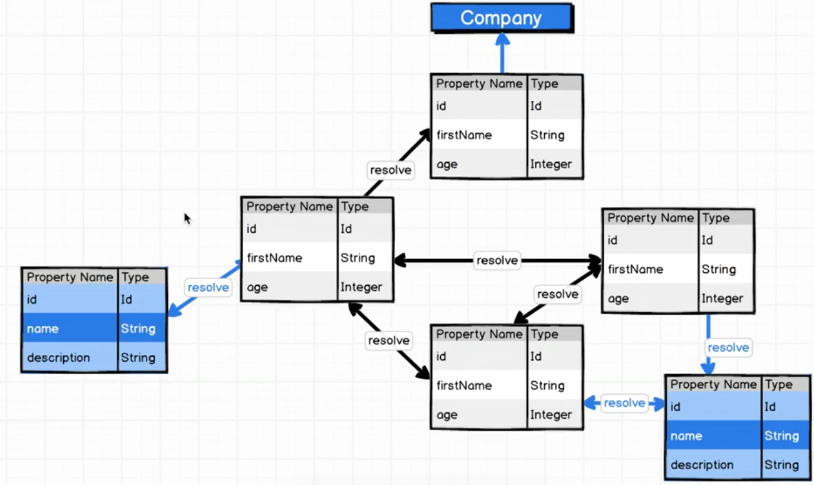

<!--ts-->
<!--te-->

# GraphQL

 
 
 
 

* **A flow of a requests sent from client  passes througth the http server**

  

 
 
 
 

* **A query is sent from GraphiQL in the browser to the server**

  

 
 
 
 

* **In a real scenario, under the hood there are few databases and we connect to them through the api which they expose.**

  

 
 
 
 

* **Traversing from the root towards the graph according to the query and the written schema (The root node is not mentioned in this image)**

  

