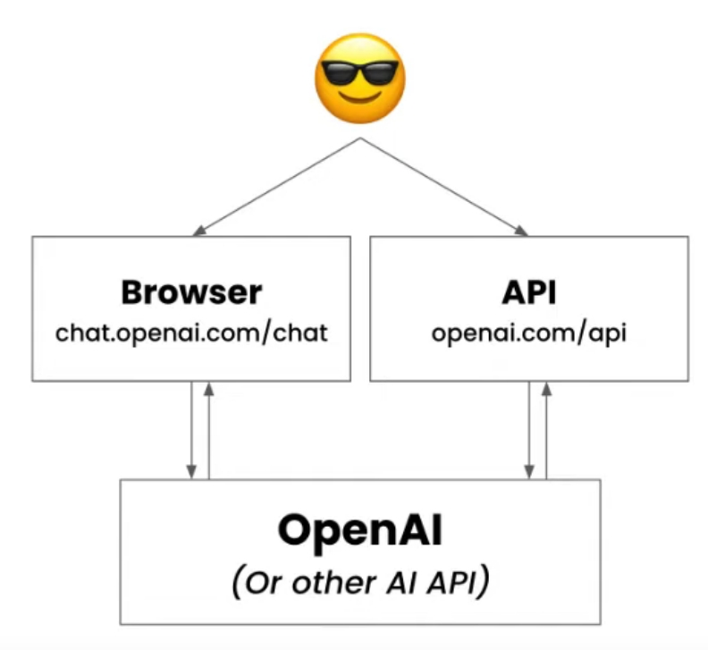
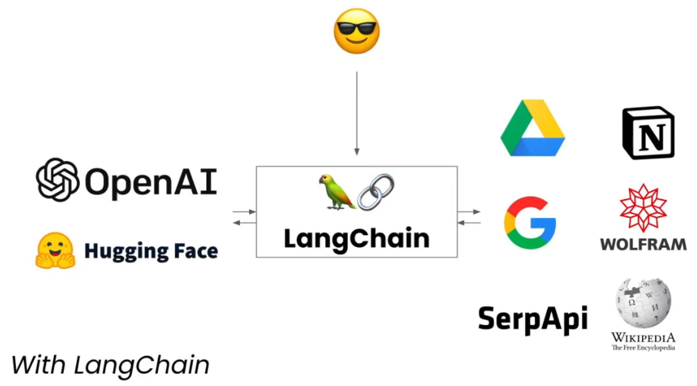

<!--ts-->
* [Langchain](#langchain)

<!-- Created by https://github.com/ekalinin/github-markdown-toc -->
<!-- Added by: gil_diy, at: Wed 19 Apr 2023 01:02:24 AM IDT -->

<!--te-->

# Langchain

[Link](https://github.com/hwchase17/langchain)

  

**With langchain**:

LangChain is a **framework for developing applications powered by language models**. We believe that the most powerful and differentiated **applications will not only call out to a language model via an API**, but will also:

Integration - Bring **external data**, such as your files, other applications, and api data, to your LLMs

Agency - Allow your LLMs to interact with it's environment via decision making. Use LLMs to help decide which action to take next.

  

[LangChain Cookbook](https://github.com/gkamradt/langchain-tutorials/blob/main/LangChain%20Cookbook.ipynb)

[Ask Questions On Your Custom (or Private) Files](https://youtu.be/EnT-ZTrcPrg?list=PLqZXAkvF1bPNQER9mLmDbntNfSpzdDIU5)