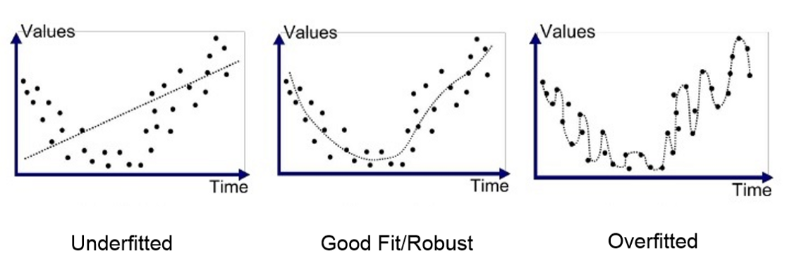

<!--ts-->
<!--te-->

## Under and Over-fitting

When you are building a predictor you have choice of algorithms to can apply,
predictor is just a function , some function are more flexiable then others, more complex .
other functions are more rigid.

**Over fitting**
----------------
is when you pick a function which is too complex (flexible)

* Fits "noise" in the training data.
* Patterns that will not re-appear

**Under-fitting**
-------------------
* Predictor too simplistic (too rigid)
* Not powerful enough to capture notable patterms in data

**Examples:**

For Regression :

  

For Classification:

  

