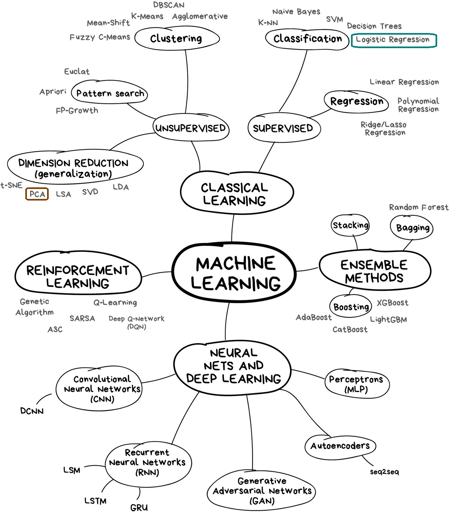
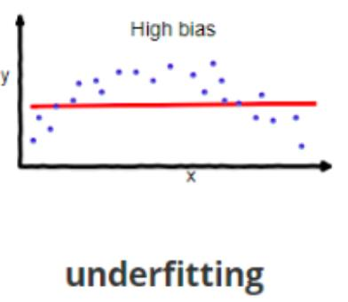
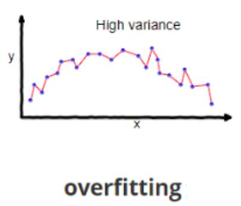
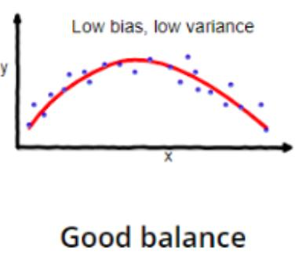

<!--ts-->
   * [Machine learning](#machine-learning)
      * [The relationship between all terminalogy (illustration)](#the-relationship-between-all-terminalogy-illustration)
      * [Machine learning techniques:](#machine-learning-techniques)
      * [Flavors of Machine Learning](#flavors-of-machine-learning)
         * [<strong>Supervised</strong>](#supervised)
         * [<strong>Unsupervised</strong>](#unsupervised)
      * [Unsupervised learning techniques:](#unsupervised-learning-techniques)
      * [Supervised vs Unsupervised learning](#supervised-vs-unsupervised-learning)
      * [Under and Over-fitting](#under-and-over-fitting)
      * [<strong>Over fitting</strong>](#over-fitting)
      * [<strong>Under-fitting</strong>](#under-fitting)
      * [Regression algorithms](#regression-algorithms)
      * [<strong>Non linear regression</strong>](#non-linear-regression)
      * [Regression accuracy](#regression-accuracy)
      * [Classification algorithms in machine learning](#classification-algorithms-in-machine-learning)
      * [Biasand Variance Tradeoff](#biasand-variance-tradeoff)
      * [K Nearest Neighbhors (KNN)](#k-nearest-neighbhors-knn)

<!-- Added by: gil_diy, at: Sat 05 Mar 2022 09:23:11 IST -->

<!--te-->

[Link](https://www.youtube.com/watch?v=3VsuTlImyiY)

# Machine learning

## The relationship between all terminalogy (illustration)

<p align="center">
  
</p>


Cardinality = How many unique values

## Machine learning techniques:

Technique name | explanation | Example
------------|-----|---
Regression/Estimation | Predicting continuous values | Predicting a price of a house
Classification | Predicting the item class/category of a case | if a cell is a benign or malignant.
Clustering | Finding the structure of data, for finding similar cases; summarization | Customer segmentation in the banking field
Associations | Associating frequent co-occuring items/events | For example groceries items which are usually getting buyed together by a praticulr customer
Anomaly detection | Discovering abnormal and unusual cases | Is used for card fraud detection
Sequence mining | Predicting next events | click stream in websites (Markov Model, HMM)
Dimension Reduction | Reducing the size of data (PCA) |
Recommnedation systems | Recommending items |

## Flavors of Machine Learning
### **Supervised**
You have information about the quality you're intrested in for each piece of training data and want to predict that quality.

* **Classification** Assign each data point to one of a set classes (e.g cat or dog)

* **Regression**  Predict the Value of quality based on given information (e.g dog's weight given age and breed)

### **Unsupervised** 
You don't have information about a specific quality you're intrested in.

* **Clustering** Split your data into groups of similar samples.

* **Dimension reduction** Given high-dimensional data, reduce it into a smaller number of dimentsions while minimizing information loss (data compression).

On Unsupervised learning the model works on its own to discover information, all of this data is unlabeled.

Unsupervised learning has more difficult algorithms then supervised learning, since we know little information about the data.

## Unsupervised learning techniques:
* Dimension reduction (Feature selection, by reducing redundant features to make the classification easier)
* Density estimation (Explore the data for find the structure )
* Market basket analysis (Model techinuqe based on the theory If you buy a certain group of items you more likely to buy another group of itmes )
* clustering (Clustering is grouping of data points or objects that are somehow similar)


## Supervised vs Unsupervised learning

Supervised learning | Unsupervised learning
--------------------|------------------------
* **Classification** | * **Clustering**
Classifies labeled data | Finds patterns and groupings from unlabled data
* **Regressions:** | * Has fewer evaluation methods than supervised learning
Predicts trends using previous labeled data |
* Has more evaluation methods | * Less controlled environment
* Controlled environment |

## Under and Over-fitting


When you are building a predictor you have choice of algorithms to can apply,
predictor is just a function , some function are more flexiable then others, more complex .
other functions are more rigid.

**Over fitting**
----------------
is when you pick a function which is too complex (flexible)

* Fits "noise" in the training data.
* Patterns that will not re-appear

**Under-fitting**
-------------------
* Predictor too simplistic (too rigid)
* Not powerful enough to capture notable patterms in data


**Examples:**

For Regression :

## Regression algorithms
* Linear regression (Very fast, No parameter tuning)
* Ordinal regression
* Poisson regression
* Fast forest quantile regression
* Linear, Polynomial, Lasso, Stepwise. Ridge regression
* Bayesian linear regression
* Neural network regression
* Decision forest regression
* Boosted decision tree regression
* KNN (K-nearest neighbors)

## **Non linear regression**
* To model non-linear relationship between the dependent variable and a set of independent variables.
* y hat must be a non-linear function of paramters theta, not necessarily the features x.

## Regression accuracy
* MAE  (Mean Absolute error)
* MSE  (Mean Square Error)
* RMSE (Root Mean Square Error)


<p align="center">
  
</p>

Over-fit: the model is overly trained to the dataset, which may capture noise and produce a non-generalized model

For Classification:
Example: the loan bank prediction
suppose a bank is concern for the potential for loan not be repaid, if previous loan default data can be used to predict which customers are likely to have problems repaying loans these bad risk customers can either have their loan application declined or offered alternative products.the goal of a loan default predictor is to use existing loan default data which has information about the customers such age, income, education to build a classifier. pass a new customer or potential future default to the model and then label it. This specific example which predict who might return a loan is a binary classifier.

## Classification algorithms in machine learning

* decision trees
* Naive bayes
* Linear Discriminant analysis
* k-Nearest Neighbor
* Logistic regression
* Neural Network
* Support Vector Machines (SVM)

<p align="center">
  
</p>

## Biasand Variance Tradeoff

* **Bias** - An error . Models with **high bias** pays very little attention to the training data and 
 **oversimplifies the model**.

<p align="center">
  
</p>


* **Variance** - An error . **High variance** can cause an algorithm to model the random noise in the training data, rather than the intended outputs. In other words, model with high variance pays a lot of information to traing data and **does not generlize on the data which it hasn't seen before**.


<p align="center">
  
</p>


* We always aim for low bias and low variance:

<p align="center">
  
</p>


## K Nearest Neighbhors (KNN)

Imagine that a telecommunications provider has segmented his customer base by service usage patterns, categorizing the customers into four groups.
If demographic data can be used to predict group membership the, company can customize offers for individual perspective customers.
This is a classification problem.
That is; given the dataset with predefined labels, we need to build a model to be used to predict the class of a new or unknown case.
The example focuses on using demographic data, such as;
region, age, and marital status to predict usage patterns.
The target field called custcat has four possible values that correspond to the four customer groups as follows;
Basic Service, E Service, Plus Service, and Total Service.
Our objective is to build a classifier.
For example, using the row zero to seven to predict the class of row eight, we will use a specific type of classification called K-Nearest Neighbor.
Just for sake of demonstration, let's use only two fields as predictors specifically, age and income, and then, plot the customers based on their group membership.
Now, let's say that we have a new customer.
For example, record number eight, with a known age and income.
How can we find the class of this customer?
Can we find one of the closest cases and assign the same class label to our new customer?
Can we also say that the class of our new customer is most probably group four i.e Total Service, because it's nearest neighbor is also of class four?
Yes, we can. In fact, it is the first nearest neighbor.
Now, the question is, to what extent can we trust our judgment which is based on the first nearest neighbor?
It might be a poor judgment especially, if the first nearest neighbor is a very specific case or an outlier, correct?
Now, let's look at our scatter plot again.
Rather than choose the first nearest neighbor,
what if we chose the five nearest neighbors and did a majority vote among them to define the class of our new customer? In this case, we'd see that three out of five nearest neighbors tell us to go for class three, which is Plus Service. Doesn't this make more sense?
Yes. In fact, it does.
In this case, the value of K in the K-Nearest Neighbors algorithm is five.
This example highlights the intuition behind the K-Nearest Neighbors algorithm.
Now, let's define the K Nearest Neighbors.
The K-Nearest Neighbors algorithm is a classification algorithm that
takes a bunch of labeled points and uses them to learn how to label other points.
This algorithm classifies cases based on their similarity to other cases.
In K-Nearest Neighbors, data points that are near each other are said to be neighbors.
K-Nearest Neighbors is based on this paradigm.
Similar cases with the same class labels are near each other.
Thus, the distance between two cases is a measure of their dissimilarity.
There are different ways to calculate the similarity or conversely,
the distance or dissimilarity of two data points.
For example, this can be done using Euclidean distance.
Now, let's see how the K-Nearest Neighbors algorithm actually works.
In a classification problem, the K-Nearest Neighbors algorithm works as follows.
One, pick a value for K. Two, calculate the distance from the new case hold out from each of the cases in the dataset.
Three, search for the K-observations in the training data that are nearest to the measurements of the unknown data point.
And four, predict the response of the unknown data point using the most popular response value from the K-Nearest Neighbors.
There are two parts in this algorithm that might be a bit confusing.
First, how to select the correct K and second, how to compute the similarity between cases, for example, among customers.
Let's first start with the second concern.
That is; how can we calculate the similarity between two data points?
Assume that we have two customers, customer one and customer two,
and for a moment, assume that these two customers have only one feature,
H. We can easily use a specific type of Minkowski distance to calculate the distance of these two customers, it is indeed the Euclidean distance.
Distance of X_1 from X_2 is root of 34 minus 30 to power of two, which is four.
What about if we have more than one feature?
For example, age and income. If we have income and age for each customer,
we can still use the same formula but this time, we're using it in a two dimensional space.
We can also use the same distance matrix for multidimensional vectors.
Of course, we have to normalize our feature set to get the accurate dissimilarity measure. There are other dissimilarity measures as well that can be used for this purpose but as mentioned, it is highly dependent on datatype and also the domain that classification is done for it.
As mentioned, K and K-Nearest Neighbors is the number of nearest neighbors to examine.
It is supposed to be specified by the user.
So, how do we choose the right K?
Assume that we want to find the class of the customer noted as question mark on the chart. What happens if we choose a very low value of K?
Let's say, K equals one.
The first nearest point would be blue, which is class one. This would be a bad prediction, since more of the points around it are magenta or class four.
In fact, since its nearest neighbor is blue we can say that we capture
the noise in the data or we chose one of the points that was an anomaly in the data.
A low value of K causes a highly complex model as well,
which might result in overfitting of the model.
It means the prediction process is not generalized enough to be used for out-of-sample cases.
Out-of-sample data is data that is outside of the data set used to train the model.
In other words, it cannot be trusted to be used for prediction of unknown samples.
It's important to remember that overfitting is bad, as we want a general model that works for any data, not just the data used for training.
Now, on the opposite side of the spectrum, if we choose a very high value of K such as K equals 20, then the model becomes overly generalized. So, how can we find the best value for K?
The general solution is to reserve a part of your data for testing the accuracy of the model.
Once you've done so, choose K equals one and then use the training part for modeling
and calculate the accuracy of prediction using all samples in your test set.
Repeat this process increasing the K and see which K is best for your model.
For example, in our case, K equals four will give us the best accuracy.
Nearest neighbors analysis can also be used to compute values for a continuous target.
In this situation, the average or median target value of
the nearest neighbors is used to obtain the predicted value for the new case.
For example, assume that you are predicting the price of a home based on its feature set, such as number of rooms, square footage, the year it was built, and so on.
You can easily find the three nearest neighbor houses of course not only based on distance but also based on all the attributes and then predict the price of the house as the medium of neighbors.


In python:

```python
from sklearn.model_selection import cross_val_score

# We got a vector of 10 scores for each fold
scores = cross_val_score(clf_knn, features, target, cv=10)
```


[Nice Reference](https://www.youtube.com/watch?v=6dbrR-WymjI)


## 