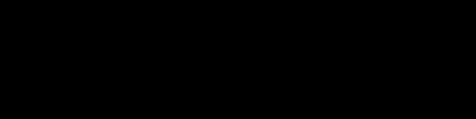
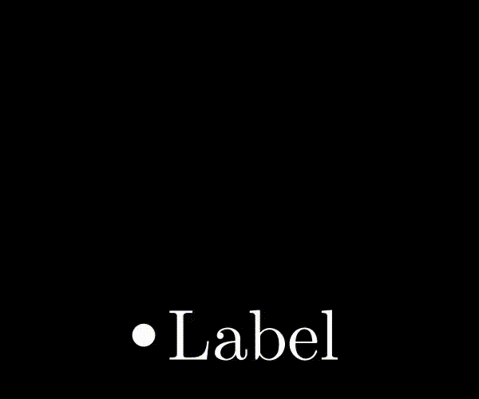
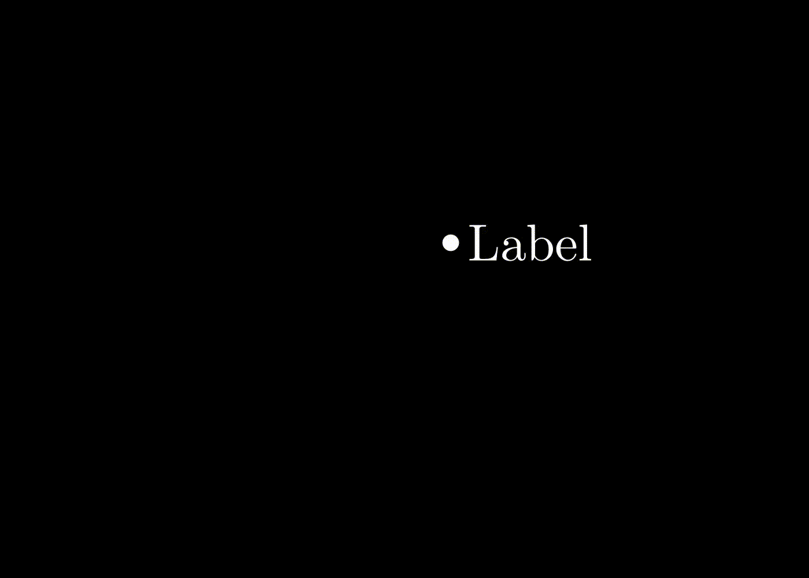
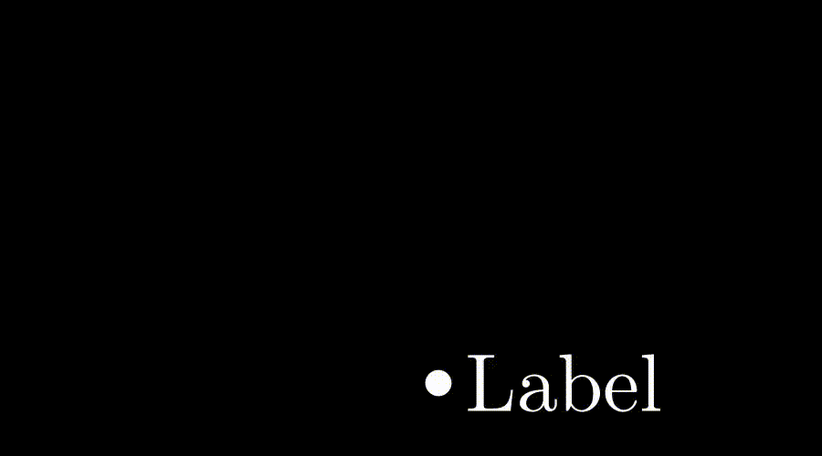
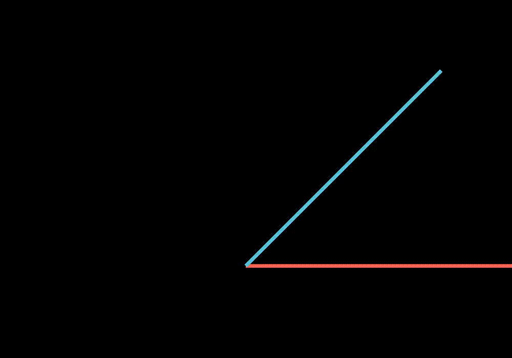
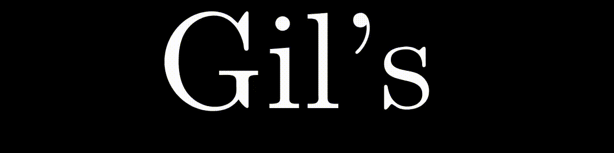
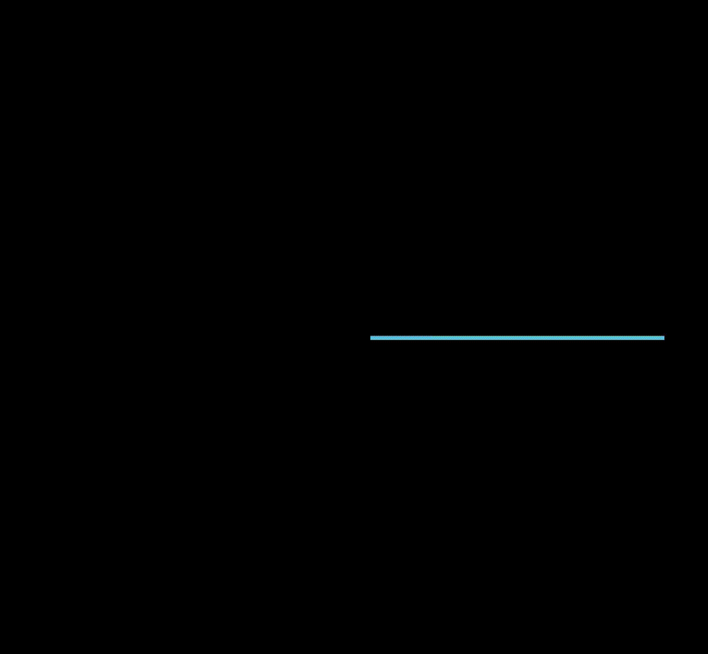

<!--ts-->
   * [Manim](#manim)
      * [Execution options](#execution-options)
      * [Operations](#operations)
         * [Add/remove text from the screen without animation](#addremove-text-from-the-screen-without-animation)
         * [Adding text to the screen with animation](#adding-text-to-the-screen-with-animation)
      * [Text transformations](#text-transformations)
      * [animations](#animations)
      * [Positions](#positions)
         * [Absolute position](#absolute-position)
            * [to_edge(DIRECTION)](#to_edgedirection)
            * [to_corner(CORNER_TYPE)](#to_cornercorner_type)
         * [Relative position](#relative-position)
            * [move_to()](#move_to)
            * [next_to()](#next_to)
            * [shift(DIRECTION)](#shiftdirection)
      * [Rotating](#rotating)
         * [Rotate an element around it's center](#rotate-an-element-around-its-center)
         * [Rotate an element with a point as a reference](#rotate-an-element-with-a-point-as-a-reference)
      * [Flipping](#flipping)
      * [Update functions](#update-functions)
         * [Example 1](#example-1)
         * [Example 2](#example-2)
         * [Example 3](#example-3)
         * [Example 4](#example-4)
         * [Example 5](#example-5)
         * [Example 6](#example-6)
         * [Example 7](#example-7)
      * [Modifying the config (default values)](#modifying-the-config-default-values)
      * [Plots](#plots)
         * [Plot 2D](#plot-2d)
            * [Plot example 1](#plot-example-1)
            * [Plot example 2](#plot-example-2)
         * [Plots 3D](#plots-3d)
            * [Setting Camera angle:](#setting-camera-angle)
               * [Plot example 1](#plot-example-1-1)
               * [Plot example 2](#plot-example-2-1)
               * [Plot example 3 With distance](#plot-example-3-with-distance)
            * [Parametric curve](#parametric-curve)
         * [Surfaces plots](#surfaces-plots)
      * [Contstants](#contstants)
      * [Coordinates systems](#coordinates-systems)
         * [Polar coordinate](#polar-coordinate)
         * [Cylindrical coordinate system](#cylindrical-coordinate-system)
         * [Spherical coordinate system](#spherical-coordinate-system)
      * [Shapes should do](#shapes-should-do)
   * [Documentations](#documentations)
   * [Intresting Packages for manim](#intresting-packages-for-manim)

<!-- Added by: gil_diy, at: Wed 19 Oct 2022 16:50:00 IDT -->

<!--te-->

# Manim


```bash
pipenv run python manim.py example_scenes.py SquareToCircle -pl
```

## Execution options 

shorthand | option | Description
------------|----- |-------------
 `-p`|  `--preview` | Automatically open the saved file once its done
 `-w`| `--write_to_movie` | Render the scene as a movie file
 `-ql`| `--low_quality` | Render at a low quality (for faster rendering)
 `-qh`| `--high_quality` | Render at a high quality
 `-s`| | Saving the last frame with -s
 `-i`|`--save_as_gif`| Save the video as gif
 `-g`| `--save_pngs` | Save each frame as a png
 `-t`|`--transparent`| Render to a movie file with an alpha channel
 `-o`| `--file_name` | Specify the name of the output file
 `-r`| `--resolution` | Resolution, passed as \"height,width\"
 ``| `--video_output_dir` | directory to write video


```bash
manim -pql <python-file> <function name - the scene>
```

## Operations

### Add/remove text from the screen without animation

```python
text = TextObject("my text")
self.add(text)
self.wait() # waits 1 second by default
self.remove(text)
self.wait() # waits 1 second by default
```


[Reference](https://www.youtube.com/watch?v=QEdVn8socC8&list=PL2B6OzTsMUrwo4hA3BBfS7ZR34K361Z8F&index=13)

```python
class FormulaColor1(Scene):
	def construct(self):
		text = TextMobject("x","=","{a","\\over","b}").scale(3)

		text[0].set_color(RED)
		text[1].set_color(BLUE)
		text[2].set_color(GREEN)
		text[3].set_color(ORANGE)
		text[4].set_color(YELLOW)

		self.play(Write(text))
		self.write(2)
```
### Adding text to the screen with animation
```python
text = TextObject("my text")
self.play(FadeIn(text), run_time=3) # Animation will take 3 seconds
```
## Text transformations

```python
class TransfromationText1V1(Scene):
    def construct(self):
        text_object1 = TextMobject("First text")
        text_object2 = TextMobject("Second text")
        self.play(Write(text_object1))
        self.wait()
        self.play(Transform(text_object1, text_object2))
        self.wait()
```
<p align="center">
	
</p>


## animations

All animationes appear in `./manimlib/animation` .

Function | Description
------------|-----
 FadeIn | element-description
 FadeInFrom | 
 FadeInFromDown | 
 FadeInFromPoint |
 FadeInFromLarge |  
 VFadeIn | 
 FadeOutAndShift |  
 FadeOutAndShiftDown | 
 VFadeOut | 
 VFadeInThenOut
  |


## Positions

### Absolute position

#### to_edge(DIRECTION)
use the predefine directions, for example:

```python
.to_edge(UP)
.to_edge(DOWN)
.to_edge(LEFT)
.to_edge(RIGHT)
```

#### to_corner(CORNER_TYPE)

To the corner, we can use:

```python
.to_corner(UR) # Up Right
.to_corner(UL) # Up Left
.to_corner(DR) # Down Right
.to_corner(DL) # Down Left
```

For example:
```python
class PositionsExmaple(Scene):
	object = Dot()
	object.to_edge(DOWN)
	self.add(object)
	self.wait()
```

* In case you want to decrease the size of the border, so the element will be closer to the edge use: `.to_edge(DIRECTION, buff=NUMBER)`

* Comment the predefined Constants are declared in: `./manimlib/constants.py`


### Relative position

#### move_to()

```python
	class PositionsExampleRelative(Scene):
		def construct(self):
		    grid = ScreenGrid()
		    my_dot = Dot()
		    
		    referenceText = TextMobject("Destination")

		    my_dot.move_to(-3*LEFT + 2*UP)

		    referenceText.move_to(my_dot.get_center() + 5*RIGHT)

		    self.add(grid,my_dot, referenceText)
		    self.wait()
```

#### next_to()

#### shift(DIRECTION)

Moves the object with **one unit** towards the direction:

my_dot.shift(RIGHT)


## Rotating

### Rotate an element around it's center

```python
	class RotateObject(Scene):
		def construct(self):
			textM = TextMobject("Text")
			textC = TextMobject("Reference text")
			textM.shift(UP)
			textM.rotate(PI/4) # <- Radians
			# You can use .rotate(45*DEGREES) too
			self.play(Write(textM), Write(textC))
			self.wait(2)
			textM.rotate(PI/4)
			self.wait(2)
			textM.rotate(PI/4)
			self.wait(2)
			textM.rotate(PI/4)
			self.wait(2)
			textM.rotate(PI)
			self.wait(2)

```	
### Rotate an element with a point as a reference

```python
my_object.rotate(110*DEGREES, about_point = point)
```
## Flipping


```python
class FlipObject(Scene):
	def construct(self):
		textM = TextMobject("Text")
		textM.flip(UP)
		self.play(Write(textM))
		self.wait(2)
```

## Update functions

### Example 1

```python
class AddUpdater1(Scene):
    def construct(self):
        dot = Dot()
        text = TextMobject("Label")
        text.next_to(dot, RIGHT, buff=SMALL_BUFF)

        self.add(dot, text)

        # Update function
        def update_text(obj):
            obj.next_to(dot, RIGHT, buff=SMALL_BUFF)

        # Add update function to the objects
        # So now the text will always be to the right of the dot regardless
        # of the point's position.
        text.add_updater(update_text)

        # Add the object again
        self.add(text)
        self.play(dot.shift, UP * 2)
        # Remove update function`
        text.remove_updater(update_text)
        self.wait()
```
<p align="center">
	
</p>


### Example 2

```python
class AddUpdater2(Scene):
    def construct(self):
        dot = Dot()
        text = TextMobject("Label")
        text.next_to(dot, RIGHT, buff=SMALL_BUFF)

        self.add(dot, text)

        # Update function
        def update_text(obj):
            obj.next_to(dot, RIGHT, buff=SMALL_BUFF)

        # Add update function to the objects
        # So now the text will always be to the right of the dot regardless
        # of the point's position. this is type of grouping
        text.add_updater(update_text)

        # Add the object again
        self.add(text)
        self.play(dot.shift, UP * 2, run_time=1)
        self.play(dot.shift, LEFT * 2, run_time=1)
        self.play(Rotating(dot, radians=PI, about_point=ORIGIN), run_time=2)
        # Remove update function`
        text.remove_updater(update_text)
        self.wait()
```
<p align="center">

</p>


### Example 3

The function **UpdateFromFunc** can be only used within `play` function.

i.e:

```python
class AddUpdater3(Scene):
    def construct(self):
        dot = Dot()
        text = TextMobject("Label").next_to(dot, RIGHT, buff=SMALL_BUFF)

        self.add(dot, text)

        def update_text(obj):
            obj.next_to(dot, RIGHT, buff=SMALL_BUFF)

        # Only works in play
        self.play(
            dot.shift, UP * 2,
            UpdateFromFunc(text, update_text)
        )

        self.play(dot.shift, LEFT * 2)

        self.wait()
```

<!-- <p align="center">

</p>
 -->

<p align="center">
  
</p>

### Example 4

```python
class UpdateValueTracker1(Scene):
    def construct(self):
        theta = ValueTracker(PI /4)
        line_1 = Line(ORIGIN, RIGHT * 3, color=RED)
        line_2 = Line(ORIGIN, RIGHT * 3, color=BLUE)

        line_2.rotate(theta.get_value(), about_point=ORIGIN)

        line_2.add_updater(
            lambda m: m.set_angle(
                theta.get_value()
            )
        )

        self.add(line_1, line_2)
        self.play(theta.increment_value, PI / 2)
        self.wait()
```
<!-- style="width:400px; -->
<p align="center"> 
  
</p>

### Example 5


```python
class UpdateValueTracker2(Scene):
    CONFIG = {
        "line_1_color": ORANGE,
        "line_2_color": PINK,
        "lines_size": 3.5,
        "theta": PI / 2,
        "increment_theta": PI / 2,
        "final_theta": PI,
        "radius": 0.7,
        "radius_color": YELLOW,
    }

    def construct(self):
        # Set objets
        theta = ValueTracker(self.theta)
        line_1 = Line(ORIGIN, RIGHT * self.lines_size, color=self.line_1_color)
        line_2 = Line(ORIGIN, RIGHT * self.lines_size, color=self.line_2_color)

        line_2.rotate(theta.get_value(), about_point=ORIGIN)
        line_2.add_updater(
            lambda m: m.set_angle(
                theta.get_value()
            )
        )

        angle = Arc(
            radius=self.radius,
            start_angle=line_1.get_angle(),
            angle=line_2.get_angle(),
            color=self.radius_color
        )

        # Show the objects

        self.play(*[
            ShowCreation(obj) for obj in [line_1, line_2, angle]
        ])

        # Set update function to angle

        angle.add_updater(
            lambda m: m.become(
                Arc(
                    radius=self.radius,
                    start_angle=line_1.get_angle(),
                    angle=line_2.get_angle(),
                    color=self.radius_color
                )
            )
        )
        # Remember to add the objects again to the screen
        # when you add the add_updater method.
        self.add(angle)

        self.play(theta.increment_value, self.increment_theta)
        # self.play(theta.set_value,self.final_theta)

        self.wait()
```

<!-- style="width:300px; -->

<p align="center;" >
  
</p>


### Example 6

```python
class Succession2(Scene):
    def construct(self):
        text1 = TextMobject("Gil's")
        text2 = TextMobject("successful")
        text3 = TextMobject("company")
        for text in text1, text2, text3:
            text.scale(3)
        self.add(text1)
        self.play(
            Succession(
                Transform(text1, text2),
                Transform(text1, text3),
                lag_ratio=1.2
            )
        )
        self.wait()
```

<p align="center;" style="width:300px;" >
  
</p>

### Example 7

```python
class TriangleScene(Scene):
    def construct(self):
        circle = Circle(radius=3)
        base_line = Line(ORIGIN, RIGHT * 3, color=ORANGE)
        side_1 = Line(ORIGIN, RIGHT * 3, color=BLUE)
        side_2 = Line(RIGHT * 3, RIGHT * 3, color=PURPLE)
        sides = VGroup(side_1, side_2)

        def triangle_update(mob):
            side_1, side_2 = mob
            new_side_1 = Line(ORIGIN, circle.points[-1], color=BLUE)
            new_side_2 = Line(RIGHT * 3, circle.points[-1], color=PURPLE)
            side_1.become(new_side_1)
            side_2.become(new_side_2)

        sides.add_updater(triangle_update)
        self.add(base_line, sides)
        self.play(ShowCreation(circle, run_time=3))

        self.wait()
```


<!-- style="width:300px;" -->
<p align="center" >
  
</p>

## Modifying the config (default values)
```python
class ConfigExample(Scene):
    CONFIG={
		"camera_config": {
			"Background_color":RED,
			"shading_factor": 1.0, ### Unclear what is shading factor??
			"background_image": "chalkboard", ## Check this too
			"background_opacity" : 1, ### Check this
			"fill_opacity": 1 # Check this
			},
		"icon_style":{
			"background_stroke_width": 5,
			"background_stroke_color": BLACK,
			},
		"axis_config": {
		"color": LIGHT_GREY,
		"include_tip": True,
		"exclude_zero_from_default_numbers": True,
			 },
		"axis_config": {
		"stroke_color": WHITE,
		"stroke_width": 2,
		"include_ticks": False,
		"include_tip": False,
		"line_to_number_buff": SMALL_BUFF,
		"label_direction": DR,
		"number_scale_val": 0.5,
			 }

        ...
    }
```

sum of the properties can be seen in: `manimlib/scene/graph_scene.py`


## Plots

Most of the parameters for the Graph appears in the file `graph_scene.py`,

### Plot 2D
#### Plot example 1

```python
class Plot2(GraphScene):
    CONFIG = {
        "y_max" : 50,
        "y_min" : 0,
        "x_max" : 7,
        "x_min" : 0,
        "y_tick_frequency" : 5,
        "axes_color" : BLUE,
        "x_axis_label" : "$t$",
        "y_axis_label" : "$f(t)$",
    }
    def construct(self):
        self.setup_axes()
        graph = self.get_graph(lambda x : x**2, color = GREEN)
        self.play(
            ShowCreation(graph),
            run_time = 2
        )
        self.wait()
        
    def setup_axes(self):
        # Add this line
        GraphScene.setup_axes(self) 
        # Parametters of labels
        #   For x
        init_label_x = 2
        end_label_x = 7
        step_x = 1
        #   For y
        init_label_y = 20
        end_label_y = 50
        step_y = 5
        # Position of labels
        #   For x
        self.x_axis.label_direction = DOWN #DOWN is default
        #   For y
        self.y_axis.label_direction = LEFT
        # Add labels to graph
        #   For x
        self.x_axis.add_numbers(*range(
                                        init_label_x,
                                        end_label_x+step_x,
                                        step_x
                                    ))
        #   For y
        self.y_axis.add_numbers(*range(
                                        init_label_y,
                                        end_label_y+step_y,
                                        step_y
                                    ))
        #   Add Animation
        self.play(
            ShowCreation(self.x_axis),
            ShowCreation(self.y_axis)
        )
```

<p align="center" >
  
</p>


#### Plot example 2

```python
# Helper function
def Range(in_val, end_val, step=1):
    return list(np.arange(in_val, end_val + step, step))

class PlotSinCos(GraphScene):
    CONFIG = {
        "y_max" : 1.5,
        "y_min" : -1.5,
        "x_max" : 3*PI/2,
        "x_min" : -3*PI/2,
        "y_tick_frequency" : 0.5,
        "x_tick_frequency" : PI/2,
        "graph_origin" : ORIGIN,
        "y_axis_label": None, # Don't write y axis label
        "x_axis_label": None,
    }
    def construct(self):
        self.setup_axes()
        plotSin = self.get_graph(lambda x : np.sin(x), 
                                    color = GREEN,
                                    x_min=-4,
                                    x_max=4,
                                )
        plotCos = self.get_graph(lambda x : np.cos(x), 
                                    color = GRAY,
                                    x_min=-PI,
                                    x_max=0,
                                )
        plotSin.set_stroke(width=3) # width of line
        plotCos.set_stroke(width=2)
        # Animation
        for plot in (plotSin,plotCos):
            self.play(
                    ShowCreation(plot),
                    run_time = 2
                )
        self.wait()

    def setup_axes(self):
        GraphScene.setup_axes(self)
        # width of edges
        self.x_axis.set_stroke(width=2)
        self.y_axis.set_stroke(width=2)
        # color of edges
        self.x_axis.set_color(RED)
        self.y_axis.set_color(YELLOW)
        # Add x,y labels
        func = TexMobject("\\sin\\theta")
        var = TexMobject("\\theta")
        func.set_color(BLUE)
        var.set_color(PURPLE)
        func.next_to(self.y_axis,UP)
        var.next_to(self.x_axis,RIGHT+UP)
        # Y labels
        self.y_axis.label_direction = LEFT*1.5
        self.y_axis.add_numbers(*[-1,1])
        #Parametters of x labels
        init_val_x = -3*PI/2
        step_x = PI/2
        end_val_x = 3*PI/2
        # List of the positions of x labels
        values_decimal_x=Range(init_val_x,end_val_x,step_x)
        # List of tex objects
        list_x=TexMobject("-\\frac{3\\pi}{2}", #   -3pi/2
                            "-\\pi", #              -pi 
                            "-\\frac{\\pi}{2}", #   -pi/2
                            "\\,", #                 0 (space)
                            "\\frac{\\pi}{2}", #     pi/2
                            "\\pi",#                 pi
                            "\\frac{3\\pi}{2}" #     3pi/2
                          )
        #List touples (position,label)
        values_x = [(i,j)
            for i,j in zip(values_decimal_x,list_x)
        ]
        self.x_axis_labels = VGroup()
        for x_val, x_tex in values_x:
            x_tex.scale(0.7)
            if x_val == -PI or x_val == PI: #if x is equals -pi or pi
                x_tex.next_to(self.coords_to_point(x_val, 0), 2*DOWN) #Put 2*Down
            else: # In another case
                x_tex.next_to(self.coords_to_point(x_val, 0), DOWN)
            self.x_axis_labels.add(x_tex)

        self.play(
            *[Write(objeto)
            for objeto in [
                    self.y_axis,
                    self.x_axis,
                    self.x_axis_labels,
                    func,var
                ]
            ],
            run_time=2
        )
```

<p align="center" >
  
</p>

### Plots 3D

With 3D Plots we have an actual camera,
We can eaily set it by:

`self.set_camera_orientation(phi=0 * DEGREES)`

You **must** add this method:

```python
def get_axis(self, min_val, max_val, axis_config):
    new_config = merge_config([
        axis_config,
        {"x_min": min_val, "x_max": max_val},
        self.number_line_config,
    ])
    return NumberLine(**new_config)
```

#### Setting Camera angle:
##### Plot example 1

```python
class CameraPosition_above(ThreeDScene):
    def construct(self):
        axes = ThreeDAxes()
        circle=Circle()
        self.set_camera_orientation(phi=0 * DEGREES)
        self.play(ShowCreation(circle),ShowCreation(axes))
        self.wait()
```

<p align="center" >
  
</p>


##### Plot example 2

```python
class CameraPosition3(ThreeDScene):
    def construct(self):
        axes = ThreeDAxes()
        circle=Circle()
        self.set_camera_orientation(phi=80 * DEGREES,theta=45*DEGREES)
        self.play(ShowCreation(circle),ShowCreation(axes))
        self.wait()
```

<p align="center" >
  
</p>

##### Plot example 3 With distance

```python
class CameraPosition4(ThreeDScene):
    def construct(self):
        axes = ThreeDAxes()
        circle=Circle()
        self.set_camera_orientation(phi=80 * DEGREES,theta=45*DEGREES,distance=6)
        self.play(ShowCreation(circle),ShowCreation(axes))
        self.wait()
```

#### Parametric curve

```python
class ParametricCurve1(ThreeDScene):
    def construct(self):
        curve1=ParametricFunction(
                lambda u : np.array([
                1.2*np.cos(u),
                1.2*np.sin(u),
                u/2
            ]),color=RED,t_min=-TAU,t_max=TAU,
            )
        curve2=ParametricFunction(
                lambda u : np.array([
                1.2*np.cos(u),
                1.2*np.sin(u),
                u
            ]),color=RED,t_min=-TAU,t_max=TAU,
            )
        axes = ThreeDAxes()

        self.add(axes)

        self.set_camera_orientation(phi=80 * DEGREES,theta=-60*DEGREES)
        self.begin_ambient_camera_rotation(rate=0.1)
        self.play(ShowCreation(curve1))
        self.wait()
        self.play(Transform(curve1,curve2),rate_func=there_and_back,run_time=3)
        self.wait()
```

<p align="center" >
  
</p>

### Surfaces plots

```python
class SurfacesAnimation(ThreeDScene):
    def construct(self):
        axes = ThreeDAxes()
        cylinder = ParametricSurface(
            lambda u, v: np.array([
                np.cos(TAU * v),
                np.sin(TAU * v),
                2 * (1 - u)
            ]),
            resolution=(6, 32)).fade(0.5)  # Resolution of the surfaces

        paraboloid = ParametricSurface(
            lambda u, v: np.array([
                np.cos(v) * u,
                np.sin(v) * u,
                u ** 2
            ]), v_max=TAU,
            checkerboard_colors=[PURPLE_D, PURPLE_E],
            resolution=(10, 32)).scale(2)

        para_hyp = ParametricSurface(
            lambda u, v: np.array([
                u,
                v,
                u ** 2 - v ** 2
            ]), v_min=-2, v_max=2, u_min=-2, u_max=2, checkerboard_colors=[BLUE_D, BLUE_E],
            resolution=(15, 32)).scale(1)

        cone = ParametricSurface(
            lambda u, v: np.array([
                u * np.cos(v),
                u * np.sin(v),
                u
            ]), v_min=0, v_max=TAU, u_min=-2, u_max=2, checkerboard_colors=[GREEN_D, GREEN_E],
            resolution=(15, 32)).scale(1)

        hip_one_side = ParametricSurface(
            lambda u, v: np.array([
                np.cosh(u) * np.cos(v),
                np.cosh(u) * np.sin(v),
                np.sinh(u)
            ]), v_min=0, v_max=TAU, u_min=-2, u_max=2, checkerboard_colors=[YELLOW_D, YELLOW_E],
            resolution=(15, 32))

        ellipsoid = ParametricSurface(
            lambda u, v: np.array([
                1 * np.cos(u) * np.cos(v),
                2 * np.cos(u) * np.sin(v),
                0.5 * np.sin(u)
            ]), v_min=0, v_max=TAU, u_min=-PI / 2, u_max=PI / 2, checkerboard_colors=[TEAL_D, TEAL_E],
            resolution=(15, 32)).scale(2)

        sphere = ParametricSurface(
            lambda u, v: np.array([
                1.5 * np.cos(u) * np.cos(v),
                1.5 * np.cos(u) * np.sin(v),
                1.5 * np.sin(u)
            ]), v_min=0, v_max=TAU, u_min=-PI / 2, u_max=PI / 2, checkerboard_colors=[RED_D, RED_E],
            resolution=(15, 32)).scale(2)

        self.set_camera_orientation(phi=75 * DEGREES)
        self.begin_ambient_camera_rotation(rate=0.2)

        self.add(axes)
        self.play(Write(sphere))
        self.wait()
        self.play(ReplacementTransform(sphere, ellipsoid))
        self.wait()
        self.play(ReplacementTransform(ellipsoid, cone))
        self.wait()
        # self.play(ReplacementTransform(cone, hip_one_side))
        # self.wait()
        # self.play(ReplacementTransform(hip_one_side, para_hyp))
        # self.wait()
        # self.play(ReplacementTransform(para_hyp, paraboloid))
        # self.wait()
        # self.play(ReplacementTransform(paraboloid, cylinder))
        # self.wait()
        self.play(FadeOut(cylinder))
```

<p align="center" >
  
</p>

## Contstants

For adding new colors:

```bash
./manimlib/constants.py
```	

## Coordinates systems

### Polar coordinate 

[Link](https://en.wikipedia.org/wiki/Polar_coordinate_system#Converting_between_polar_and_Cartesian_coordinates)

### Cylindrical coordinate system

[Link](https://en.wikipedia.org/wiki/Cylindrical_coordinate_system#Cartesian_coordinates)

### Spherical coordinate system

[Link](https://en.wikipedia.org/wiki/Spherical_coordinate_system#Cartesian_coordinates)

## Shapes should do

[Lemniscate](https://he.wikipedia.org/wiki/%D7%9C%D7%9E%D7%A0%D7%99%D7%A1%D7%A7%D7%98%D7%94)

[heart](https://mathworld.wolfram.com/HeartCurve.html)

# Documentations

[Link](https://docs.manim.community/en/stable/installation/linux.html)

# Intresting Packages for manim

[manim-fonts](https://github.com/naveen521kk/manim-fonts)

[manim-fontawesome](https://github.com/naveen521kk/manim-fontawesome)

[manim for machine learning](https://github.com/manimml/ManimML)

[Manim for physics](https://github.com/Matheart/manim-physics)

[Manim for presentation with javascript](https://github.com/chubbc/manim_slides)