<!--ts-->
   * [matplotlib](#matplotlib)
      * [Basics (Stateful appraoch)](#basics-stateful-appraoch)
         * [Simple plot](#simple-plot)
            * [Example #1:](#example-1)
            * [Example #2:](#example-2)
            * [Example #3 (line types + colors + symbols):](#example-3-line-types--colors--symbols)
                  * [Color](#color)
                  * [Symbol](#symbol)
                  * [Line type](#line-type)
         * [Bar Charts](#bar-charts)
         * [Create a Bar Chart Race](#create-a-bar-chart-race)
         * [Line plots](#line-plots)
         * [Pie Charts](#pie-charts)
         * [Stack Plots](#stack-plots)
         * [Histograms](#histograms)
         * [Boxplot](#boxplot)
         * [Scatter Plots](#scatter-plots)
         * [Draw arrows](#draw-arrows)
         * [Draw 3d vectors](#draw-3d-vectors)
         * [Plotting time series](#plotting-time-series)
         * [Plotting Live data in real-time](#plotting-live-data-in-real-time)
      * [Animation](#animation)
      * [Visualising correlation using Seaborn library](#visualising-correlation-using-seaborn-library)
      * [Subplots (Object oriented approach)](#subplots-object-oriented-approach)
         * [Multiple plots](#multiple-plots)
         * [Simple plot](#simple-plot-1)
         * [Configuring the axis](#configuring-the-axis)
            * [Plot image without showing axis:](#plot-image-without-showing-axis)
            * [Set the current Axes:](#set-the-current-axes)
            * [Linestyles](#linestyles)
         * [Plot with logarithmic scale for y-axis](#plot-with-logarithmic-scale-for-y-axis)
         * [Export plot](#export-plot)
         * [Drawing shapes with Matplotlib (patches)](#drawing-shapes-with-matplotlib-patches)
         * [Configuring plot design](#configuring-plot-design)
            * [Title plot size](#title-plot-size)
            * [Legend text size](#legend-text-size)
            * [Ticks text size](#ticks-text-size)
         * [Draw contour lines and filled contours](#draw-contour-lines-and-filled-contours)
   * [Reference](#reference)

<!-- Added by: gil_diy, at: Tue 11 Jan 2022 15:14:49 IST -->

<!--te-->

# matplotlib


## Basics (Stateful appraoch)

### Simple plot
#### Example #1:

```python
import matplotlib.pyplot as plt

ages_x = list(range(25, 36))

developer_salary_y = [38496, 42000, 46752, 49320, 53200, 56000, 62316, 64928, 67317, 68748, 73752]

# The label metioned is for the legend
plt.plot(ages_x, developer_salary_y, label='All Devs')

python_developer_salary_y = [45732, 48876, 53850, 57287, 63016, 65998, 70003, 70000, 71496, 75370, 83640]

plt.plot(ages_x, python_developer_salary_y, label='Python Devs')

plt.xlabel('Ages')
plt.ylabel('Median Salary (USD)')
plt.title('Median Salary (USD) by Age')

plt.legend()

# Showing what we've plotted
plt.show()

```

#### Example #2:


```python
import numpy as np
from matplotlib import pyplot as plt

X = np.linspace(-10, 10, 1024)
Y = np.sinc(X)

plt.plot(X, Y)
plt.savefig('sinc.png', c = 'k')
plt.show()
```

* You can save the image with tranparency support by:

```python
plt.savefig('sinc.png', transparent = True)
```

<p align="center"> <!-- style="width:400px;" -->
  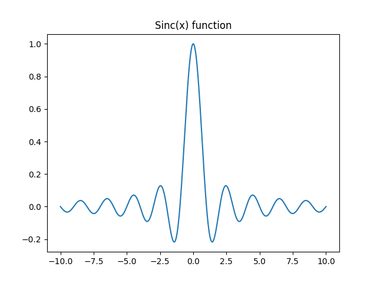
</p>


#### Example #3 (line types + colors + symbols):


```python
import matplotlib.pyplot as plt
import numpy as np

x = np.linspace(1,10,10)
y = np.linspace(2,20,10)

plt.plot(x,y, 'rs--') # rs-- means: 'red' and 'square' and 'dashed' line.
plt.show()
```

<p align="center"> <!-- style="width:400px;" -->
  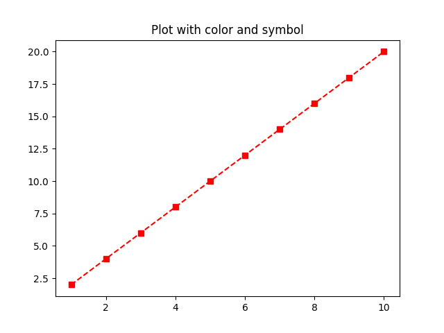
</p>

###### Color 


Color-type | character     
------------|-----
blue | b
green | g
red | r
cyan | c
magenta | m
yellow | y
black | k 
white | w


###### Symbol

Symbol-type | character
------------|-----
point | .
circle | o
x-mark | x
plus | +
star | *
square | s
diamond | d
triangle (down) | v 
triangle (up) | ^
triangle (left) | <
triangle (right) |  >


###### Line type

Line-type | character
------------|-----
solid | -
dotted | :
dashdot | -.
dashed | --


### Bar Charts
```python
import numpy as np
import matplotlib.pyplot as plt

if __name__ == '__main__':
    # creating the dataset
    data = {'C': 20, 'C++': 15, 'Java': 30,
            'Python': 35}
    courses = list(data.keys())
    values = list(data.values())

    fig = plt.figure(figsize=(10, 5))

    # creating the bar plot
    plt.bar(courses, values, color='lightblue',
            width=0.4)

    plt.xlabel("Courses offered")
    plt.ylabel("No. of students enrolled")
    plt.title("Students enrolled in different courses")
    plt.show()

```

<p align="center"> <!-- style="width:400px;" -->
  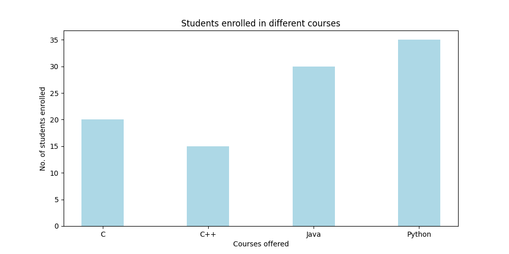
</p>


```python
labels = ['model1', 'model2', 'model3', 'model4', 'model5', 'model6', 'model7', 'model8']
men_means = [13, 11.3, 9.8, 6.5, 6.3, 5.9, 5.6, 4.9]
women_means = [12.5, 10.5, 9.8, 6.4, 6.3, 6, 5.3, 4.99]

x = np.arange(len(labels))  # the label locations
width = 0.35  # the width of the bars

fig, ax = plt.subplots()
rects1 = ax.bar(x - width / 2, men_means, width, label='RMSE', color='lightblue')
rects2 = ax.bar(x + width / 2, women_means, width, label='MAE')

# Add some text for labels, title and custom x-axis tick labels, etc.
ax.set_ylabel('Scores')
ax.set_title('RMSE and MAE comparisons among different recommendation models')
ax.set_xticks(x)
ax.set_xticklabels(labels)
ax.legend()


def autolabel(rects):
    """Attach a text label above each bar in *rects*, displaying its height."""
    for rect in rects:
        height = rect.get_height()
        ax.annotate('{}'.format(height),
                    xy=(rect.get_x() + rect.get_width() / 2, height),
                    xytext=(0, 3),  # 3 points vertical offset
                    textcoords="offset points",
                    ha='center', va='bottom')


autolabel(rects1)
autolabel(rects2)

fig.tight_layout()

plt.show()
```

<p align="center"> <!-- style="width:400px;" -->
  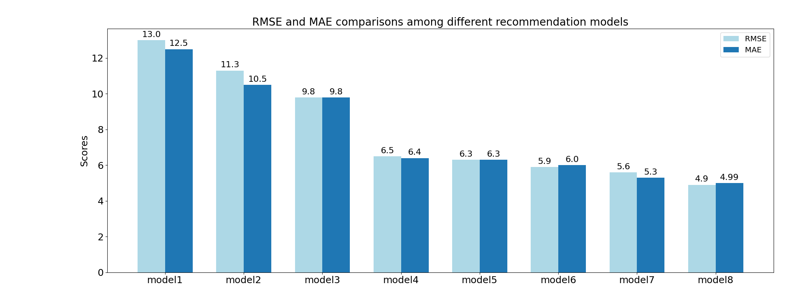
</p>


### Create a Bar Chart Race

[Link](https://swdevnotes.com/python/2020/create-bar-chart-race-1/)

### Line plots
```python
from matplotlib import pyplot as plt

def line_plot_with_fill_between_functions():
    data = pd.read_csv('sample_datasets/data.csv')
    ages = data['Age']
    dev_salaries = data['All_Devs']
    py_salaries = data['Python']
    js_salaries = data['JavaScript']

    plt.plot(ages,
             dev_salaries, color='#444444',
             linestyle='--',
             label='All Devs'
             )

    plt.plot(ages,
             py_salaries,
             label='Python'
             )

    # Fills underneath our function but above our median.
    plt.fill_between(x=ages,
                     y1=py_salaries,
                     y2=js_salaries,
                     alpha=0.25,
                     where=(py_salaries > js_salaries),
                     interpolate=True,
                     label = 'Above Avg')

    plt.fill_between(x=ages,
                     y1=py_salaries,
                     y2=js_salaries,
                     color='red',
                     alpha=0.25,
                     where=(py_salaries <= js_salaries),
                     interpolate=True,
                     label = 'Below Avg')

    plt.legend()
    plt.title('Median Salary (USD) by Age')
    plt.xlabel('Ages')
    plt.ylabel('Median Salary (USD)')
    plt.tight_layout()

    plt.show()
```

<p align="center"> <!-- style="width:400px;" -->
  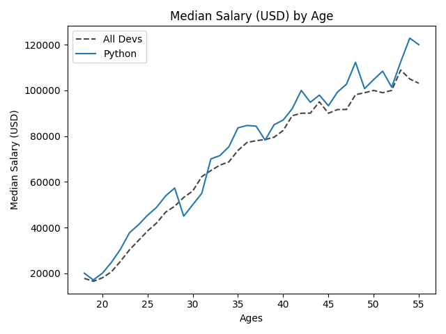
</p>

<p align="center"> <!-- style="width:400px;" -->
  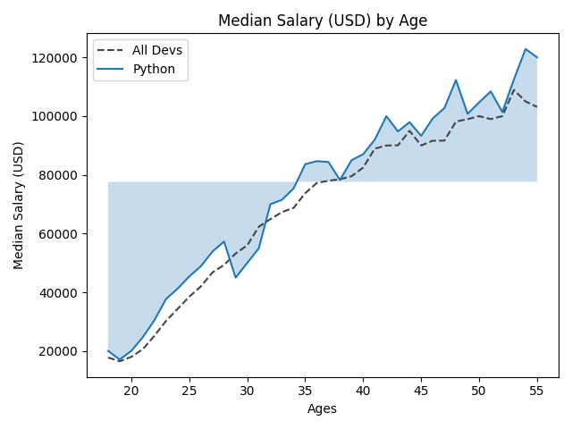
</p>

<p align="center"> <!-- style="width:400px;" -->
  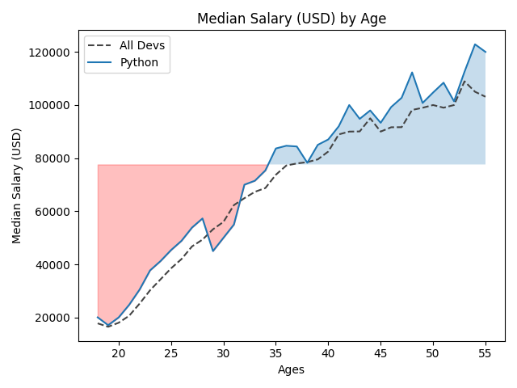
</p>

<p align="center"> <!-- style="width:400px;" -->
  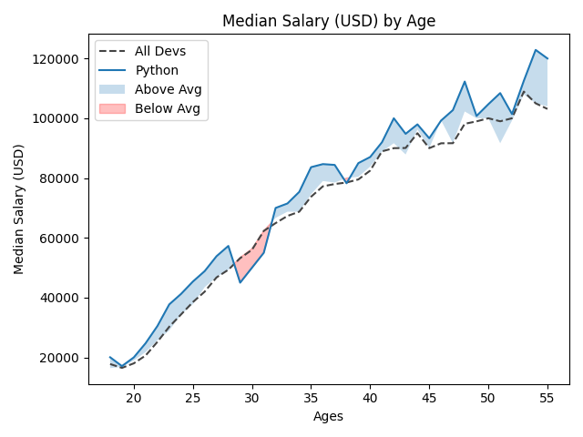
</p>

### Pie Charts
```python
from matplotlib import pyplot as plt

def pie_chart_with_explode():
    plt.style.use("fivethirtyeight")
    slices = [59219, 55466, 47544, 36443, 35917]
    labels = ['Javascript', 'HTML/CSS', 'SQL', 'Python', 'Java']
    relevant_colors = ['#008fd5', '#fc4f30', '#e5ae37', '#6d904f', '#D8BFD8']
    explode_parts = [0, 0, 0, 0.1, 0]

    plt.pie(slices,
            labels=labels,
            wedgeprops={'edgecolor': 'black'},
            colors=relevant_colors,
            explode=explode_parts,
            shadow=True,
            startangle=90,  # Rotate the pie
            autopct='%1.1f%%'  # show percentage
            )

    plt.title("My Awesome pie chart")
    plt.tight_layout()
    plt.show()
```
<p align="center"> <!-- style="width:400px;" -->
  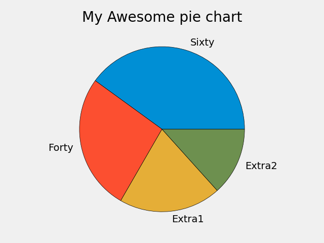
</p>

<p align="center"> <!-- style="width:400px;" -->
  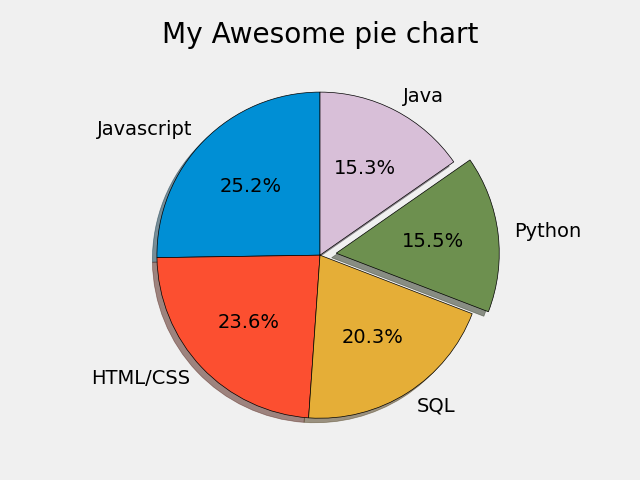
</p>

### Stack Plots
```python
from matplotlib import pyplot as plt

plt.style.use("fivethirtyeight")

minutes = [1, 2, 3, 4, 5, 6, 7, 8, 9]
player1_score_until_minute = [1, 2, 3, 4, 5, 6, 7, 8, 9]
player2_score_until_minute = [1, 1, 1, 1, 1, 3, 5, 6, 13]
player3_score_until_minute = [3, 4, 7, 9, 15, 16, 18, 20, 24]
player_names = ["Player 1", "Player 2", "Player 3"]
colors_shades = ['#6d904f', '#fc4f30', '#008fd5']

plt.stackplot(minutes,
            player1_score_until_minute,
            player2_score_until_minute,
            player3_score_until_minute,
            labels=player_names,
            colors=colors_shades)

# Take the label into an account
# you can write more specify the exact location, with loc=(0.07,0.05)
plt.legend(loc='upper left')

plt.title("My Awesome Stack Plot")
plt.tight_layout()
plt.show()
```

<p align="center"> <!-- style="width:400px;" -->
  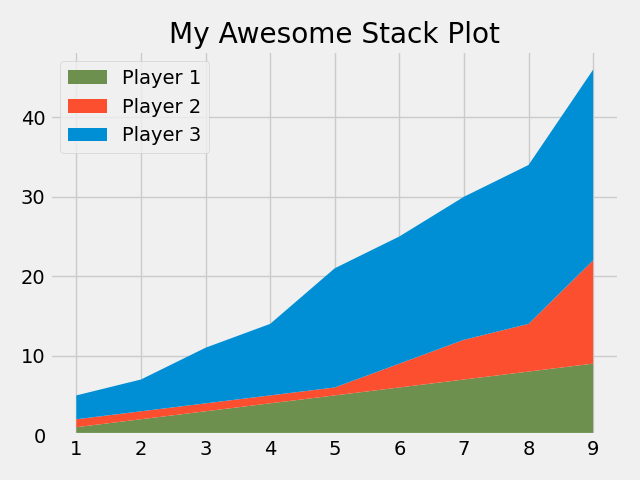
</p>

### Histograms
```python
def histogram_basic_with_declared_bins():
    ages = [18, 19, 21, 25, 26, 26, 30, 32, 38, 45, 55, 47]

    the_bins = [20, 30, 40, 50, 60]

    # So the bins are between:
    # bin #1: people which fell in the age range: 20 - 30
    # bin #2: people which fell in the age range: 30 - 40
    # bin #3: people which fell in the age range: 40 - 50
    # bin #4: people which fell in the age range: 40 - 50
    # bin #5: people which fell in the age range: 50 - 60

    plt.hist(ages,
             bins=the_bins,
             edgecolor='black',
             log=True)

    median_age = statistics.median(ages)
    color_median = '#fc4f30'

    plt.axvline(median_age,
                color=color_median,
                label='Age Median',
                linewidth=5)

    plt.legend()

    plt.title('Ages of Respondents')
    plt.xlabel('Ages')
    plt.ylabel('Total Respondents')

    plt.show()
```

<p align="center"> <!-- style="width:400px;" -->
  
</p>

<p align="center"> <!-- style="width:400px;" -->
  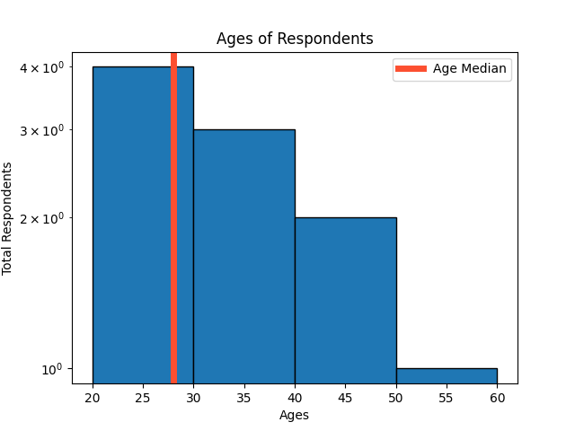
</p>


```python
## The number of bins can be calculated automatically:
plt.hist(arr, bins='auto')
```

[Reference](https://www.youtube.com/watch?v=XDv6T4a0RNc&list=PL-osiE80TeTvipOqomVEeZ1HRrcEvtZB_&index=6)

### Boxplot
```python
from matplotlib import pyplot as plt

 value1 = [82, 76, 24, 40, 67, 62, 75, 78, 71, 32, 98, 89, 78, 67, 72, 82, 87, 66, 56, 52]
 value2 = [62, 5, 91, 25, 36, 32, 96, 95, 3, 90, 95, 32, 27, 55, 100, 15, 71, 11, 37, 21]
 value3 = [23, 89, 12, 78, 72, 89, 25, 69, 68, 86, 19, 49, 15, 16, 16, 75, 65, 31, 25, 52]
 value4 = [59, 73, 70, 16, 81, 61, 88, 98, 10, 87, 29, 72, 16, 23, 72, 88, 78, 99, 75, 30]

 box_plot_data = [value1, value2, value3, value4]
 box = plt.boxplot(box_plot_data,
                   vert=1,  # Vertical or Horizontal
                   patch_artist=True,  # fills the boxplot, otherwise you can't apply the function set_facecolor
                   labels=['course1', 'course2', 'course3', 'course4']
                   )

 colors = ['cyan', 'lightblue', 'lightgreen', 'tan']
 for patch, color in zip(box['boxes'], colors):
     patch.set_facecolor(color)

 plt.show()
```

<p align="center"> <!-- style="width:400px;" -->
  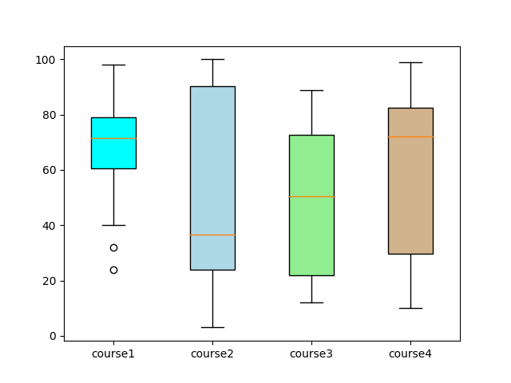
</p>

### Scatter Plots

```python
def scatter_plot_with_different_sizes_and_colors():
    x_input = [5, 7, 8, 5, 9, 3, 1, 1, 5]
    y_input = [5, 7, 8, 5, 5, 6, 4, 3, 4]

    sizes = [100, 56, 222, 333, 151, 92, 67, 72, 103]
    colors = [1, 7, 8, 1, 1, 6, 4, 3, 1]

    # Color maps:
    # https://matplotlib.org/3.1.0/tutorials/colors/colormaps.html

    plt.scatter(x=x_input,
                y=y_input,
                s=sizes,
                c=colors,  # colors
                cmap='Pastel1',  # color map
                edgecolors='black',
                linewidth=1,
                alpha=0.5)

    plt.title('Title example: scatter_plot_with_different_sizes')
    plt.xlabel('x label')
    plt.ylabel('y label')

    color_bar = plt.colorbar()
    color_bar.set_label('Satifaction')
    plt.show()
```

[Reference](https://www.youtube.com/watch?v=zZZ_RCwp49g&list=PL-osiE80TeTvipOqomVEeZ1HRrcEvtZB_&index=7)

<p align="center"> <!-- style="width:400px;" -->
  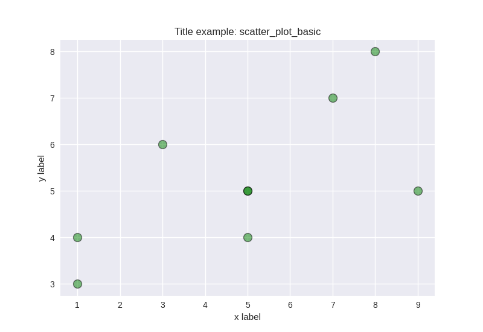
</p>

<p align="center"> <!-- style="width:400px;" -->
  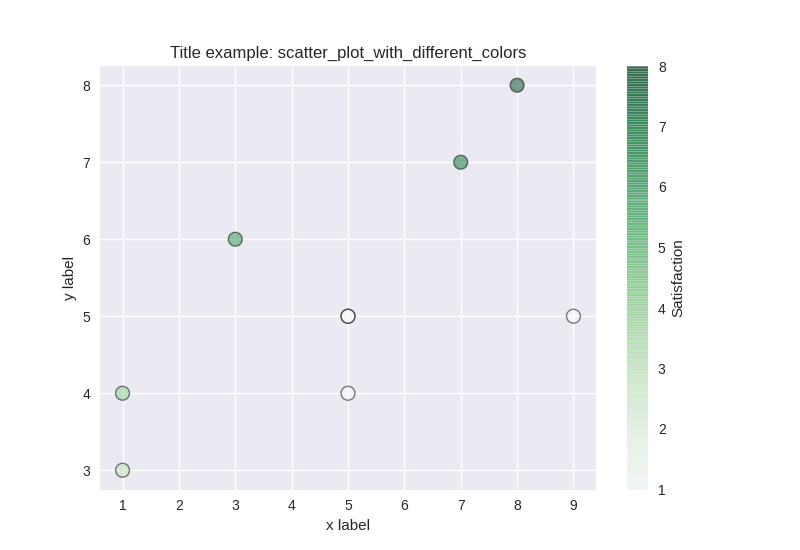
</p>

<p align="center"> <!-- style="width:400px;" -->
  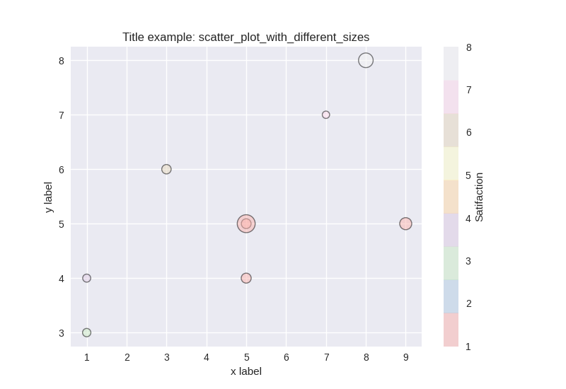
</p>

### Draw arrows

```python
def draw_vector(v0, v1, ax=None):
    ax = ax or plt.gca()
    arrowprops=dict(arrowstyle='->',
                    linewidth=2,
                    shrinkA=0, shrinkB=0, 
                    color='black')
    ax.annotate('', v1, v0, arrowprops=arrowprops)
```

```python
rng = np.random.RandomState(1)
data = np.dot(rng.rand(2, 2), rng.randn(2, 200)).T

plt.scatter(data[:, 0], data[:, 1], alpha=0.2)
for length, vector in zip(pca.explained_variance_, pca.components_):
    v = vector * 3 * np.sqrt(length)
    draw_vector(pca.mean_, pca.mean_ + v)
```


### Draw 3d vectors 

<p align="center"> <!-- style="width:400px;" -->
  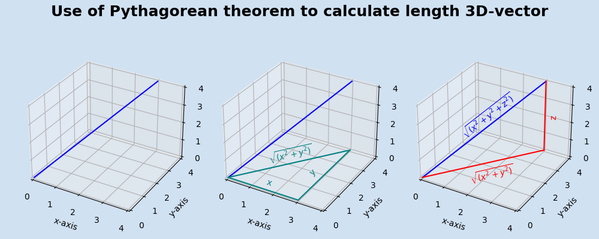
</p>

```python
import matplotlib.pyplot as plt

if __name__ == '__main__':
    fig, axs = plt.subplots(
        1, 3, figsize=(10, 4), facecolor=plt.cm.Blues(0.2), subplot_kw={"projection": "3d"}
    )
    fig.suptitle(
        f"Use of Pythagorean theorem to calculate length 3D-vector",
        fontsize=18,
        fontweight="bold",
    )

    for i, ax in enumerate(axs.flatten()):
        ax.set_facecolor(plt.cm.Blues(0.2))
        xs, ys, zs = zip((0, 0, 0), (3, 4, 4))
        ax.plot(xs, ys, zs, color="blue")
        ax.set_xlim(0, 4)
        ax.set_ylim(0, 4)
        ax.set_zlim(0, 4)
        ax.set_xlabel("x-axis")
        ax.set_ylabel("y-axis")
        ax.set_zlabel("z-axis")

    axs[1].plot((0, 3), (0, 0), (0, 0), color="teal")
    axs[1].plot((3, 3), (0, 4), (0, 0), color="teal")
    axs[1].plot((0, 3), (0, 4), (0, 0), color="teal")
    axs[1].text(1.5, 0.2, 0, "x", "x", color="teal")
    axs[1].text(2.5, 1.6, 0, "y", "y", color="teal")
    axs[1].text(0.7, 1.6, 0, r"$\sqrt{(x^2 + y^2)}$", (3, 4, 0), color="teal")

    axs[2].plot((0, 3), (0, 4), (0, 0), color="red")
    axs[2].plot((3, 3), (4, 4), (0, 4), color="red")
    axs[2].text(1.7, 0.5, 0, r"$\sqrt{(x^2 + y^2)}$", (3, 4, 0), color="red")
    axs[2].text(3.2, 4.0, 2.0, "z", "z", color="red")
    axs[2].text(1, 1, 2, r"$\sqrt{(x^2 + y^2 + z^2)}$", (3, 4, 4), color="blue")

    fig.tight_layout(pad=2.0)
    plt.show()
```

### Plotting time series

```python
from datetime import datetime, timedelta
from matplotlib import pyplot as plt
from matplotlib import dates as mpl_dates

if __name__ == '__main__':
   plt.style.use('seaborn')

   dates = [
     datetime(2019, 5, 24),
     datetime(2019, 5, 25),
     datetime(2019, 5, 26),
     datetime(2019, 5, 27),
     datetime(2019, 5, 28),
     datetime(2019, 5, 29),
     datetime(2019, 5, 30)
   ]

   y = [0, 1, 3, 4, 6, 5, 7]

   plt.plot_date(dates, y, linestyle='solid')

   plt.gcf().autofmt_xdate()
   date_format = mpl_dates.DateFormatter('%b, %d %Y')

   # gca = Get current axis
   plt.gca().xaxis.set_major_formatter(date_format)
   plt.show()
```

### Plotting Live data in real-time

The magic takes place by using the `FuncAnimation`.

```python
import pandas as pd
import matplotlib.pyplot as plt
from matplotlib.animation import FuncAnimation

# Attention Gil:
# you should run this script DURING the script generate_data_for_plotting_in_real_time.py is running.

plt.style.use('fivethirtyeight')

x_vals = []
y_vals = []


def animate(i):
    data = pd.read_csv('sample_datasets/data_for_real_time.csv')
    x = data['x_value']
    y1 = data['total_1']
    y2 = data['total_2']

    plt.cla()  # Clear axes

    plt.plot(x, y1, label='Channel 1')
    plt.plot(x, y2, label='Channel 2')

    plt.legend(loc='upper left')
    plt.tight_layout()


if __name__ == '__main__':

    # gcf means get current figure
    ani = FuncAnimation(fig=plt.gcf(),
                        func=animate,
                        interval=1000)

    plt.tight_layout()
    plt.show()
```


time_series_plot.png

## Animation 

[Link1](https://towardsdatascience.com/basics-of-gifs-with-pythons-matplotlib-54dd544b6f30)

[Link2](https://nathankjer.com/animated-3d-plots/)

## Visualising correlation using Seaborn library

```python
correlation = df.corr()
plt.figure(figsize=(10,10))
sns.heatmap(correlation, vmax=1, square=True,annot=True,cmap='cubehelix')

plt.title('Correlation between different fearures')
```

## Subplots (Object oriented approach)

We can instantiate figure and axis as an actual object

Thefore we can change everywhere:


```python
  # You can specify the number of rows and columns, if we don't specify
  # the default value will be one on one

  fig, ax = plt.subplots()

  plt.plot(...)   => ax.plot(...)
  plt.title(...)  => ax.set_title(...)
  plt.xlabel(...) => ax.set_xlabel(...)
  plt.ylabel(...) => ax.set_ylabel(...)

```
for example:

```python

# You can specify the number of rows and columns, if we don't specify
# the default value will be one on one
fig, ax = plt.subplots()

ax.plot(ages, salaries_israel, label="graph1")
ax.plot(ages, salaries_USA, label="graph2")
ax.legend()

plt.xlabel('Ages')
plt.ylabel('Salaries')
plt.grid(true)
plt.title('Median Salary (USD) by Age')

plt.show()

```


### Multiple plots

```python

# would like multiple subplots
fig, ax = plt.subplots(nrows = 2 , ncols = 1)

# Therefore we get in ax a list of subplots of two axis
# you can unpack it, more easier:
fig, (ax1, ax2) = plt.subplots(nrows = 2 , ncols = 1)
```

### Simple plot

Description | command
------------|---------
Load image | img = mpimg.imread('my_image.jpg')
Show image | plt.imshow(output[i])
		   | plt.show(block=True)
		   | plt.interactive(False)
Save image to file | plt.savefig("example.png")  # should before plt.show method plt.show()


```python
ax.plot(ages, salaries_israel, label="graph1")
ax.plot(ages, salaries_USA, label="graph2")
ax.legend()

plt.xlabel('Ages')
plt.ylabel('Salaries')
plt.grid(true)
plt.title('Median Salary (USD) by Age')

plt.show()
```

### Configuring the axis

#### Plot image without showing axis:

By default we will see the axis.

```python
plt.axis('off')
```

#### Set the current Axes:

```python
fix, axes = plt.subplots(ncols=2, figsize=(10, 4), sharey=True)
plt.sca(axes[0])
```
#### Linestyles
```python
plt.plot(x,y, linewidth = 4.0)
plt.plot(x,y, ls='solid')
plt.plot(x,y, ls='--')
plt.plot(x,y, ls='--')
```

### Plot with logarithmic scale for y-axis

```python
plt.yscale('log')
```


### Export plot
```python
plt.savefig('my_plot.png')
```

arguments | Description
------------|-----
dpi | set the resolution of the file to a numeric value
transparent | set to True, which causes the background of the chart to be transparent.


### Drawing shapes with Matplotlib (patches)

```python
from matplotlib.pyplot import plt
from matplotlib.patches import Polygon,Ellipse

fig, ax = plt.subplots(figsize = (16,8))
ax.tick_params(left = False,
                bottom = False,
                labelleft = False,
                labelbottom = False)

my_poly = Polygon([[.3,.5],[.6,.7],[.8,.55]], color = 'silver')
ax.add_patch(my_poly)

wheel = Ellipse(xy = [.35,.4], .05, .1, cololr = 'black')
ax.adedd_patch(wheel)

```


### Configuring plot design


#### Title plot size 

```python
ax.set_title('My title', fontsize=20)
```
#### Legend text size

```python
ax.legend(fontsize='x-large')  # 'xx-small', 'x-small', 'small', 'medium', 'large', 'x-large', 'xx-large'
```

#### Ticks text size

```python
ax.xaxis.label.set_size(16)
ax.yaxis.label.set_size(18)
```

### Draw contour lines and filled contours

```python
plt.contourf(x1, x2, y_pred, alpha=0.3, cmap=custom_cmap)
```


# Reference

[Very nice Resource](https://userdyk-github.github.io/pl03-topic02/PL03-Topic02-Matplotlib.html)