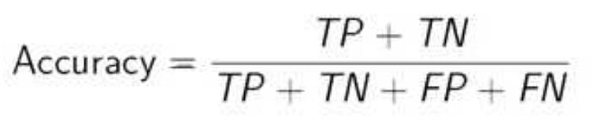
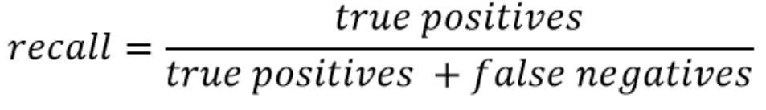
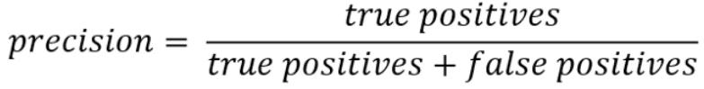
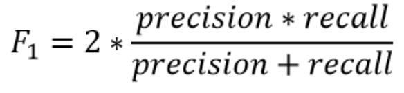
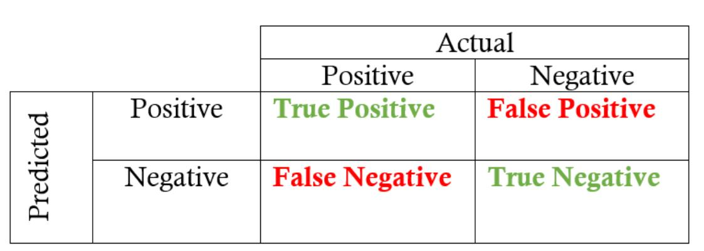
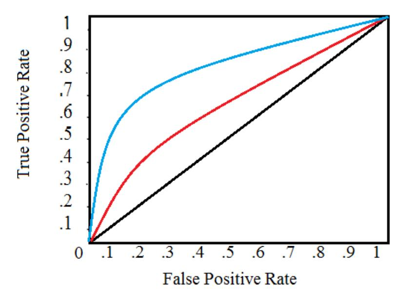
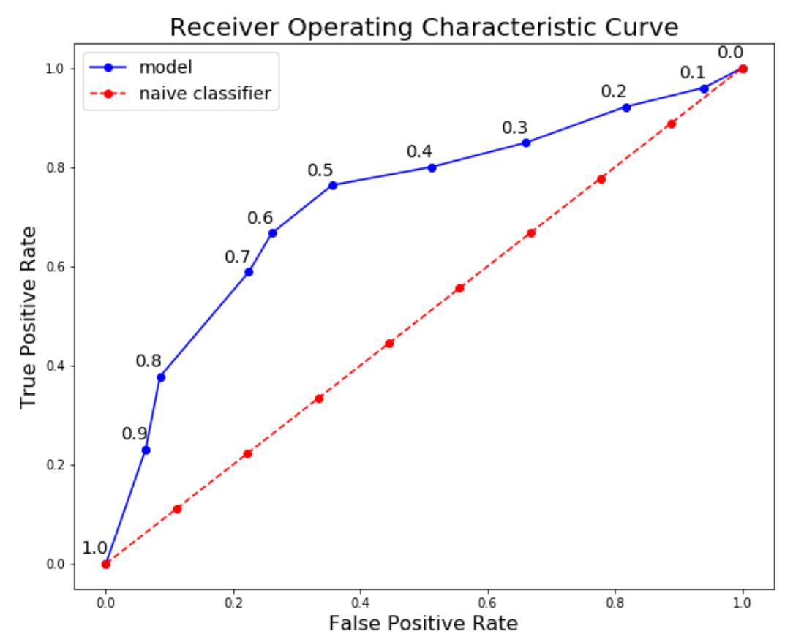
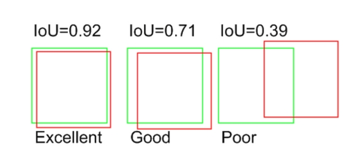
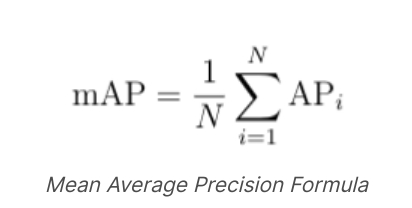

<!--ts-->
* [Metrics](#metrics)
   * [1. Accuracy](#1-accuracy)
   * [2. Recall](#2-recall)
   * [3. precision](#3-precision)
   * [4. F1 (F-score / F-measure)](#4-f1-f-score--f-measure)
   * [5. confusion Matrix](#5-confusion-matrix)
   * [6. ROC Curve](#6-roc-curve)
   * [Precision Recall Curve](#precision-recall-curve)
   * [Evaluating models for Detection - mAP](#evaluating-models-for-detection---map)
* [Link to resource:](#link-to-resource)

<!-- Created by https://github.com/ekalinin/github-markdown-toc -->
<!-- Added by: gil_diy, at: Thu 05 Jan 2023 12:49:24 IST -->

<!--te-->
# Metrics

[Link1](https://youtu.be/aWAnNHXIKww)
[Link2](https://youtu.be/A_ZKMsZ3f3o)
[Link3](https://youtu.be/A_ZKMsZ3f3o)

## 1. Accuracy

  

## 2. Recall

Recall (also known as sensitivity) is the fraction of relevant instances that were retrieved

Binary metric to evaluate models with binary output

  

**Recall expresses the abilty to find all relevant instances in a datset**

## 3. precision

Binary metric to evaluate models with binary output, which means:
**of all examples I predicted to be TRUE, how many were actually TRUE**

  

**Precision expresses the proportion of the data points our model says was relevant actually were relevant**

## 4. F1 (F-score / F-measure)

  

## 5. confusion Matrix

Shows the actual and predicted labels from a classification problem

  

## 6. ROC Curve

* Instead of being overwhelmed with confusion matrices **Receiver Operator Charatsitic (ROC)** graphs provide a simple way to summarize all of the information.

* **y-axis** shows the **True Positive Rate**, which is **Sensitivity (Recall)**.

* **x-axis** shows the **False Positive Rate**, which is **(1-Specificity)**.

plots the true positive rate (TPR) versus the false positive rate (FPR) as a function of the model’s threshold for classifying a positive

metric to calculate the overall performance of a classification model based on area under the ROC curve

  

for example: 

  

In a **huge imbalanced dataset**, if we have a very high number of true negatives, then our x axis in ROC curve (FPR) which has TN is denomitor, will be a very small number, which will push our ROC plot to the left side,
and shoot up our ROC AUC value to be close to 1, which is misleading.
Therefore we should not use **ROC curve** in massive imbalance in the data.

## Precision Recall Curve

Recall vs precision relationship changes as we vary the threshold for identifying a positive in our model. 

* PR Curves have precision and recall values, which do not make use of the True Negatives at all.

* Hence they become suitable for such analyses where the number of ww is very much huge, or when the existence of True Negatives doesn't play a major role in the business problem.

* Precision-Recall is a useful measure of success of prediction **when the classes are very imbalanced**

## Evaluating models for Detection - mAP

IoU

  

Mean Average Precision(mAP) is a metric used to evaluate object detection models such as Fast R-CNN, YOLO, Mask R-CNN, etc. The mean of average precision(AP) values are calculated over recall values from 0 to 1.

**mAP** formula is based on the following sub metrics:

  * Confusion Matrix
  * Intersection over Union(IoU)
  * Recall
  * Precision

Here is a summary of the steps to calculate the AP:

* Generate the prediction scores using the model.
* Convert the prediction scores to class labels.
* Calculate the confusion matrix—TP, FP, TN, FN.
* Calculate the precision and recall metrics.
* Calculate the area under the precision-recall curve.
* Measure the average precision.

The mAP is calculated by finding Average Precision(AP) for each class and then average over a number of classes.

  

# Link to resource:

[Write about this](https://ds100.org/sp20/resources/assets/lectures/lec24/LogisticRegressionPart2.html)

[Sensitivity_and_specificity](https://en.wikipedia.org/wiki/Sensitivity_and_specificity)

