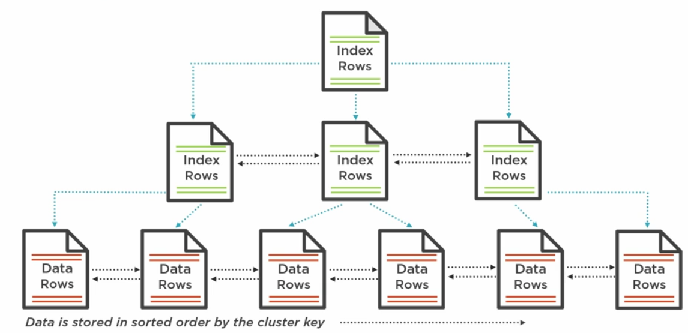

<!--ts-->
   * [mysql common operations](#mysql-common-operations)
      * [mysql admin operations:](#mysql-admin-operations)
         * [Grant access to another person from your local network:](#grant-access-to-another-person-from-your-local-network)
         * [Dump csv file into mysql table](#dump-csv-file-into-mysql-table)
   * [MySQL Server Performance](#mysql-server-performance)
      * [Clustered Index structure](#clustered-index-structure)

<!-- Added by: gil_diy, at: 2018-10-17T09:55+03:00 -->

<!--te-->

# mysql common operations

## mysql admin operations:
### Grant access to another person from your local network:

**Step #1:**
```sql
CREATE USER '<usrname>'@'<ip_address>' IDENTIFIED WITH mysql_native_password BY '<password>';
```
**Step #2:**

```sql
GRANT ALL PRIVILEGES ON <database_name>.<table_name> TO '<username>'@'<ip-address>';
```


**Tip:** For granting access to **all databases and tables** use `*.*`:

```sql
GRANT ALL PRIVILEGES ON *.* TO '<username>'@'<ip-address>';
```


### Dump sql which populates data into database:

```sql
mysql -u username -p password database_name < /path/to/your/file.sql
```

Another way will be:

1. login to your mysql server:

```sql
use db_name;
source /path/to/file.sql;
```

### Dump csv file into mysql table

```sql
LOAD DATA INFILE '<full-path-to-file>'
INTO TABLE <table-name>
FIELDS TERMINATED BY ';'
LINES TERMINATED BY '\n'
(<colunm-name1>, <colunm-name2>)
SET id = NULL;
```

**Attention**: In case you're getting an issue such as `Operation not permitted` (with `secure_file_priv`),
change the value of the variable `secure_file_priv`:

Check the variable's value:
```sql
SELECT @@global.secure_file_priv;
```
make sure the variable value is **empty** by inserting last line:

`secure_file_priv=""`

in the file: `/etc/mysql/mysql.conf.d/mysqld.cnf`

and finally simply restart the service:
`sudo service mysql restart`

# MySQL Server Performance
## Clustered Index structure
The data is stored as a tree like structure. as seen below:




at the bottom of the tree are the leafs of the tree which are the actual data rows, each of the leaf node is also known as a page (8KB) in sql server.
The data is stored in sorted order by cluster key. by default the primary key of a table will be the cluster key in sql server.


So let's say now we would like to find the row for student 327:

As you probably noticed, the tree is sorted by the student id column.


we will be able to traverse this tree in only **3 operations**.

This approach is very efficient as long the data is stored in the table

But we stumble upon a problem if we would like to search for a student by a particular private name, the data is not sorted by private name and there is no correlation between student id to private name. therefore mysql will create a **scan** of this structure, meaning it would read every one of this data pages sequentially at the bottom of the cluster index strcuture (will conduct linear search) looking for the data matches to the criteria.

So we can easily see the **Scan operations** are very costly since sql reads every data page  in the table, generally expensive in terms of IO and CPU.

Therefore the solution would be to sort our tree by first name and last name columns, so the index key will be the combination of the two. The index values point to where the corresponding data is in the table.

So if we search student by name there would be two traverses:
1. sql server will first traverse the tree structure of the index to find the student id number.
2. now sql server will traverse the tree structure of the table to locate the data for the student

We also can and often do multiple indexes on a table in order to cover the difference ways or application might search for data in that table.


Great reference is written here:
[link]https://dev.mysql.com/doc/refman/8.0/en/mysql-indexes.html

So in conclusion:

**Use an index when a statement needs to access data by a criteria other than the primary key. This way we take the advantage of the tree structure of the index for quickly find the pointer to the data we need this way is much more efficient than scan all rows in the table**


## Deep dive into the execution plan of queries
By delving into the execution plan of a query we can notice which sub-operations are cost the most. after figuring out we might consider replace those **Cluster Index Scan** which are very expensive operation specially for big tables with huge amount of rows.


in **Datagrip** it can easily be done by clicking `Explain Plain`,
moreover you can get valuable info from the `performance_schema`.

## Multiple-Column Indexes

https://dev.mysql.com/doc/refman/8.0/en/multiple-column-indexes.html
