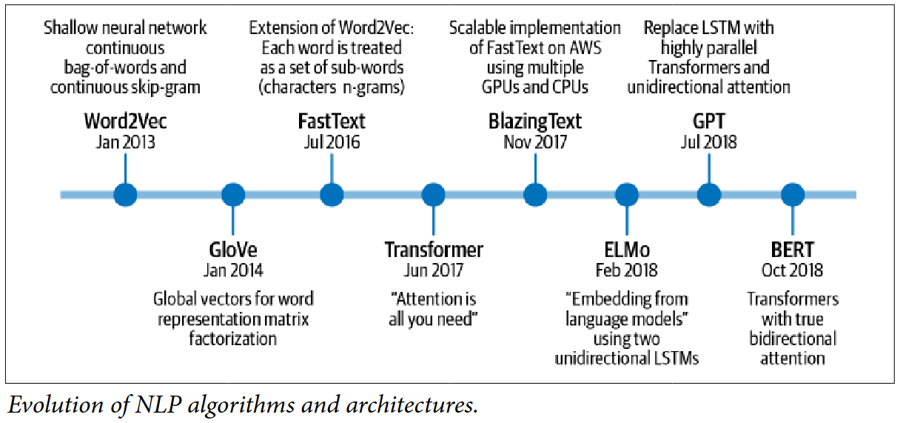
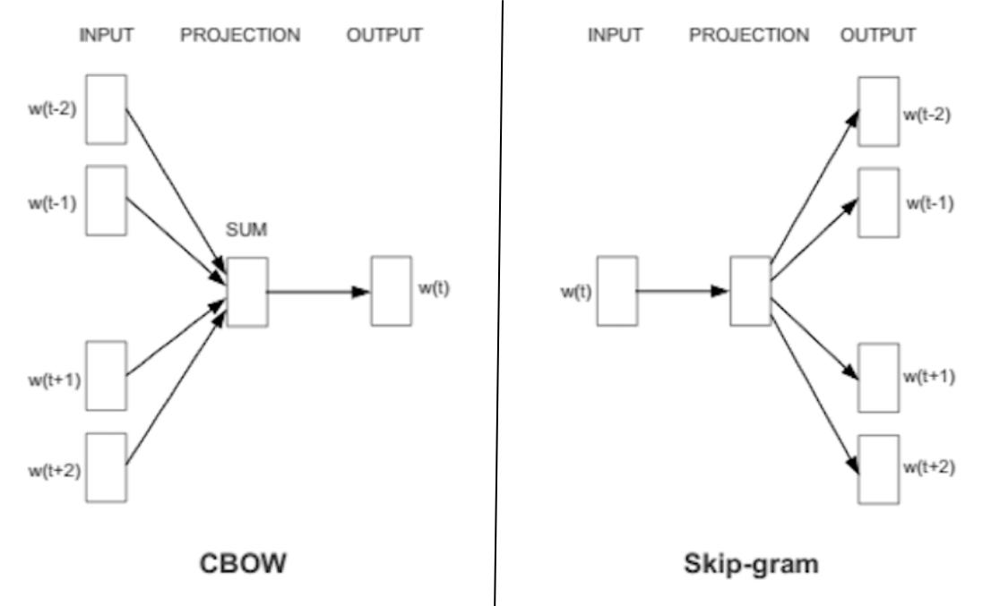
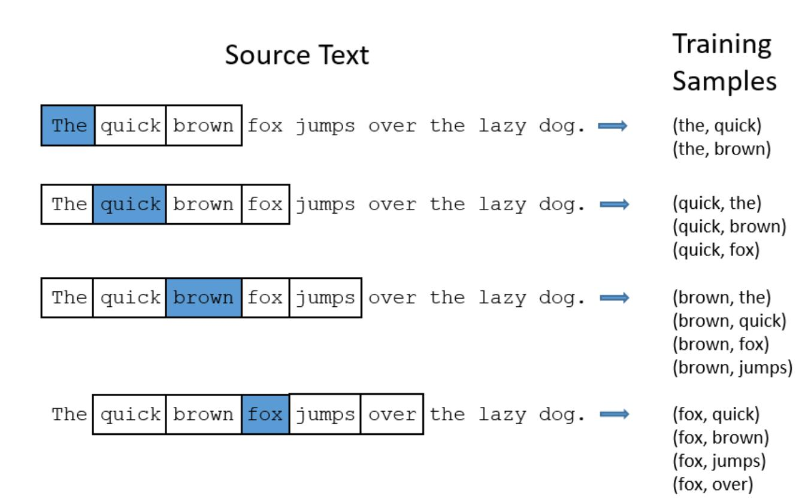
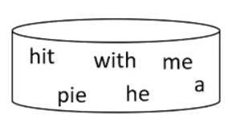
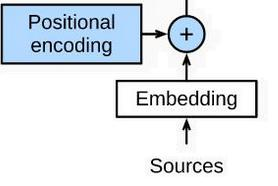
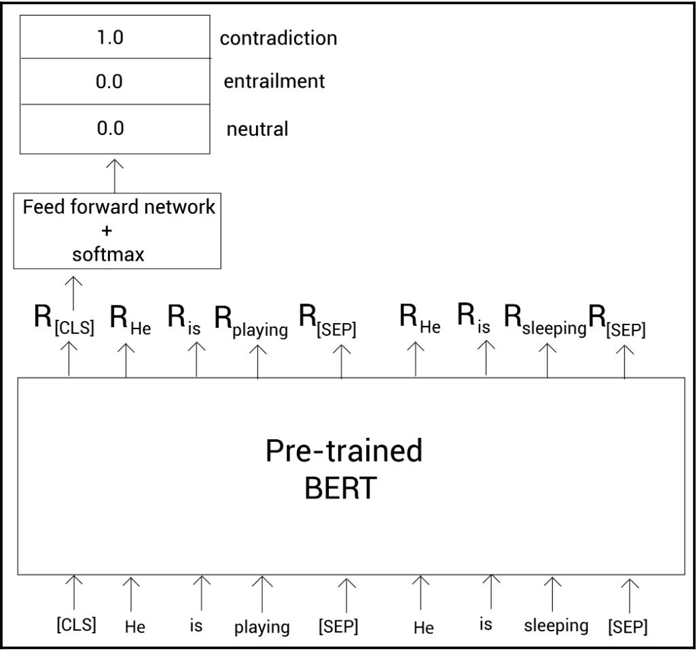
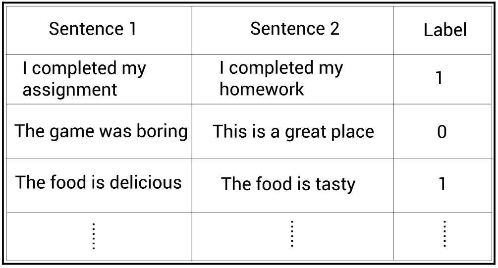
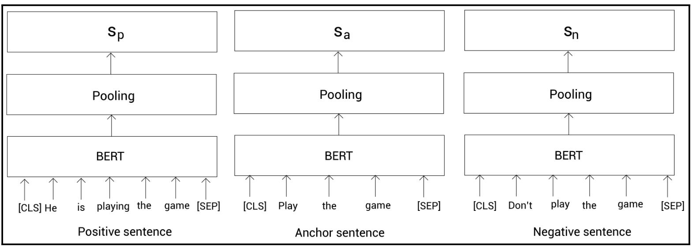
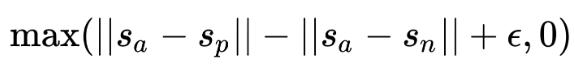
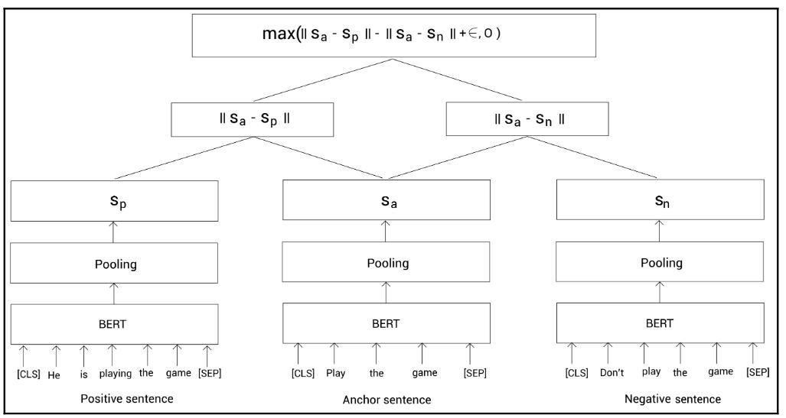

<!--ts-->
   * [NLP](#nlp)
      * [Well known libraries in NLP](#well-known-libraries-in-nlp)
      * [NLP Tasks](#nlp-tasks)
      * [Topic Discovery](#topic-discovery)
         * [LDA - Latent Dirichlet Allocation](#lda---latent-dirichlet-allocation)
      * [Preprocessing](#preprocessing)
         * [Basics](#basics)
         * [Stemming](#stemming)
         * [Lemmatiziation](#lemmatiziation)
         * [One hot encoding](#one-hot-encoding)
            * [Drawbacks of One hot encoding](#drawbacks-of-one-hot-encoding)
         * [Continuous Vectors](#continuous-vectors)
      * [Bag Of Words](#bag-of-words)
            * [Drawbacks](#drawbacks)
         * [TFIDF](#tfidf)
            * [Drawbacks](#drawbacks-1)
      * [The use of pretrained Word Embedding](#the-use-of-pretrained-word-embedding)
         * [1. Word2Vec Embedding](#1-word2vec-embedding)
            * [Applications of word2vec](#applications-of-word2vec)
            * [How the actual embedding works?](#how-the-actual-embedding-works)
            * [word2vec in python](#word2vec-in-python)
            * [Drawbacks](#drawbacks-2)
         * [2. GloVe Embedding (Global Vector for Word Representation)](#2-glove-embedding-global-vector-for-word-representation)
         * [3. FastText Embedding (Brought by Facebook)](#3-fasttext-embedding-brought-by-facebook)
            * [Limitation of word Embeddings until here](#limitation-of-word-embeddings-until-here)
         * [4. ELMo - Embedding from Language Model (Brought by ALLenNLP)](#4-elmo---embedding-from-language-model-brought-by-allennlp)
      * [Transformer](#transformer)
         * [Positional encoding (position embeddings)](#positional-encoding-position-embeddings)
         * [Position-wise Feed-Forward Network](#position-wise-feed-forward-network)
      * [BERT (Bidirectional Encoder Representation from Transformer)](#bert-bidirectional-encoder-representation-from-transformer)
         * [Finetuning BERT to downstream tasks](#finetuning-bert-to-downstream-tasks)
            * [Text classification](#text-classification)
            * [Natural language inference](#natural-language-inference)
         * [NER (Named Entity Recognition)](#ner-named-entity-recognition)
         * [Question-answering](#question-answering)
      * [BERT Varients](#bert-varients)
         * [ALBERT (A Lite version of BERT)](#albert-a-lite-version-of-bert)
         * [RoBERT](#robert)
         * [ELECTRA](#electra)
         * [SpanBERT](#spanbert)
         * [Sentence-BERT](#sentence-bert)
            * [Sentence-BERT for sentence pair classification task](#sentence-bert-for-sentence-pair-classification-task)
            * [Sentence-BERT for sentence pair regression task](#sentence-bert-for-sentence-pair-regression-task)
            * [Sentence-BERT with a triplet network](#sentence-bert-with-a-triplet-network)
         * [Bert with pytorch](#bert-with-pytorch)
         * [Drawbacks](#drawbacks-3)
      * [Cleaning methods](#cleaning-methods)
      * [Word Cloud](#word-cloud)
      * [Data Augmentation for NLP](#data-augmentation-for-nlp)
      * [10 Leading Language Models For NLP In 2021](#10-leading-language-models-for-nlp-in-2021)
      * [Repositories](#repositories)

<!-- Added by: gil_diy, at: Sun 27 Mar 2022 12:43:40 IDT -->

<!--te-->

# NLP 

## Well known libraries in NLP

* NLTK
* Spacy
* [Gensim](https://github.com/RaRe-Technologies/gensim)


[look into it](https://youtu.be/m20_dfn6tsU)

## NLP Tasks

* Text classification

* Next sentence prediction

* Named-Entity-Recognition (NER)

* Question-Answering


## Topic Discovery

Is to discover topics in a collection of documents, and then automatically **classify** any individual document within the collection in terms of how "relevant" it is to each of the discovered topics.


**For example:**

* In a document collection related to pet animals, the terms dog, spaniel, beagle, golden retriever, puppy, bark, and woof would suggest a DOG_related theme.

* Terms cat, siamese, main coon, tabby, manx, meow, purr, and kitten would suggest a CAT_related theme.

### LDA - Latent Dirichlet Allocation

[Link1](https://youtu.be/T05t-SqKArY)


[Training Latent Dirichlet Allocation: Gibbs Sampling](https://youtu.be/BaM1uiCpj_E)


## Preprocessing

### Basics

1. Lowercase

2. Remove emails

3. Remove html tags

4. Remove emojis

5. Remove stopwords


### Stemming

The problem using stemming it produces **intermediate representation of the word may not have any meaning**. 

**Example:** 

`intelligent` gets converted into `intelligen`

`final` gets converted into `fina`

### Lemmatiziation


### One hot encoding

#### Drawbacks of One hot encoding
But there are a few problems with the One-Hot Encodings:

**1.** The length of the One-Hot Encoding can go up to 1 million (given a dictionary of 1 million words). This is a very sparse vector/encoding and is highly inefficient at storing data.

**2.** Such an encoding doesn’t preserve the semantic meaning of the word. 
Semantics is the study of the relationship between words and how we draw meaning from those words
Pick any distance metric, the distance between the One-Hot Encoding of any two words is always the same. Don’t you think it would be better to have encodings which could give us some idea about the semantic meaning of the words?

You can use either: 
```python
from sklearn.feature_extraction.text import CountVectorizer
```

### Continuous Vectors

These are the vector representation of words which consist of **real continuous numbers** (not just 0 or 1). In this representation, there is no fixed rule for the length of such vectors. You can pick any length (any number of features) to represent words present in a given dictionary.

I am going to explain this to you by taking an example of words like ‘Batman’, ‘Joker’, ‘Spiderman’ and ‘Thanos’. Interesting selection of example words huh? I have made up 3-dimensional (3 features) continuous vectors of these words to explain to you, what the real numbers in the word vectors might represent.

```
word_vec(‘Batman’) = [0.9, 0.8, 0.2]
word_vec(‘Joker’) = [0.8, 0.3, 0.1]
word_vec(‘Spiderman’) = [0.2, .9, 0.8]
word_vec(‘Thanos’) = [0.3, 0.1, 0.9]
```

1. It seems that the 1st feature represents the **belongingness to the DC Universe**. See that ‘Batman’ and ‘Joker’ have higher values for their 1st feature because they do belong to DC Universe.

2. Maybe the 2nd element in the word2vec representation here captures the **hero/villian features**. That’s why ‘Batman’ and ‘Spiderman’ have higher values and, ‘Joker’ and ‘Thanos’ have smaller values.

3. One might say that the 3rd component of the word vectors represent the **supernatural powers/abilities**. We all know that ‘Batman’ and ‘Joker’ have no such superpowers and that’s why their vectors have small numbers at the 3rd position.


We see how different dimensions in a c**ontinuous word vector might capture different semantic meaning/features of that word**, something that One-Hot Encoding fails to capture!

## Bag Of Words

```python
from gensim import corpora
...
dictionary = corpora.Dictionary(processed_corpus)
dictionary.doc2bow(text)
```


#### Drawbacks

* **Semantic information is not stored**, which means the context/order of a word appears in a sentence is not taken into account.

* There is definitely a chance of over fitting

### TFIDF

Is a numerical statistic that is intended to reflect how important a word is to a document in a collection or corpus:

1) The tf–idf is the product of two statistics, term frequency and inverse document frequency.
   There are various ways for determining the exact values of both statistics.

2) A formula that aims to define the importance of a keyword or phrase within a document or a web page.

#### Drawbacks

* **Semantic information is not stored**, which means the context/order of a word appears in a sentence is not taken into account.

* There is definitely a chance of over fitting


## The use of pretrained Word Embedding 

Word embedding which is n-dimensional vector space representation of words such that semantically similar words:

* for instance, **“boat” — “ship”**

* Semantically related words (for instance, **“boat” — “water”**) 

are closer in the vector space depending on the training data.


<p align="center">
  
</p>


### 1. Word2Vec Embedding


* Word2vec is a group of related models that are used to produce word embeddings

* Another point to think about is information vs domain knowledge.
For example, let’s consider word embeddings (word2vec) and bag of words representations.
While both of them can have the entire information about which words are in a sentence, word embeddings also include **domain knowledge like relationship between words and such**.

* Word2vec takes as its input a large corpus of text and produces a vector space, typically of several hundred dimensions, with each unique word in the corpus being assigned a corresponding vector in the space.

* The purpose and usefulness of Word2vec is to group the vectors of similar words together in vectorspace. That is, **it detects similarities mathematically**. Word2vec creates vectors that are distributed numerical representations of word features, features such as the context of individual words. It does so **without human intervention**.

* When you train such a model over billions of tokens over a large dataset containing web articles and so forth, what you get is a very potent representation of each word in the vocabulary in the form of a vector. These vectors can be 300 dimensions long, i.e. each word is represented by 300 real numbers.

* Pre-trained word embedding is an example of **Transfer Learning**. The main idea behind it is to **use public embeddings that are already trained on large datasets**. Specifically, instead of initializing our neural network weights randomly, we will set these pre trained embeddings as initialization weights. This trick helps to accelerate training and boost the performance of NLP models.

* Word2vec is an algorithm used to produce distributed representations of words, and by that we mean word types; i.e. any given word in a vocabulary, such as get or grab or go has its own word vector, and those vectors are **effectively stored in a lookup table or dictionary** .


#### Applications of word2vec

Word2vec’s applications extend beyond parsing sentences in the wild. 
It can be applied just as well to:

1) **genes**

2) **code** (code2vec)

3) **likes**

4) **playlists**

5) **social media graphs** [Facebook datset](http://snap.stanford.edu/data/egonets-Facebook.html)

6) **Other verbal or symbolic series**

in which patterns may be noticed.

A neat example, is word2vec can gauge relations between words of one language,
and map them to another.


<p align="center">
  
</p>

#### How the actual embedding works?

* At the beginning the word vectors/embeddings don’t come with the right numbers making up the vector. The embeddings capture semantic meaning only when they are trained on a huge text corpus, using some word2vec model. **Before training, the word embeddings are randomly initialized and they don’t make any sense at all**. It’s only when the model is trained, that the word embeddings have captured the semantic meaning of all the words.


* The word embeddings can be thought of as a child’s understanding of the words. **Initially, the word embeddings are randomly initialized and they don’t make any sense**, just like the baby has no understanding of different words. It’s only after the model has started getting trained, the word vectors/embeddings start to capture the meaning of the words, just like the baby hears and learns different words.

* **Word2vec is a two-layer neural net** that processes text by “vectorizing” words. Its input is a text corpus and its output is a set of vectors: feature vectors that represent words in that corpus. While Word2vec is not a deep neural network, it turns text into a numerical form that deep neural networks can understand.

* The output of the Word2vec neural net is a vocabulary in which each item has a vector attached to it, which can be fed into a deep-learning net or simply queried to detect relationships between words.


* word2vec trains words against other words that neighbor them in the input corpus.

* Word2vec can utilize either of two model architectures to produce a distributed representation of words: 


   **1.** Context to predict a target word, called **continuous bag-of-words (CBOW)**

   **2.** Using a word to predict a target context, called **continuous skip-gram**

We use the latter method because it produces more accurate results on large datasets.

<p style="width:500px; text-align:center " >
  
</p>


* This is done by making **context and target word pairs** which further depends on the window size you take.

* We use a window_size parameter (window_size is 2 in this case) which looks to the **left and right** of the context word for as many as **window_size(=2)** words.

<p align="center">
  
</p>

* And we keep on making context-target word pairs for all the possible context and target words. What we are essentially doing here is that we are capturing word pairs which can be found next to each other. We are **capturing the context** and we are going to use this **context information to train the word embeddings**. This is why I called this a semi-supervised learning algorithm earlier!

* Word2Vec uses a trick you may have seen elsewhere in machine learning. 
We’re going to train a simple **neural network with a single hidden layer** to perform a certain task, but then we’re not actually going to use that neural network for the task we trained it on! Instead, the goal is actually **just to learn the weights of the hidden layer**–we’ll see that these weights are actually the “word vectors” that we’re trying to learn.

#### word2vec in python

```python
from gensim.test.utils import common_texts
from gensim.models import Word2Vec

model = Word2Vec(sentences=common_texts, min_count=1,size=50,workers=3, window=5, sg = 1) # sg = skip-gram
```

* The "window size" parameter to the algorithm. A typical window size might be 5, meaning 5 words behind and 5 words ahead (10 in total).

[Word2Vec in Gensim](https://radimrehurek.com/gensim/models/word2vec.html)

#### Drawbacks

* Is context-free model, which generate **static embeddings irrespective of the context**.


### 2. GloVe Embedding (Global Vector for Word Representation)

Belongs to Stanford (2016), training is **performed on aggregated global word-word co-occurrence statistics from a corpus**, and the resulting representations showcase interesting linear substructures of **the word vector space**. 


[Example for creating embedding matrix](https://gist.github.com/Athena75/40c18e9a1c435a08a54880436c9f5ff7#file-embedding_matrix-py)

[Github](https://github.com/stanfordnlp/GloVe)


[Link](https://nlp.stanford.edu/projects/glove/)

### 3. FastText Embedding (Brought by Facebook)

The main disadvantages of **Word2Vec** and **GloVe** embedding is that they are unable to **encode unknown or out-of-vocabulary words**.

Word2Vec which feeds whole words into the neural network, FastText first breaks the words into several sub-words (or n-grams) and then feed them into the neural network.

* Starts with word representations that are averaged into text representation and feed them to a linear classifier (multinomial logistic regression).

* Hierarchial Softmax: Based on Huffman Coding Tree Used to reduce computational complexity O(kh) to O(hlog(k)), where k is the number of classes and h is dimension of text representation.

* Uses a bag of n-grams to maintain efficiency without losing accuracy. No explicit use of word order.

* Uses hashing trick to maintain fast and memory efficient mapping of the n-grams.

#### Limitation of word Embeddings until here

They don’t take into consideration the order of words in which they appear which leads to loss of syntactic and semantic understanding of the sentence.


### 4. ELMo - Embedding from Language Model (Brought by ALLenNLP)

Character-level tokens are taken as the inputs to a **bi-directional LSTM which produces word-level embeddings**. 
Like BERT (but unlike the word embeddings produced by "Bag of Words" approaches, and earlier vector approaches such as Word2Vec and GloVe)


* ELMo embeddings are **context-sensitive**

* ELMo produces **different representations for words that share the same spelling** but have different meanings, ie:
  such as "bank" in **"river bank"** and **"bank balance"**

* As the ELMo **uses bidirectional LSTM** it can get understanding of both **next and previous word** in the sentence.


## Transformer

* Transformer replaces the **recurrent layers** in seq2seq with **attention layers**.

<p align="center">
  
</p>

### Positional encoding (position embeddings)

What we see as a sentence is : `"he hit me with a pie"`

What naive self-attention sees is just a bag of words:

<p align="center">
  
</p>


so for the self-attention model:

`a pie hit me with he`

`a hit with me pie`

`he pie me with a hit`

1) all permutations of those words look the same.
**most** alternative orderings are nonsense, but some change the meaning.

* This is very **different from recurent model** cause recurent models looks on the word one at a time, and remembers which words he saw before and therefore **remember their order**.

2) **in general** the position of words in sentence carries information!


3) **idea is** to add some information to the representation at the beginning that indicates **where it is in the sequence** !

This embedding are then added to the initial vector representation of the input.

<p align="center">
  
</p>

4) We want to represent **position** in a way that tokens with similar **relative** position have similar **positional encoding**

### Position-wise Feed-Forward Network

Position wise just means each position is multiplied by a matrix. 
Usually a layer of a neural network is (batch_size, hidden_size)
which is multiplied by (hidden_size, hidden_size) to get the next layer

## BERT (Bidirectional Encoder Representation from Transformer)

[Attention is all you need](https://arxiv.org/pdf/1706.03762.pdf)


`BERT` generates **dynamic embeddings** based on the context.

For example:

**Sentence A**: He got bit by Python

**Sentence B**: Python is my favorite programming language

By reading the preceding two sentences, we can understand that the meaning of the words `Python`
is different in both sentences. 

In sentence A, the word `Python` refers to a snake.

In sentence B, the word `Python` refers to a Programming language.

if we get embeddings for the word `Python` in the preceding two sentences using an
embedding model such as **word2vec**, the embedding of the word `Python` would be the
same in both sentences, and so this renders the meaning of the word `Python` the same in
both sentences. 
This is because word2vec is the **context-free** model, so it will ignore the
context and always give the same embedding for the word `Python` irrespective of the context.


**BERT**, on the other hand, is a **context-based model**. It will understand the context and then
generate the embedding for the word based on the context. So, for the preceding two
sentences, it will give different embeddings for the word 'Python' based on the context.


* It is **pre-trained on unlabeled data** extracted from **BooksCorpus**, which has 800M words, and from Wikipedia, which has 2,500M words.

* The encoder of the transformer is bidirectional in nature since it can read a sentence in both directions. This means that BERT learns information from a sequence of words not only from left to right, but also from right to left.

* BERT uses `Positional Encoding`

* The embedding dimension is 512 (**maximum size of tokens that can be fed into BERT model is 512**) - If the tokens in a sequence are less than 512, we can use padding to fill the unused token slots with [PAD] token. If the tokens in a sequence are longer than 512, then we need to do a truncation.

* BERT model then will output an **embedding vector of size 768 (256*3=768) in each of the tokens**.


### Finetuning BERT to downstream tasks 

#### Text classification

For example sentiment analysis task, our goal is to classify whether a sentence is positive or negative,

During fine-tuning, we feed the embedding of R[cls] (Representation of the sentence) to a classifier and train the classifier to perform classification.

During the fine-tuning we update only the weights of the classification layer and not the pre-trained BERT model. When we do this, it becomes the same as using the pre-trained BERT model as a feature extractor.

#### Natural language inference

The goal of our model is to determine whether a hypothesis is True of False given a premise
The goal of our model is to determine whether a sentence pair (premise-hypothesis pair) is either:
an enltailment, contradiction, Neutral.

```python

```

* We take the representation of the [CLS] token, which is R_[CLS], and feed it to a classifier (feedforward + softmax), which returns the probabilty of the sentence being a contradiction, enltailment, Neutral.

<p align="center">
  
</p>

### NER (Named Entity Recognition)

### Question-answering

## BERT Varients

### ALBERT (A Lite version of BERT)

### RoBERT

### ELECTRA

### SpanBERT

### Sentence-BERT

* Sentence-BERT  drastically reduces the inference time of BERT, Sentence-BERT is popularity used in tasks such as:

**sentence pair classification**,  **computing similarity between two sentences**

* Sentence-BERT is modification of the BERT model which uses **siamese** and **triplet network structures** and adds a pooling operation to the output of BERT to obtain fix-sized semantically meaningful sentence embeddings.

* Sentence BERT uses a Siamese network architecture for tasks that involve a sentence pair as input.

#### Sentence-BERT for sentence pair classification task

**(0)** - Dissimiliar

**(1)** - Similiar


<p align="center">
  
</p>


We know that the siamese network consists of two identical networks that share the **same weights** . So here we use two identical pre-trained BERT models. We feed the tokens from sentence 1 to one BERT and the tokens from sentence 2 to another BERT and compute the representation of the given two sentences.

#### Sentence-BERT for sentence pair regression task

#### Sentence-BERT with a triplet network

Suppose we have three sentences:

* **Anchor sentence**: Play the game

* **Positive sentence**: He is playing the game

* **Negative sentence**: Don't play the game

Our task is is to compute a representation such that the similairty between the `anchor` and `positive
sentences` should be high and similarity between the anchor and negative sentences should be low.
since we have three sentences, in this case Sentence-BERT sues the triplet network architecture.


* We tokenize and feed the anchor, positive, and negative sentences to the three pretrained BERT models, and then obtain the representation of each of the sentences through pooling, as shown in the following figure:

<p align="center">
  
</p>


We train the network to maximize the triplet loss function, 
<p align="center">
  
</p>

We use the Euclidean distance as the distance metric.


<p align="center">
  
</p>

* [Please Read in Depth](https://classic.d2l.ai/chapter_attention-mechanism/transformer.html)
* [Implementation](https://github.com/UKPLab/sentence-transformers)

* [Research paper](https://arxiv.org/pdf/1908.10084.pdf)


### Bert with pytorch


```python
tokenizer = BertTokenizer.from_pretrained('bert-base-cased')

example_text = 'I will watch Memento tonight'

bert_input = tokenizer(example_text,
                       padding='max_length',
                       max_length = 10, 
                       truncation=True,
                       return_tensors="pt")
```

[Link](https://towardsdatascience.com/text-classification-with-bert-in-pytorch-887965e5820f)


[Link](https://neptune.ai/blog/how-to-code-bert-using-pytorch-tutorial)

### Drawbacks

* BERT is state-of-the-art  at the Semantic Textual Similarity tasks but the problem with is it would take very long time for a huge corpus
( 65 hours!! for 10,000 sentences)


## Cleaning methods


```python
def text_cleaning(texts):
    texts_cleaning = []
    for txt in tqdm(texts):
        url = re.compile(r'https?://\S+|www\.\S+')
        html = re.compile(r'<.*?>')
        emoji_pattern = re.compile("["
                               u"\U0001F600-\U0001F64F"  # emoticons
                               u"\U0001F300-\U0001F5FF"  # symbols & pictographs
                               u"\U0001F680-\U0001F6FF"  # transport & map symbols
                               u"\U0001F1E0-\U0001F1FF"  # flags (iOS)
                               u"\U00002702-\U000027B0"
                               u"\U000024C2-\U0001F251"
                               "]+", flags=re.UNICODE)
        txt = emoji_pattern.sub(r'', txt)
        txt = html.sub(r'',txt)
        txt = url.sub(r'',txt)
        txt = re.sub('[^A-Za-z\s]', '', txt)
        
        texts_cleaning.append(txt.lower())
    return texts_cleaning
text = text_cleaning(train.text.tolist())
```

## Word Cloud

```python
disaster_tweets = train_data[train_data.target == 1]
disaster_string = []
for t in disaster_tweets.text:
    disaster_string.append(t)
disaster_string = pd.Series(disaster_string).str.cat(sep=' ')
wordcloud = WordCloud(width=1600, height=800,max_font_size=100, background_color='white').generate(disaster_string)
plt.figure(figsize=(12,10))
plt.imshow(wordcloud, interpolation="bilinear")
plt.axis("off")
plt.show()
```

## Data Augmentation for NLP

[Link](https://neptune.ai/blog/data-augmentation-nlp)


## 10 Leading Language Models For NLP In 2021

[Link](https://www.topbots.com/leading-nlp-language-models-2020/)


## Repositories

[Link](https://github.com/flairNLP/flair)

[word2vec stanford Christopher Manning ](https://web.stanford.edu/class/cs224n/slides/cs224n-2019-lecture02-wordvecs2.pdf)

[Link](https://aegis4048.github.io/optimize_computational_efficiency_of_skip-gram_with_negative_sampling)

[optimize_computational_efficiency_of_skip-gram_with_negative_sampling](https://aegis4048.github.io/optimize_computational_efficiency_of_skip-gram_with_negative_sampling)


[Annotation tool for text](https://github.com/doccano/doccano)