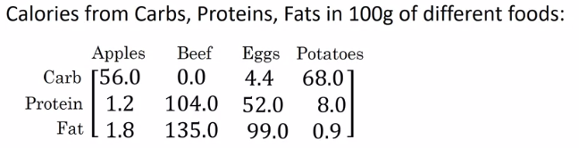
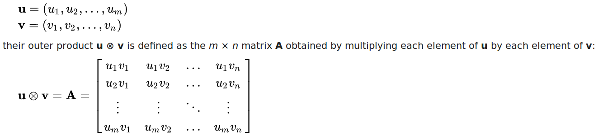
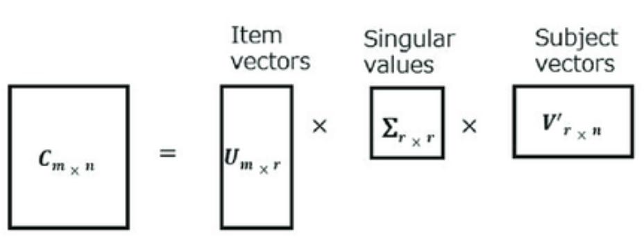

<!--ts-->
   * [Numpy Introduction](#numpy-introduction)
      * [Why use numpy?](#why-use-numpy)
         * [Data representation](#data-representation)
            * [Key attributes](#key-attributes)
         * [Creating](#creating)
            * [Creating a 3d array](#creating-a-3d-array)
            * [Import data from csv](#import-data-from-csv)
         * [Random generation](#random-generation)
            * [randn](#randn)
            * [rand](#rand)
         * [Forming](#forming)
            * [Stack 1-D arrays as columns into a 2-D array.](#stack-1-d-arrays-as-columns-into-a-2-d-array)
            * [vstack](#vstack)
            * [hstack](#hstack)
            * [Concatenating](#concatenating)
         * [Retrieving info about an array](#retrieving-info-about-an-array)
         * [Counts the number of non-zero values in an array given a constraint](#counts-the-number-of-non-zero-values-in-an-array-given-a-constraint)
         * [Transpose a matrix/array](#transpose-a-matrixarray)
         * [Aggregation functions](#aggregation-functions)
         * [Aggregation functions example on matrix:](#aggregation-functions-example-on-matrix)
         * [Concatenating columns](#concatenating-columns)
         * [Unique and Other Set Logic](#unique-and-other-set-logic)
            * [unique and exclude NAN](#unique-and-exclude-nan)
            * [sorted unique values in an array](#sorted-unique-values-in-an-array)
            * [Histogram count (Get frequency counts for unique values)](#histogram-count-get-frequency-counts-for-unique-values)
         * [Iterating easily over an array](#iterating-easily-over-an-array)
         * [Fancy indexing](#fancy-indexing)
            * [<strong>1. Select some rows</strong>](#1-select-some-rows)
            * [<strong>2. Select some rows and specific column</strong>](#2-select-some-rows-and-specific-column)
            * [<strong>3. Select some rows and columns</strong>](#3-select-some-rows-and-columns)
            * [<strong>4. Some simple slicing</strong>](#4-some-simple-slicing)
            * [<strong>5. argmin, argmax, argsort</strong>](#5-argmin-argmax-argsort)
      * [reshape](#reshape)
      * [Squizzing](#squizzing)
      * [Unsquizzing](#unsquizzing)
      * [splitting data](#splitting-data)
      * [Removing rows/columns](#removing-rowscolumns)
      * [Multiplication:](#multiplication)
         * [Vectorized dot product of vectors](#vectorized-dot-product-of-vectors)
         * [Vectorized outer product](#vectorized-outer-product)
         * [Vectorized elementwise multiplication](#vectorized-elementwise-multiplication)
         * [Vectorized general dot product](#vectorized-general-dot-product)
         * [Hadamard multiplication](#hadamard-multiplication)
         * [Standard matrix multiplication](#standard-matrix-multiplication)
      * [Calculate the covarience matrix](#calculate-the-covarience-matrix)
      * [Computing Eigenvectors and Eigenvalues](#computing-eigenvectors-and-eigenvalues)
      * [meshgrid](#meshgrid)
      * [Vectorized elementwise](#vectorized-elementwise)
      * [Linear algebra](#linear-algebra)
         * [Invert matrix](#invert-matrix)
            * [Invert a matrix](#invert-a-matrix)
            * [Is matrix invertible?](#is-matrix-invertible)
         * [Calculate Determinant matrix](#calculate-determinant-matrix)
         * [Decompositions](#decompositions)
            * [SVD Singular Value Decomposition](#svd-singular-value-decomposition)
            * [Cholesky Decomposition](#cholesky-decomposition)
            * [qr factorization of a matrix](#qr-factorization-of-a-matrix)
         * [Distance of vectors](#distance-of-vectors)
         * [Matrix rank](#matrix-rank)
      * [NPZ files](#npz-files)
         * [Saving our datasets to NPZ files](#saving-our-datasets-to-npz-files)
      * [Exporting txt files easily with specific format](#exporting-txt-files-easily-with-specific-format)
      * [Reference](#reference)

<!-- Added by: gil_diy, at: Thu 09 Dec 2021 15:21:06 IST -->

<!--te-->


# Numpy Introduction

Numpy uses **ndarray** which is much more efficient way of storing and manipulating "numerical data" than the built-in Python data structure.


## Why use numpy?

Numpy arrays are much faster,
let's see an example:

```python
my_list = range(10000)
my_array = np.arange(10000)

timeit [i**2 for o in my_list]
timeit my_array**2
```
**If you'll run it, you can easily see the numpy array is much much faster than the list!!**


### Data representation

Data is stored in multidimensional Numy arrays, also called **tensors** .
tensor is a container for data and a generalization of matrices to an arbitrary number of dimensions.


**(note that in the context of tensors, a dimension is often called an axis)**

Description | result | x.ndim
-----------|------------|-----
Scalars (0D tensors) | x = np.array(12) | 0
Vectors (1D tensors) | x = np.array([12,3,6,14]) |  1
Matrices (2D tensors) | x = np.array([[12,3,6,14],[5,16,18,79]]) | 2
Cubes (3D tensors) | x = np.array([ [[12,3,6,14],[5,16,18,79]] ,  [[1,3,0,1],[0,16,3,79]] , [[3,3,3,7],[0,0,18,9]] ]) | 3


Type | Real world example
-----|-------------------
Vector (2D tensors)| (samples, features)
Timeseries (3D tensors)| (samples, timestamps, features)
Images (4D tensors) | (samples, height, width, channels)
Video (5D tensors)| (samples, frames, height, width, channels)


#### Key attributes

1. **Number of axes (rank)** - Number of dimensions
2. **Shape** - A tuple of integers that describes how many dimensions the tensor **has along each axis**
3. **Data type (usually called **dtype**)** - This is the type of the data contianed in the tensor,
float32, uint8, float64 etc..

### Creating

Description | command
------------------------------------|-----
Create Ndarray | np.array([1,3,5])
a | np.array([[1,3,5],[11,31,215]])
== | ==
Create Special Ndarray | np.zeros((1,10))  #one dimentional ndarray with 10 elements of value 0
=> | np.ones((2,3))  #two dimentional ndarray with 6 elements of value 1, **please notice** i'm passing tuple.
== | ==
Create range of numbers in an Ndarray | np.arange(10)
Create a **column** vector with **random** numbers | a = np.random.randn(5, 1)
Create a **row** vector with **random** numbers | a = np.random.randn(1, 5)
Create a matrix with **random** numbers | a = np.random.randn(5, 3) # 5 Rows, 3 columns
Create a matrix with ones on a diagonal (optionally offset) | np.eye(N=3)
Create a matrix with specific values on a diagonal |np.diag([1, 82, 3, 5])
Takes only the upper triangle above the matrix diagonal | np.triu()
Reshape array to matrix 2x5 | np.arange(10).reshape(2, 5)
==>							| np.arange(10).reshape(2, -1)      (**Read tip #2**)
== | ==
Remove single-dimensional entries from the shape of an array | x = np.array([[[0], [1], [2]]])      # x.shape: (1, 3, 1)
==> | np.squeeze(x).shape
==> | output: (3,)
== | ==
Concatenation, or joining of two arrays |  x = np.array([1, 2, 3])
==> | y = np.array([3, 2, 1])
==> | np.concatenate([x, y])
Extract the lower triangle (below diagonal) | np.tril(A)
Extract the upper triangle (above diagonal)| np.triu(A)


**Tip #1** : A greate way to make sure is by using assert:

```python
assert(a.shape == (5,1))
```

**Tip #2**: When you are dealing with many dimensions and you would like to reshape it to you can enter the dimension size either rows or columns and the other will be -1, numpy will figure out what the value should be for rehsaping properly (well explained [here](https://stackoverflow.com/questions/18691084/what-does-1-mean-in-numpy-reshape))

```python
# data.shape = (963,64,64,3)
# for rehsaping it to 963 columns of length (64*64*3)
data.reshape((-1,data.shape[0])

```
#### Creating a 3d array

The most efficient way is to initialize the 3d array first and then sequentially write your data into it. 

```python
import numpy as np

my_array = np.arange(9.0)
single_matrix =  np.array_split(my_array, 3)

arr = np.empty(shape=(2, 3, 3))  # Initilaze a 3d array (with two layers)

arr[0,:,:] = single_matrix # Adding to first layer
arr[1,:,:] = single_matrix # Adding to second layer
```


#### Import data from csv
```python
from numpy import genfromtxt

data = genfromtxt(filename, delimiter=',')
```

### Random generation

[Great answer](https://stackoverflow.com/questions/47240308/differences-between-numpy-random-rand-vs-numpy-random-randn-in-python)

#### randn
`numpy.random.randn` generates samples from the normal distribution

#### rand

`numpy.random.rand` generates samples from unifrom (in range [0,1))


### Forming

```python
a = np.array((1, 2, 3))
b = np.array((2, 3, 4))
c = np.array((5, 6, 7))
np.stack((a, b, c))
```

The output would be:
```python
array([[1, 2, 3],
       [2, 3, 4],
       [5, 6, 7]])
```
* by default the command stack uses: axis = 0

```python
np.stack((a, b,c), axis = 1)
```
with axis = 1 (stacking as columns), will get:

```python
array([[1, 2, 5],
       [2, 3, 6],
       [3, 4, 7]])
```

#### Stack 1-D arrays as columns into a 2-D array.
```python
np.column_stack(([1,2,3],[4,5,6]))
```

The output would be:
```python
array([[1, 2],
       [2, 3],
       [3, 4]])
```

#### vstack

```python
np.column_stack(([1,2,3],[4,5,6]))
```

The output would be:
```python
array([[1, 2, 3],
       [4, 5, 6]])
```
#### hstack

```python
np.hstack(([1,2,3],[4,5,6]))
```

The output would be:

```python
array([1, 2, 3, 4, 5, 6])
```
#### Concatenating

```python
a = np.array([[1, 2], [3, 4]])
b = np.array([[5, 6]])

np.concatenate((a, b), axis=0)

# array([[1, 2],
#        [3, 4],
#        [5, 6]])

np.concatenate((a, b.T), axis=1)

# array([[1, 2, 5],
#        [3, 4, 6]])

np.concatenate((a, b), axis=None)

# array([1, 2, 3, 4, 5, 6])
```

### Retrieving info about an array

```python
my_mat = np.array([[1,3,5],[6,16,2]])
m2 = np.arange(8)
```
```python
my_array = np.array([[-5, -6, 3], [1, 3, -9], [2, -9, -23]])

my_array > 0
```
The output would be:

```python
array([[False, False,  True],
       [ True,  True, False],
       [ True, False, False]])
```

To find the coordinates (row number, column number) just use `np.where(mat > 0)`:

```python
(array([0, 1, 1, 2]), array([2, 0, 1, 0]))
```


### Counts the number of non-zero values in an array given a constraint

```python
np.count_nonzero(my_mat!=False)
```


### Transpose a matrix/array

```python
array1 = np.array([[1.],[2.]])
array1_transpose = array1.T
```

another example more advance:

```python
my_array = np.array([[[1, 2, 3, 4, 5], [6, 7, 8, 9, 10]],
                     [[11, 12, 13, 14, 15], [16, 17, 18, 19, 20]],
                     [[21, 22, 23, 24, 25], [26, 27, 28, 29, 30]]])

print(my_array.shape) # output would be: (3, 2, 5)

my_array = np.transpose(my_array, axes=(1,2,0))

print(my_array.shape) # output would be: (2, 5, 3)
```


Description | command
------------|---------
Get array's dimensions | my_mat.ndim
Get Shape | my_mat.shape # The returned tuple will hold ndim numbers
| i.e: for my_mat it returns: (2, 3)
|
Get number of elements in an array | my_mat.size
Get data type in this array | my_mat.dtype

* Note: If image is grayscale, tuple returned contains only number of rows and columns. So it is a good method to check if loaded image is grayscale or color image.

Description | command
------------|---------
Get array's dimensions | my_mat.ndim

### Aggregation functions

let's assume we have an array:
```python
vec = np.arange(10) # So vec holds: [0 1 2 3 4 5 6 7 8 9]
```

Description | command   | result
-----------|------------|-----
Compute sum of elements | np.sum(vec) | 45
Compute Accumulated sum od elements | np.np.cumsum(vec) | [ 0  1  3  6 10 15 21 28 36 45]
Compute product of elements | np.prod(vec) | 362,880
Compute mean of elements | np.mean(vec) | 4.5
Compute standard deviation | np.std(vec)
Compute variance | np.var(vec)
Compute minimum value | np.min(vec) | 0
Compute maximum value | np.max(vec) | 9
Find index of minimum value | np.argmin(vec) | 0
Find index of maximum value | np.argmax(vec) | 9
Compute median value | np.median(vec) | 5
Evaluate whether any elements are true | np.any(vec > 5) True
Evaluate whether all elements are true | np.all(vec > -1) | True

### Aggregation functions example on matrix:

For example:

<p align="center" style="width:400px;" >
  
</p>

```python
# Each column presents a fruit
data = np.array([56.0, 0.0, 4.4, 68.0],
				[1.2, 104.0, 52.0, 8.0],
				[1.8, 135.0, 99.0, 0.9])

print(data)

# Let's sum up the colories for each fruit:
cal = data.sum(axis=0) 

# Axis = 0 means sum each column
# Axis = 1 means sum each row

print(cal)

precentage = (data/cal) * 100 # Using broadcasting
print(precentage)
```


### Concatenating columns

```python
np.column_stack([X_train, y_train])
```

### Unique and Other Set Logic


#### unique and exclude NAN

Return number of unique elements in the object.
Excludes NA values by default

```python
s = pd.Series([1, 3, 5, 7, 7])
print(s.nunique())
```

#### sorted unique values in an array

```python
names = np.array(['Bob', 'Joe', 'Will', 'Bob', 'Will', 'Joe', 'Joe'])
np.unique(names)
```
The output would be:

```python
array(['Bob', 'Joe', 'Will'], dtype='<U4')
```

Here are few more operations on sets:

Description | command
-----------|------------
unique(x) | Compute the sorted, unique elements in x
intersect1d(x,y) | Compute the sorted, common elements in x and y
union1d(x,y) | Compute the sorted union of elements
in1d(x,y) | Compute a boolean array indicating whether each element of x is contained in y
setdiff1d(x, y) | Set difference, elements in x that are not in y


#### Histogram count (Get frequency counts for unique values)

```python
x = np.array([1, 1, 1, 2, 2, 2, 5, 25, 1, 1])
elements_count = np.bincount(x)
elements = np.nonzero(y)[0]
print(dict(zip(elements, elements_count[elements])))
```

**final output would be:**

```
{1: 5, 2: 3, 5: 1, 25: 1}
```


### Iterating easily over an array

Avoid using nested loop,
numpy has a built in function `ndindex`:

```python
for i in np.ndindex(B.shape):
    print i, B[i]
```

### Fancy indexing

Given the matrix:

```python
my_mat = np.array([[1,8,15,16],[17,58,854,11],[485,78,86,33]])
```

#### **1. Select some rows**
```python
print(my_mat[[0,1,2], :])
```

#### **2. Select some rows and specific column**

```python
print(my_mat[[0,1,2], 2])
```

#### **3. Select some rows and columns**

This:

```python
print a[[0,1,2], [0,2]]
```

**Will fail miserably with:**

**"IndexError: shape mismatch: indexing arrays could not be broadcast together with shapes"**


For picking both rows and columns, should use the built-in **`np.ix_`**:

**ix_** one can quickly construct index arrays that will index the **cross product**.

So **a[np.ix_([0,1,2],[0,2])]** returns the array: **[a[0,0] a[0,2], [a[1,0], a[1,2], a[1,2], a[2,0], a[2,2]]**

```python
print(my_mat[np.ix_([0,1,2],[0,2])])
```
#### **4. Some simple slicing**
suppose one wanted to square all the negative values in an array. Short of writing a loop in python, one wants to be able to locate the negative values, extract them, square them, and put the new values where the old ones were:

```python
result=original.copy()
result[result<0] ** = 2
```
#### **5. argmin, argmax, argsort**

Those functions returns the actual indexes:

```python
my_array = np.array([[1,5,3], [10,1,2], [10,30,20]])

np.argmax(my_array, axis = 0)  # Find max in each column: array([1, 2, 2])
np.argmax(my_array, axis = 1)  # Find max in each row: array([1, 0, 1])

```

```python
my_vec = np.array([1,5,3,56,4,7,43])
indexes = np.argsort(mt_vec) # result: array([0, 2, 4, 1, 5, 6, 3])
```

## reshape

Make sure your matrices are the size you want it to be

```python
# Argument: image - a numpy array of shape (length, height, depth)
# Returns:   v -  a vector of shape (length*height*depth, 1)
def image2vector(image):
    v = image.reshape((np.prod(image.shape),1))
    return v

image = np.array([[[ 0.67826139,  0.29380381],
        [ 0.90714982,  0.52835647],
        [ 0.4215251 ,  0.45017551]],

       [[ 0.92814219,  0.96677647],
        [ 0.85304703,  0.52351845],
        [ 0.19981397,  0.27417313]],

       [[ 0.60659855,  0.00533165],
        [ 0.10820313,  0.49978937],
        [ 0.34144279,  0.94630077]]])

print ("image2vector(image) = " + str(image2vector(image)))
```

A trick when you want to flatten a matrix X of shape (a,b,c,d) to a matrix
X_flatten of shape (b ∗∗ c ∗∗ d, a) is to use:
```python
X_flatten = X.reshape(X.shape[0], -1).T      # X.T is the transpose of X
```

## Squizzing

Remove single-dimensional entries from the shape of an array.

```python
x = np.array([[[0], [1], [2]]])
x.shape # (1, 3, 1)
new_shape = np.squeeze(x).shape 

# Output: (3,)
```

## Unsquizzing


## splitting data
```python
  x = np.arange(8.0)
  np.array_split(x, 3)

  # We will recieve:
  # `[array([0.,  1.,  2.]), array([3.,  4.,  5.]), array([6.,  7.])]`
```

## Removing rows/columns


```python
np.delete(orig_cord, np.where(con), axis=1)
```

## Multiplication:

### Vectorized dot product of vectors
The dot product or **scalar product** is an algebraic operation that takes two equal-length sequences of numbers (usually coordinate vectors) and returns a single number.
```python
x1 = np.array([5,6,7,8])
x2 = np.array([0,2,4,2])
dot_res = np.dot(x1,x2)

# Therefore the result would be: dot_res = 5*0+6*2+7*8+8*2=> 84
```

<p align="center" style="width:400px;" >
  
</p>


Another example:

```python
mat1 = np.array([[1, 2, 3], [4, 5, 6], [1, 6, 2]])  # mat1.shape => (2,3)
mat2 = np.array([[7, 8],[9,10],[11,12]]) # mat2.shape => (3,2)

dot_res = np.dot(mat1,mat2)

# dot_res = array([[ 58,  64],
#                  [139, 154],
#                  [ 83,  92]])

# dot_res.shape => (3,2)
```

### Vectorized outer product

The outer product of two coordinate vectors is a matrix. If the two vectors have dimensions n and m, then their outer product is an **n × m matrix**


<p align="center" style="width:900px;" >
  
</p>


```python
x1 = np.array([5, 6, 7])
x2 = np.array([0, 2, 4, 2])
outer_res = np.outer(x1,x2)

# outer_res = array([[ 0, 10, 20, 10],
#                    [ 0, 12, 24, 12],
#                    [ 0, 14, 28, 14]])
```

it's equivalent to this:
```python
# We create a len(x1)*len(x2) matrix with only zeros
outer = np.zeros((len(x1),len(x2))) #
for i in range(len(x1)):
    for j in range(len(x2)):
        outer[i,j] = x1[i]*x2[j]
```

### Vectorized elementwise multiplication
The same as "a*b" which performs an element-wise multiplication.

```python
x1 = np.array([11, 3, 9])
x2 = np.array([7, 5, 3])
elementwise_res = np.multiply(x1,x2)

# elementwise_res = array([77, 15, 27])
```

it's equivalent to this:
```python
for i in range(len(x1)):
    mul[i] = x1[i]*x2[i]
```


### Vectorized general dot product
```python
x1 = [9, 2, 5, 0, 0, 7, 5, 0, 0, 0, 9, 2, 5, 0, 0]
W = np.random.rand(3,len(x1)) # Random 3*len(x1) numpy array
dot = np.dot(W,x1)
```

it's equivalent to this:
```python
gdot = np.zeros(W.shape[0])
for i in range(W.shape[0]):
    for j in range(len(x1)):
        gdot[i] += W[i,j]*x1[j]
```


**The difference** : np.dot(a,b) performs a matrix multiplication on a and b, whereas "a*b" performs an element-wise multiplication.


### Hadamard multiplication

```python
M1 = np.array([[1, 5, 10, 3], [2, 0, 1, 3], [-1, 2, 3, 4], [6, 6, 2, 3]])
M2 = np.array([[1, 2, 1, 1], [2, 1, 1, 1], [2, 2, 1, 1], [2, 2, 2, 1]])

# Hadamard multiplication
hadamard_multiplication_result = M1 * M2
print("Hadamard multiplication result: ", hadamard_multiplication_result)

# Hadamard multiplication result: 
#  [[ 1 10 10  3]
#  [ 4  0  1  3]
#  [-2  4  3  4]
#  [12 12  4  3]]

```

### Standard matrix multiplication


In python there are two ways to conduct matrix multiplication:

1. The @ operator (i.e: M1 @ M2)
2. The np.matmul()

```python
M1 = np.array([[1, 5, 10, 3], [2, 0, 1, 3], [-1, 2, 3, 4], [6, 6, 2, 3]])
M2 = np.array([[1, 2, 1, 1], [2, 1, 1, 1], [2, 2, 1, 1], [2, 2, 2, 1]])

matrix_multiplication_result1 = M1 @ M2
print("matrix_multiplication_result1: ", matrix_multiplication_result1)

# matrix_multiplication_result: 
# [[37 33 22 19]
# [10 12  9  6]
# [17 14 12  8]
# [28 28 20 17]]

matrix_multiplication_result2 = np.matmul(M1, M2)
print("matrix_multiplication_result2: ", matrix_multiplication_result2)

# matrix_multiplication_result: 
#  [[37 33 22 19]
#  [10 12  9  6]
#  [17 14 12  8]
#  [28 28 20 17]]
```

## Calculate the covarience matrix

```python
cov_mat = np.cov(X_std.T)
```

## Computing Eigenvectors and Eigenvalues

```python
eig_vals, eig_vecs = np.linalg.eig(cov_mat)
```

## meshgrid

<p align="center" style="width:400px;" >
  
</p>

```python
X = np.arange(start=-4, stop=4, step=1)
Y = np.arange(start=-5, stop=5, step=1)

xx, yy = np.meshgrid(X, Y)

print("X coordinates:\n{}\n".format(xx))
print("Y coordinates:\n{}".format(yy))
```

output:

```
X coordinates:
[[-4 -3 -2 -1  0  1  2  3]
 [-4 -3 -2 -1  0  1  2  3]
 [-4 -3 -2 -1  0  1  2  3]
 [-4 -3 -2 -1  0  1  2  3]
 [-4 -3 -2 -1  0  1  2  3]
 [-4 -3 -2 -1  0  1  2  3]
 [-4 -3 -2 -1  0  1  2  3]
 [-4 -3 -2 -1  0  1  2  3]
 [-4 -3 -2 -1  0  1  2  3]
 [-4 -3 -2 -1  0  1  2  3]]

Y coordinates:
[[-5 -5 -5 -5 -5 -5 -5 -5]
 [-4 -4 -4 -4 -4 -4 -4 -4]
 [-3 -3 -3 -3 -3 -3 -3 -3]
 [-2 -2 -2 -2 -2 -2 -2 -2]
 [-1 -1 -1 -1 -1 -1 -1 -1]
 [ 0  0  0  0  0  0  0  0]
 [ 1  1  1  1  1  1  1  1]
 [ 2  2  2  2  2  2  2  2]
 [ 3  3  3  3  3  3  3  3]
 [ 4  4  4  4  4  4  4  4]]
```

## Vectorized elementwise

Operation | Explanation
------------|-----
 multiply | element-description
 divide | element-description


Description | Function
------------|-----
Convert from radian to degree | `np.degree(np.pi/2)`


## Linear algebra

### Invert matrix

A square matrix is called singular if and only if the value of its determinant is equal to zero

[How in math to find invertible matrix?](https://www.wikihow.com/Find-the-Inverse-of-a-3x3-Matrix)


#### Invert a matrix

```python
x = np.array([[1, 2, 3], [0, 1, 4], [5, 6, 0]])
x_inverted = np.linalg.pinv(x)

print("x_inverted: ", )

# output: x_inverted 
#
# [[-24.  18.   5.]
#  [ 20. -15.  -4.]
#  [ -5.   4.   1.]]
```
#### Is matrix invertible?
```python
def is_invertible_approach1(a):
  # checking the matrix is square and the rank is equivalent to the size of the matrix
  return a.shape[0] == a.shape[1] and np.linalg.matrix_rank(a) == a.shape[0]

def is_invertible_approach2(a):
  # checking the matrix is square and the rank is equivalent to the size of the matrix
  return (np.linalg.det(a) != 0)

a = np.random.rand(10, 10)
b = np.random.rand(10, 10)

# One row is a linear combination of two others
b[-1] = b[0] + b[1] 

np.linalg.matrix_rank(a)
np.linalg.matrix_rank(b)

is_invertible_approach1(a) # Returned: True
is_invertible_approach2(a) # Returned: True

is_invertible_approach1(b) # Returned: False
is_invertible_approach2(b) # Returned: False
```


### Calculate Determinant matrix

The determinant is a scalar value that is a function of the entries of a square matrix. It allows characterizing some properties of the matrix and the linear map represented by the matrix.

```python
np.linalg.det(A)
```


### Decompositions

#### SVD Singular Value Decomposition

Take the matrix M and decompose or represent it as the product of three other matrices.

Has a wide array of applications:
1. dimensionality reduction
2. image compression
3. denoising data

<p align="center" style="width:400px;" >
  
</p>

```python
M = np.array([[1, 0, 0, 0, 2],
              [0, 0 3, 0, 0],
              [0, 0, 0, 0, 0],
              [0, 2, 0, 0, 0]])

u, s, vh = np.linalg.svd(M, full_matrices=True)
print("U shape is: ", u.shape)
print("s shape is: ", s.shape)
print("vh shape is: ", vh.shape)
```

```
U shape is:  (4, 4)
s shape is:  (4,)
vh shape is:  (5, 5)
```

[Link](https://youtu.be/nbBvuuNVfco)

#### Cholesky Decomposition

#### qr factorization of a matrix


### Distance of vectors

Description | Function
------------|-----
Computing the magnitude of the vector using norm() | `numpy.linalg.norm(v)`  - The default is power of two
Euclidean distance of two vectors | `‫‪np.linalg.norm(x-y‬‬)`


[Link](https://numpy.org/doc/stable/reference/routines.linalg.html)


Simple example:
```python
v = numpy.array([0, 1, 2, 3, 4]) 

# computing and displaying the magnitude of the vector 
print('Magnitude of the Vector:', np.linalg.norm(v)) # Magnitude of the Vector: 5.477225575051661

# Is equivalent as :
print('Magnitude of the Vector:', np.sqrt(np.sum(v**2))) # Magnitude of the Vector: 5.477225575051661

# Computing the nth order of the magnitude of vector 
print('ord is 0: ', numpy.linalg.norm(v, ord = 0))  # ord is 0:  4.0
print('ord is 1: ', numpy.linalg.norm(v, ord = 1))  # ord is 1:  10.0
print('ord is 2: ', numpy.linalg.norm(v, ord = 2))  # ord is 2:  5.477225575051661 (The default)
print('ord is 3: ', numpy.linalg.norm(v, ord = 3))  # ord is 3:  4.641588833612778
print('ord is 4: ', numpy.linalg.norm(v, ord = 4))  # ord is 4:  4.337613136533361
```

### Matrix rank

```python
import numpy as np

A = np.random.randn(3,6)
r = np.linalg.matrix_rank(A)  

prink("The rank of A is: ", r) 
# You will get "The rank of A is: 3"

B = np.array([[1, -2], [2, -4]])
r = np.linalg.matrix_rank(B)  

prink("The rank of B is: ", r)

# You will get "The rank of B is: 1"
```

## NPZ files

### Saving our datasets to NPZ files

```python
np.savez('cats_vs_dogs_training_data.npz', np.array(training_images))
np.savez('cats_vs_dogs_training_labels.npz',np.array(training_labels))
np.savez('cats_vs_dogs_test_data.npz', np.array(test_images))
np.savez('cats_vs_dogs_test_labels.npz', np.array(test_labels))

def load_data_training_and_test(datasetname):
  npzfile = np.load(datasetname = "_training_data.npz")
```

## Exporting txt files easily with specific format

```python
# For example:
yolo_data = np.array([[1, 0.4342435454, 0.46456562, 0.43543243, 0.685989534]])
np.savetxt(
    fname=os.path.join(directory_path, f"{filename_no_extension}.txt"),
    X=yolo_data,
    fmt=["%d", "%f", "%f", "%f", "%f"]
)
```

## Reference

**Very useful:**

[NumPy Cheat Sheet](https://www.dataquest.io/blog/numpy-cheat-sheet/)
