<!--ts-->
* [An OpenCV glimpse](#an-opencv-glimpse)
   * [Color-spaces in OpenCV](#color-spaces-in-opencv)
      * [<strong>Gray</strong>](#gray)
      * [<strong>BGR</strong>](#bgr)
      * [<strong>HSV</strong>](#hsv)
      * [Convert between colorspaces](#convert-between-colorspaces)
         * [Get the unique colors](#get-the-unique-colors)
      * [Histograms](#histograms)
   * [Operations on Layers](#operations-on-layers)
      * [Gather layers into image](#gather-layers-into-image)
      * [Seperate layers from image](#seperate-layers-from-image)
      * [Useful functions in open CV](#useful-functions-in-open-cv)
      * [Reading images in different modes:](#reading-images-in-different-modes)
         * [Reading image with alpha channel](#reading-image-with-alpha-channel)
      * [Writing images in different modes:](#writing-images-in-different-modes)
   * [Draw on screen shapes](#draw-on-screen-shapes)
   * [Arithmetic Operations on Images](#arithmetic-operations-on-images)
      * [Addition](#addition)
      * [Substruction](#substruction)
      * [Logical Operations on images](#logical-operations-on-images)
      * [Overlay two images one above the other](#overlay-two-images-one-above-the-other)
   * [Thresholding Types](#thresholding-types)
      * [Threshold Global](#threshold-global)
      * [Threshold set manually](#threshold-set-manually)
      * [Threshold calculated automatically (THRESH_OTSU)](#threshold-calculated-automatically-thresh_otsu)
      * [Adaptive thresholding](#adaptive-thresholding)
      * [blurring/smoothening techniques](#blurringsmoothening-techniques)
         * [Averaging](#averaging)
         * [Gaussian Blurring](#gaussian-blurring)
         * [medianBlur](#medianblur)
         * [Bilateral Filtering](#bilateral-filtering)
   * [Geometric Transformations (affine transformation)](#geometric-transformations-affine-transformation)
      * [2x2 Tranformation Matrix](#2x2-tranformation-matrix)
         * [Scale an image](#scale-an-image)
         * [Rotate an image](#rotate-an-image)
      * [3x3 Tranformation Matrix](#3x3-tranformation-matrix)
         * [Shift/Translate an image](#shifttranslate-an-image)
         * [Projective Transformation](#projective-transformation)
         * [Barrel Transformation](#barrel-transformation)
      * [Morphological Transformations](#morphological-transformations)
      * [Affine wrap transform](#affine-wrap-transform)
      * [Perspective Transformation](#perspective-transformation)
         * [Erosion](#erosion)
         * [Dilation](#dilation)
         * [Gradient (For determining the borders)](#gradient-for-determining-the-borders)
         * [Structuring Element (elliptical/circular shaped kernels)](#structuring-element-ellipticalcircular-shaped-kernels)
      * [Contour Approximation Method](#contour-approximation-method)
      * [Bounding Shapes](#bounding-shapes)
         * [Bounding rectangle](#bounding-rectangle)
            * [Straight Bounding Rectangle](#straight-bounding-rectangle)
            * [Rotated Rectangle](#rotated-rectangle)
         * [Minimum Enclosing Circle](#minimum-enclosing-circle)
         * [Enclosing Triangle](#enclosing-triangle)
         * [Fitting an Ellipse](#fitting-an-ellipse)
         * [Fitting a Line](#fitting-a-line)
   * [Contours](#contours)
      * [Contours Hierarchy](#contours-hierarchy)
      * [Extracting connected components from binary image](#extracting-connected-components-from-binary-image)
      * [How to detect all the connected neighboring pixels which have same color value?](#how-to-detect-all-the-connected-neighboring-pixels-which-have-same-color-value)
      * [Defines for video capture](#defines-for-video-capture)
      * [distance transform](#distance-transform)
   * [Detecting Edges](#detecting-edges)
      * [Sobel](#sobel)
      * [Laplacian](#laplacian)
      * [Canny](#canny)
   * [Drawing functions](#drawing-functions)
      * [Drawing Line](#drawing-line)
      * [Drawing Rectangle](#drawing-rectangle)
      * [Drawing Circle](#drawing-circle)
      * [Drawing Ellipse](#drawing-ellipse)
      * [Drawing Polygon](#drawing-polygon)
      * [Adding Text to Images](#adding-text-to-images)
   * [Keypoints (Interest points)](#keypoints-interest-points)
      * [SIFT (Scale-invariant feature transform )](#sift-scale-invariant-feature-transform-)
      * [SURF (Speeded-up robust features)](#surf-speeded-up-robust-features)
      * [FAST (Features from accelerated segment test)](#fast-features-from-accelerated-segment-test)
      * [BRIEF (Binary robust independent elementary features)](#brief-binary-robust-independent-elementary-features)
      * [Create a transparent image](#create-a-transparent-image)
   * [Image Stiching](#image-stiching)
      * [Dealing with outliers (RANSAC - RANdom Sample Consensus)](#dealing-with-outliers-ransac---random-sample-consensus)
         * [The algorithm](#the-algorithm)
         * [Ransac's Tasks](#ransacs-tasks)
      * [Homography matrix](#homography-matrix)
   * [three essential algorithms used to identify obstacles using Lidar: RANSAC, KD-Tree, and Euclidean clustering](#three-essential-algorithms-used-to-identify-obstacles-using-lidar-ransac-kd-tree-and-euclidean-clustering)
         * [Find Homography with Python](#find-homography-with-python)
   * [Deep learning in OpenCV](#deep-learning-in-opencv)
      * [The function blobFromImage(s)](#the-function-blobfromimages)
         * [1. Mean subtraction](#1-mean-subtraction)

<!-- Created by https://github.com/ekalinin/github-markdown-toc -->
<!-- Added by: gil_diy, at: Thu 13 Apr 2023 02:55:30 PM IDT -->

<!--te-->

# An OpenCV glimpse


[Great reference-1](https://opencv-python-tutroals.readthedocs.io/en/stable/py_tutorials/py_tutorials.html)


[Great reference-2](https://medium.com/swlh/contours-in-images-a58b4c12c0ff)

[Great reference-3](https://medium.com/analytics-vidhya/tutorial-how-to-scale-and-rotate-contours-in-opencv-using-python-f48be59c35a2)


## Color-spaces in OpenCV

**Attention:** by default in openCV image holds the following layers in the following order: **BGR**


### **Gray**
liminates color information translating
to shades of gray: this color space is extremely useful for intermediate
processing, such as face detection.

### **BGR**
blue-green-red color space, in which each pixel is a three-element
array, each value representing the blue, green, and red colors:

### **HSV**
hue is a color tone, saturation is the intensity of a color, and value
represents its darkness

### Convert between colorspaces

```python
img_gray = cv2.cvtColor(img, cv2.COLOR_BGR2GRAY)
```

Title1 | Title2
------------|-----
cv2.COLOR_BGR2GRAY | Convert from BGR to grayscale
cv2.COLOR_BGR2HSV | Convert from BGR to HSV
cv2.COLOR_BGR2BGRA | Adds an Alpha channel
cv2.COLOR_BGR2RGB | Order the layers differently


<p align="center"> <!-- style="width:400px;" -->
  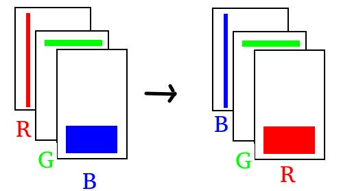
</p>

**Attention:** 

1) So if we apply **cv2.COLOR_BGR2RGB** then the **all red pixels will become blue pixels**

2) Full transparency is by using mask of 0 values in the alpha channel

3) No transparency is by using mask of 255 values in the alpha channel


#### Get the unique colors
```python
# List of all colors in an image using opencv and python
print(np.unique(img, axis=0, return_counts=True))
```

### Histograms

A histogram represents the distribution of pixel intensities (whether color or grayscale) in an image.

It can be visualized as a graph (or plot) that gives a high-level intuition of the intensity (pixel value) distribution.


```python
hist = cv2.calcHist([img_grayscale], channels=[0], mask=None, histSize=[256], ranges=[0, 256])
```

**Comments:** 

* **channels** - To compute a histogram for all three red, green, and blue channels, the channels list would be [0,1,2] .

* **histsize** - is the number of bins we want to use when computing a histogram, for each channel we compute a histogram.

* **ranges** - We specify The range of possible pixel values. Normally, this is [ 0, 256 ] for each channel, but if you are using a color space other than RGB (such as HSV), the ranges might be different.


[Intresting article about histogram](https://lmcaraig.com/understanding-image-histograms-with-opencv)

## Operations on Layers

### Gather layers into image

```python
overlay_color = cv2.merge((b, g, r))
```

### Seperate layers from image

```python
b, g, r, a = cv2.split(img_with_alpha_channel)
```


### Useful functions in open CV

Description | command
------------------------------------|-----
Load image | img = **cv2.imread**( "_path-to-file_")
Load image with alpha channel| img = **cv2.imread**( "_path-to-file_", cv2.IMREAD_UNCHANGED)
Write image to disk | **cv2.imwrite**( "_/codingForPleasure/example.png_", _img_ )
Display image | **cv2.imshow**( "_window-title_" , _img_ )
Get image size | rows, columns , _ = **cv2.shape()**
Convert to grayscale | grayImg = **cv2.cvtColor**(_img, **cv2.COLOR_BGR2GRAY**_)
Threshold | thresholdImg = **cv2.threshold**(_grayImg, &lt;threshold value&gt; ,&lt;max value&gt; **cv2.THRESH_BINARY_INV** \| **cv2.THRESH_OTSU**_ )
Retrieve contours | im2, contours, hierarchy = **cv2.findContours**(_img, **cv2.RETR_EXTERNAL**, **cv2.CHAIN_APPROX_SIMPLE**_)
Calculate contour's area | area = **cv2.contourArea**(contour)
Get the dimensions of a bounding rectangle | (x,y,w,h) = **cv2.boundingRect**(contour)
Resize image | **cv2.resize**(_img, **(100, 100)**_)
             |     resizedImg = cv2.resize(img, (int(imgwidth / descalingFactor), int(imgheight / descalingFactor)),interpolation=cv2.INTER_AREA)
Draw a rectangle on an image | **cv2.rectangle**(img, (x, y), (x + w, y + h), color, thickness)
split each color to different layer| b,g,r = cv2.split(img)


* findContours should opperate on black and white image **ONLY**


### Reading images in different modes:
```python
img = cv2.imread("path-to-file", cv2.IMREAD_COLOR)
```

#### Reading image with alpha channel

```python
img = cv2.imread("path-to-file",cv2.IMREAD_UNCHANGED)
```

Description | Flags
------------|-----
Always load to three-channel array | IMREAD_COLOR
Always load to single-channel array | IMREAD_GRAYSCALE
Channels as indicated by file (up to three) | IMREAD_ANYCOLOR
Allow loading of more than 8-bit depth | IMREAD_ANYDEPTH
Equivalent to combining: IMREAD_ANYCOLOR + IMREAD_ANYDEPTH | IMREAD_UNCHANGED

### Writing images in different modes:

```python
img = cv2.imwrite(filename = "path-to-file", img = img, params = cv2.IMREAD_COLOR)

```
Description | Flags
------------|-----
JPEG quality | IMWRITE_JPG_QUALITY
PNG compression (higher values mean more compression)y | IMWRITE_PNG_COMPRESSION
Channels as indicated by file (up to three) | IMREAD_ANYCOLOR

## Draw on screen shapes

* top-left corner and bottom-right corner of rectangle


```python
x1, x2 = 200, 300
y1, y2 = 100, 400
cv2.rectangle(img, (x1, y1), (x2, y2), (0, 255, 0), 3)
```

## Arithmetic Operations on Images

apply a simple arithmation operation on each pixel of the image

### Addition

**Commutative operation**

### Substruction

### Logical Operations on images

```python
img1 = cv2.imread(imgpath1, cv2.IMREAD_COLOR)
img2 = cv2.imread(imgpath2, cv2.IMREAD_COLOR)

img1 = cv2.cvtColor(img1, cv2.COLOR_BGR2RGB)
img2 = cv2.cvtColor(img2, cv2.COLOR_BGR2RGB)

img3 = cv2.bitwise_not(img1)
img4 = cv2.bitwise_and(img1, img2)
img5 = cv2.bitwise_or(img1, img2)
img6 = cv2.bitwise_xor(img1, img2)
```

### Overlay two images one above the other

Assuming both images of the same size:

```python
img = cv2.bitwise_and(img1, img2)
```


## Thresholding Types

### Threshold Global

[Link](https://www.youtube.com/watch?v=f1SaYzOthCM)

### Threshold set manually

**Binary:**  `if pixel > threshold
	pixel = max_val`
else
	pixel = 0

so in code:
```python
max_val = 255
cv2.threshold(img,th,max_val, cv2.THRESH_BINARY)
```

Let's see some few more types of threshold:

**THRESH_BINARY_INV:**`if pixel > threshold pixel = 0 else pixel = max_val`

**THRESH_TOZERO:** `if pixel < threshold pixel = 0 `

**THRESH_TOZERO_INV:** `if pixel > threshold pixel = 0 `

**THRESH_TRUNC:** `if pixel > threshold pixel = 0 `

<p align="center">
  
</p>


What about those two: THRESH_TRIANGLE, THRESH_MASK ?


### Threshold calculated automatically (THRESH_OTSU)

Will automatically calculate the appropriate threshold and then apply the binarization algorithm we are using with it.
Is used to **automatically** perform clustering-based image thresholding,
The algorithm assumes that the image contains two classes of pixels following bi-modal histogram (foreground pixels and background pixels), it then calculates the optimum threshold separating the two classes so that their combined spread (intra-class variance) is minimal, or equivalently (because the sum of pairwise squared distances is constant), so that their inter-class variance is maximal.

To apply THRESH_OTSU second argument (threshold) should be set to zero, and should add the THRESH_OTSU flag:

cv2.threshold(img,0,max_val, cv2.THRESH_BINARY + cv2.THRESH_OTSU)

http://www.labbookpages.co.uk/software/imgProc/otsuThreshold.html

### Adaptive thresholding

When the THRESH_OTSU approach fails, we should consider adaptive thresholding:

```python
block_size = 513
constant = 2

th1 = cv2.adaptiveThreshold(img, 255, cv2.ADAPTIVE_THRESH_MEAN_C, cv2.THRESH_BINARY, block_size, constant)
th2 = cv2.adaptiveThreshold (img, 255, cv2.ADAPTIVE_THRESH_GAUSSIAN_C, cv2.THRESH_BINARY, block_size, constant)
```


[Link](https://www.youtube.com/watch?v=nPyb2BVBeB8)

### blurring/smoothening techniques

#### Averaging
It simply takes the average of all the pixels under kernel area and replace the central element.

```python
   kernel = (5,5)
   blur = cv2.blur(img,kernel)
```

#### Gaussian Blurring

When Should I use it?
**Gaussian blurring is highly effective in removing gaussian noise from the image.**

We should specify the kernel size and **we also should specify the standard deviation in X and Y direction, sigmaX and sigmaY respectively**. if only sigmaX is specified, sigmaY is taken as same as sigmaX. If both are given as zeros, they are calculated from kernel size.


```python
 kernel = (5,5)
 blur = cv2.GaussianBlur(img,kernel,0)
```

#### medianBlur

When should I use it?
**This is highly effective against salt-and-pepper noise in the images**

takes median of all the pixels under kernel area and central element is replaced with this median value. **Its kernel size should be a positive odd integer.**


```python
median = cv2.medianBlur(src = img,ksize = 5)
```

<p align="center" style="width:400px;" >
  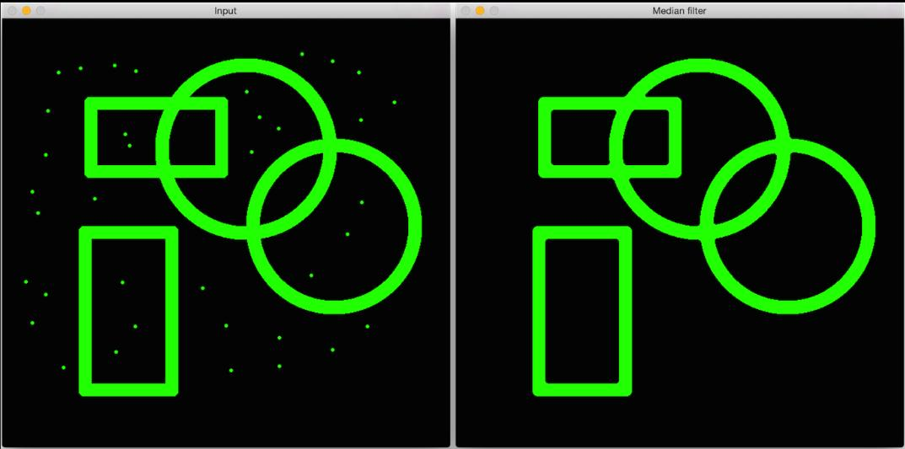
</p>

#### Bilateral Filtering

When should I use it?
**is highly effective in noise removal while keeping edges sharp. But the operation is slower compared to other filters. So the end result would be the texture on the surface is gone, but edges are still preserved.**

```python
blur = cv2.bilateralFilter(img,9,75,75)
```


## Geometric Transformations (affine transformation)

I have noticed a great reference here:
https://docs.opencv.org/3.0-beta/doc/py_tutorials/py_imgproc/py_geometric_transformations/py_geometric_transformations.html


<p align="center">
  
</p>

### 2x2 Tranformation Matrix

#### Scale an image
Scale scales a set of points up or down in the x and y directions.

```python
cv2.resize(img1, None,...)
```

<p align="center">
  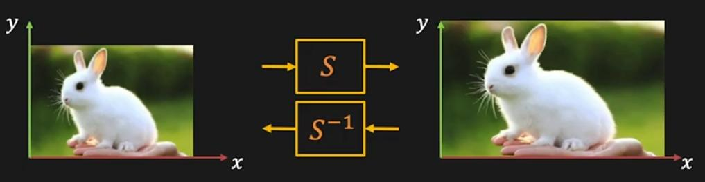
</p>

**Forward:**

$x_2=ax_1$ , $y_2=by_1$

 $\begin{bmatrix} x_2 \\ y_2 \end{bmatrix}$=S$\begin{bmatrix} x_1 \\ y_1 \end{bmatrix}=\begin{bmatrix} a & 0 \\ 0 & b \end{bmatrix}\begin{bmatrix} x_1 \\ y_1 \end{bmatrix}$

**Reverse:**

$x_1=\frac{1}{a}x_2$ , $y_1=\frac{1}{b}y_2$

 $\begin{bmatrix} x_1 \\ y_1 \end{bmatrix}=S^{-1}\begin{bmatrix} x_2 \\ y_2 \end{bmatrix}=\begin{bmatrix} \frac{1}{a} & 0 \\ 0 & \frac{1}{b} \end{bmatrix}\begin{bmatrix} x_2 \\ y_2 \end{bmatrix}$


#### Rotate an image

<p align="center">
  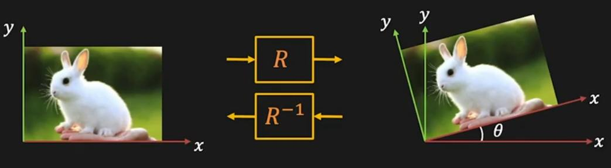
</p>

[Link](https://youtu.be/K2XLXlyPqCA?list=PL2zRqk16wsdp8KbDfHKvPYNGF2L-zQASc&t=258)


cv2.getRotationMatrix2D(center, angle, scale)
 - returns a **rotation matrix**.

```python
rows, columns, channels = img1.shape

# Generate an rotation matrix clockwise by 45 degrees and remain the same size (scale factor = 1):
R = cv2.getRotationMatrix2D((columns/2, rows/2), 45, 1)

# Now apply the rotation matrix on the image
output = cv2.warpAffine(img1, R ,(columns,rows))

```

### 3x3 Tranformation Matrix

#### Shift/Translate an image

<p align="center">
  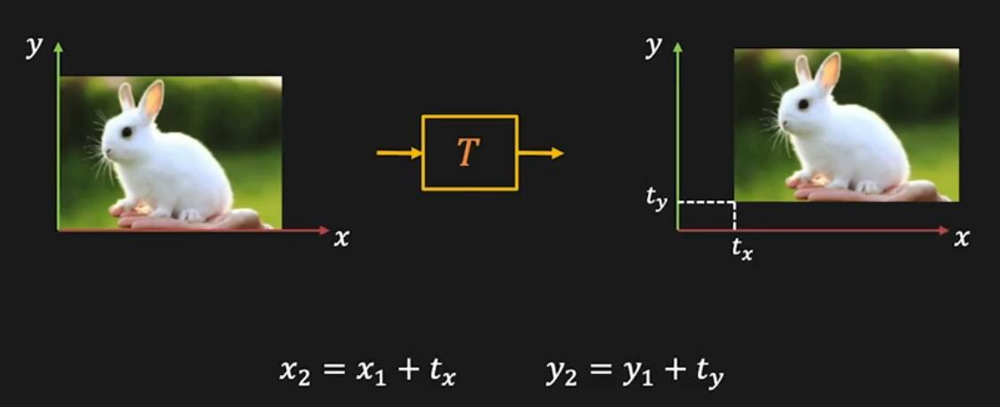
</p>

Shift/Translate does a set of points a fixed distance in x and y

```python
T = np.float32([[1,0,50],[0,1,-50]])
cv2.warpAffine(img1,T, (columns,rows))
```


<p align="center">
  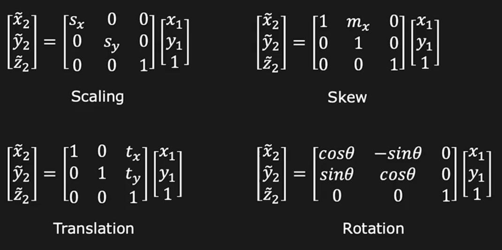
</p>

* We can apply those transformations sequentially,
  or we can apply a composition of transform matrices to get the same effect as applying them sequentially.

* What intresting in any transformation we have seen so far, they all belong to the 
`Affine Transformation` which the transformation matrix holds in the last row: `0 0 1`

 $$\begin{bmatrix} x_2 \\ y_2 \\ 1 \end{bmatrix}=\begin{bmatrix} \tilde{x_2} \\ \tilde{y_2} \\ \tilde{z_2} \end{bmatrix}=\begin{bmatrix} a_{11} & a_{12} & a_{13} \\ a_{21} & a_{22} & a_{23} \\0 & 0 & 1 \end{bmatrix}\begin{bmatrix} \tilde{x_1} \\ \tilde{y_1} \\ \tilde{z_1}\end{bmatrix}$$


* The features:

1) Lines map to lines

2) Parallel lines remain parallel

3) Closed under composition

Shear offsets a set of points a distance proportional to their x and y coordinates.

#### Projective Transformation

Projective matrix, that matrix is called **homography**:

What does projective matrix to?

maps one plane to another plane through a point

<p align="center">
  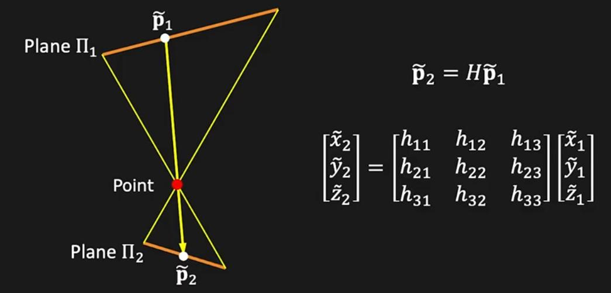
</p>


Same as imaging a plane through a pinhole, **exactly like a camera does**.

0) Origin does not necessarily map to the origin

1) Lines map to lines

2) Parallel lines **do not necessarily remain parallel**

3) Closed under composition

#### Barrel Transformation

### Morphological Transformations

Should apply those transformations on black and white images

In OpenCV there a are many predefined filters which use a **kernel**. kernel is a set of weights, which determine how each output pixel is calculated from a neighborhood of input pixels. Another term for a kernel is a convolution matrix. It mixes up or convolves the pixels in a region. Similarly, a kernel-based filter may be called a convolution filter.

### Affine wrap transform

[Link](https://www.youtube.com/watch?time_continue=23&v=PtCQH93GucA&feature=emb_logo)


### Perspective Transformation

[Link](https://medium.com/analytics-vidhya/opencv-perspective-transformation-9edffefb2143)


#### Erosion
```python
kernel = np.ones((5,5),np.uint8)
erosion = cv2.erode(binary_inv, kernel, iterations = 1)
```
#### Dilation
```python
kernel = np.ones((5,5),np.uint8)
dilation = cv2.dilate(binary_inv, kernel, iterations = 1)
```
#### Gradient (For determining the borders)

```python
kernel = np.ones((5,5),np.uint8)
gradient = cv2.morphologyEx(binary_inv, cv2.MORPH_GRADIENT, kernels)
```

#### Structuring Element (elliptical/circular shaped kernels)
We manually created a structuring elements in the previous examples with help of Numpy. It is rectangular shape. But in some cases, you may need elliptical/circular shaped kernels.
i.e:

```python
kernel = cv2.getStructuringElement(cv2.MORPH_CROSS,(5, 5))
```

\# | Structure element
----|-------------------
1 | MORPH_RECT
2 | MORPH_ELLIPSE
3 | MORPH_CROSS
3 | MORPH_TOPHAT


<!-- MORPH_BLACKHAT = 6
MORPH_CLOSE = 3
MORPH_CROSS = 1
MORPH_DILATE = 1
MORPH_ELLIPSE = 2
MORPH_ERODE = 0
MORPH_GRADIENT = 4
MORPH_HITMISS = 7
MORPH_OPEN = 2
MORPH_RECT = 0
MORPH_TOPHAT = 5 -->

### Contour Approximation Method
```python
kernel = kernel = np.ones((5,5),np.uint8)
gradient = cv2.morphologyEx(binary_inv, cv2.morphologyEx, cv2.MORPH_GRADIENT, kernel)
```

Flag | Meaning
-----|-------------------
CHAIN_APPROX_NONE | all the boundary points are stored (maximum accuracy but the tradeoff is memory consumption).
CHAIN_APPROX_SIMPLE | removes all redundant points and compresses the contour, thereby saving memory
CHAIN_APPROX_TC89_KCOS |
CHAIN_APPROX_TC89_L1 |


### Bounding Shapes

#### Bounding rectangle
##### Straight Bounding Rectangle

```python
x,y,w,h = cv2.boundingRect(cnt)
cv2.rectangle(img,(x,y),(x+w,y+h),(0,255,0),2)
```
##### Rotated Rectangle

In this case bounding rectangle is drawn with minimum area, so it considers the rotation also.
It returns a Box2D structure which contains following details -
`(center (x,y), (width, height), angle of rotation )`

```python
rect = cv2.minAreaRect(cnt)
box = cv2.boxPoints(rect)
box = np.int0(box)
cv2.drawContours(img,[box],0,(0,0,255),2)
```
#### Minimum Enclosing Circle
```python
(x,y),radius = cv2.minEnclosingCircle(cnt)
center = (int(x),int(y))
radius = int(radius)
cv2.circle(img,center,radius,(0,255,0),2)
```


#### Enclosing Triangle

```python
points = np.array([[50, 50], [20, 150], [130, 60], [170, 90]], np.float32)
triangle = cv2.minEnclosingTriangle(points)

# Create blank black image
img = np.zeros((500, 500, 3), dtype = np.uint8)  # it's important to write: dtype = np.uint8


# Show all points on black image
    for point in points:
        cv2.circle(img, center=(int(point[0]), int(point[1])), color=(0, 0, 255), radius=10, thickness=-1)

# Draw the actual triangle:
cv2.polylines(img=img, pts=[np.int32(triangle[1])], isClosed=True, color=(0, 0, 0), thickness=2,
            lineType=cv2.LINE_AA)

cv2.imshow("Triangle", img)
cv2.waitKey(0)
cv2.destroyAllWindows()
```

<p align="center">
  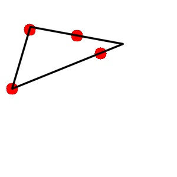
</p>

#### Fitting an Ellipse

fitEllipse returns a tuple of three elements:

```pyton
(x, y), (MA, ma), angle = cv2.fitEllipse(cnt)
cv2.ellipse(img,ellipse,(0,255,0),2)
```

**comment:** For calculating the area of ellipse you get: **PI * MA * ma**
(The area of an ellipse is simply pi times the product of the major axis and the minor axis)

#### Fitting a Line
image contains a set of white points. We can approximate a straight line to it.

```python
rows,cols = img.shape[:2]
[vx,vy,x,y] = cv2.fitLine(cnt, cv2.DIST_L2,0,0.01,0.01)
lefty = int((-x*vy/vx) + y)
righty = int(((cols-x)*vy/vx)+y)
cv2.line(img,(cols-1,righty),(0,lefty),(0,255,0),2)
```


## Contours


In OpenCV, finding contours is like finding white object from **black background**. 

**So remember**, object to be found **should be white and background should be black**.

```python
(_, cnts, _) = cv2.findContours(edged.copy(), cv2.RETR_EXTERNAL, cv2.CHAIN_APPROX_SIMPLE)
cv2.drawContours(coins, cnts, -1, (0, 255, 0), 2)
```

contours, _ = cv2.findContours(image=img_gray, mode=cv2.RETR_EXTERNAL, method=cv2.CHAIN_APPROX_SIMPLE)

What is the **Method** argument?

This means **Contour Approximation Method**, see below:

Method type | Description
------------|-----
cv2.CHAIN_APPROX_NONE | All the boundary points are stored
cv2.CHAIN_APPROX_SIMPLE | It removes all redundant points and compresses the contour, thereby saving memory i.e a straight line only twwo points will be stored.


### Contours Hierarchy

Great resource:
https://docs.opencv.org/3.4.0/d9/d8b/tutorial_py_contours_hierarchy.html

### Extracting connected components from binary image
* Connected components in binary images are areas of non-zero values.
* different components don't touch each other, there are zeros around each one.
* Finding connected components in an image is much faster then finding all contours.So it's possible to quickly exclude all irrelevant paths of the image according to connected component features.


Description | command
------------------------------------|-----
Get some important information about each connected component, such as the bounding box, area, and center of mass (also known as centroid) |_, labels, stats, _ = **cv2.connectedComponentsWithStats**(img, connectivity=4)
 | **cv2.connectedComponents**(img, connectivity=4)
 | **connectivity=4** means 4-connected pixels are neighbors to every pixel that touches one of their edges (These pixels are connected horizontally and vertically).
 |**connectivity=8** means 8-connected pixels are neighbors to every pixel that touches one of their edges or corners. These pixels are connected horizontally, vertically, and diagonally
| group_areas = stats[1:, cv2.CC_STAT_AREA]    # (ignoring 0, which is the background id)


As mentioned before the **connectedComponentsWithStat** function returns 4 values.

The **second value** is a marix of the original image's size, which every pixel holds the label it belongs to the corresponding connected component.

The **third value** is a tuple (&lt;label&gt;,&lt;property-value-of-the-label&gt;)

&lt;property-value-of-the-label&gt; can hold one of the following values:

CC_STAT_LEFT

CC_STAT_TOP

CC_STAT_WIDTH

CC_STAT_HEIGHT

CC_STAT_AREA

**Let's take an example, see below:**

There are 4 connected components, **largest one holds label '1, let's focus on it** :

<p align="center">
  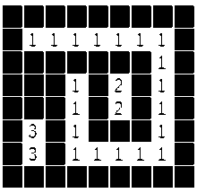
</p>

it's **CC_STAT_LEFT** is 1

it's **CC_STAT_TOP** is 1

it's **CC_STAT_WIDTH** is 7

it's **CC_STAT_HEIGHT** is 6

it's **CC_STAT_AREA** is 19


### How to detect all the connected neighboring pixels which have same color value?

You should use `flood fill` function

```python
h, w = img_bw.shape

cv2.floodFill(image=img_bw,
              mask=np.zeros((h + 2, w + 2), np.uint8),
              seedPoint=pos_cursor,
              newVal=0)	
```

[Nice Reference](https://github.com/opencv/opencv/blob/master/samples/python/floodfill.py)

### Defines for video capture

Define | Meaning
------------|-----
cv2.CAP_PROP_FRAME_WIDTH | Set frame width
cv2.CAP_PROP_FRAME_HEIGHT |  Set frame height
cv2.CAP_PROP_POS_FRAMES | Skip to specific frame
cv2.CAP_PROP_FRAME_COUNT | Get number of frames per video
[Link](https://docs.opencv.org/3.4/dd/d01/group__videoio__c.html)

### distance transform

https://homepages.inf.ed.ac.uk/rbf/HIPR2/distance.htm

## Detecting Edges

[Sequence of Lectures about edge detection](https://www.youtube.com/watch?v=7AlwDYmjrcs&list=PL2zRqk16wsdqXEMpHrc4Qnb5rA1Cylrhx)

### Sobel

Simple edge detection filter known as the Sobel filter. Since edges can occur in both horizontal and vertical directions, the Sobel filter is composed of the
following two kernels:

<p align="center" >
  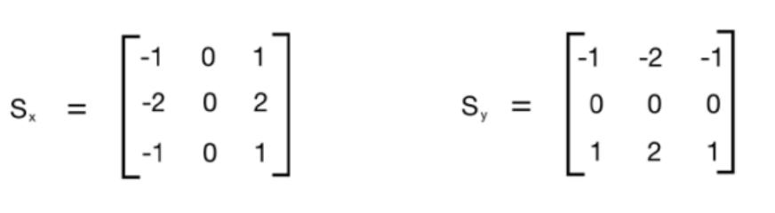
</p>

The kernel on the left detects horizontal edges and the kernel on the right detects vertical edges.

```python
import cv2
import numpy as np
img = cv2.imread('images/input_shapes.png', cv2.IMREAD_GRAYSCALE)
rows, cols = img.shape
# It is used depth of cv2.CV_64F.
sobel_horizontal = cv2.Sobel(img, cv2.CV_64F, 1, 0, ksize=5)
# Kernel size can be: 1,3,5 or 7.
sobel_vertical = cv2.Sobel(img, cv2.CV_64F, 0, 1, ksize=5)
cv2.imshow('Original', img)
cv2.imshow('Sobel horizontal', sobel_horizontal)
cv2.imshow('Sobel vertical', sobel_vertical)
cv2.waitKey(0)
```

<p align="center" style="width:550px;" >
  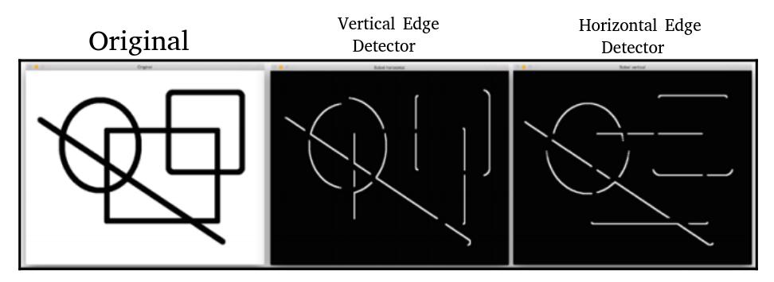
</p>

The **Sobel filter** detects edges in **either a horizontal or vertical direction** and it **doesn't give us a holistic view of all the edges**.

### Laplacian

The advantage of using this filter is that it uses a **double derivative in both directions**

```python
laplacian = cv2.Laplacian(img, cv2.CV_64F)
```

<p align="center" style="width:550px;" >
  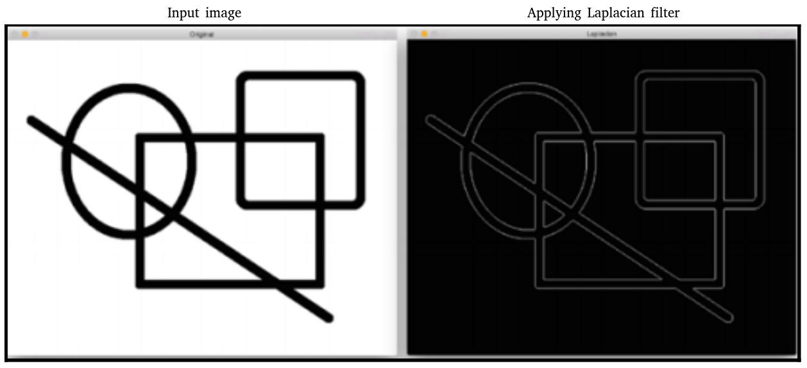
</p>

The Laplacian kernel gives rise to a noisy output,which is not exactly useful. 

### Canny

To overcome Laplacian edge detection's problems, we use the Canny edge detector. To use the Canny edge detector, we can use the following function:

<p align="center" style="width:400px;" >
  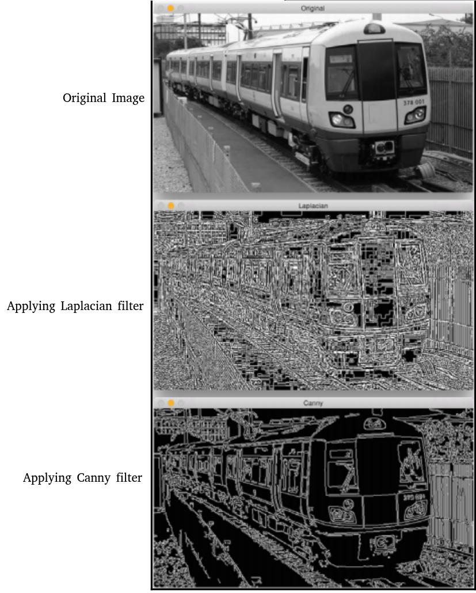
</p>


As we can see, the quality of the **Canny edge detector is much better**!!

```python
canny = cv2.Canny(img, threshold1 = 50, , threshold2 = 240)
```

It takes two numbers as arguments to indicate the thresholds. The second argument is called the low threshold value, and the third argument is called the high threshold value.


## Drawing functions

Reference: [Link](https://docs.opencv.org/4.x/dc/da5/tutorial_py_drawing_functions.html)

### Drawing Line

### Drawing Rectangle

### Drawing Circle

### Drawing Ellipse

### Drawing Polygon

### Adding Text to Images


## Keypoints (Interest points)

[1) Intro](https://www.youtube.com/watch?v=KgsHoJYJ4S8)

[1) What is an Interest Point?](https://youtu.be/wcqbiHonfbo)

[2) Detecting Blobs - SIFT Detector](https://youtu.be/zItstOggP7M)

(3) [SIFT Detector](https://youtu.be/ram-jbLJjFg)
### SIFT (Scale-invariant feature transform )


We can use this algorithm to extract keypoints and build the corresponding feature descriptors.

We can use this algorithm to extract keypoints and build the corresponding feature descriptors. To identify a potential keypoint, SIFT builds a pyramid by downsampling an image and taking the difference of Gaussian.

**So how does SIFT achieves scale invariance?**

Using a Pyramid:

<p align="center">
  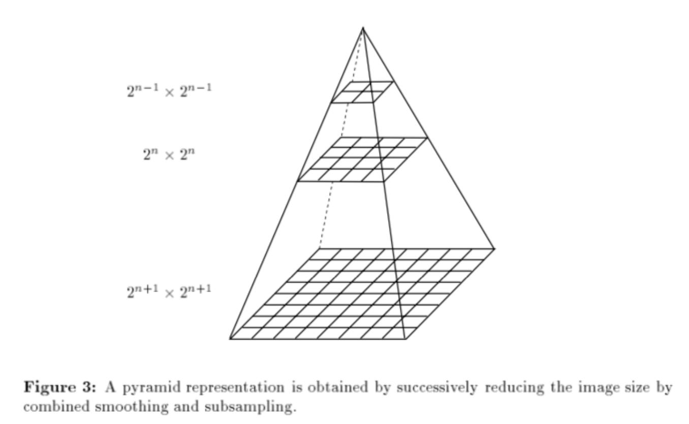
</p>

We can find the features under various image sizes.
Besides, we can also use the **Laplacian of Gaussian(LoG)** with different σ to achieve this.

* The Laplacian of Gaussian(LoG) operation goes like this. You take an image, and blur it a little (using Gaussian kernel). And then, you calculate the sum of second-order derivatives on it (or, the “Laplacian”). This locates edges and corners on the image. These edges and corners are good for finding keypoints (note that we want a keypoint detector, which means we will do some extra operations to suppress the edge). LoG is often used for blob detection.


[How does the SIFT algorithm work?](https://youtu.be/m_XtEl-HUIg)

[SIFT in short in Hebrew](https://www.lbscience.org/2020/09/10/%d7%9e%d7%99-%d7%a9%d7%9e%d7%91%d7%99%d7%98-%d7%91%d7%99-%d7%9e%d7%94%d7%a6%d7%93-%d7%99%d7%95%d7%93%d7%a2-%d7%9e%d7%99-%d7%90%d7%a0%d7%99/)

[SIFT towardsdatascience](https://towardsdatascience.com/sift-scale-invariant-feature-transform-c7233dc60f37)

[Ransac - nike was questioned](http://www.my-website.com)

### SURF (Speeded-up robust features)

### FAST (Features from accelerated segment test)

### BRIEF (Binary robust independent elementary features)

### Create a transparent image


```python
    img_height, img_width = 300, 300
    n_channels = 4

    transparent_img = np.zeros((img_height, img_width, n_channels), dtype=np.uint8)
    transparent_img[:, :, :3] = np.ones((img_height, img_width, n_channels - 1), dtype=np.uint8) * 255
    transparent_img[:, :, 3] = np.ones((img_height, img_width), dtype=np.uint8) * 255

    cv2.circle(img=transparent_img, thickness=-1, radius=100, center=(150, 150), color=(255, 0, 0))

    # Save the image for visualization
    cv2.imwrite("./transparent_img.png", transparent_img)
```


## Image Stiching

[Link](https://www.youtube.com/watch?v=J1DwQzab6Jg&list=PL2zRqk16wsdp8KbDfHKvPYNGF2L-zQASc)


[image stiching code example](https://colab.research.google.com/drive/11Md7HWh2ZV6_g3iCYSUw76VNr4HzxcX5#scrollTo=yMNF_uEKE9gj)

Steps:


(1) 
(2) 
(3) Dealing with outliers: RANSAC (Since there are false matches between pair of images)
(4) Warping and Blending algorithm

### Dealing with outliers (RANSAC - RANdom Sample Consensus)

* We need to robustly compute transformation in the presence of wrong matches.

* if number of **outliers < 50%**, then **RANSAC** to the rescue!!

#### The algorithm
**3 Steps procedure**

Loop until `n iterations`

Repeat: 
   1. Sample a small subset of data points, treat them as inliers.
      Select four feature pairs (at random)

   2. Compute homography **H** (exact)

   3. Compute inliers where ||pi; Hpi|| < `epsilon`

   3. Scoring the model


* Keep lragest set of inliers

* Re-compute least-squares `H` estimate using all of the inliers.

Finally, use the solution with the highest score.


#### Ransac's Tasks

Ransac is used often in tasks such as:

**a.** Stiching

**b.** In robotics and computer vision,

**visual odometry** is the process of determining the position and orientation of a robot by analyzing the associated camera images.
[Link](https://youtu.be/9D5rrtCC_E0?t=234)


[Well exaplained](https://youtu.be/EkYXjmiolBg?list=PL2zRqk16wsdp8KbDfHKvPYNGF2L-zQASc)

### Homography matrix


## three essential algorithms used to identify obstacles using Lidar: RANSAC, KD-Tree, and Euclidean clustering


#### Find Homography with Python 

```python

```

## Deep learning in OpenCV

In the context of deep learning and image classification, these preprocessing tasks normally involve:

1) Mean subtraction

2) Scaling by some factor

OpenCV’s new deep neural network (dnn) module contains two functions that 
**can be used for preprocessing images and preparing them for classification via pre-trained deep learning models**.

### The function blobFromImage(s)
The two functions:

* cv2.dnn.blobFromImage

* cv2.dnn.blobFromImages


[Reference](https://www.pyimagesearch.com/2017/11/06/deep-learning-opencvs-blobfromimage-works/)

These two functions perform:

1. **Mean subtraction**

2. **Scaling**

3. **And optionally channel swapping**

Let's delve into each one:

####  1. Mean subtraction

Mean subtraction is used to help combat illumination changes in the input images in our dataset. We can therefore view mean subtraction as a **technique used to aid our Convolutional Neural Networks**.

Before we even begin training our deep neural network, autoc we first **compute the average pixel intensity across all images in the training set for each of the Red, Green, and Blue channels**.


<p align="center"> <!-- style="width:400px;" -->
  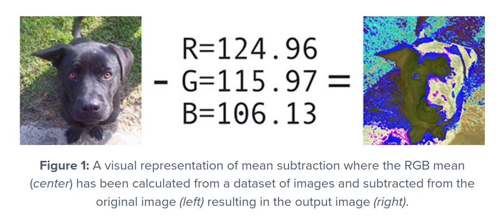
</p>


[opencv fails in pycharm in autocomplete](https://stackoverflow.com/questions/68669767/pycharm-can%c2%b4t-find-reference-of-any-opencv-function-in-init-py/73087052#73087052)

[ First Principles of Computer Vision ](https://www.youtube.com/channel/UCf0WB91t8Ky6AuYcQV0CcLw/videos)

[Install OpenCV on hard-drive](https://linuxize.com/post/how-to-install-opencv-on-ubuntu-18-04/)

[Great example for opencv in github ](https://github.com/opencv/opencv/tree/master/samples/python)

[Great Kaggle opencv Notebook](https://www.kaggle.com/bulentsiyah/learn-opencv-by-examples-with-python)