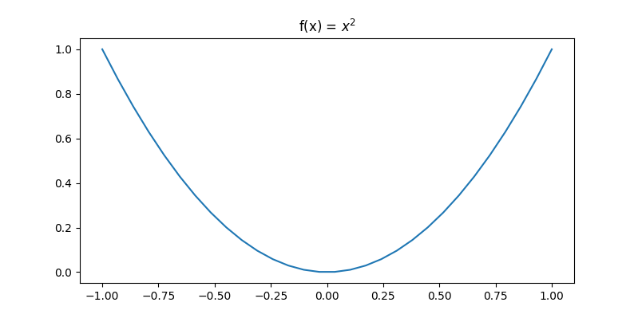

<!--ts-->
   * [Gradient Descent](#gradient-descent)
      * [Understanding Gradient](#understanding-gradient)

<!-- Added by: gil_diy, at: Fri 04 Feb 2022 10:26:05 IST -->

<!--te-->

# Gradient Descent


## Understanding Gradient

Suppose we have the function `f(x) = x^2` , where x ranges from -1 to 1, given x randomly start in the range, how to find the minimum value of `f(x)` ?

```python
def f(x):
	return x**2

if __name__ == '__main__':
	x_range = np.linspace(-1,1,30)
	y = [f(x) for x in x_range]

	plt.figure(figsize = [8,4])
	plt.plot(x_range, y)
	plt.title('f(x) = $x^2$')
	plt.show()
```

<p align="center"> <!-- style="width:400px;" -->
  
</p>