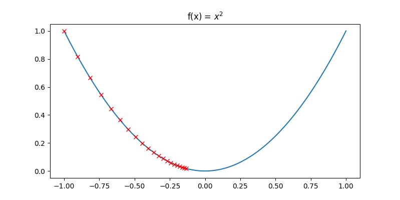

<!--ts-->
   * [Gradient Descent](#gradient-descent)
      * [Understanding Gradient](#understanding-gradient)
      * [First implementation](#first-implementation)
      * [Optimizing parameters](#optimizing-parameters)

<!-- Added by: gil_diy, at: Sat 05 Feb 2022 15:29:52 IST -->

<!--te-->

# Gradient Descent


## Understanding Gradient

Suppose we have the function `f(x) = x^2` , where x ranges from -1 to 1, given x randomly start in the range, how to find the minimum value of `f(x)` ?

```python
def f(x):
	return x**2

if __name__ == '__main__':
	x_range = np.linspace(-1,1,30)
	y = [f(x) for x in x_range]

	plt.figure(figsize = [8,4])
	plt.plot(x_range, y)
	plt.title('f(x) = $x^2$')
	plt.show()
```

<p align="center"> <!-- style="width:400px;" -->
  
</p>


## First implementation

```python
def gd(init_x, grad_fn, lr=0.01, n_iter=10):
    x = init_x
    x_list = [x]
    for i in range(n_iter):
        x -= grad_fn(x) * lr
        x_list.append(x)

    return x_list


if __name__ == '__main__':
    init_x_val = -1
    
    grad_func = lambda x: 2 * x # The derivative

    x_output = gd(init_x=init_x_val,
                  grad_fn=grad_func,
                  lr=0.01,
                  n_iter=100)

    y_output = [f(x) for x in x_output]
    print("x_output: ", x_output)
    print("y_output: ", y_output)

    plt.figure(figsize=[8, 4])
    plt.plot(x_range, y)  # Original graph

    # No need so many points so we are skipping 
    # every 4 consecutive points:

    plt.plot(x_output[::5], y_output[::5], 'rx')
    plt.title('f(x) = $x^2$')
    plt.show()
```

In each iteration, `x -= lr*grad_fn(x)` makes it always moving to the minimum, and we can also plot the trajectory of x:

<p align="center"> <!-- style="width:400px;" -->
  
</p>

Starting from -1, x descent to 0 gradually. Also notice that it moves faster at the beginning and slows down when approaching the goal, this is because the absolute gradient is higher at start.

## Optimizing parameters


