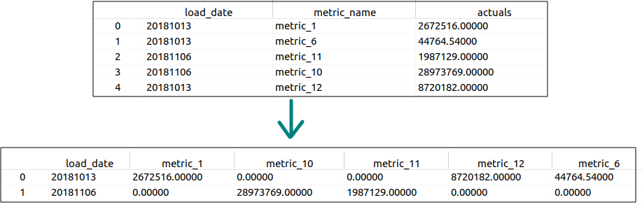

<!-- #Pandas Cheat sheet for Shay (clean examples) -->
<!--ts-->
   * [Pandas](#pandas)
      * [Pandas data structures](#pandas-data-structures)
         * [Series](#series)
         * [DataFrame](#dataframe)
            * [Creating a dataframe](#creating-a-dataframe)
            * [Creating dataframe (another approach)](#creating-dataframe-another-approach)
            * [Creating a dataframe and adding row on each iteration](#creating-a-dataframe-and-adding-row-on-each-iteration)
            * [Get dimensions of a dataframe](#get-dimensions-of-a-dataframe)
            * [Iterate over rows](#iterate-over-rows)
            * [Rename indexes (rename row names)](#rename-indexes-rename-row-names)
            * [Rename indexes to default range index](#rename-indexes-to-default-range-index)
            * [Set row names given a list](#set-row-names-given-a-list)
            * [Get dataframe except specific rows](#get-dataframe-except-specific-rows)
            * [Get dataframe except specific column](#get-dataframe-except-specific-column)
            * [Get row names](#get-row-names)
            * [Get column names](#get-column-names)
            * [rename column names](#rename-column-names)
            * [rename either columns/rows names](#rename-either-columnsrows-names)
            * [Get numeric columns in pandas](#get-numeric-columns-in-pandas)
            * [Get categorical columns in pandas](#get-categorical-columns-in-pandas)
            * [Get column index for a given specific name](#get-column-index-for-a-given-specific-name)
            * [Dropping columns in pandas](#dropping-columns-in-pandas)
            * [Concatentaing columns and rows](#concatentaing-columns-and-rows)
            * [Treat pandas strings as numeric value  (casting)](#treat-pandas-strings-as-numeric-value--casting)
            * [Converting from numpy table to pandas dataframe](#converting-from-numpy-table-to-pandas-dataframe)
            * [Converting from pandas dataframe to numpy table](#converting-from-pandas-dataframe-to-numpy-table)
            * [Converting categorical columns to numbers (4 Methods)](#converting-categorical-columns-to-numbers-4-methods)
            * [Methods of slicing in pandas](#methods-of-slicing-in-pandas)
            * [Accessing an element in pandas](#accessing-an-element-in-pandas)
            * [Accessing a column in pandas](#accessing-a-column-in-pandas)
            * [Filtering data within a dataframe](#filtering-data-within-a-dataframe)
               * [Method #1 (Similar to R language)](#method-1-similar-to-r-language)
               * [Method #2 (Similar to Filter function in R language)](#method-2-similar-to-filter-function-in-r-language)
               * [Method #3 (less clean way)](#method-3-less-clean-way)
      * [CSV](#csv)
         * [Importing data from CSV file](#importing-data-from-csv-file)
         * [Importing only first 1000 rows from a HUGE CSV file](#importing-only-first-1000-rows-from-a-huge-csv-file)
         * [Importing only chunksize into memory](#importing-only-chunksize-into-memory)
         * [Importing only selected columns from a HUGE CSV file](#importing-only-selected-columns-from-a-huge-csv-file)
         * [Importing data from CSV with NA's](#importing-data-from-csv-with-nas)
         * [Importing data and squeeze](#importing-data-and-squeeze)
         * [Importing data from CSV with date](#importing-data-from-csv-with-date)
         * [Importing data from CSV when numerical columns consist of thousands seperator](#importing-data-from-csv-when-numerical-columns-consist-of-thousands-seperator)
         * [Setting a specific column as an index](#setting-a-specific-column-as-an-index)
         * [Exporting data into CSV](#exporting-data-into-csv)
      * [Excel File](#excel-file)
      * [JSON File](#json-file)
         * [Importing data from json](#importing-data-from-json)
      * [Displaying data cleaner](#displaying-data-cleaner)
      * [Get information of the data types for a given dataframe](#get-information-of-the-data-types-for-a-given-dataframe)
      * [Get information about the memory usage of a dataframe stored in the memory](#get-information-about-the-memory-usage-of-a-dataframe-stored-in-the-memory)
      * [Get statistics (count, mean, std, min, max))](#get-statistics-count-mean-std-min-max)
      * [Get statistics for Categorical columns](#get-statistics-for-categorical-columns)
      * [Get counts for spcific column (Exactly like table function in R)](#get-counts-for-spcific-column-exactly-like-table-function-in-r)
      * [Get mode - value that appears most often in either column or row](#get-mode---value-that-appears-most-often-in-either-column-or-row)
      * [Datatypes conversions](#datatypes-conversions)
      * [Dealing with NA's](#dealing-with-nas)
         * [Check the column-wise distribution of null values](#check-the-column-wise-distribution-of-null-values)
         * [Remove rows with NA's](#remove-rows-with-nas)
         * [Check for NA's in dataframe](#check-for-nas-in-dataframe)
         * [Replace NA's with the median](#replace-nas-with-the-median)
         * [Replace string with other thing in a specific column](#replace-string-with-other-thing-in-a-specific-column)
         * [Replace string with other thing in a dataframe](#replace-string-with-other-thing-in-a-dataframe)
         * [Retrieve NaN values](#retrieve-nan-values)
      * [Get the index of the min or the max element](#get-the-index-of-the-min-or-the-max-element)
      * [Get the nsmallest or nlargest element](#get-the-nsmallest-or-nlargest-element)
      * [Get Skewness of a column](#get-skewness-of-a-column)
      * [Get Kurtosis of a column](#get-kurtosis-of-a-column)
      * [Segment and sort data values into bins](#segment-and-sort-data-values-into-bins)
      * [Shuffle rows in Dataframe](#shuffle-rows-in-dataframe)
      * [Transform single row into multiple rows](#transform-single-row-into-multiple-rows)
      * [Group by:](#group-by)
         * [Group with aggregate](#group-with-aggregate)
         * [Group by time slot](#group-by-time-slot)
      * [Concat Dataframes](#concat-dataframes)
         * [Join two dataframes one <strong>below</strong> the other.](#join-two-dataframes-one-below-the-other)
         * [Join two dataframes one <strong>besides</strong> the other.](#join-two-dataframes-one-besides-the-other)
         * [Join two dataframes one <strong>besides</strong> the other when share the same key (inner join)](#join-two-dataframes-one-besides-the-other-when-share-the-same-key-inner-join)
         * [Join two dataframes one <strong>besides</strong> the other when share the same key (Left join)](#join-two-dataframes-one-besides-the-other-when-share-the-same-key-left-join)
         * [Dataframe Pivot table](#dataframe-pivot-table)
         * [Printing data so all columns will be presented (Display all columns)](#printing-data-so-all-columns-will-be-presented-display-all-columns)
         * [Get data ditribution of the data per column](#get-data-ditribution-of-the-data-per-column)
      * [Convert each consecutive pair of columns into a tuple in a single column](#convert-each-consecutive-pair-of-columns-into-a-tuple-in-a-single-column)
      * [Mapping/Applying categorical values to a specified numerical values](#mappingapplying-categorical-values-to-a-specified-numerical-values)
      * [confidence_interval](#confidence_interval)
      * [One hot encoding](#one-hot-encoding)
      * [Mathematical functions](#mathematical-functions)
         * [Calculate correlation for all numerical columns pairs](#calculate-correlation-for-all-numerical-columns-pairs)
      * [Execute sql](#execute-sql)
      * [Dump dataframe into the clipboard](#dump-dataframe-into-the-clipboard)
      * [Reference](#reference)

<!-- Added by: gil_diy, at: Sat 08 Oct 2022 11:36:33 IDT -->

<!--te-->


# Pandas
pandas adopts significant parts of NumPy’s idiomatic style of array-based computing, especially array-based functions and a preference for data processing without for loops.

While pandas adopts many coding idioms from NumPy, the biggest difference is that
pandas is designed for working with tabular or heterogeneous data. NumPy, by contrast, is best suited for working with homogeneous numerical array data.

```python
import pandas as pd
```

## Pandas data structures

### Series

A series is one-dimensional array like object conject containing a sequense of values.

```python
obj = pd.Series([4, 7, -5, 3])
```

you can use labels in the index when selecting single
values or a set of values:
```python
obj2 = pd.Series([4, 7, -5, 3], index=['d', 'b', 'a', 'c'])
my_matrix = pd.Series()
```


### DataFrame

#### Creating a dataframe

```python

# Converting a a simple dictionary to a dataframe

my_data_states = {'state': ['Ohio', 'Ohio', 'Ohio', 'Nevada', 'Nevada', 'Nevada'],
	'year': [2000, 2001, 2002, 2001, 2002, 2003],
	'pop': [1.5, 1.7, 3.6, 2.4, 2.9, 3.2]}

my_df1 = pd.DataFrame(my_data_states)
```

Another example:

```python
my_df2 = pd.DataFrame(data = [[0,0,0],[1,2,3],[4,5,6],[7,8,9]],
                     index = range(0,4),
                     columns=['col1','col2','col3'])

print("\n",my_df2)
```

Another example:

Creating a dataframe of specific size and initializing it with -1's:

```python
my_df3 = pd.DataFrame(index=range(5), columns=range(3))
my_df3 = my_df3.fillna(-1)
```

#### Creating dataframe (another approach)

```python
import pandas as pd
df = pd.DataFrame([['a','b','c'],['gr','lt','eq']],
                  columns=["col1", "col2", "col3"])

df.to_csv('list.csv', index=False)
```

#### Creating a dataframe and adding row on each iteration

```python

df = pd.DataFrame(columns=["a", "b", "c"])

 for i in range(5):
     df.loc[len(df)] = ['name5', 9, 0]
```

#### Get dimensions of a dataframe

```python
df = pd.DataFrame(np.array([1,2,3],[4,5,6]))
print("\nThe shape of our dataframe is:",df.shape) # The shape of the dataframe is (2,3)
```

#### Iterate over rows

```python
# list of dicts 
input_df = [{'name':'Sujeet', 'age':10}, 
            {'name':'Sameer', 'age':11}, 
            {'name':'Sumit', 'age':12}] 
  
df = pd.DataFrame(input_df) 
print('Original DataFrame: \n', df) 
  
  
print('\nRows iterated using iterrows() : ') 
for index, row in df.iterrows(): 
    print(row['name'], row['age']) 
```

#### Rename indexes (rename row names)

Set the row names according to the value of a specific column:

```python
my_df.set_index("third-column", inplace=True)
```

#### Rename indexes to default range index

```python
my_df.reset_index(inplace=True)
```

#### Set row names given a list


```python
my_df.index = ["col1", "col2", "col3", "col4"]
```

#### Get dataframe except specific rows

I'd like to get all rows **excepts rows 3 and 5**:
```python
not_relevant_rows = my_df1.index.isin([3,5])
df_relevant = my_df1[~not_relevant_rows]
```

#### Get dataframe except specific column


```python
X = df.iloc[:, df.columns.drop('target-column')].values
```

or 

```python
df.loc[:, ~df.columns.isin(['target'])]
```

#### Get row names
```python
print(my_df.index.values) # equivallent to  print(list(my_df.index))
```

#### Get column names

```python
print(data_df.columns.values)
```

#### rename column names

```python
 df.columns = ['new-name1', 'new-name1']
```

if this does not work please check:

```python
 df.columns.values = ['new-name1', 'new-name1']
```

#### rename either columns/rows names 

```python
df_new = df.rename(columns={'A': 'a'}, index={'ONE': 'one'}, inplace=True)
```

* index - stands for rows names

[Great reference](https://note.nkmk.me/en/python-pandas-dataframe-rename/)


#### Get numeric columns in pandas
```python
df.select_dtypes(include='number')
```

or 

```python
numeric_list_types = ['int16', 'int32','int64', 'float16', 'float32', 'float64']
df.select_dtypes(include=numeric_list_types)
```

#### Get categorical columns in pandas
```python
df.select_dtypes(include='category')
```

#### Get column index for a given specific name

```python
   df.columns.get_loc('my_column')
```

#### Dropping columns in pandas

```python
df.drop('column_name',axis = 1,inplace=True)
```

Axis = 1 => Column

Axis = 0 => Row

#### Concatentaing columns and rows

concatentaing columns:
```python
# Axis 1 means columns
result = pd.concat([df['person_name'], df['person_weight']], axis = 1)
```

a different approach for adding a column will be:

```python
df['my_new_column'] = pd.Series(list_of_values)
```

Retriving specific columns:
```python
df1 = df[['column1','column2']]
```

concatentaing rows:

**Approach #1:**

```python
# Here i'm concatentaing two first rows with two last rows.
result = pd.concat([df[0:2], df[-2:]], axis = 0)
```

**Approach #2:**

```python
# Adding a row to my_df:
my_df.loc["two"] = [4,5,6]
```

**Approach #3:**

```python
# Adding a row to my_df:
my_df.append(df2)
```


#### Treat pandas strings as numeric value  (casting)

```python
# convert to numeric
X = X.astype('float32')
```

#### Converting from numpy table to pandas dataframe
```python
my_2darray = np.array([[1, 2, 3], [4, 5, 6]])
print(pd.DataFrame(my_2darray,columns=['a','b','c']))
```

#### Converting from pandas dataframe to numpy table

When we use the `.values` we get the actual numpy matrix

```python
x = df.loc[:, features].values
```

#### Converting categorical columns to numbers (4 Methods)
**Worked well for me!**

Great reference:

[Link](https://www.datacamp.com/community/tutorials/categorical-data)


#### Methods of slicing in pandas

* `loc` get rows/columns with praticular **labels** (label-based indexing).

* `iloc` get rows/columns at praticular **index** (it only takes integers).

* `get_loc()` is and index method meaning "get the position of the label in this index"

```python
df.iloc[:df.index.get_loc('row_bla') + 1, :4]
```

#### Accessing an element in pandas
```python
print(my_df.iloc[row_num, col_num] )
```

#### Accessing a column in pandas

```python
# There are two options:
print(my_df.my_column_name)
# Or 
print(my_df['my_column_name'])
```


#### Filtering data within a dataframe

##### Method #1 (Similar to R language)

```python
newdf = df[(df.column_name_1 == "JFK") & (df.colunm_name_2 == "B6")]
```

##### Method #2 (Similar to Filter function in R language)

```python
newdf = df.query('column_name_1 == "JFK" & colunm_name_2 == "B6"')
```

##### Method #3 (less clean way)

```python
newdf = df.loc[(df.column_name_1 == "JFK") & (df.colunm_name_2 == "B6")]
```

## CSV

### Importing data from CSV file

```python
movies_df = pd.read_csv('data/movies.csv')
movies_df.head()
```

### Importing only first 1000 rows from a HUGE CSV file

```python
relevant_df = pd.read_csv('data/large_dataset.csv', nrows = 1000)
```

### Importing only chunksize into memory

```python
import gc # Garbage collector - frees up the space from the memory while handling extensive data. It removes unwanted things from memory.

my_chunk_size = 500000

for idx,chunk in enumarate(pd.read_csv('test_data.csv'. chunk_size = my_chunk_size)):
   chunk.to_csv('chunk'+str(idx)+'.csv', index = False)
   gc.collect()
```


### Importing only selected columns from a HUGE CSV file

```python
chosen_columns = ['id', 'occupation']
df = pd.read_csv('data/large_dataset.csv',usecols = chosen_columns)
```

### Importing data from CSV with NA's
```python
rawfile = pd.read_csv(filename, header=None, names=DataLabels, sep=',\s', na_values=["?"])
```

### Importing data and squeeze

If the parsed data only contains one column then return a Series.

```python
loans_income = pd.read_csv('datasets/loans_income.csv', squeeze=True)
```

### Importing data from CSV with date
```python
# fifa_data = pd.read_csv(fifa_filepath, index_col="Date", parse_dates=True)
rawfile = pd.read_csv(filename, header=None, names=DataLabels, parse_dates=True)
```

### Importing data from CSV when numerical columns consist of thousands seperator 

Whenever a column in the dataset contains a thousand separator,
`pandas.read_csv()` reads it as a string rather than an integer.

therefore use this:

```python
df = pd.read_csv('sample.csv',thousands=',')
```

Otherwise the column will be recognized as a column of `objects` and not of `int64`

### Setting a specific column as an index
Labeling the rows while importing data

```python
spotify_data = pd.read_csv(spotify_filepath, index_col="Date", parse_dates=True)
```


### Exporting data into CSV
```python
movies_df.to_csv('./my_folder/movies.csv', index = False)
```

## Excel File

You should install the package `openpyxl`:

```python
movies_df = pd.read_excel('data/movies.xlsx')
```

## JSON File

### Importing data from json

## Displaying data cleaner

```python
display(df[0:5])
```

## Get information of the data types for a given dataframe

```python
movies_df.info()
```

Writes how many variables of each type in dataframe, 

**dtypes: Int64(1), float32(4), float64(7), int64(12)**

Which means my data holds:

**1 column of type Int64**

**4 columns of type Float32**

**7 columns of type Float64**

**12 columns of type Int64**


## Get information about the memory usage of a dataframe stored in the memory

```python
df1.info(memory_usage = 'deep')
```

Or you can use this:

```python
df1.memory_usage(deep = True) * 1e-3
```
**Comment:** memory usage in KB


## Get statistics (count, mean, std, min, max))

```python
df['column_name'].describe()

# or for all numerical columns

df.describe()

```

**For getting all stats write:**

```python
df.describe(include='all')
```

* count
* unique
* top (most frequent)
* freq
* mean
* std
* min
* 25%
* 50%
* 75%
* max

## Get statistics for Categorical columns

A summary for nonnumerical columns can be produced by specifying include='O' (the alias for `np.object` )


In this case, we also get the count, the number of unique values,
the top-most element (or one of them if there are many with the same number
of occurrences), and its frequency.

```python
df[['country', 'speaker']].describe(include='O').T
```

## Get counts for spcific column (Exactly like table function in R)
```python
data_df['my_column'].value_counts()


# See the counts broken down by precentage ( In R it's prop.table )
data_df['my_column'].value_counts(normalize=True)

# Get the top 5 values
data_df['my_column'].value_counts(ascending=False).nlargest(5)


```
## Get `mode` - value that appears most often in either column or row

Replacing the missing values with the most frequent values present in each column:

```python
    df = pd.DataFrame({
        'column_1': [np.nan, 5, 9, 15, np.nan, 15, 15],
        'column_2': [9, 5, 9, 15, np.nan, 50, 9],
        'column_3': ['apple1', np.nan, 'apple2', 'apple1', 'apple1','apple3','apple3'],
    })
    print("Original Orders DataFrame:")
    print(df)
    print("\nReplace the missing values with the most frequent values present in each column:")
    result = df.fillna(df.mode().iloc[0])
```

[Reference](https://pandas.pydata.org/docs/reference/api/pandas.DataFrame.mode.html)

## Datatypes conversions

```python
movies_df['average rating'] = movies_df['average rating'].astype('float')
movies_df['Date'] = pd.to_datetime(movies_df['Date'])
movies_df['Star Ratings'] = movies_df['Star Ratings'].astype('int')
```

## Dealing with NA's

### Check the column-wise distribution of null values

```python
print(df.isnull().sum())
```
Equivalent to:

```python
print(df.isnan().sum())
```

### Remove rows with NA's
```python
my_df = my_df.dropna()
```
### Check for NA's in dataframe

```python
np.any(np.isnan(df))
```

```python
np.all(np.isfinite(df))
```

### Replace NA's with the median 
```python
the_median = df['horse_power'].median()
my_df['horse_power'] = my_df['horse_power'].fillna(med)
```

### Replace string with other thing in a specific column

```Python
df['workclass'].replace('?', np.NaN)
```

Or a more advance approach:

```python
df['body-style1'] = df['body-style'].replace({'convertible': 1,
                                            'hardtop': 2,
                                            'hatchback': 3,
                                            'sedan': 4,
                                            'wagon': 5
                                            })
```

### Replace string with other thing in a dataframe

```Python
df.replace('?', np.NaN)
```

### Retrieve NaN values
```python
<columnname>.notnull()
```


## Get the index of the min or the max element

```python
data_example = pd.Series([
		1,3,2,8,124,4,2,1
])

print('The index of the minimum value is: ', data_example.idxmin())
print('The index of the maximum value is: ', data_example.idxmax())
```

## Get the nsmallest or nlargest element

```python
df = pd.DataFrame({
	'Name': ['Bob', 'Mark', 'Steph', 'Jess', 'Becky'],
	'Points': [55, 98, 46, 77, 81]
})

print('The fourth element in size is:', str(df.mslargest(4,'Points')))
print('The 2nd smallest element  is:', str(df.msmallest(2,'Points')))
```

## Get Skewness of a column

* returns unbiased skew over requested axis Normalized by N-1. Skewness is a measure of the asymmetry of the probability distribution of a real-valued random variable about its mean

```python
print("Skewness: %f" % df['Sales'].skew())
```

<p align="center">
  
</p>

## Get Kurtosis of a column

* Is a measure of the "tailedness" of the probability distribution of a real-valued random variable.

```python
print("Kurtosis: %f" % df['Profit'].kurt())
```


## Segment and sort data values into bins

* Use cut when you need to segment and sort data values into bins. 

* This function is also **useful for going from a continuous variable to a categorical variable**. 
For example, cut could convert ages to groups of age ranges

```python
data_to_split = [1,16,5,9,32,42]
pd.cut(x = data_to_split , bins = np.arange(0, 46, 5))
```
**The output is:**

```
[(0, 5], (15, 20], (0, 5], (5, 10], (30, 35], (40, 45]]
Categories (9, interval[int64, right]): [(0, 5] < (5, 10] < (10, 15] < (15, 20] ... (25, 30] <
                                         (30, 35] < (35, 40] < (40, 45]]
```
## Shuffle rows in Dataframe

```python
df = df.sample(frac=1.0)
```

## Transform single row into multiple rows

```python
df = pd.DataFrame(
  {'movie_name': ['The Shawshank Redemption', 'Batman Begins', 'The Dark Knight Rises', 'The Fighter'],
   'movie_length': [2.22, 2.20, 2.44, 1.56],
   'actors': ['Tim Robbins, Morgan Freeman, William Sadler, Bob Gunton',
              'Christian Bale, Michael Caine, Liam Neeson, Gary Oldman',
              'Christian Bale, Anne Hathaway, Gary Oldman',
              'Mark Wahlberg, Christian Bale, Amy Adams'
              ]
   })
```


movie_name | movie_length | actors
-----------|--------------|---------
The Shawshank Redemption| 2.22 | "Tim Robbins, Morgan Freeman, William Sadler, Bob Gunton"
Batman Begins| 2.2 |"Christian Balem, Michael Caine, Liam Neeson, Gary Oldman"
The Dark Knight Rises| 2.44 | "Christian Bale, Anne Hathaway, Gary Oldman"
The Fighter| 1.56 | "Mark Wahlberg,"Christian Bale, Amy Adams"


```python
df['list_of_actors'] = df['actors'].apply(lambda x: list(map(str.strip, x.split(','))))
df.drop('actors', axis=1, inplace=True)
df_new = df.explode('list_of_actors') # <- The magic is done using the function explode
```
**Output:**

<center>

movie_name|movie_length|list_of_actors
----------|------------|---------------
The Shawshank Redemption|2.22|Tim Robbins
The Shawshank Redemption|2.22|Morgan Freeman
The Shawshank Redemption|2.22|William Sadler
The Shawshank Redemption|2.22|Bob Gunton
Batman Begins|2.2|Christian Bale
Batman Begins|2.2|Michael Caine
Batman Begins|2.2|Liam Neeson
Batman Begins|2.2|Gary Oldman
The Dark Knight Rises|2.44|Christian Bale
The Dark Knight Rises|2.44|Anne Hathaway
The Dark Knight Rises|2.44|Gary Oldman
The Fighter|1.56|Mark Wahlberg
The Fighter|1.56|Christian Bale
The Fighter|1.56|Amy Adams

</center>

## Group by:
```python
# This will create a data frame object consists of
# few tables each table is seperated for each city (we have splitted the data into smaller groups).
my_groups = df.groupby('city')

# Running iteratively and retrieving the table for the corresponding group.
for city,city_df in my_groups:
	print(city)
	print(city_df)


# Get the dataframe of group city 'new york'
my_groups.get_group('new york')


# Apply the function max on each group:
my_groups.max()


# Get all the analytics in one shot (count, mean, std, min, max):
my_groups.describe()
```

[Reference](http://tiny.cc/h6hdaz)


### Group with aggregate

```python

```
[Link](https://www.youtube.com/watch?v=txMdrV1Ut64)


### Group by time slot

[Link](https://stackoverflow.com/questions/11073609/how-to-group-dataframe-by-a-period-of-time)

[Link](https://coderedirect.com/questions/115764/pandas-groupby-range-of-values)


```python
df.groupby(pd.cut(df["B"], np.arange(0, 1.0+0.155, 0.155))).sum()
```


## Concat Dataframes

### Join two dataframes one **below** the other.

```python
import pandas as pd

israel_weather = pd.Dataframe({
   'city':['Ramat-Gan', 'Tel-Aviv', 'Haifa'],
   'tempature':['35','33','40'],
   'humidity':[60,65,75]
   })

us_weather = pd.Dataframe({
   'city':['New york', 'Boston', 'Los Angeles'],
   'tempature':['25','29','30'],
   'humidity':[40,25,55]
   })

df1 = pd.concat([israel_weather, us_weather], ignore_index = True)

# create a sub-table
df2 = pd.concat([israel_weather, us_weather], keys = ['Israel','US'])

# Retrieve the Israel dataframe:
df2.loc['Israel']
```
### Join two dataframes one **besides** the other.

```python
import pandas as pd

tempature_df = pd.Dataframe({
   'city':['New york', 'Boston', 'Los Angeles'],
   'humidity':[60,65,75]
   })

windspeed_df = pd.Dataframe({
   'city':['New york', 'Boston', 'Los Angeles'],
   'widspeed':[7,12,9]
   })

# Axis =1 means concating dataframe beside one the other dataframe
df1 = pd.concat([israel_weather, us_weather], axis = 1)

# Retrieve the Israel dataframe:
df2.loc['Israel']
```

[Reference](https://www.youtube.com/watch?v=WGOEFok1szA&list=PLeo1K3hjS3uuASpe-1LjfG5f14Bnozjwy&index=8)


### Join two dataframes one **besides** the other when share the same key (inner join)

```python
result = ffp_train_df.merge(reviews_train_df, on='ID')
```

### Join two dataframes one **besides** the other when share the same key (Left join)

```python
df_features_season = df_features_season.merge(num_win, on=['Season', 'TeamID'], how='left')
```

[Reference](https://pandas.pydata.org/pandas-docs/stable/user_guide/merging.html)

### Dataframe Pivot table 

```python
my_df = pd.DataFrame(data=[[20181013, 'metric_1', 2672516.00],
                          [20181013, 'metric_6', 44764.54],
                          [20181106, 'metric_11', 1987129.00],
                          [20181106, 'metric_10', 28973769.00],
                          [20181013, 'metric_12', 8720182.00]],
                    index=range(0, 5),
                    columns=['load_date', 'metric_name', 'actuals'])

# Let's 
metrics_df = pd.pivot_table(my_df, values='actuals', index='load_date', columns='metric_name')
metrics_df.reset_index(inplace=True)
metrics_df.fillna(0, inplace=True)
```


<p align="center">
  
</p>

[Link](https://www.youtube.com/watch?v=5yFox2cReTw)

### Printing data so all columns will be presented (Display all columns)
```python
pd.set_option('display.max_rows', 500)    # To see all rows
pd.set_option('display.max_columns', 500) # To see all columns
pd.set_option('display.width', 1000)
```

### Get data ditribution of the data per column

```python
import matplotlib.pyplot as plt
my_df.hist(bins=50, figsize=(20,15))
plt.show()
```


## Convert each consecutive pair of columns into a tuple in a single column
```python
df = ps.Datframe({"nose_x":[1,3,5],"nose_y":[11,18,9],"left_eye_x":[0,3,2], "left_eye_y":[11,25,3],"chin":[13,21,45]})

li = zip(df.columns[0:-1:2], df.columns[1:-1:2])

new_df = pd.DataFrame({f"{i}y": zip(df[i], df[j]) for i, j in li})
```

## Mapping/Applying categorical values to a specified numerical values

```python
 
event_type_strength = {
     'VIEW': 1.0,
     'LIKE': 2.0,
     'BOOKMARK': 2.5,
     'FOLLOW': 3.0,
     'COMMENT CREATED': 4.0,
 }

# mapping:
df['eventStrength'] = interactions_df['eventType'].apply(lambda x: event_type_strength[x])

```

```python
dataset['Gender'] = dataset['Sex'].map({'female': 0, 'male': 1}).astype(int)
```

## confidence_interval

```python
results = pd.Series(results)
confidence_interval = list(results.quantile([0.05, 0.95]))
```

Taken from: `lesson3_confidence_interval.py`


## One hot encoding

```python
categorical_columns = ['Gender', 'House Type']

for column in categorical_columns:
    tempdf = pd.get_dummies(df[column], prefix=column)
```
## Mathematical functions

### Calculate correlation for all numerical columns pairs

```python
df.corr()
```

Attention: In case there is a categorical column in the dataframe it will get ignored it.

## Execute sql

```python
# Amazon Athena is a serverless, interactive query service to query data and analyze big data in Amazon S3 using standard SQL
from pyathena import connect 


# Set S3 staging directory -- this is a temporary directory used for Athena queries
s3_staging_dir = "s3://{0}/athena/staging".format(bucket)

statement = """
SELECT product_category, COUNT(star_rating) AS count_star_rating 
FROM {}.{}
GROUP BY product_category 
ORDER BY count_star_rating DESC
""".format(
    database_name, table_name
)


conn = connect(region_name=region, s3_staging_dir=s3_staging_dir)

pd.read_sql(statement, conn)
```

## Dump dataframe into the clipboard 

```python
df.to_clipboard(sep=',')
```

## Reference

[25-advanced-pandas-functions](https://towardsdatascience.com/25-advanced-pandas-functions-people-are-using-without-telling-you-b65fa442f0f4)

[Pandas Cheat Sheet #1](https://www.datacamp.com/community/blog/python-pandas-cheat-sheet#gs.S4P4T=U)

[Pandas Cheat Sheet #2](http://datasciencefree.com/pandas.pdf)


[My Python Pandas Cheat Sheet](https://towardsdatascience.com/my-python-pandas-cheat-sheet-746b11e44368)