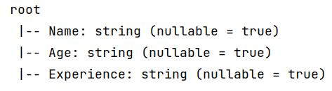
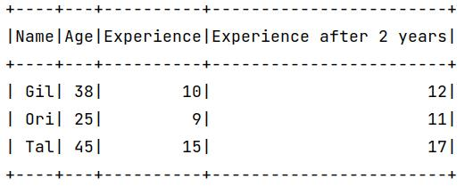

<!--ts-->
   * [PySpark](#pyspark)
      * [What is spark?](#what-is-spark)
      * [Install](#install)
      * [Open spark session](#open-spark-session)
      * [Read data](#read-data)
         * [read csv](#read-csv)
         * [read json](#read-json)
         * [show data](#show-data)
         * [Get Columns](#get-columns)
         * [Type of pyspark datframe](#type-of-pyspark-datframe)
         * [Print data schema (simiilar to my_df.info())](#print-data-schema-simiilar-to-my_dfinfo)
         * [See a specific column or columns](#see-a-specific-column-or-columns)
         * [See datatypes of columns](#see-datatypes-of-columns)
         * [Get simple statistics for each column](#get-simple-statistics-for-each-column)
         * [Adding columns in data frame](#adding-columns-in-data-frame)
         * [Drop columns in data frame](#drop-columns-in-data-frame)
         * [Renaming columns](#renaming-columns)
         * [Drop rows](#drop-rows)
            * [Drop rows with any](#drop-rows-with-any)
            * [Drop with Subset](#drop-with-subset)
            * [Drop with Subset](#drop-with-subset-1)
            * [Replacing NA values](#replacing-na-values)
            * [Filling missing values (imputation)](#filling-missing-values-imputation)
            * [Imputation with pyspark (Exactly like in sklearn)](#imputation-with-pyspark-exactly-like-in-sklearn)
      * [Filter operations](#filter-operations)

<!-- Added by: gil_diy, at: Sun 06 Mar 2022 13:37:52 IST -->

<!--te-->

# PySpark

## What is spark?

## Install 

```bash
pip install pyspark
```

## Open spark session

```python
from pyspark.sql import SparkSession


# Let's open a spark session
spark = SparkSession.builder.appName("Practice").getOrCreate()
```

## Read data
### read csv

```python
df_spark = spark.read.option('header', 'true').csv('my_csv_file.csv', inferSchema=True)
```

### read json

```python
df_spark = spark.read.option('header', 'true').json('my_json_file.json')
```

### show data

```python
df_spark.show()
```


### Get Columns

```python
print(df_spark.columns)
```

### Type of pyspark datframe

```python
type(df_spark)
```
### Print data schema (simiilar to my_df.info())

```python
print(df_spark.printSchema())
```

<p align="center">
  
</p>

### See a specific column or columns

```python
print(df_spark.select(['column-name1','column-name2']).show())
``` 

### See datatypes of columns

```python
print(df_spark.dtypes)
```

### Get simple statistics for each column

Get the basic statistics such as:

* count

* mean

* stddev

* min

* max


```python
print(df_spark.describe().show())
```

### Adding columns in data frame

```python
df_spark.withColumn(colName='Experience after 2 years', col=df_spark['Experience'] + 2).show()
```


<p align="center">
  
</p>

### Drop columns in data frame


```python
print(df_spark.drop('Experience after 2 years').show())
```

### Renaming columns

Let's rename column `Age` into `new age`:

```python
print(df_spark.withColumnRenamed("Age", "new age").show())
```

### Drop rows

#### Drop rows with any

* drop(any=`any`) - If one or more  cells in the row are null, than drop the row (If at least one of the cells in the row is null, than drop the row)

* drop(any=`all`) - If all the cells in the row is null, than drop the row

```python
print(df_spark.na.drop().show())
```

#### Drop with Subset

* drop(any=`any`, thresh=`2`) - If at least `2` cells in the row is null, than drop the row

```python
print(df_spark.na.drop(any=any, thresh=2).show())
```

#### Drop with Subset


Subset means focus on specific columns and check for null values:

```python
print(df_spark.na.drop(any=any, subset = ['column-name1']).show())
```

#### Replacing NA values

#### Filling missing values (imputation)

```python
print(df_spark.na.fill(value = -5555).show())
```


Pay attention in case the column is not numeric and you have used the `inferSchema=True` option while
editing. then the value `-5555` won't be set into a column of type string.

You can focus on specific columns using the `subset` column:

```python
print(df_spark.na.fill(value = -5555, subset = ['Age']).show())
```

#### Imputation with pyspark (Exactly like in sklearn)


Adding few columns with the corresponding cells in the columns are replaced with the `NA` values.

```python
from pyspark.ml.features import Imputer

imputer = Imputer(
	inputCols = ['age', 'Experience', 'Salary'],
	outputcols = [f"{c}_imputed" for c in ['age', 'Experience', 'Salary']
	).setStrategy("mean")
```

* You can set either by setStrategy("mean") or setStrategy("median")

## Filter operations

```python

print(df_spark.filter((df_spark['Salary'] <= 20000) & (df_spark[Salary] >= 150000)).show())
```