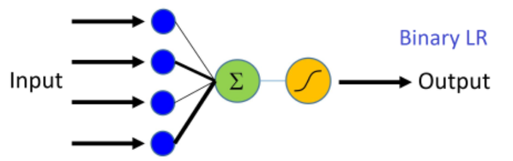
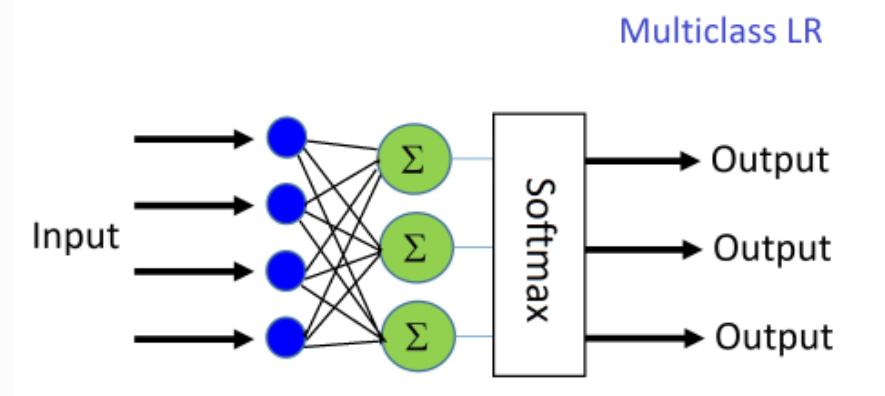

# Logistic regression


* Logistic "regression" is really classification.

* Examples:

1. MNIST [Link](https://en.wikipedia.org/wiki/MNIST_database)

2. Image classification


Importance to notice:
Logistic Regression (LR) is a fundumental machine learning techinique that uses a linear weighted combination of features and generates a **probablity predictions** of different classes.

There are two basic forms of Logistic Regression:

1. **Binary Logistic Regression** - a single output that can predict two classes


<p align="center">
	
</p>


the input features are each scaled by an associated weight and summed together. The sum is passed through a squashing (aka activation) function and generates an output in [0,1]. This output value (which can be thought of as a probability) is then compared with a threshold (such as 0.5) to produce a binary label (0 or 1). This technique supports only classification problems with two output classes, hence the name binary Logitic Regression. In the binary Logitic Regression example shown above, the sigmoid function is used as the squashing function.

2. **Multinomial Logistic Regression** - multiple outputs, eachof which is usedto predict a single class.

<p align="center">
	
</p>

2 or more output nodes are used, one for each output class to be predicted. Each summation node uses its own set of weights to scale the input features and sum them together. Instead of passing the summed output of the weighted input features through a sigmoid squashing function, the output is often passed through a softmax function (which in addition to squashing, like the sigmoid, the softmax normalizes each nodes’ output value using the sum of all unnormalized nodes).

## Project example

### Data description:

1. Is_mobile (0 or 1)
2. N_products_viewed (int >= 0)
3. Visit_duration (real >= 0)
4. Is_returning_visitor (0 or 1)
5. Time_of_delay (0 / 1 / 2 / 3 = 24hours split into 4 categories)
6. User_action:
		* bounce
		* add_to_cart
		* begin_checkout
		* finish_checkout

`User_action` is what we will predict

As we know:
- Logistic class -> Binary classification
- Neural networks class -> multi-class classification


### Steps to take:
So as we know Logistic regression / Neural networks work on numerical vectors, not categories. therefore we will be using **one-hot coding**:

12am-6am | 6am-12pm | 12pm-6pm | 6pm-12am
-------|--------|--------|--------
1 | 0 | 0 | 0
0 | 1 | 0 | 0
0 | 0 | 1 | 0
0 | 0 | 0 | 1


## basic example
Simple example:

```pyhton
from sklearn.linear_model import LogisticRegression

# Make an instance of the Model
logisticRegr = LogisticRegression()


# Model is learning the relationship between digits (x_train) and labels (y_train)
logisticRegr.fit(x_train, y_train)


# Returns a NumPy Array
# Predict for One Observation (image)
logisticRegr.predict(x_test[0].reshape(1,-1))

predictions = logisticRegr.predict(x_test)

# Use score method to get accuracy of model
score = logisticRegr.score(x_test, y_test)
print(score)

```


## Calculating the confusion matrix

A confusion matrix is a table that is often used to describe the performance of a classification model (or “classifier”) on a set of test data for which the true values are known

```python
import matplotlib.pyplot as plt
import seaborn as sns
from sklearn import metrics


plt.figure(figsize=(9,9))
sns.heatmap(cm, annot=True, fmt=".3f", linewidths=.5, square = True, cmap = 'Blues_r');
plt.ylabel('Actual label');
plt.xlabel('Predicted label');
all_sample_title = 'Accuracy Score: {0}'.format(score)
plt.title(all_sample_title, size = 15);
```


[url](https://towardsdatascience.com/logistic-regression-using-python-sklearn-numpy-mnist-handwriting-recognition-matplotlib-a6b31e2b166a)
