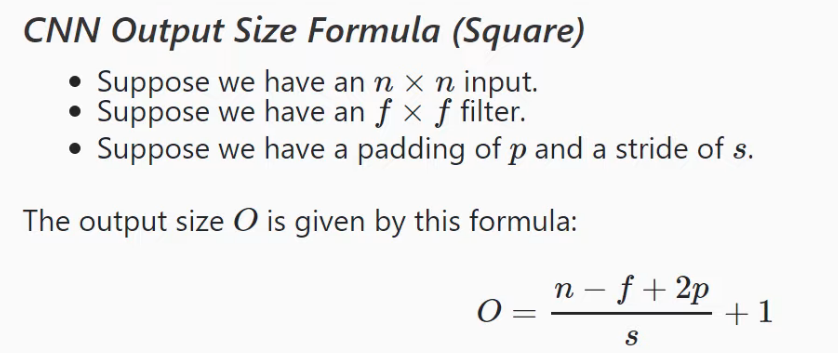
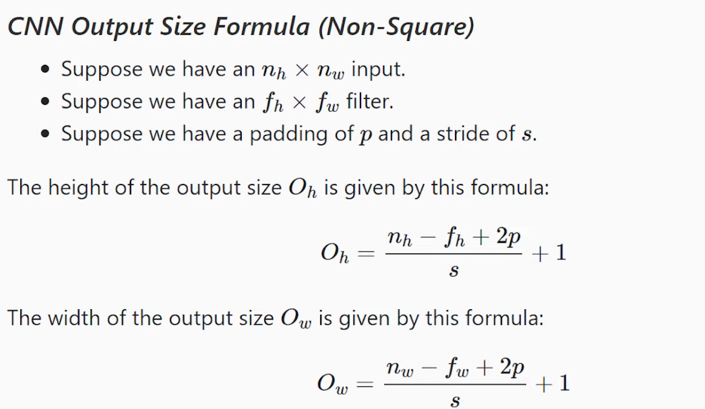

<!--ts-->
   * [Pytorch](#pytorch)
      * [Road map](#road-map)
      * [The training process (Road map)](#the-training-process-road-map)
      * [Install](#install)
      * [torch vision](#torch-vision)
         * [Display images as grid](#display-images-as-grid)
      * [Checking versions](#checking-versions)
      * [Basics - Tensors](#basics---tensors)
         * [Create tensors](#create-tensors)
            * [Create a tensor with all the same values](#create-a-tensor-with-all-the-same-values)
            * [Create a tensor from uniform distribution](#create-a-tensor-from-uniform-distribution)
            * [Create a tensor from a given range of values](#create-a-tensor-from-a-given-range-of-values)
            * [Create a tensor with attributes from another tensor](#create-a-tensor-with-attributes-from-another-tensor)
            * [Create a tensor from numpy array](#create-a-tensor-from-numpy-array)
            * [Create a numpy array from tensor](#create-a-numpy-array-from-tensor)
            * [Create an Identity tensor](#create-an-identity-tensor)
            * [Create all zeros tensor](#create-all-zeros-tensor)
            * [Create all ones tensor](#create-all-ones-tensor)
         * [Get number of elements in a tensor](#get-number-of-elements-in-a-tensor)
         * [Tensor Operation types](#tensor-operation-types)
            * [Reshape operations](#reshape-operations)
               * [rehshape](#rehshape)
               * [squeeze](#squeeze)
               * [flatten](#flatten)
               * [unsqueeze](#unsqueeze)
            * [Element-wise operations](#element-wise-operations)
            * [Reduction operations](#reduction-operations)
            * [Access operations](#access-operations)
         * [Get the data type of a tensor](#get-the-data-type-of-a-tensor)
         * [Reshaping tensor - View tensor differently](#reshaping-tensor---view-tensor-differently)
         * [matrix multiplication](#matrix-multiplication)
         * [Converting tensors into numpy arrays](#converting-tensors-into-numpy-arrays)
         * [Getting the actual value of a tensor of size 1x1](#getting-the-actual-value-of-a-tensor-of-size-1x1)
      * [Exploring Gradients](#exploring-gradients)
         * [Stop calculating the gradient function](#stop-calculating-the-gradient-function)
            * [Method #1: require_grad_(False)](#method-1-require_grad_false)
            * [Method #2: detach](#method-2-detach)
            * [Method #3: with torch.no_grad()](#method-3-with-torchno_grad)
         * [Stop accumalting gradients, reset to zero](#stop-accumalting-gradients-reset-to-zero)
      * [Utilizing GPU device](#utilizing-gpu-device)
         * [tensor on CPU](#tensor-on-cpu)
         * [Defining Cuda device](#defining-cuda-device)
         * [Move the tensor onto CUDA device](#move-the-tensor-onto-cuda-device)
         * [Move the tensors to CPU](#move-the-tensors-to-cpu)
      * [matrix multiplication](#matrix-multiplication-1)
      * [Basic functions in pytorch](#basic-functions-in-pytorch)
      * [Concatenating torches:](#concatenating-torches)
      * [Stacking](#stacking)
      * [Linear Layers in depth](#linear-layers-in-depth)
      * [Custom Dataset](#custom-dataset)
      * [Loading images directory into a dataset](#loading-images-directory-into-a-dataset)
      * [Subsetting Dataset](#subsetting-dataset)
      * [Dataloader](#dataloader)
      * [Dataset &amp;&amp; DataLoader](#dataset--dataloader)
      * [Utilizing the multiple process capabilities of the PyTorch DataLoader class](#utilizing-the-multiple-process-capabilities-of-the-pytorch-dataloader-class)
         * [To better understand your data](#to-better-understand-your-data)
      * [Calculating the Output size of a CNN](#calculating-the-output-size-of-a-cnn)
         * [<strong>CNN Output Size formula (Square)</strong>](#cnn-output-size-formula-square)
         * [<strong>CNN Output Size formula (Non Square)</strong>](#cnn-output-size-formula-non-square)
      * [Batch normalization](#batch-normalization)
      * [Preprocessing](#preprocessing)
      * [Batch size](#batch-size)
      * [Load data](#load-data)
      * [Inspecting the weight and bias and layers](#inspecting-the-weight-and-bias-and-layers)
      * [Loss function](#loss-function)
         * [Negative log likelihood](#negative-log-likelihood)
      * [Optimizers](#optimizers)
         * [Check default values of an optimizer](#check-default-values-of-an-optimizer)
         * [The type of optimizers](#the-type-of-optimizers)
      * [Dropouts](#dropouts)
      * [torchvision](#torchvision)
      * [Transfer learning](#transfer-learning)
         * [Freezing the model](#freezing-the-model)
         * [Replacing the last two layers](#replacing-the-last-two-layers)
      * [Checkpoints](#checkpoints)
         * [Saving the model (Saving checkpoint)](#saving-the-model-saving-checkpoint)
         * [Loading the model (Loading checkpoint)](#loading-the-model-loading-checkpoint)
      * [Useful for plotting](#useful-for-plotting)
      * [Derivatives](#derivatives)
         * [Y(x)](#yx)
      * [Partial derivatives Y(x,z)](#partial-derivatives-yxz)
      * [Generate random numbers](#generate-random-numbers)
      * [Reproduce random numbers](#reproduce-random-numbers)
      * [Tensor to number](#tensor-to-number)
      * [Template for Regression](#template-for-regression)
      * [Integrating TensorBoard with pytorch](#integrating-tensorboard-with-pytorch)
      * [Segmentation with U-net  (Encoder-Decoder)](#segmentation-with-u-net--encoder-decoder)
      * [Pytorch Built-in Datasets](#pytorch-built-in-datasets)
      * [References](#references)

<!-- Added by: gil_diy, at: Thu 09 Dec 2021 00:12:39 IST -->

<!--te-->

# Pytorch

## Road map

* Exploring the datset
* Creating a custom dataset
* Splitting the dataset
* Transforming the data
* Creating the dataloaders
* Building the classification model
* Defining the loss function
* Defining the optimizer
* Training ans evaluation of the model
* Deploying the model
* Model inference on test data


## The training process (Road map)

1. Get batch from the training set
2. Pass batch to network
3. Calculate the loss (difference between the predicted values and the true values)
4. Calculate the gradient of the loss function with the network weights
5. Update the weights using the gradients to reduce the loss
6. Repeat steps 1-5 until one epoch is completed
7. Repeat steps 1-6 for as many epochs required to obtain the desired level of accuaracy.

## Install
Install `pip install torch torchvision`

## torch vision

Torchvision is compiled from 4 parts:

* Datasets (like MNIST and Fashion-MNIST)

* Models

* Transforms

* Utils

### Display images as grid

```python
num_images_per_row = 5
grid = torchvision.utils.make_grid(images, nrow=num_images_per_row, padding=2)
plt.figure(figsize=(10, 3))

# Now for imshow function requirement we arrange the axis
# from grid.shape: [3,62,152] to transfer to shape of: [62,152,3]
plt.imshow(np.transpose(grid, (1, 2, 0)))
plt.show()
```

## Checking versions

```python
print("torch version = ", torch.__version__)
print("torchvision version = ",torchvision.__version__)
print("torch.version.cuda = ", torch.version.cuda)
```

## Basics - Tensors

### Create tensors

####  Create a tensor with all the same values

creating a tensor of 2 rows and 3 columns with all 4's.

```python
x = torch.full((2,3), 4)
```

#### Create a tensor from uniform distribution

with mean 0 and variance 1

```python
torch.randn((2,3))
```
#### Create a tensor from a given range of values

```python
torch.randint(low=10, high = 100, size = (2, 3))
```

#### Create a tensor with attributes from another tensor

```python
tensor1 = torch.tensor([[1,2,3],[4,5,6]])
print("tensor1 type is: ", tensor1.dtype)
print("tensor1 shape is: ", tensor1.shape)

# Now let's create a new tensor tensor2, 
# that matches the atrributes of tensor1
# we will use the torch.*_like format for this:
tensor2 = torch.ones_like(tensor1)

print("tensor2 type is: ", tensor2.dtype)
print("tensor2 shape is: ", tensor2.shape)
```

#### Create a tensor from numpy array

```python
my_array = np.array([1,2,3,4,5])
my_tensor_converted = torch.from_numpy(my_array)
print(my_tensor_converted)
print(my_tensor_converted.type())
```

Shared Data | Copy Data
------------|-----
 torch.as_tensor() | torch.tensor()
 torch.from_numpy() | torch.Tensor()


**Well explained here:** [Link](https://youtu.be/AglLTlms7HU?list=PLZbbT5o_s2xrfNyHZsM6ufI0iZENK9xg)

#### Create a numpy array from tensor

```python
my_torch_tensor.cpu().detach().numpy()
```

#### Create an Identity tensor

```python
torch.eye(2)
```
#### Create all zeros tensor

```python
torch.zeros(2,2)
```

#### Create all ones tensor

```python
torch.ones(2,2)
```

### Get number of elements in a tensor

```python

t= torch.tensor([
  [1,1,1,1],
  [2,2,2,2],
  [3,3,3,3],
  ], dtype = torch.float32)

print("number of elements in the tensor: ", torch.tensor(t.shape).prod())
print("number of elements in the tensor: ", t.numel())
```


### Tensor Operation types
#### Reshape operations

##### rehshape
```python
print(t.reshape(1,12))
print(t.reshape(1,12).shape)

print(t.reshape(12,1))
print(t.reshape(12,1).shape)

print(t.reshape(2,2,3))
print(t.reshape(2,2,3).shape)

print(t.reshape(3,4))
print(t.reshape(3,4).shape)

```

##### squeeze

Removes all axis which have a length of one

```python
print(t.reshape(1,12))
print(t.reshape(1,12).shape)

print(t.reshape(1,12).squeeze())
print(t.reshape(1,12).squeeze().shape)
```

Use case example:

```python
def my_flatten(t):
  t = t.reshape(1,-1)
  t = t.squeeze()
  return t
```

##### flatten 

All the axis are squeeze together to a single axis

```python
t.flatten() # (built-in function)
```

**Other ways to accomplish the same result is:**

```python
t.reshape(1,-1)[0]
```
**another appraoch**

```python
t.reshape(-1)
```
**other appraoch**

```python
t.view(t.numel())
```


In case we would like to flatten a specific axis:


```python

# Let's create 3 grayscale images of the same size:

t1 = torch.tensor([1,1,1,1],
                  [1,1,1,1],
                  [1,1,1,1],)

t2 = torch.tensor([2,2,2,2],
                  [2,2,2,2],
                  [2,2,2,2])

t3 = torch.tensor([3,3,3,3],
                  [3,3,3,3],
                  [3,3,3,3])

# Let's combine those tensors:

t = tensor.stack((t1,t2,t3))

print(t.shape) # Output: torch.size([3,3,4]), the first 3 is for the batch size

# we would like to add axis for the color channel
t = t.reshape(3,1,4,4)

# We want to flat the color channel with the width and height axis
# we will use the flatten function with skipping the first axis (the batch axis)
t.flatten(start_dim = 1) # The output would be: torch.Size([3,16])

# The output is:
# torch.tensor([1,1,1,1,1,1,1,1,1,1,1,1],
#              [2,2,2,2,2,2,2,2,2,2,2,2],
#              [3,3,3,3,3,3,3,3,3,3,3,3])
                  )

```


**Explanation:** [Link](https://youtu.be/mFAIBMbACMA?list=PLZbbT5o_s2xrfNyHZsM6ufI0iZENK9xgG)

##### unsqueeze

```python
print(t.reshape(1,12).squeeze().unsqueeze(dim=0))
print(t.reshape(1,12).squeeze().unsqueeze(dim=0).shape)
```

#### Element-wise operations

Tensors must have the same shape for perform the element-wise operations
except for broadcasting operations:

```python

t1 = torch.tensor([[4,4],[5,5]])

# Under the hood those function perform broadcasting too
t1.add(2) 

t1.sub(2)

t1.mul(2)

t1.div(2)
```

Operation | Exmaple
------------|-----
 equal to zero | t.eq(0)
 greater and equal to zero | t.ge(0)
 less than zero | t.lt(0)
 less and equal zero | t.le(0)

#### Reduction operations

Reduction operation | Exmaple
------------|-----
 sum | t.sum()
 product | t.prod()
 mean | t.mean()
 standard deviation | t.std
 argmax | t.argmax

If we would like to apply the sum function on specific axis:

```python
t = torch.tensor([
  [1,1,1,1],
  [2,2,2,2],
  [3,3,3,3],
  ], dtype = torch.float32)


t.sum(dim = 0) # Output: tensor([6.,6.,6.,6.])
t.sum(dim = 1) # Output: tensor([4.,8.,12.])
```


#### Access operations

### Get the data type of a tensor

```python
print(t1.dtype)
```

Data type | dtype | CPU Tensor | GPU Tensor
----------|-------|------------|-----------
32-bit floating point | torch.float32 | torch.FloatTensor | torch.cuda.FloatTensor
64-bit floating point | torch.float64 | torch.DoubleTensor| torch.cuda.DoubleTensor
16-bit floating point | torch.float16 | torch.HalfTensor | torch.cuda.HalfTensor
8-bit integer (unsigned) | torch.uint8 | torch.ByteTensor | torch.cuda.ByteTensor
8-bit integer (signed) | torch.int8 | torch.CharTensor | torch.cuda.CharTensor
16-bit integer (signed) | torch.int16 | torch.ShortTensor | torch.cuda.ShortTensor
32-bit integer (signed) | torch.int32 | torch.IntTensor | torch.cuda.IntTensor
64-bit integer (signed) | torch.int64 | torch.LongTensor | torch.cuda.LongTensor

### Reshaping tensor - View tensor differently
```python
import torch

my_vec = torch.tensor([56, 15, 13])
print(my_vec[1])

float_vector = torch.FloatTensor([1, 2, 3, 4, 5, 6])
print(float_vector.dtype)
print(float_vector.size())

# View the data differently
print(float_vector.view(6, 1))   # See with 6 rows 1 column
print(float_vector.view(3, 2))   # See with 3 rows 2 column
print(float_vector.view(3, -1))  # See with 3 rows 2 column (was calculated)

one_d = torch.arange(2, 7)

two_d = one_d.view(3,3) # reshaping
print(two_d.dim())


x = torch.arange(0, 18).view(3,3)
print(x.dim())
```

Example what would be the output of the following snippet?
```python
x = torch.arange(18).view(3, 2, 3)
print(x)
```
**Output would be:**
```python
[[[ 0,  1,  2],
 [ 3,  4,  5]],

[[ 6,  7,  8],
 [ 9, 10, 11]],

[[12, 13, 14],
 [15, 16, 17]]]
```

Example what would be the output of the following snippet?
```python
x = torch.arange(18).view(3, 2, 3)
print(x[1,0:2,1])
```

Output will be the number **10** .

### matrix multiplication

```python
weight_matrix.matmul(in_features)
```

### Converting tensors into numpy arrays

```python
numpy_converted = my_tensor_converted.numpy()
print(numpy_converted)
```


```python
t_one = torch.tensor([1,2,3])
t_two = torch.tensor([5,10,15])

print(t_one*t_two)

print(5*t_one)

dot_product = torch.product(t_two, t_two) # 1+5+2*10+3*15
print(dot_product)
```

### Getting the actual value of a tensor of size 1x1

```python
x = torch.rand(5,3)
print(x)

print(x[1,1].item()) # <- retreiving the value from the tensor
```

## Exploring Gradients


```python
import torch

x = torch.randn(3, requires_grad = False) # tensor of size three
print(x)

y = x*2
print(y)
z = y*y*2

z.backward()
print(x.grad) # will print the gradient of each element in x
```


### Stop calculating the gradient function

#### Method #1: require_grad_(False)

```python
import torch

x=torch.randn(3, requires_grad=True)
print(x)
x.require_grad_(False)
print(x)
```

#### Method #2: detach

```python
import torch

x=torch.randn(3, requires_grad=True)
print(x)
y = x.detach() # No more dependency on x
print(y)

```
#### Method #3: with torch.no_grad()

```python
import torch

x=torch.randn(3, requires_grad=True)
print(x)
with torch.no_grad():
	y = x + 2
	print(y)
```


### Stop accumalting gradients, reset to zero

On the backwards path the default behaviour is to accumulate the gradient values from preivouse paths, so to stop this you should reset it to zero.

```python
# Pytorch accumulates the gradient by default 
x.grad.zero_()

```
## Utilizing GPU device

### tensor on CPU
```python
x = torch.tensor([1.5, 2])
print(x)
print(x.device)
```
### Defining Cuda device

```python
# define a cuda/gpu device
if torch.cuda.is_available():
    dev = "cuda:0"
else:
    dev = "cpu"

print("The device is: ", dev)  
device = torch.device(dev)
```

### Move the tensor onto CUDA device

```python
x = x.to(device)
print(x)
print(x.device)
```

### Move the tensors to CPU

```python
x = x.to(device)
print(x)
print(x.device)
```

## matrix multiplication 
```python
mat_a = torch.tensor([0,3,5,5,5,2]).view(2,3)
mat_a = torch.tensor([3,4,3,-2,4,-2]).view(3,2)

torch.matmul(mat_a,mat_b) # Equivalent to mat_a @ mat_b

```

## Basic functions in pytorch

Example | Explanantion
------------|-----
torch.ones((2,3)) | return a tensor that contains ones and has a default **float datatype**.
torch.ones((2,3), dtype=torch.int8) | Tensor consisting of only integer ones.
torch.eye(2) | Returns the identity matrix
torch.zeros((2,3), dtype=torch.int8)  | Tensor consisting of only integer zeros.
torch.full((2,3), 3.141) | Tensor with required fill value along with the shape
torch.empty((2,3)) | Create empty tensor filled with uninitialzed data
torch.rand((2,3))| Tensor from a **uniform distribution** from [0, 1]
torch.randn((2,3))| Tensor with mean 0 and variance 1 from **normal distribution**
torch.randint(low = 10,high = 100,size = (2,3))| Tensor from a given range between 10 to 100
my_tensor.shape | The shape of `my_tensor` tensor (we can say the size of a tensor)
my_tensor.dtype | The datatype of `my_tensor` tensor
torch.ones_like(my_tensor) | Create a new tensor that matches `my_tensor` attributes (shape and datatype) with all ones.
torch.flatten(torch.arange(18).view(2,-1)) | Flattening a torch to 1 dimentional

## Concatenating torches:

Concatenting joins a seqquence of tensors along an **exisiting axis**

```python
tensor1 = torch.arange(6).view(2,-1)
tensor2 = torch.arange(30,36).view(2,-1)

print(torch.cat((tensor1,tensor2),0))
print(torch.cat((tensor1,tensor2),1))
```

`tensor([[0, 1, 2],
        [3, 4, 5]])`

`tensor([[30, 31, 32],
        [33, 34, 35]])`

Output of: **print(torch.cat((tensor1,tensor2),0))**

`tensor([[ 0,  1,  2],
        [ 3,  4,  5],
        [30, 31, 32],
        [33, 34, 35]])`

Output of: **print(torch.cat((tensor1,tensor2),1))**

`tensor([[ 0,  1,  2, 30, 31, 32],
        [ 3,  4,  5, 33, 34, 35]])`


## Stacking 

Stacking joins a sequence of tensors along a **new axis**

[Reference](https://www.youtube.com/watch?v=kF2AlpykJGY)


* Turn A List Of PyTorch Tensors Into One Tensor

```python
stacked_tensor = torch.stack(tensor_list)
```

## Linear Layers in depth

Linear layers use matrix multiplication to transform `in_features` to `out_features`. this matrix multiplication producess the `out_features`

```python
from torch import nn

in_features = torch.tensor([1, 2, 3, 4], dtype=torch.float32)

weight_matrix = torch.tensor([
    [1, 2, 3, 4],
    [2, 3, 4, 5],
    [3, 4, 5, 6]
], dtype=torch.float32)

# In nn.Linear function during training under the hood pytroch creates a weight_matrix of M
# of size 3x4 (according to the in_features and out_features) as you know the numbers in 
# weights matrix defines the linear function during the training python
# updates the weights which changes the linear function

fc = nn.Linear(in_features=4, out_features=3, bias=False)
fc.weight = nn.Parameter(weight_matrix)

# we can call the instance object like this because
# python neural network modules are callable python objects

print(fc(in_features))
```

[Link to youtube](https://youtu.be/rcc86nXKwkw?list=PLZbbT5o_s2xrfNyHZsM6ufI0iZENK9xgG)

## Custom Dataset

```python
class My_data_set(Dataset):
  def __init__(self, csv_file):
    self.data = pd.read_csv(csv_file)


  # Gets an item in the the dataset within a specific index location in the dataset
  def __getitem__(self, index):
    r = self.data.iloc[index]
    label = torch.tensor(r.is_up_day, dtype = torch.long)
    sample = self.normalize(torch.tensor([r.open, r.high, r.low, r.close]))
    return sample, label

  # Returns the length of the dataset
  def __len__(self):
    return len(self.data)

```

## Loading images directory into a dataset

In case the data is **already splitted into two directories**,
you can easily use the `ImageFolder` function:

```python
from torchvision.datasets import ImageFolder

    TRAIN_DIR = "input/jpeg-224x224/train"
    VAL_DIR = "input/jpeg-224x224/val"

    transform_train = T.Compose([
        T.RandomCrop(128, padding_mode="reflect"),
        T.RandomHorizontalFlip(),
        T.ToTensor()
    ])
    train_ds = ImageFolder(
        root=TRAIN_DIR,
        transform=transform_train
    )

    transform_val = T.Compose([
        T.ToTensor()
    ])

    val_ds = ImageFolder(
        root=VAL_DIR,
        transform=transform_val
    )
```

## Subsetting Dataset

```python
from sklearn.model_selection import StratifiedShuffleSplit
from torch.utils.data import Subset

sss = StratifiedShuffleSplit(n_splits=1, test_size=0.2, random_state=42)
for train_index, test_index in sss.split(shape_dataset, shape_dataset.labels):
    print(train_index)
    print("----------")
    print(test_index)

train_dataset = Subset(shape_dataset, train_index)
test_dataset = Subset(shape_dataset, test_index)
```

## Dataloader

The dataloader gives us access to the dataset, and gives us query capabilties,
we can shuffle and have a batch size.

```python
example_dataset_train = My_data_set()


# Wen we create a Dataloader the Default batch size is 1, 
# A higher batch size means that the model has fewer training steps and learns faster,
# whereas a high batch size results in high memory requirements.

# 

train_loader = torch.utils.data.Dataloader(example_dataset_train) 
```
## Dataset && DataLoader
```python
import torch 
import torchvision
import torch.vision,transforms as transforms

train_set = torchvision.datasets.FasshionMNIST(
root = './data/FashionMNIST',
train = True,
download = True,
transform = transforms.Compose([
	transforms.ToTensor()
	])
)

train_loader = torch.utils.data.Dataloader(
train_set, batch_size = 10
)
```

## Utilizing the multiple process capabilities of the PyTorch DataLoader class

The natural question that arises is, how many worker processes should we add? 
There are a lot of factors that can affect the optimal number here, so the best way to find out is to test. 

```python
# To speed up the training process, we will make use of the num_workers optional attribute of the DataLoader class.
# The num_workers attribute tells the data loader instance how many sub-processes to use for data loading. 
# By default, the num_workers value is set to zero, and a value of zero tells the loader to load the data inside the main process. 

train_loader = torch.utils.data.Dataloader(train_set, batch_size = 10, num_workers=5)
```

### To better understand your data
```python
import numpy as np
import matplotlib.pyplot as plt

torch.set_printoptions(linewidth = 120)
len(train_set)
train_set.train_labels

# Gives me the frequency distribution of the labels
# Should be uniform distibution for each class,
# This was you can check if all classes are balanced.
# https://youtu.be/mUueSPmcOBc?t=250 
train_set.train_labels.bincount()

```

```python
sample = next(iter(train_set))
print(len(sample))

image, label = sample # sequence unpacking / Deconstructing the object
print(image.shape)
print(label.shape) # Scalar value

# See a preview of a single image
plt.imgshow(image.sqeeze(), cmap = 'gray')
print('label:',label)
```

[Link](https://youtu.be/mUueSPmcOBc?t=665)

## Calculating the Output size of a CNN

[Link](https://youtu.be/cin4YcGBh3Q?list=PLZbbT5o_s2xrfNyHZsM6ufI0iZENK9xgG)

### **CNN Output Size formula (Square)**


<p align="center"> <!-- style="width:400px;" -->
  
</p>


### **CNN Output Size formula (Non Square)**

<p align="center"> <!-- style="width:400px;" -->
  
</p>


## Batch normalization

* We know a neural network learns the weights in our model become updated over each
epoch during training via the process of stochastic gradient descent or SGD.

* what if during training one of the weights ends up becoming drastically
larger than the other weights well this large weight will then cause
the output from its corresponding neuron to be extremely large and this **imbalance**
will again continue to cascade through the neural network causing **instability**.

* This is where batch normalization comes into play batch norm is applied to
layers that you choose to apply it to within your network when applying batch
norm to a layer the first thing the **batch norm does is normalize the output
from the activation function**.

* Batch norm can be applied after each layer or your can sprinkled it out over few layers which you pick

```python
network2 = nn.Sequential(
      nn.Conv2d(in_channels=1, out_channels=6, kernel_size=5)
    , nn.ReLU()
    , nn.MaxPool2d(kernel_size=2, stride=2)

      # Applying here batch norm according to the number output channels of previous layer
    , nn.BatchNorm2d(6) 

    , nn.Conv2d(in_channels=6, out_channels=12, kernel_size=5)
    , nn.ReLU()
    , nn.MaxPool2d(kernel_size=2, stride=2)
    , nn.Flatten(start_dim=1)  
    , nn.Linear(in_features=12*4*4, out_features=120)
    , nn.ReLU()

    # Applying here batch norm according to the number output feature of previous layer
    , nn.BatchNorm1d(120)
    , nn.Linear(in_features=120, out_features=60)
    , nn.ReLU()
    , nn.Linear(in_features=60, out_features=10)
)
```

[Link](https://deeplizard.com/learn/video/bCQ2cNhUWQ8)


[Explained well](https://www.youtube.com/watch?v=dXB-KQYkzNU)

## Preprocessing
There is a module called `transforms` that helps with a lot of
image preprocessing tasks.

[Reference](https://pytorch.org/docs/stable/torchvision/transforms.html)


we first need to read from the image and convert it
into a tensor using a transforms.ToTensor() transform. We then make the mean and standard deviation of the pixel values 0.5 and 0.5 respectively so that it becomes easier for the model to train;
```python
relevant_transform = transforms.Compose([transforms.ToTensor(),
                                       transforms.Normalize(mean=(0.5,), std=(0.5,))
                                       ])
```


* We combine all of the transformations together with `transform.Compose()`

## Batch size
A higher batch size means that the model has fewer training steps and learns faster, whereas a high batch size results in high memory requirements.

## Load data

## Inspecting the weight and bias and layers

Each layer holds weights and bias,you can easily see the name of the 
tensors which holds weights and biases separately by using:

```python
print(list(model.state_dict().keys()))
```

To inspect the weights tensor of specific layer, you can either write:

```python
print('Getting weights for layer conv1: ')
print(model.state_dict()['conv1.weight'])

print('Getting bias for layer conv1: ')
print(model.state_dict()['conv1.bias'])
```

or 

```python
print('Getting weights for layer conv1: ')
print(model.conv1.weight)

print('Getting bias for layer conv1: ')
print(model.conv1.bias)
```

in case you would like to see the layers and the tensor sizes:

```python

for param_tensor in model.state_dict().keys():
    print(param_tensor, "\t", model.state_dict()[param_tensor].size())
```


## Loss function
Defining the loss function A machine learning model, when being trained, may have some deviation between the predicted output and the actual output, and this difference is called the **error** of the model. The function that lets us calculate this error is called the **loss function**, or error function.
This function provides a metric to evaluate all possible solutions and choose the most optimized model. The loss function has to be able to reduce all attributes of the model down to a single number so that an improvement in that loss function value is representative of a better model.

### Negative log likelihood

we therefore use negative log likelihood when dealing with log softmax, as softmax is not compatible. It is useful in classification between n number of classes. The log would ensure
that we are not dealing with very small values between 0 and 1, and negative values would ensure that a logarithm of probability that is less than 1 is nonzero. Our goal would be to reduce this negative log loss error function. In PyTorch, the loss function is called a
criterion, and so we named our loss function criterion.

<p align="center"> <!-- style="width:400px;" -->

</p>

The negative log-likelihood becomes unhappy at smaller values, where it can reach infinite unhappiness (that’s too sad), and becomes less unhappy at larger values. Because we are summing the loss function to all the correct classes, what’s actually happening is that whenever the network assigns high confidence at the correct class, the unhappiness is low, but when the network assigns low confidence at the correct class, the unhappiness is high.

In PyTorch, the loss function is called a **criterion**, and so we named our loss function criterion.

[Reference](https://ljvmiranda921.github.io/notebook/2017/08/13/softmax-and-the-negative-log-likelihood/)


## Optimizers

Learned that, for us to get a good model, we need to minimize the errors that are calculated. Backpropagation is a method by which the neural networks learn from errors; the errors are used to modify weights in such a way that the errors are minimized. Optimization functions are responsible for modifying weights to reduce the error. Optimization functions calculate the partial derivative of errors
with respect to weights. The derivative shows the direction of a positive slope, and so we need to reverse the direction of the gradient. The optimizer function combines the model parameters and loss function to iteratively modify the model parameters to reduce the model error. Optimizers can be thought of as fiddling with the model weights to get the best possible model based on the difference in prediction from the model and the actual output, and the loss function acts as a guide by indicating when the optimizer is going right or wrong.


The learning rate is a hyperparameter of the optimizer, which controls the amount by which the weights are updated. The learning rate ensures that the weights are not updated by a huge amount so that the algorithm fails to converge at all and the error gets bigger and bigger; however at the same time, the updating of the weight should not be so low that it takes forever to reach the minimum of the cost function/error function.

### Check default values of an optimizer
```python
print(optimizer.defaults)
```

```python

```

### The type of optimizers

* Adadelta
* Adagrad
* SGD

[Reference](https://pytorch.org/docs/stable/optim.html#torch.optim.Optimizer)


## Dropouts

Using a dropout is one of the most popular regularization techniques in neural networks, in which randomly selected neurons are turned off while training—that is, the contribution of neurons is temporarily removed from the forward pass and the backward pass doesn't affect the weights, so that no single neuron or subset of neurons gets all the decisive power of the model; rather, all the neurons are forced to make active contributions to predictions.

It should be remembered that dropouts are to be applied only while training; however, when testing and during the actual prediction, we want all of the neurons to make contributions.

We have to keep in mind that dropouts **must be applied only on
hidden layers** in order to prevent us from losing the input data and missing outputs.

```python
nn.Dropout(p=0.25)
```

## torchvision

###Augmentations

Few exaples of transforms on the data to create more data from existing data:

```python
import torchvision

transforms.Compose([
	transforms.CenterCrop(10),
	transforms.Pad(1, 0),
	transforms.CenterCrop((10, 10))
	transforms.ToTensor(),
	transforms.RandomCrop(10)
	transforms.RandomCrop((10,20))
	transforms.RandomHorizontalFlip(p=0.3)
	transforms.RandomVerticalFlip(p=0.3)
	# Adding brightness, contrast, saturation, and hue variations
	transforms.ColorJitter(0.25, 0.25, 0.25, 0.25)
	transforms.RandomRotation(10)
])
```

## Transfer learning
Transfer learning is an important concept in deep learning that has made it possible for us to use deep learning for various day-to-day tasks. It is a machine learning technique where a model trained for a task is reused to create a new model for a similar task. We take a
model trained on a large dataset and transfer its knowledge to a smaller dataset. For computer vision tasks with a convolutional neural network (CNN), we freeze the early convolutional layers of the network and only train the last few layers.

The early convolutional layers extract general, low-level features that are applicable across images for detecting edges, patterns, and gradients, while the later layers identify specific features within an image, and are specific to the dataset.


### Freezing the model

```python
my_model = models.resnet50(pretrained=True)

# freezes the weights of the model. By freezing the
# weights, the lower convolutional layers are not updated
for param in my_model.parameters():
param.requires_grad = False
```

### Replacing the last two layers

We will apply transfer learning on Resnet50, the actual architecture can be seen easily with:
`print(my_model)`

The last two layers:

```
(avgpool): AdaptiveAvgPool2d(output_size=(1, 1))
(fc): Linear(in_features=2048, out_features=1000, bias=True)
```
we replaced the average pooling layer,
with our AdaptiveConcatPool2d layer and added a fully connected classifier with two output units for the two classes available.

```python
# Performs concatenation between Average 2D pooling and Max 2D pooling
class AdaptiveConcatPool2d(nn.Module):
  def __init__(self, sz=None):
      super().__init__()
      sz = sz or (1, 1)
      self.ap = nn.AdaptiveAvgPool2d(sz)
      self.mp = nn.AdaptiveMaxPool2d(sz)

  def forward(self, x):
      return torch.cat([self.mp(x), self.ap(x)], 1)
```


```python
my_model.avgpool = AdaptiveConcatPool2d()
my_model.fc = nn.Sequential(
nn.Flatten(),
nn.BatchNorm1d(4096),
nn.Dropout(0.5),
nn.Linear(4096, 512),
nn.Relu(),
nn.BatchNorm1d(512),
nn.Dropout(p = 0.5),
nn.Linear(512, 2),
nn.LogSoftMax(dim=1)
)

```

## Checkpoints
### Saving the model (Saving checkpoint)
```python
def save_checkpoint(state, filename="my_checkpoint.pth.tar"):
    print("=> Saving checkpoint")
    torch.save(state, filename)


# Example
model = torchvision.models.vgg16(pretrained=False)
optimizer = optim.Adam(model.parameters())

checkpoint = {"state_dict": model.state_dict(), 
			  "optimizer": optimizer.state_dict()}

# invoking save checkpoint for saving the model parameters:
save_checkpoint(checkpoint)
```
[Reference](https://pytorch.org/docs/stable/generated/torch.save.html#torch.save)

### Loading the model (Loading checkpoint)

```python
def load_checkpoint(checkpoint, model, optimizer):
    print("=> Loading checkpoint")
    model.load_state_dict(checkpoint["state_dict"])
    optimizer.load_state_dict(checkpoint["optimizer"])


load_checkpoint(torch.load("my_checkpoint.pth.tar"), model, optimizer)
```

[Reference](https://pytorch.org/docs/stable/generated/torch.load.html#torch.load)

## Useful for plotting
```python
torch.linespace(start = 0, end = 10, steps = 5) # Useful for plotting
```

## Derivatives
Let's calculate the derivative of the function **y** at x=2.0 , 
We should use the flag: `requires_grad` and set it to **True** .

### Y(x)
```python
# we will add a new key that lets
# PyTorch know that it needs to perform gradient calculations on the following
# tensor:
x = torch.tensor(2.0, requires_grad = True) # important for calculating the derivative 
y = 9*x**4 + 2*x**3 + 3*x**2+6*x+1
y.backward()
x.grad
```

The output we got is the gradient/derivative in x=2.0 ( y'(x=2) ) which is:  **tensor(330.)**

## Partial derivatives Y(x,z)
```python
x = torch.tensor(1.0, requires_grad = True) # important for calculating the derivative 
z = torch.tensor(2.0, requires_grad = True) # important for calculating the derivative 

y = x**2 + z**3
y.backward()
print("derivative_for_two_variables, result x.grad: ", x.grad)
print("derivative_for_two_variables, result z.grad: ", z.grad)
```

## Generate random numbers

Generate 100 random numbers between 0 to 10
```python
torch.randn(100, 1) * 10
```

## Reproduce random numbers

```python
torch.manual_seed(50)
```


## Tensor to number

```python
my_tensor.item()
```

```python
import torch
import torchvision
from torchvision import transforms, datasets
```


## Template for Regression 

```python
import torch.nn as nn

loss_function = nn.BCELoss()
optimizer = torch.optim.SGD(model.parameters(), lr=0.01)

epochs = 1000
losses = []

for epoch_idx in range(epochs):
  y_pred = model.forward(x_data)
  loss = loss_function(y_pred, y_data)
  print("epoch: ", epoch_idx, "loss", loss.item())

  losses.append(loss.item())
  optimizer.zero_grad()
  loss.backward()
  optimizer.step()
  
```

## Integrating TensorBoard with pytorch

[Part1 : TensorBoard with PyTorch - Visualize Deep Learning Metrics](https://youtu.be/pSexXMdruFM)

Hyperparameters are parameters whose values are chosen manually and arbitrarily.
for example: kernel_size, out_channels, out_features. 
It's the job of the network's designer to choose those values.

[Part2 : Hyperparameter Tuning and Experimenting - Training Deep Neural Networks](https://youtu.be/ycxulUVoNbk?list=PLZbbT5o_s2xrfNyHZsM6ufI0iZENK9xgG)


## Segmentation with U-net  (Encoder-Decoder)

the popular model architecture for segmentation tasks is the so-called **encoder-decoder** model.
In the first half of the encoder-decoder model, the input image is downsized to a feature map using a few layers of convolution neural network and pooling layers.
In the second half of the model, the feature map is up-sampled to the input size to produce a binary mask.


## Pytorch Built-in Datasets

[Link](https://pytorch.org/docs/0.4.0/torchvision/datasets.html)

## References

[Logo Detection Using PyTorch](https://medium.com/diving-in-deep/logo-detection-using-pytorch-7897d4898211)

[pytorch projects](https://github.com/bharathgs/Awesome-pytorch-list#cv)

[pytorch getting started in kaggle](https://www.kaggle.com/getting-started/123904)

[PyTorch-Computer-Vision-Cookbook - Github](https://github.com/PacktPublishing/PyTorch-Computer-Vision-Cookbook)

[PyTorch-Artificial-Intelligence-Fundamentals - Github](https://github.com/PacktPublishing/PyTorch-Artificial-Intelligence-Fundamentals)

[Neural Networks for Image
Segmentation based on PyTorch](https://github.com/qubvel/segmentation_models.pytorch#examples)

[GPU in pytorch](https://medium.com/ai%C2%B3-theory-practice-business/use-gpu-in-your-pytorch-code-676a67faed09)