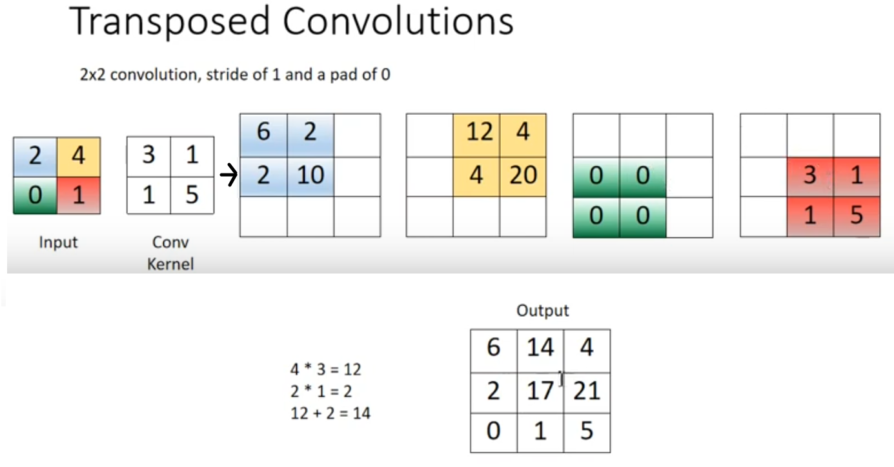
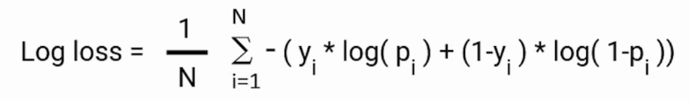
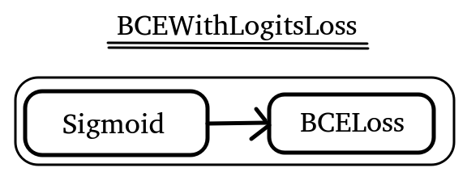
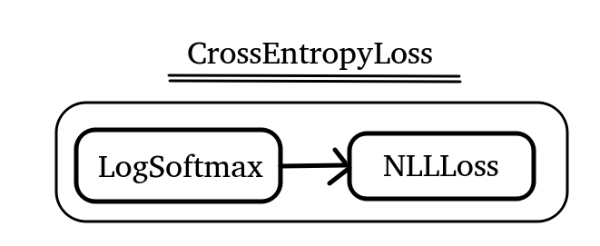
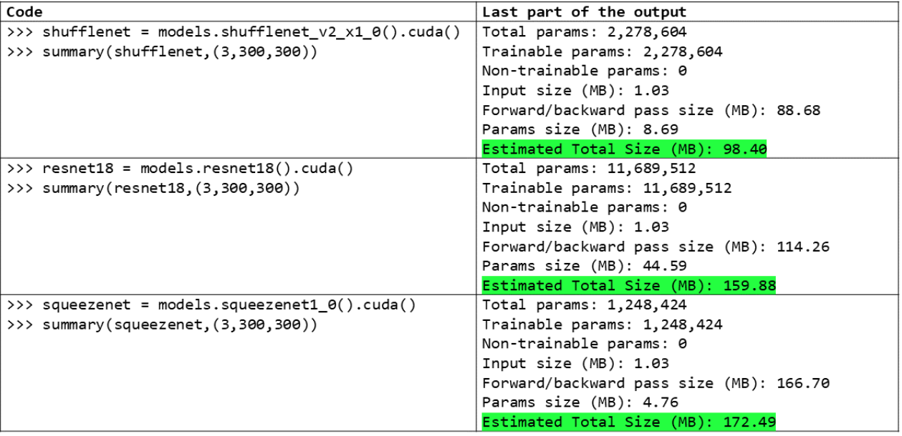

<!--ts-->
* [Pytorch](#pytorch)
   * [Pytorch hierarchy structure](#pytorch-hierarchy-structure)
   * [Road map](#road-map)
   * [The training process (Road map)](#the-training-process-road-map)
   * [Install torch](#install-torch)
   * [Checking versions](#checking-versions)
   * [Set printing tensors nicely](#set-printing-tensors-nicely)
   * [Basics - Tensors](#basics---tensors)
      * [Create tensors](#create-tensors)
         * [Create tensor directly on GPU](#create-tensor-directly-on-gpu)
         * [Create a tensor with attributes from another tensor](#create-a-tensor-with-attributes-from-another-tensor)
         * [Create a tensor from numpy array](#create-a-tensor-from-numpy-array)
         * [Create a numpy array from tensor](#create-a-numpy-array-from-tensor)
         * [Casting a tensor to another type](#casting-a-tensor-to-another-type)
      * [Tensor Operation types](#tensor-operation-types)
         * [Reshape operations](#reshape-operations)
            * [squeeze](#squeeze)
            * [permute](#permute)
            * [flatten](#flatten)
            * [unsqueeze](#unsqueeze)
         * [Padding tensors with constant value](#padding-tensors-with-constant-value)
         * [Padding tensors with constant value in the end](#padding-tensors-with-constant-value-in-the-end)
         * [Padding tensors with constant value in the beginning and in the end](#padding-tensors-with-constant-value-in-the-beginning-and-in-the-end)
         * [Element-wise operations](#element-wise-operations)
         * [Reduction operations](#reduction-operations)
         * [Access operations](#access-operations)
      * [Get the data type of a tensor](#get-the-data-type-of-a-tensor)
      * [Reshaping tensor - View tensor differently](#reshaping-tensor---view-tensor-differently)
      * [matrix multiplication](#matrix-multiplication)
   * [Exploring Gradients](#exploring-gradients)
      * [Stop calculating the gradient function](#stop-calculating-the-gradient-function)
         * [Method #1: require_grad_(False)](#method-1-require_grad_false)
         * [Method #2: detach](#method-2-detach)
         * [Method #3: with torch.no_grad()](#method-3-with-torchno_grad)
      * [Stop accumalting gradients, reset to zero](#stop-accumalting-gradients-reset-to-zero)
   * [Utilizing GPU device](#utilizing-gpu-device)
      * [tensor on CPU](#tensor-on-cpu)
      * [Defining Cuda device](#defining-cuda-device)
      * [Move the tensor onto CUDA device](#move-the-tensor-onto-cuda-device)
      * [Move the tensors to CPU](#move-the-tensors-to-cpu)
      * [Delete model from GPU](#delete-model-from-gpu)
   * [matrix multiplication](#matrix-multiplication-1)
   * [Basic functions in pytorch](#basic-functions-in-pytorch)
   * [torch](#torch)
   * [Sample according to a given custom distribution - torch multinomial](#sample-according-to-a-given-custom-distribution---torch-multinomial)
   * [Clipping tensors](#clipping-tensors)
   * [Converting tensors into numpy arrays](#converting-tensors-into-numpy-arrays)
   * [Concatenating torches:](#concatenating-torches)
   * [Convert a list of tensors into large tensor](#convert-a-list-of-tensors-into-large-tensor)
   * [Stacking](#stacking)
   * [Linear Layers in depth](#linear-layers-in-depth)
   * [Dataset](#dataset)
      * [Create a dataset out of tensors](#create-a-dataset-out-of-tensors)
      * [Create a custom Dataset](#create-a-custom-dataset)
      * [Splitting Dataset](#splitting-dataset)
      * [Subsetting Dataset](#subsetting-dataset)
      * [Create a Dataset by loading images directory into it](#create-a-dataset-by-loading-images-directory-into-it)
   * [Dataloader](#dataloader)
      * [Utilizing the multiple process capabilities of the PyTorch DataLoader class](#utilizing-the-multiple-process-capabilities-of-the-pytorch-dataloader-class)
      * [Samplers - Customise the shuffling in a dataloader](#samplers---customise-the-shuffling-in-a-dataloader)
         * [SequentialSample](#sequentialsample)
         * [RandomSampler](#randomsampler)
         * [Custom Sampler](#custom-sampler)
   * [Preprocessing](#preprocessing)
   * [Transpose Convolution, what is it?](#transpose-convolution-what-is-it)
   * [Dataset &amp;&amp; DataLoader](#dataset--dataloader)
      * [To better understand your data](#to-better-understand-your-data)
   * [Good practice for avoid mistakes](#good-practice-for-avoid-mistakes)
      * [First train on a single batch](#first-train-on-a-single-batch)
   * [Batch normalization](#batch-normalization)
      * [nn.BatchNorm2d](#nnbatchnorm2d)
   * [Inspecting the weight and bias and layers](#inspecting-the-weight-and-bias-and-layers)
   * [Loss function](#loss-function)
      * [Mean Absolute Error (nn.L1Loss)](#mean-absolute-error-nnl1loss)
      * [Mean Absolute Error (nn.L2Loss)](#mean-absolute-error-nnl2loss)
      * [Binary Cross Entropy (nn.BCELoss)](#binary-cross-entropy-nnbceloss)
      * [nn.BCEWithLogitsLoss](#nnbcewithlogitsloss)
      * [Negative Log-Likelihood Loss(nn.NLLLoss)](#negative-log-likelihood-lossnnnllloss)
      * [Cross-Entropy Loss(nn.CrossEntropyLoss)](#cross-entropy-lossnncrossentropyloss)
   * [Optimizers](#optimizers)
      * [Check default values of an optimizer](#check-default-values-of-an-optimizer)
      * [The type of optimizers](#the-type-of-optimizers)
         * [Learning rate scheduler (ReduceLROnPlateau)](#learning-rate-scheduler-reducelronplateau)
      * [What is The weight_decay for optimizer?](#what-is-the-weight_decay-for-optimizer)
   * [Dropouts](#dropouts)
   * [Inference/Evaluation](#inferenceevaluation)
      * [model.eval()](#modeleval)
   * [torchvision](#torchvision)
      * [Install torchvision](#install-torchvision)
      * [Show all pretrained models available in pytorch vision](#show-all-pretrained-models-available-in-pytorch-vision)
      * [Finetuning Torchvision Models](#finetuning-torchvision-models)
      * [torchsummary](#torchsummary)
      * [Display images as grid](#display-images-as-grid)
      * [Augmentations](#augmentations)
   * [Transfer learning](#transfer-learning)
      * [Freezing the model](#freezing-the-model)
      * [Modify the model](#modify-the-model)
   * [Checkpoints](#checkpoints)
      * [Saving the model (Saving checkpoint)](#saving-the-model-saving-checkpoint)
      * [Loading the model (Loading checkpoint)](#loading-the-model-loading-checkpoint)
   * [Derivatives](#derivatives)
      * [Y(x)](#yx)
   * [Partial derivatives Y(x,z)](#partial-derivatives-yxz)
   * [AMP (Automatic Mixed Precision) for shorting the training time](#amp-automatic-mixed-precision-for-shorting-the-training-time)
   * [Use of Neural Networks for Feature Extraction](#use-of-neural-networks-for-feature-extraction)
   * [Template for Regression](#template-for-regression)
   * [Getting deterministic behaviour for debugging](#getting-deterministic-behaviour-for-debugging)
   * [Debug with pycharm in pytorch](#debug-with-pycharm-in-pytorch)
   * [Integrating TensorBoard with pytorch](#integrating-tensorboard-with-pytorch)
   * [Segmentation with U-net  (Encoder-Decoder)](#segmentation-with-u-net--encoder-decoder)
   * [pytorch usefule functions](#pytorch-usefule-functions)
   * [Pytorch hooks](#pytorch-hooks)
   * [Customize optimizer in Pytorch](#customize-optimizer-in-pytorch)
   * [Pytorch Built-in Datasets](#pytorch-built-in-datasets)
   * [References](#references)

<!-- Created by https://github.com/ekalinin/github-markdown-toc -->
<!-- Added by: gil_diy, at: Sun 09 Apr 2023 12:37:01 AM IDT -->

<!--te-->

# Pytorch

## Pytorch hierarchy structure

<p align="center" style="width:600px;"> <!--  -->
  
</p>

The functions appear in `from torch.nn import functional as F` are callable,
for example:

`nn.Softmax` - Not callable 

`F.softmax` - callable 


## Road map

* Exploring the datset
* Creating a custom dataset
* Splitting the dataset
* Transforming the data
* Creating the dataloaders
* Building the classification model
* Defining the loss function
* Defining the optimizer
* Training ans evaluation of the model
* Deploying the model
* Model inference on test data


## The training process (Road map)

1. Get batch from the training set
2. Pass batch to network
3. Calculate the loss (difference between the predicted values and the true values)
4. Calculate the gradient of the loss function with the network weights
5. Update the weights using the gradients to reduce the loss
6. Repeat steps 1-5 until one epoch is completed
7. Repeat steps 1-6 for as many epochs required to obtain the desired level of accuaracy.

## Install torch
Install `pip install torch`

```python
import torch

print(torch.__version__)
```

## Checking versions

```python
print("torch version = ", torch.__version__)
print("torch.version.cuda = ", torch.version.cuda)
```

## Set printing tensors nicely

```python
torch.set_printoptions(linewidth = 120)
torch.set_printoptions(precision=10) # print floating point nicely
```
## Basics - Tensors

### Create tensors

#### Create tensor directly on GPU

```python
my_tensor = torch.ones((100,64,64), device = 'cuda')
```

#### Create a tensor with attributes from another tensor

```python
tensor1 = torch.tensor([[1,2,3],[4,5,6]])
print("tensor1 type is: ", tensor1.dtype)
print("tensor1 shape is: ", tensor1.shape)

# Now let's create a new tensor tensor2, 
# that matches the atrributes of tensor1
# we will use the torch.*_like format for this:
tensor2 = torch.ones_like(tensor1)

print("tensor2 type is: ", tensor2.dtype)
print("tensor2 shape is: ", tensor2.shape)
```

**Pay attention:** Difference between **torch.Tensor** vs **torch.tensor**
```
torch.Tensor([1,2,3]).dtype => torch.float32
torch.tensor([1, 2, 3]).dtype => torch.int64
torch.Tensor([True, False]).dtype => torch.float32
torch.tensor([True, False]).dtype => torch.uint8
```

To avoid all the mess just use `torch.tensor` with the `dtype` field.

for example: `torch.tensor([1,3,4], dtype=torch.float32)`

#### Create a tensor from numpy array

```python
my_array = np.array([1,2,3,4,5])
my_tensor_converted = torch.from_numpy(my_array)
print(my_tensor_converted)
print(my_tensor_converted.type())
```

Shared Data | Copy Data
------------|-----
 torch.as_tensor() | torch.tensor()
 torch.from_numpy() | torch.Tensor()


**Well explained here:** [Link](https://youtu.be/AglLTlms7HU?list=PLZbbT5o_s2xrfNyHZsM6ufI0iZENK9xg)

#### Create a numpy array from tensor

```python
my_torch_tensor.cpu().detach().numpy()
```

#### Casting a tensor to another type

```python
my_tensor = torch.tensor([[1, 3, 2, 5],[-1, 3, 4, 5]])

print(t.mean(dim=0))
# You will get an ERROR
# "input dtype should be either floating point or complex dtypes"

tensor_float = my_tensor.type(torch.float64)
print(tensor_float.mean(dim=0))
```

### Tensor Operation types
#### Reshape operations

##### squeeze

Removes all axis which have a length of one

```python
print(t.reshape(1,12))
print(t.reshape(1,12).shape)

print(t.reshape(1,12).squeeze())
print(t.reshape(1,12).squeeze().shape)
```

Use case example:

```python
def my_flatten(t):
  t = t.reshape(1,-1)
  t = t.squeeze()
  return t
```

##### permute

Arrange the axis in different order,
it is similar to numpy function:

`np.transpose(grid, axes = (1, 2, 0))` 

```python
x = torch.tensor([[1,2,3],[4,5,6]])

print('x = ',x)

print('x.permute(1,0) = ',x.permute(1,0))

```

Since Pytorch modules processing image data expect tensors in format 
**Channels x Height x Width** , 

whereas **PILLOW**, **Matplotlib** and **OpenCV** expect
image arrays in the format of **Height x Width x Channels**

You can either use:
```python
img_tensor.permute(1, 2, 0).numpy() * 255).astype(np.uint8)
```

or 

```python
from torchvision import transforms.functional as F

F.to_pil_image(image_tensor)
```

##### flatten 

All the axis are squeeze together to a single axis

```python
t.flatten() # (built-in function)
```

**Other ways to accomplish the same result is:**

```python
t.reshape(1,-1)[0]
```
**another appraoch**

```python
t.reshape(-1)
```
**other appraoch**

```python
t.view(t.numel())
```


In case we would like to flatten a specific axis:


```python

# Let's create 3 grayscale images of the same size:

t1 = torch.tensor([1,1,1,1],
                  [1,1,1,1],
                  [1,1,1,1],)

t2 = torch.tensor([2,2,2,2],
                  [2,2,2,2],
                  [2,2,2,2])

t3 = torch.tensor([3,3,3,3],
                  [3,3,3,3],
                  [3,3,3,3])

# Let's combine those tensors:

t = tensor.stack((t1,t2,t3))

print(t.shape) # Output: torch.size([3,3,4]), the first 3 is for the batch size

# we would like to add axis for the color channel
t = t.reshape(3,1,4,4)

# We want to flat the color channel with the width and height axis
# we will use the flatten function with skipping the first axis (the batch axis)
t.flatten(start_dim = 1) # The output would be: torch.Size([3,16])

# The output is:
# torch.tensor([1,1,1,1,1,1,1,1,1,1,1,1],
#              [2,2,2,2,2,2,2,2,2,2,2,2],
#              [3,3,3,3,3,3,3,3,3,3,3,3])
                  )

```


**Explanation:** [Link](https://youtu.be/mFAIBMbACMA?list=PLZbbT5o_s2xrfNyHZsM6ufI0iZENK9xgG)

##### unsqueeze

Adds a dummy dimension, usually so it will look like a batch.

```python
print(t.reshape(1,12).squeeze().unsqueeze(dim=0))
print(t.reshape(1,12).squeeze().unsqueeze(dim=0).shape)
```

#### Padding tensors with constant value


#### Padding tensors with constant value in the end 

Here I'm adding 5 zeros in the end of each numpy array

```python
x = torch.ones(2, 3)
print('x: ', x)

padded = nn.ConstantPad1d((0, 5), 0)(x)
print('x: ', x)
print('#######################')
print('Padded output: ', padded)

# x:  tensor([[1., 1., 1.],
#             [1., 1., 1.]])
# ###############################################
# Padded output:  tensor([[1., 1., 1., 0., 0., 0., 0., 0.],
#                  [1., 1., 1., 0., 0., 0., 0., 0.]])
```

#### Padding tensors with constant value in the beginning and in the end 

Here I'm adding 3 zeros in the beginning of each numpy array and 2 zeros in the end

```python
x = torch.ones(2, 3)
print('x: ', x)

padded = nn.ConstantPad1d((3, 2), 0)(x)
print('x: ', x)
print('#######################')
print('Padded output: ', padded)

# x:  tensor([[1., 1., 1.],
#            [1., 1., 1.]])
# ########################################
# Padded output:  tensor([[0., 0., 0., 1., 1., 1., 0., 0.],
#                         [0., 0., 0., 1., 1., 1., 0., 0.]])
```
#### Element-wise operations

Tensors must have the same shape for perform the element-wise operations
except for broadcasting operations:

```python

t1 = torch.tensor([[4,4],[5,5]])

# Under the hood those function perform broadcasting too
t1.add(2) 

t1.sub(2)

t1.mul(2)

t1.div(2)
```

Operation | Exmaple
------------|-----
 equal to zero | t.eq(0)
 greater and equal to zero | t.ge(0)
 less than zero | t.lt(0)
 less and equal zero | t.le(0)

#### Reduction operations

Reduction operation | Exmaple
------------|-----
 sum | t.sum()
 product | t.prod()
 mean | t.mean()
 standard deviation | t.std
 argmax | t.argmax

If we would like to apply the sum function on specific axis:

```python
t = torch.tensor([
  [1,1,1,1],
  [2,2,2,2],
  [3,3,3,3],
  ], dtype = torch.float32)


t.sum(dim = 0) # Output: tensor([6.,6.,6.,6.])
t.sum(dim = 1) # Output: tensor([4.,8.,12.])
```


Another useful example:

```python
from tqdm import tqdm

def get_mean_std(loader):
    # var[X] = E[X**2] - E[X]**2
    channels_sum, channels_sqrd_sum, num_batches = 0, 0, 0

    for data, _ in tqdm(loader):

    	# Opperating mean for each channel separately
        channels_sum += torch.mean(data, dim=[0, 2, 3])
        channels_sqrd_sum += torch.mean(data ** 2, dim=[0, 2, 3])
        num_batches += 1

    mean = channels_sum / num_batches
    std = (channels_sqrd_sum / num_batches - mean ** 2) ** 0.5

    return mean, std

train_loader = torch.utils.data.DataLoader(dataset=train_set, batch_size=64, shuffle=True)
mean, std = get_mean_std(train_loader)

```

#### Access operations

### Get the data type of a tensor

```python
print(t1.dtype)
```

Data type | dtype | CPU Tensor | GPU Tensor
----------|-------|------------|-----------
32-bit floating point | torch.float32 | torch.FloatTensor | torch.cuda.FloatTensor
64-bit floating point | torch.float64 | torch.DoubleTensor| torch.cuda.DoubleTensor
16-bit floating point | torch.float16 | torch.HalfTensor | torch.cuda.HalfTensor
8-bit integer (unsigned) | torch.uint8 | torch.ByteTensor | torch.cuda.ByteTensor
8-bit integer (signed) | torch.int8 | torch.CharTensor | torch.cuda.CharTensor
16-bit integer (signed) | torch.int16 | torch.ShortTensor | torch.cuda.ShortTensor
32-bit integer (signed) | torch.int32 | torch.IntTensor | torch.cuda.IntTensor
64-bit integer (signed) | torch.int64 | torch.LongTensor | torch.cuda.LongTensor

### Reshaping tensor - View tensor differently
```python
import torch

my_vec = torch.tensor([56, 15, 13])
print(my_vec[1])

float_vector = torch.FloatTensor([1, 2, 3, 4, 5, 6])
print(float_vector.dtype)
print(float_vector.size())

# View the data differently
print(float_vector.view(6, 1))   # See with 6 rows 1 column
print(float_vector.view(3, 2))   # See with 3 rows 2 column
print(float_vector.view(3, -1))  # See with 3 rows 2 column (was calculated)

one_d = torch.arange(2, 7)

two_d = one_d.view(3,3) # reshaping
print(two_d.dim())


x = torch.arange(0, 18).view(3,3)
print(x.dim())
```

Example what would be the output of the following snippet?
```python
x = torch.arange(18).view(3, 2, 3)
print(x)
```
**Output would be:**
```python
[[[ 0,  1,  2],
 [ 3,  4,  5]],

[[ 6,  7,  8],
 [ 9, 10, 11]],

[[12, 13, 14],
 [15, 16, 17]]]
```

Example what would be the output of the following snippet?
```python
x = torch.arange(18).view(3, 2, 3)
print(x[1,0:2,1])
```

Output will be the number **10** .

### matrix multiplication

```python
weight_matrix.matmul(in_features)
```


``` python
t_one = torch.tensor([1,2,3])
t_two = torch.tensor([5,10,15])

print(t_one*t_two)

print(5*t_one)

dot_product = torch.product(t_two, t_two) # 1+5+2*10+3*15
print(dot_product)
```

## Exploring Gradients

* The forward pass of your network defines the **computational graph**; 
nodes in the graph are Tensors and edges are functions that produced the output Tensors from input Tensors. 

* Back-propagation through this graph then gives the gradients.

* **autograd** keeps a graph recording of all of the operations that created the data as you execute operations, 
giving you a **directed acyclic graph** whose **leaves are the input tensors** and **roots are the output tensors**. 
By tracing this graph from roots to leaves, you can automatically compute the gradients using the chain rule (back-propagation).

* When the forward pass completed, the **graph is evaluated in the backwards pass to compute the gradients**.

```python
import torch

x = torch.randn(3, requires_grad = False) # tensor of size three
print(x)

y = x*2
print(y)
z = y*y*2

z.backward()
print(x.grad) # will print the gradient of each element in x
```


### Stop calculating the gradient function

When creating a tensor the default property is `requires_grad=False`

#### Method #1: require_grad_(False)

```python
import torch

x = torch.randn(3, requires_grad=True)
print(x)
x.requires_grad = False
print(x)
```

**Output:**

`
tensor([-0.1308,  1.2437, -1.2573], requires_grad=True)
tensor([-0.1308,  1.2437, -1.2573])
`

#### Method #2: detach

```python
import torch

x=torch.randn(3, requires_grad=True)
print(x)
y = x.detach() # No more dependency on x
print(y)
```
**Output:**

`
tensor([-0.7538,  0.7917, -0.8920], requires_grad=True)
tensor([-0.7538,  0.7917, -0.8920])
`


#### Method #3: with torch.no_grad()

```python
import torch

x=torch.randn(3, requires_grad=True)
print(x)
with torch.no_grad():
	y = x + 2
	print(y)
```

**Output:**

`
tensor([ 1.2526, -1.4044, -0.2214], requires_grad=True)
tensor([3.2526, 0.5956, 1.7786])
`

### Stop accumalting gradients, reset to zero

On the backwards path the default behaviour is to accumulate the gradient values from preivouse paths, so to stop this you should reset it to zero.

```python
# Pytorch accumulates the gradient by default 
x.grad.zero_()

```
## Utilizing GPU device

### tensor on CPU
```python
x = torch.tensor([1.5, 2])
print(x)
print(x.device)
```
### Defining Cuda device

```python
# define a cuda/gpu device
if torch.cuda.is_available():
    dev = "cuda:0"
else:
    dev = "cpu"

print("The device is: ", dev)  
device = torch.device(dev)
```

### Move the tensor onto CUDA device

```python
x = x.to(device)
print(x)
print(x.device)
```

### Move the tensors to CPU

```python
predictions.detach().cpu().numpy()
```
### Delete model from GPU

```python
import gc

example_model = ExampleModel().cuda()

del example_model

gc.collect()

# The model will normally stay on the cache until something takes it's place
torch.cuda.empty_cache()

```

## matrix multiplication 
```python
mat_a = torch.tensor([0,3,5,5,5,2]).view(2,3)
mat_a = torch.tensor([3,4,3,-2,4,-2]).view(3,2)

torch.matmul(mat_a,mat_b) # Equivalent to mat_a @ mat_b

```

## Basic functions in pytorch

Example | Explanantion
------------|-----
torch.ones((2,3)) | return a tensor that contains ones and has a default **float datatype**.
torch.ones((2,3), dtype=torch.int8) | Tensor consisting of only integer ones.
torch.eye(2) | Returns the identity matrix
torch.zeros((2,3), dtype=torch.int8)  | Tensor consisting of only integer zeros.
torch.full((2,3), 3.141) | Tensor with required fill value along with the shape
torch.empty((2,3)) | Create empty tensor filled with uninitialzed data
torch.manual_seed(50) | Reproduce random numbers
torch.rand((2,3))| Tensor from a **uniform distribution** from [0, 1]
torch.randn((2,3))| Tensor with mean 0 and variance 1 from **normal distribution**
torch.randint(low = 10,high = 100,size = (2,3))| Tensor from a given range between 10 to 100
my_tensor.shape | The shape of `my_tensor` tensor (we can say the size of a tensor)
my_tensor.dtype | The datatype of `my_tensor` tensor
my_tensor.item() | Tensor to number
my_tensor.numel() | number of elements in a tensor
torch.ones_like(my_tensor) | Create a new tensor that matches `my_tensor` attributes (shape and datatype) with all ones.
torch.flatten(torch.arange(18).view(2,-1)) | Flattening a torch to 1 dimentional

## torch 

```python
g = torch.Generator().manual_seed(123456)
p = torch.rand(3, generator=g)
```

## Sample according to a given custom distribution - torch multinomial

Give me probabilities and I will give you integers which are sampled according to the property distribution.

```
# Deterministic way of creating a torch generator object seeding it with some
# number that we can agree on so that seeds a generator gets gives us an object g
# and then we can pass that g to a function that creates um here random numbers
g = torch.Generator().manual_seed(123456)
p = torch.rand(3, generator=g)
p = p/p.sum()

# For p We will get the vector:
# tensor([0.6064, 0.3033, 0.0903])

torch.multinomial(p, num_samples=10, replacement = True, generator = g)
```

* The more we sample (num_samples) the more these numbers should roughly have the distribution here.


## Clipping tensors

Clamps all elements in input into the range [ min, max ]. Letting min_value and max_value be min and max, respectively:

```pytorch
a = torch.randn(4)
print('a: ', a)
b = torch.clamp(a, min=-0.5, max=0.5)
print('b: ', b)
```


## Converting tensors into numpy arrays

```python
numpy_converted = my_tensor_converted.numpy()
print(numpy_converted)
```


## Concatenating torches:

Concatenting joins a seqquence of tensors along an **exisiting axis**

```python
tensor1 = torch.arange(6).view(2,-1)
tensor2 = torch.arange(30,36).view(2,-1)

print(torch.cat((tensor1,tensor2),0))
print(torch.cat((tensor1,tensor2),1))
```

`tensor([[0, 1, 2],
        [3, 4, 5]])`

`tensor([[30, 31, 32],
        [33, 34, 35]])`

Output of: 
```python
print(torch.cat((tensor1,tensor2),0))
```

`tensor([[ 0,  1,  2],
        [ 3,  4,  5],
        [30, 31, 32],
        [33, 34, 35]])`

Output of: 
```
print(torch.cat((tensor1,tensor2),1))
```

`tensor([[ 0,  1,  2, 30, 31, 32],
        [ 3,  4,  5, 33, 34, 35]])`

## Convert a list of tensors into large tensor

```python
torch.cat(input_ids, dim=0)
```


## Stacking 

Stacking joins a sequence of tensors along a **new axis**

[Reference](https://www.youtube.com/watch?v=kF2AlpykJGY)


* Turn A List Of PyTorch Tensors Into One Tensor

```python
stacked_tensor = torch.stack(tensor_list)
```

```python
dataset = [torch.tensor(s).unsqueeze(1).float() for s in sequences]
n_seq, seq_len, n_features = torch.stack(dataset).shape
```


## Linear Layers in depth

Linear layers use matrix multiplication to transform `in_features` to `out_features`. this matrix multiplication producess the `out_features`

```python
from torch import nn

in_features = torch.tensor([1, 2, 3, 4], dtype=torch.float32)

weight_matrix = torch.tensor([
    [1, 2, 3, 4],
    [2, 3, 4, 5],
    [3, 4, 5, 6]
], dtype=torch.float32)

# In nn.Linear function during training under the hood pytroch creates a weight_matrix of M
# of size 3x4 (according to the in_features and out_features) as you know the numbers in 
# weights matrix defines the linear function during the training python
# updates the weights which changes the linear function

fc = nn.Linear(in_features=4, out_features=3, bias=False)
fc.weight = nn.Parameter(weight_matrix)

# we can call the instance object like this because
# python neural network modules are callable python objects

print(fc(in_features))
```

[Link to youtube](https://youtu.be/rcc86nXKwkw?list=PLZbbT5o_s2xrfNyHZsM6ufI0iZENK9xgG)

## Dataset

PyTorch Datasets are just things that **have a length** and **are indexable** so that len(dataset) will work and dataset[index] will return a tuple of (x,y).

### Create a dataset out of tensors

The `TensorDataset` is a **ready to use class** to represent your data as list of tensors.
it's not an **abstract class** like `Dataset` class which is an abstract class.

If you just want to create a dataset that contains tensors for input features and labels, then use the TensorDataset directly.

Here is a simple example:
```python
dataset = TensorDataset(input_features, labels)
```

Note: In this example  `input_features` and `labels` must match on the length of the **first dimension**.

i.e When building language model with transformer, we pass 3 tensors to the `TensorDataset`:

```python
# Wrapping it all to Dataset of tensors.
train_data = TensorDataset(train_inputs, train_masks, train_labels) 

train_sampler = RandomSampler(train_data)
train_dataloader = DataLoader(train_data, sampler=train_sampler, batch_size=batch_size)
```

Note: In this example  `train_inputs` and `train_masks` and `train_labels` must match on the length of the **first dimension**.

### Create a custom Dataset

The `Dataset` class is an **abstract class** that is used to define new types of (customs) datasets. 

Therefore it's mandatory to implement the "dunder/magic methods" __getitem__ (for dataset[index] functionality) and __len__ (for len(dataset) functionality)

```python
xs = list(range(10))
ys = list(range(10,20))
print('xs values: ', xs)
print('ys values: ', ys)

# Output:
# xs values:  [0, 1, 2, 3, 4, 5, 6, 7, 8, 9]
# ys values:  [10, 11, 12, 13, 14, 15, 16, 17, 18, 19]

dataset = list(zip(xs,ys))
print("First tuple: ", dataset[0]) 

# Output:
# First tuple: (0, 10)
```

Now we will create a custome on `Dataset`

```python
class MyDataset:
    def __init__(self, xs, ys):
        self.xs = xs
        self.ys = ys
    
    def __getitem__(self, i):
        return self.xs[i], self.ys[i]
    
    def __len__(self):
        return len(self.xs)
```

```python
dataset = MyDataset(xs, ys)
print(dataset[2])

# Outputs:
# Returns the tuple (x[2], y[2]) which is: (2, 12)

print('Length of our dataset is:', len(dataset))

# Outputs:
# Length of our dataset is: 10
```


```python
from torch.utils.data import Dataset

class My_data_set(Dataset):
  def __init__(self, csv_file):
    self.data = pd.read_csv(csv_file)


  # Gets an item in the the dataset within a specific index location in the dataset
  def __getitem__(self, index):
    r = self.data.iloc[index]
    label = torch.tensor(r.is_up_day, dtype = torch.long)
    sample = self.normalize(torch.tensor([r.open, r.high, r.low, r.close]))
    return sample, label

  # Returns the length of the dataset
  def __len__(self):
    return len(self.data)

```

### Splitting Dataset

```python
from torch.utils.data import random_split

# Combine the training inputs into a TensorDataset.
dataset = TensorDataset(input_ids, attention_masks, labels)

# Create a 90-10 train-validation split.

# Calculate the number of samples to include in each set.
train_size = int(0.9 * len(dataset))
val_size = len(dataset) - train_size


# Divide the dataset by randomly selecting samples.
train_dataset, val_dataset = random_split(dataset, [train_size, val_size])

print('{:>5,} training samples'.format(train_size))
print('{:>5,} validation samples'.format(val_size))
```

### Subsetting Dataset

```python
from sklearn.model_selection import StratifiedShuffleSplit
from torch.utils.data import Subset

sss = StratifiedShuffleSplit(n_splits=1, test_size=0.2, random_state=42)
for train_index, test_index in sss.split(shape_dataset, shape_dataset.labels):
    print(train_index)
    print("----------")
    print(test_index)

train_dataset = Subset(shape_dataset, train_index)
test_dataset = Subset(shape_dataset, test_index)
```


### Create a Dataset by loading images directory into it

In case the data is **already splitted into two directories**,
you can easily use the `ImageFolder` function:

```python
from torchvision.datasets import ImageFolder

    TRAIN_DIR = "input/jpeg-224x224/train"
    VAL_DIR = "input/jpeg-224x224/val"

    transform_train = T.Compose([
        T.RandomCrop(128, padding_mode="reflect"),
        T.RandomHorizontalFlip(),
        T.ToTensor()
    ])
    train_ds = ImageFolder(
        root=TRAIN_DIR,
        transform=transform_train
    )

    transform_val = T.Compose([
        T.ToTensor()
    ])

    val_ds = ImageFolder(
        root=VAL_DIR,
        transform=transform_val
    )
```

Assuming the data is arranged in the following order:

```
root/dog/xxx.png
root/dog/xxy.png
root/dog/[...]/xxz.png

root/cat/123.png
root/cat/nsdf3.png
root/cat/[...]/asd932_.png
```

Each directory holds images which only belong to the same class,
```python
folder_dataset = datasets.ImageFolder(root="./data/faces/training/")
```

The function `ImageFolder` will generate a list of tuples (image_name, class_id) in `folder_dataset.imgs`

## Dataloader

After setting up a Dataset we can wrap that in a `DataLoader` and we can iterate it but now **they're magically tensors** and we can use DataLoaders handy configurations like shuffling, batching, multi-processing, etc.

The dataloader gives us access to the dataset, and gives us query capabilties,
we can shuffle and have a batch size.

The following code continues the [Dataset example I showed here ](#create-a-custom-dataset).

```python
# Wen we create a Dataloader the Default batch size is 1, 
# A higher batch size means that the model has fewer training steps and learns faster,
# whereas a high batch size results in high memory requirements.

from torch.utils.data import DataLoader

train_loader = DataLoader(dataset)
for x, y in train_loader:
    print(x,y)

# Output:
# tensor([0]) tensor([10])
# tensor([1]) tensor([11])
# tensor([2]) tensor([12])
# tensor([3]) tensor([13])
# tensor([4]) tensor([14])
# tensor([5]) tensor([15])
# tensor([6]) tensor([16])
# tensor([7]) tensor([17])
# tensor([8]) tensor([18])
# tensor([9]) tensor([19])
```

But the real fun is that we can get batches of these by setting batch_size:

```python
for x, y in DataLoader(dataset, batch_size=2):
    print(x,y)

# Output:
# tensor([0, 1]) tensor([10, 11])
# tensor([2, 3]) tensor([12, 13])
# tensor([4, 5]) tensor([14, 15])
# tensor([6, 7]) tensor([16, 17])
# tensor([8, 9]) tensor([18, 19])
```

### Utilizing the multiple process capabilities of the PyTorch DataLoader class

The natural question that arises is, how many worker processes should we add? 
There are a lot of factors that can affect the optimal number here, so the best way to find out is to test. 

```python
# To speed up the training process, we will make use of the num_workers optional attribute of the DataLoader class.
# The num_workers attribute tells the data loader instance how many sub-processes to use for data loading. 
# By default, the num_workers value is set to zero, and a value of zero tells the loader to load the data inside the main process. 

train_loader = torch.utils.data.Dataloader(train_set,
                                 batch_size = 10,
                                 num_workers=5,
                                 shuffle = True)
```

**use num_workers=0 to disable multiprocessing**

### Samplers - Customise the shuffling in a dataloader

Every DataLoader has a sampler internally which is either `SequentialSampler` or `RandomSampler`  or a `Custom Sampler` depending on the value of shuffle, and these are iterated over to get the indices of the Dataset to use.

Let's have a look at the internal .sampler property of a few DataLoaders and see how it changes when the DataLoader configurations change:

#### SequentialSample

When `shuffle=False` (default value) with `batch_size=0`, the sampler returns each index in 0,1,2,3,4... as you iterate.

```python
default_sampler = DataLoader(dataset).sampler

# So when we iterate over the sampler we should get the indices:

for i in default_sampler:
    # iterating over the SequentialSampler
    print(i)


# Output:
# 0
# 1
# 2
# 3
# 4
# 5
# 6
# 7
# 8
# 9

print("The type of the default sample is: ", type(default_sampler))

# Output:
# The type of the default sample is:  torch.utils.data.sampler.SequentialSampler
```
#### RandomSampler

```python
random_sampler = DataLoader(dataset, shuffle=True).sampler
for index in random_sampler:
    print(index)

# Output:
# 3
# 0
# 7
# 5
# 2
# 4
# 6
# 9
# 8
# 1

print("The type of the default sample is: ", type(default_sampler))

# Output:
# The type of the default sample is:  torch.utils.data.sampler.RandomSampler
```

#### Custom Sampler

That's great and all, but what if we want to `customise the order of the data`, other than shuffled or sequential. That's where custom Samplers come in.

[Readhere](https://www.scottcondron.com/jupyter/visualisation/audio/2020/12/02/dataloaders-samplers-collate.html#Custom-Sampler)

## Preprocessing
There is a module called `transforms` that helps with a lot of
image preprocessing tasks.

[Reference](https://pytorch.org/docs/stable/torchvision/transforms.html)


we first need to read from the image and convert it
into a tensor using a transforms.ToTensor() transform. We then make the mean and standard deviation of the pixel values 0.5 and 0.5 respectively so that it becomes easier for the model to train;
```python
relevant_transform = transforms.Compose([transforms.ToTensor(),
                                       transforms.Normalize(mean=(0.5,), std=(0.5,))
                                       ])
```


* We combine all of the transformations together with `transform.Compose()`


## Transpose Convolution, what is it?

Transpose Convolution are upscaler, used for Encoder-Decoder architectures as "Decomprossor"

What is it used for?

* Super resolution (Upscaling the input image to higher resolutions)

* Semantic Segmentation -> (From RGB image input to class based visualisation)

<p align="center"> <!-- style="width:400px;" -->
  
</p>


## Dataset && DataLoader
```python
import torch 
import torchvision
import torch.vision,transforms as transforms

train_set = torchvision.datasets.FasshionMNIST(
  root = './data/FashionMNIST',
  train = True,
  download = True,
  transform = transforms.Compose([transforms.ToTensor()])
)

train_loader = torch.utils.data.Dataloader(
train_set, batch_size = 10
)
```


### To better understand your data
```python
import numpy as np
import matplotlib.pyplot as plt

torch.set_printoptions(linewidth = 120)
len(train_set)
train_set.train_labels

# Gives me the frequency distribution of the labels
# Should be uniform distibution for each class,
# This was you can check if all classes are balanced.
# https://youtu.be/mUueSPmcOBc?t=250 
train_set.train_labels.bincount()

```

```python
sample = next(iter(train_set))
print(len(sample))

image, label = sample # sequence unpacking / Deconstructing the object
print(image.shape)
print(label.shape) # Scalar value

# See a preview of a single image
plt.imgshow(image.sqeeze(), cmap = 'gray')
print('label:',label)
```

[Link](https://youtu.be/mUueSPmcOBc?t=665)


## Good practice for avoid mistakes

### First train on a single batch

```python
# retrieve single batch
data, targets = next(iter(train_loader))

for epoch in range(num_epochs):
	print(f"Epoch [{epoch+1/num_epochs}]")
	data = data.to(device = device)
	targets = targets.to(device = device)
	...
```

## Batch normalization

* We know a neural network learns the weights in our model become updated over each
epoch during training via the process of stochastic gradient descent or SGD.

* what if during training one of the weights ends up becoming drastically
larger than the other weights well this large weight will then cause
the output from its corresponding neuron to be extremely large and this **imbalance**
will again continue to cascade through the neural network causing **instability**.

* This is where batch normalization comes into play batch norm is applied to
layers that you choose to apply it to within your network when applying batch
norm to a layer the first thing the **batch norm does is normalize the output
from the activation function**.

* Batch norm can be applied after each layer or your can sprinkled it out over few layers which you pick

### nn.BatchNorm2d

 Batch Normalization is done over the C dimension, computing statistics on (N, H, W) slices, it’s common terminology to call this **Spatial Batch Normalization**

```python
network2 = nn.Sequential(
      nn.Conv2d(in_channels=1, out_channels=6, kernel_size=5)
    , nn.ReLU()
    , nn.MaxPool2d(kernel_size=2, stride=2)

      # Applying here batch norm according to the number output channels of previous layer
    , nn.BatchNorm2d(6) 

    , nn.Conv2d(in_channels=6, out_channels=12, kernel_size=5)
    , nn.ReLU()
    , nn.MaxPool2d(kernel_size=2, stride=2)
    , nn.Flatten(start_dim=1)  
    , nn.Linear(in_features=12*4*4, out_features=120)
    , nn.ReLU()

    # Applying here batch norm according to the number output feature of previous layer
    , nn.BatchNorm1d(120)
    , nn.Linear(in_features=120, out_features=60)
    , nn.ReLU()
    , nn.Linear(in_features=60, out_features=10)
)
```

[Link](https://deeplizard.com/learn/video/bCQ2cNhUWQ8)


[Explained well](https://www.youtube.com/watch?v=dXB-KQYkzNU)


## Inspecting the weight and bias and layers

Each layer holds weights and bias,you can easily see the name of the 
tensors which holds weights and biases separately by using:

```python
print(list(model.state_dict().keys()))
```

To inspect the weights tensor of specific layer, you can either write:

```python
print('Getting weights for layer conv1: ')
print(model.state_dict()['conv1.weight'])

print('Getting bias for layer conv1: ')
print(model.state_dict()['conv1.bias'])
```

or 

```python
print('Getting weights for layer conv1: ')
print(model.conv1.weight)

print('Getting bias for layer conv1: ')
print(model.conv1.bias)
```

in case you would like to see the layers and the tensor sizes:

```python

for param_tensor in model.state_dict().keys():
    print(param_tensor, "\t", model.state_dict()[param_tensor].size())
```

## Loss function

* Defining the loss function A machine learning model, when being trained, may have some deviation between the predicted output and the actual output, and this difference is called the **error** of the model. 

* The function that lets us calculate this error is called the **loss function**, or error function.
This function provides a metric to evaluate all possible solutions and choose the most optimized model. 

* The loss function has to be able to reduce all attributes of the model down to a single number so that an improvement in that loss function value is representative of a better model.

[Reference](https://analyticsindiamag.com/all-pytorch-loss-function/)

[Reference2](https://neptune.ai/blog/pytorch-loss-functions)

### Mean Absolute Error (nn.L1Loss)

* It is the simplest form of error metric. Mean Absolute Error(MAE) measures the numerical distance
  between predicted and true value by subtracting and then dividing it by the total number of data points.
  MAE is a linear score metric

### Mean Absolute Error (nn.L2Loss)

* Like, Mean absolute error(MAE), Mean squared error(MSE) sums the squared paired differences
  between ground truth and prediction divided by the number of such pairs.

* MSE loss function is generally used when larger errors are well-note

```python
target = torch.randn(3, 4)
mse_loss = nn.MSELoss()
output = mse_loss(input, target)
output.backward()
print('input -: ', input)
print('target -: ', target)
print('output -: ', output)
```

### Binary Cross Entropy (nn.BCELoss) 

* This loss metric creates a criterion that measures the BCE between the target and the output.

* Also with binary cross-entropy loss function, 
we use the Sigmoid activation function which works as a squashing function and hence limits the output to a range between 0 and 1.

[Explanation here](https://youtu.be/gIx974WtVb4)

**Attention**: `N` is the number of samples.

<p align="center"> <!-- style="width:400px;" -->
  
</p>


```python
bce_loss = torch.nn.BCELoss()
sigmoid = torch.nn.Sigmoid() # Ensuring inputs are between 0 and 1

input = torch.tensor(y_pred)
target = torch.tensor(y_true)
output = bce_loss(input, target)
output
```

### nn.BCEWithLogitsLoss

It adds a Sigmoid layer and the BCELoss in one single class. This provides numerical stability for log-sum-exp.
It is more numerically stable  than using a plain Sigmoid followed by a BCELoss.

<p align="center"> <!-- style="width:400px;" -->
  
</p>

```python
target = torch.ones([10, 64], dtype=torch.float32)  # 64 classes, batch size = 10
output = torch.full([10, 64], 1.5)  # A prediction (logit)
pos_weight = torch.ones([64])  # All weights are equal to 1
criterion = torch.nn.BCEWithLogitsLoss(pos_weight=pos_weight)
criterion(output, target)  # -log(sigmoid(1.5))
```

### Negative Log-Likelihood Loss(nn.NLLLoss)


* Product of probablities give us be a very tiny number,
 so for convenience what people work with usually is not the likelihood but they work
with what's called the **log likelihood** so the product of these is the likelihood
to get the log likelihood we just have to take the log of the probability.

* Because what we'd like is a loss function and a loss function has the semantics that low is good
 because we're trying to minimize the loss so we actually need to invert this and that's what gives us
 something called the negative log likelihood negative log likelihood.


* The negative log is a very nice loss function because the lowest it can get is zero and the higher 
it is the worse off the predictions are that you're making

The negative log likelihood loss is mostly used in **classification problems**, 
here Likelihood refers to the chances of some calculated parameters producing some known data.

```python
input = torch.randn(3, 5, requires_grad=True)
# every element in target should have value(0 <= value < C)
target = torch.tensor([1, 0, 4])
m = nn.LogSoftmax(dim=1)
nll_loss = nn.NLLLoss()
output = nll_loss(m(input), target)
output.backward()
print('input -: ', input)
print('target -: ', target)
print('output -: ', output)
```
<p align="center"> <!-- style="width:400px;" -->
  
</p>

we therefore use negative log likelihood when dealing with log softmax, as softmax is not compatible. It is useful in classification between n number of classes. The log would ensure
that we are not dealing with very small values between 0 and 1, and negative values would ensure that a logarithm of probability that is less than 1 is nonzero. Our goal would be to reduce this negative log loss error function. In PyTorch, the loss function is called a
criterion, and so we named our loss function criterion.

<p align="center"> <!-- style="width:400px;" -->

</p>

The negative log-likelihood becomes unhappy at smaller values, where it can reach infinite unhappiness (that’s too sad), and becomes less unhappy at larger values. Because we are summing the loss function to all the correct classes, what’s actually happening is that whenever the network assigns high confidence at the correct class, the unhappiness is low, but when the network assigns low confidence at the correct class, the unhappiness is high.

In PyTorch, the loss function is called a **criterion**, and so we named our loss function criterion.

[Nice Reference](https://ljvmiranda921.github.io/notebook/2017/08/13/softmax-and-the-negative-log-likelihood/)

**Summarization:**

 **GOAL: maximize likelihhod of the data w.r.t model parameters (statostocal modeling)**
* Equivalent to maximizing the log likelihood (because log is monotonic)
* Equivalent to minimizing the negative log likelihood
* Equivalent to minimizing the average negative log likelihood


### Cross-Entropy Loss(nn.CrossEntropyLoss)

Cross-Entropy loss or Categorical Cross-Entropy (CCE) is an addition of the Negative Log-Likelihood and Log Softmax loss function, 
**it is used for tasks where more than two classes have been used** such as the classification of vehicle Car, motorcycle, truck, etc


<p align="center"> <!-- style="width:400px;" -->
  
</p>

```python
input = torch.randn(3, 5, requires_grad=True)
target = torch.empty(3, dtype=torch.long).random_(5)
cross_entropy_loss = nn.CrossEntropyLoss()
output = cross_entropy_loss(input, target)
output.backward()
print('input: ', input)
print('target: ', target)
print('output: ', output)
```

[Cross-Entropy Loss](https://towardsdatascience.com/cross-entropy-loss-function-f38c4ec8643e)


## Optimizers

Learned that, for us to get a good model, we need to minimize the errors that are calculated. Backpropagation is a method by which the neural networks learn from errors; the errors are used to modify weights in such a way that the errors are minimized. Optimization functions are responsible for modifying weights to reduce the error. Optimization functions calculate the partial derivative of errors
with respect to weights. The derivative shows the direction of a positive slope, and so we need to reverse the direction of the gradient. The optimizer function combines the model parameters and loss function to iteratively modify the model parameters to reduce the model error. Optimizers can be thought of as fiddling with the model weights to get the best possible model based on the difference in prediction from the model and the actual output, and the loss function acts as a guide by indicating when the optimizer is going right or wrong.


The learning rate is a hyperparameter of the optimizer, which controls the amount by which the weights are updated. The learning rate ensures that the weights are not updated by a huge amount so that the algorithm fails to converge at all and the error gets bigger and bigger; however at the same time, the updating of the weight should not be so low that it takes forever to reach the minimum of the cost function/error function.


### Check default values of an optimizer
```python
print(optimizer.defaults)
```

```python

```

### The type of optimizers

* Adadelta
* Adagrad
* SGD


#### Learning rate scheduler (ReduceLROnPlateau)

On each epoch our learning rates get updated, see below:
```python
criterion = nn.CrossEntropyLoss()
optimizer = optim.Adam(model.parameters(),
                       lr=learning_rate)

scheduler = optim.lr_scheduler.ReduceLROnPlateau(optimizer,
                                                 patience=5,
                                                 verbose=True)

for epoch in range(1, num_epochs):

    # calculating loss per batch
    losses = []
    for idx_batch, (data, targets) in enumerate(train_loader):
        data = data.reshape(data.shape[0], -1)
        data = data.to(device)
        targets = targets.to(device)

        # forward
        scores = model(data)
        loss = criterion(scores, targets)
        losses.append(loss.item())

        # backward
        loss.backward()

        # Gradient descent or Adam step
        optimizer.step()
        optimizer.zero_grad()

    mean_loss = sum(losses) / len(losses)

    # After each epoch do scheduler.step
    # Note in this scheduler we need to send in loss for that epoch!
    scheduler.step(mean_loss)
    print(f'Cost of epoch at {epoch} is {mean_loss}')
```

[Reference](https://pytorch.org/docs/stable/optim.html#torch.optim.Optimizer)


### What is The weight_decay for optimizer?


## Dropouts

Using a dropout is one of the most popular regularization techniques in neural networks, in which randomly selected neurons are turned off while training—that is, the contribution of neurons is temporarily removed from the forward pass and the backward pass doesn't affect the weights, so that no single neuron or subset of neurons gets all the decisive power of the model; rather, all the neurons are forced to make active contributions to predictions.

It should be remembered that dropouts are to be applied only while training; however, when testing and during the actual prediction, we want all of the neurons to make contributions.

We have to keep in mind that dropouts **must be applied only on
hidden layers** in order to prevent us from losing the input data and missing outputs.

```python
nn.Dropout(p=0.25)
```

## Inference/Evaluation


### model.eval()

**model.eval()** is a kind of switch for some specific layers/parts of the model
that behave differently during training and inference (evaluating) time.
For example:

* Dropouts Layers

* BatchNorm Layers

You need to **turn off them** during model evaluation,
and **.eval()** will do it for you. it means during evaluation the dropouts and the BatchNorm will get removed.

In addition, the **common practice for evaluating/validation** is using
 **torch.no_grad()** in pair with **model.eval()** to turn off gradients computation:

```python
# Now let's set the model in "evaluation (inference) mode"
model.eval()

for x, y, files in tqdm(loader):
    x = x.to(config.DEVICE)

    with torch.no_grad():
        pred = model(x).argmax(1)
        preds.append(pred.cpu().numpy())
        filenames += files

df = pd.DataFrame({"image": filenames,
                   "level": np.concatenate(preds, axis=0)})

df.to_csv(output_csv, index=False)

# Now we will turn off "evaluation mode" by running model.train()
# toggel it back on for future training.
model.train()
```

## torchvision


Torchvision is compiled from 4 parts:

* Datasets (like MNIST and Fashion-MNIST)

* Models (List of well known models: [Link](https://pytorch.org/vision/stable/models.html))

* Transforms

* Utils

### Install torchvision

Install `pip install torchvision`

```python
import torchvision
print("torchvision version = ",torchvision.__version__)
```
### Show all pretrained models available in pytorch vision

```python
from torchvision import models

print("List of available models: ", dir(models))
```

### Finetuning Torchvision Models

Model | Finetune | Prerequisite
------------|----|-------------
 inception_v3 | `model.AuxLogits.fc = nn.Linear(768, num_classes)`|  requires the input size to be (299,299)
              | `model.fc = nn.Linear(2048, num_classes)`         | 
 Resnet | `model.fc = nn.Linear(512, num_classes)`|  requires the input size to be (224,224)
 Alexnet | `model.classifier[6] = nn.Linear(4096,num_classes)` |  requires the input size to be (224,224)
 Densenet | `model.classifier = nn.Linear(1024, num_classes)` | requires the input size to be (224,224)
 Squeezenet |`model.classifier[1] = nn.Conv2d(512, num_classes, kernel_size=(1,1), stride=(1,1))`|  requires the input size to be (224,224)

[Reference](https://pytorch.org/tutorials/beginner/finetuning_torchvision_models_tutorial.html)

### torchsummary

Here are three examples of using torchsummary to calculate total parameters and memory:

<p align="center">
  
</p>

### Display images as grid

```python
batch = next(iter(data_loader))
images, labels = batch
num_images_per_row = 5
grid = torchvision.utils.make_grid(images, nrow=num_images_per_row, padding=2)
plt.figure(figsize=(10, 3))

# Now for imshow function requirement we arrange the axis
# from grid.shape: [3,62,152] to transfer to shape of: [62,152,3]
plt.imshow(np.transpose(grid, (1, 2, 0)))
plt.show()
```


### Augmentations

Few exaples of transforms on the data to create more data from existing data:

```python
import torchvision

transforms.Compose([
	transforms.CenterCrop(10),
	transforms.Pad(1, 0),
	transforms.CenterCrop((10, 10))
	transforms.ToTensor(),
	transforms.RandomCrop(10)
	transforms.RandomCrop((10,20))
	transforms.RandomHorizontalFlip(p=0.3)
	transforms.RandomVerticalFlip(p=0.3)
	# Adding brightness, contrast, saturation, and hue variations
	transforms.ColorJitter(0.25, 0.25, 0.25, 0.25)
	transforms.RandomRotation(10)
])
```

## Transfer learning
Transfer learning is an important concept in deep learning that has made it possible for us to use deep learning for various day-to-day tasks. 
It is a machine learning technique where a model trained for a task is reused to create a new model for a similar task. 
We take a model trained on a large dataset and transfer its knowledge to a smaller dataset. 
For computer vision tasks with a convolutional neural network (CNN), 
we freeze the early convolutional layers of the network and **only train the last few layers**.

The early convolutional layers extract general, low-level features that are applicable across images for detecting edges,
patterns, and gradients, while the **later layers identify specific features within an image, and are specific to the dataset**.


### Freezing the model

```python
my_model = models.resnet50(pretrained=True)

# freezes the weights of the model. By freezing the
# weights, the lower convolutional layers are not updated
for param in my_model.parameters():
  param.requires_grad = False
```

* Notice that the only difference between loading a randomly-initialized model and a pretrained model is whether you set `pretrained=True` or not. 

### Modify the model

Make a specific exited **layer transparent**.
creating a simple identity class:

```python
class Identity(nn.Module):
    def __init__(self):
        super(Identity, self).__init__()

    def forward(self, x):
        return x

model = models.vgg11(pretrained=True)

print("Before modification of the model:")
print(model)

model.avgpool = Identity()
model.classifier = nn.Linear(in_features=4096, out_features=10)

print("After modification of the model")
print(model)
```

[Reference](https://youtu.be/qaDe0qQZ5AQ?list=PLhhyoLH6IjfxeoooqP9rhU3HJIAVAJ3Vz)


## Checkpoints
### Saving the model (Saving checkpoint)
```python
def save_checkpoint(state, filename="my_checkpoint.pth.tar"):
    print("=> Saving checkpoint")
    torch.save(state, filename)


# Example
model = torchvision.models.vgg16(pretrained=False)
optimizer = optim.Adam(model.parameters())

checkpoint = {"state_dict": model.state_dict(), 
			  "optimizer": optimizer.state_dict()}

# invoking save checkpoint for saving the model parameters:
save_checkpoint(checkpoint)
```
[Reference](https://pytorch.org/docs/stable/generated/torch.save.html#torch.save)

### Loading the model (Loading checkpoint)

```python
def load_checkpoint(checkpoint, model, optimizer):
    print("=> Loading checkpoint")
    model.load_state_dict(checkpoint["state_dict"])
    optimizer.load_state_dict(checkpoint["optimizer"])


load_checkpoint(torch.load("my_checkpoint.pth.tar"), model, optimizer)
```

[Reference](https://pytorch.org/docs/stable/generated/torch.load.html#torch.load)


## Derivatives
Let's calculate the derivative of the function **y** at x=2.0 , 
We should use the flag: `requires_grad` and set it to **True** .

### Y(x)
```python
# we will add a new key that lets
# PyTorch know that it needs to perform gradient calculations on the following
# tensor:
x = torch.tensor(2.0, requires_grad = True) # important for calculating the derivative 
y = 9*x**4 + 2*x**3 + 3*x**2+6*x+1
y.backward()
x.grad
```

The output we got is the gradient/derivative in x=2.0 ( y'(x=2) ) which is:  **tensor(330.)**

## Partial derivatives Y(x,z)
```python
x = torch.tensor(1.0, requires_grad = True) # important for calculating the derivative 
z = torch.tensor(2.0, requires_grad = True) # important for calculating the derivative 

y = x**2 + z**3
y.backward()
print("derivative_for_two_variables, result x.grad: ", x.grad)
print("derivative_for_two_variables, result z.grad: ", z.grad)
```


## AMP (Automatic Mixed Precision) for shorting the training time

```python
from torch.cuda import amp
# Creates model and optimizer in default precision
model = Net().cuda()
optimizer = optim.SGD(model.parameters(), ...)

# Creates a GradScaler once at the beginning of training.
scaler = amp.GradScaler()

for epoch in epochs:
    for input, target in data:
    	# important to zero it otherwise it will accumulate 
    	# all the grads is current batch
        optimizer.zero_grad() 

        # Runs the forward pass with autocasting.
        with amp.autocast():
            output = model(input)
            loss = loss_fn(output, target)

        # Scales loss.  Calls backward() on scaled loss to create scaled gradients.
        # Backward passes under autocast are not recommended.
        # Backward ops run in the same dtype autocast chose for corresponding forward ops.
        scaler.scale(loss).backward()

        # scaler.step() first unscales the gradients of the optimizer's assigned params.
        # If these gradients do not contain infs or NaNs, optimizer.step() is then called,
        # otherwise, optimizer.step() is skipped.
        scaler.step(optimizer)

        # Updates the scale for next iteration.
        scaler.update()
```

[pytorch documentation](https://pytorch.org/docs/stable/notes/amp_examples.html#typical-mixed-precision-training)

[Link1](https://www.youtube.com/watch?v=X7iOkhGePXg)

[Link2](https://www.youtube.com/watch?v=b5dAmcBKxHg)

## Use of Neural Networks for Feature Extraction

[Link](https://arxiv.org/abs/1805.02294)


## Template for Regression 

```python
import torch.nn as nn

loss_function = nn.BCELoss()
optimizer = torch.optim.SGD(model.parameters(), lr=0.01)

epochs = 1000
losses = []

for epoch_idx in range(epochs):
  y_pred = model.forward(x_data)
  loss = loss_function(y_pred, y_data)
  print("epoch: ", epoch_idx, "loss", loss.item())

  losses.append(loss.item())
  optimizer.zero_grad()
  loss.backward()
  optimizer.step()
  
```

## Getting deterministic behaviour for debugging

For reproducible results, we will get a consistent behaviour,
But for trainig you should remove it:

```python
seed = 0
torch.backends.cudnn.deterministic = True
torch.backends.cudnn.benchmark = False
torch.manual_seed(seed)

# In case you're using cuda:
torch.cuda.manual_seed_all(seed)
```

## Debug with pycharm in pytorch

* set `num_workers` to 0 during creation of the **DataLoader object**. 

from the documentation `use num_workers=0 to disable multiprocessing`

worked for me well!!!


## Integrating TensorBoard with pytorch

[Part1 : TensorBoard with PyTorch - Visualize Deep Learning Metrics](https://youtu.be/pSexXMdruFM)

Hyperparameters are parameters whose values are chosen manually and arbitrarily.
for example: kernel_size, out_channels, out_features. 
It's the job of the network's designer to choose those values.

[Part2 : Hyperparameter Tuning and Experimenting - Training Deep Neural Networks](https://youtu.be/ycxulUVoNbk?list=PLZbbT5o_s2xrfNyHZsM6ufI0iZENK9xgG)


[Pytorch TensorBoard Tutorial](https://youtu.be/RLqsxWaQdHE)


## Segmentation with U-net  (Encoder-Decoder)

the popular model architecture for segmentation tasks is the so-called **encoder-decoder** model.
In the first half of the encoder-decoder model, the input image is downsized to a feature map using a few layers of convolution neural network and pooling layers.
In the second half of the model, the feature map is up-sampled to the input size to produce a binary mask.


## pytorch usefule functions

Explanation | Fucntion
------------|-----
 PairwiseDistance | `nn.PairwiseDistance()`
 TripletMarginWithDistanceLoss | `nn.TripletMarginWithDistanceLoss`


## Pytorch hooks

There are two type of hooks:

* Hooks for tensors
* Hooks for modules

[Link](https://youtu.be/syLFCVYua6Q)


## Customize optimizer in Pytorch

[pytorch code repo for optimizer](https://github.com/pytorch/pytorch/blob/master/torch/optim/optimizer.py)


## Pytorch Built-in Datasets

[Link](https://pytorch.org/docs/0.4.0/torchvision/datasets.html)


## References

[collection of simple PyTorch implementations of neural networks and related algorithms](https://nn.labml.ai/)

[Logo Detection Using PyTorch](https://medium.com/diving-in-deep/logo-detection-using-pytorch-7897d4898211)

[pytorch projects](https://github.com/bharathgs/Awesome-pytorch-list#cv)

[pytorch getting started in kaggle](https://www.kaggle.com/getting-started/123904)

[PyTorch-Computer-Vision-Cookbook - Github](https://github.com/PacktPublishing/PyTorch-Computer-Vision-Cookbook)

[PyTorch-Artificial-Intelligence-Fundamentals - Github](https://github.com/PacktPublishing/PyTorch-Artificial-Intelligence-Fundamentals)

[Neural Networks for Image
Segmentation based on PyTorch](https://github.com/qubvel/segmentation_models.pytorch#examples)

[GPU in pytorch](https://medium.com/ai%C2%B3-theory-practice-business/use-gpu-in-your-pytorch-code-676a67faed09)

[The Incredible PyTorch: a curated list of tutorials, papers, projects, communities and more relating to PyTorch.](https://www.ritchieng.com/the-incredible-pytorch/)