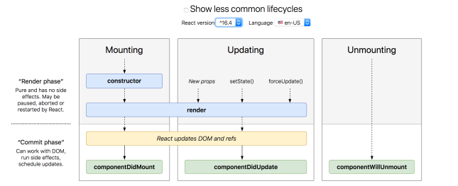

<!--ts-->
   * [React](#react)
      * [Description](#description)
      * [basic requirements:](#basic-requirements)
      * [How to start my app super fast?](#how-to-start-my-app-super-fast)
         * [create react app](#create-react-app)
      * [Run the server:](#run-the-server)
      * [Debug in vscode with Chrome](#debug-in-vscode-with-chrome)
      * [Props/render](#propsrender)
      * [What is the difference building components as functions vs class bases components?](#what-is-the-difference-building-components-as-functions-vs-class-bases-components)
      * [Orginizing the project:](#orginizing-the-project)
         * [Importing and exporting components to seperate files:](#importing-and-exporting-components-to-seperate-files)
            * [Default imports](#default-imports)
         * [export by name](#export-by-name)
      * [React fragment](#react-fragment)
         * [shorthand for fragments:](#shorthand-for-fragments)
      * [Properties aka. Props](#properties-aka-props)
         * [Default props](#default-props)
      * [Styling in React](#styling-in-react)
      * [React states](#react-states)
         * [Initial state](#initial-state)
         * [Change/set a state](#changeset-a-state)
         * [Update state based of exisiting state](#update-state-based-of-exisiting-state)
            * [Change a state after time passed](#change-a-state-after-time-passed)
         * [mutating State with object updates](#mutating-state-with-object-updates)
         * [Rules of thumbs when designing states](#rules-of-thumbs-when-designing-states)
      * [React Events](#react-events)
         * [Mouse events](#mouse-events)
         * [Form events](#form-events)
         * [Keyboard events](#keyboard-events)
      * [Method binding](#method-binding)
      * [Passing functions to child components](#passing-functions-to-child-components)
      * [Keys](#keys)
      * [Lifecycle methods](#lifecycle-methods)
         * [componentDidMount](#componentdidmount)
         * [Loading data by making AJAX requests](#loading-data-by-making-ajax-requests)
         * [Loading data asynchronously](#loading-data-asynchronously)
         * [componentDidUpdate](#componentdidupdate)
         * [componentWillUnmount](#componentwillunmount)
      * [Hooks](#hooks)
         * [UseEffect](#useeffect)
      * [React snippets](#react-snippets)
      * [Configuring proxy in React-app](#configuring-proxy-in-react-app)
      * [Conventions - Rule of thumbs](#conventions---rule-of-thumbs)
      * [Webpack](#webpack)

<!-- Added by: gil_diy, at: 2019-10-04T02:41+03:00 -->

<!--te-->


# React
<p align="center">
		
</p>

## Description
At the heart of all react applications there are the components. a component is a piece of the user interface. When we build an application with react we build independed isolated reusable components and then compose and creat complex interfaces.
Every react application has a root component (App), this component contains other child components (tree of components).

Every component is a javascript class which has state and a render method. The state is the data we would like to display when the component is rendered.
The output of this render method is a react element.
A react element maps to DOM Element.
React keeps a lightweigh represntation of the DOM in memory which refer to the Virtual DOM.

Unlike the Real DOM this Virtual DOM is cheap to create. We simply change the state of our componets and React will automatically will change the Real DOM (React = react to state changes)

React is a library it only takes care of rendering the view. it all makes sure the view is synced with the state.


The JSX code will go through Babel, and Babel will convert this JSX code syntax to javascript code so browser can understand. (You can see for yourself here how Babel compiles from JSX to standard javascript code: [babeljs in action](https://babeljs.io/repl))

## basic requirements:
`node -v` (i'm using version 10.13.0)

`npm -v` (i'm using version 6.8.0)

## How to start my app super fast?

### create react app
```bash
npm init react-app my-demo-project
```
or
```bash
npx create-react-app my-demo-project
```

**Note: ** Create react app is built on top of "Webpack"


Simply enter the directory which was created and enter vscode:
```bash
cd my-demo-project && code .
```

## Run the server:
```bash
npm start
```

check it is up and running with:

`localhost:3000`


## Debug in vscode with Chrome

[short video](https://www.youtube.com/watch?v=PJeNReqyH88) - Worked well!

## Props/render

[Create React.js Components (Youtube)](https://www.youtube.com/watch?v=bd3UGjPwl0w&index=3&list=PLN3n1USn4xlntqksY83W3997mmQPrUmqM)

[Passing Data to Components (Youtube) ](https://www.youtube.com/watch?v=ICmMVfKjEuo&list=PLN3n1USn4xlntqksY83W3997mmQPrUmqM&index=4)

* I have wrote a seperate component called `MySuperComponent` which is invoked as a single tag.

* Moreover I have wrote **MyBody** in 3 equivalent ways:

**Way #1:**
```javascript
const MyBody2 = () => {
  return <p className="App-intro">MyBody!!!! Hoooray (version 2)</p>;
};
```

**Way #2:**
```javascript
function MyBody3() {
  return <p className="App-intro">MyBody!!!! Hoooray (version 3)</p>;
}
```

**Way #3 (The shortest):**
```javascript
const MyBody1 = () => (
  <p className="App-intro">MyBody!!!! Hoooray (version 1)</p>
);
```


Here,
the whole code together is written below:

```javascript
class MySuperComponent extends Component {
  render() {
    return (
      <div>
        Hello there {this.props.name} your age is: {this.props.age}, pineapple
        cost: {this.props.fruits.Pineapple} of {this.props.myArray[1]} Dollars
      </div>
    );
  }
}

const MyBody1 = () => (
  <p className="App-intro">MyBody!!!! Hoooray (version 1)</p>
);

const MyBody2 = () => {
  return <p className="App-intro">MyBody!!!! Hoooray (version 2)</p>;
};

function MyBody3() {
  return <p className="App-intro">MyBody!!!! Hoooray (version 3)</p>;
}

class App extends Component {
  render() {
    return (
      <div className="App">
        <header className="App-header">
          
          <p>
            Edit <code>src/App.js</code> and save to reload.
          </p>
          <a
            className="App-link"
            href="https://reactjs.org"
            target="_blank"
            rel="noopener noreferrer"
          >
            Learn React
          </a>
        </header>
        <MySuperComponent
          name={"Gil"}
          age={35}
          fruits={{ Apple: 35, Pineapple: "70kg" }}
          myArray={[1, 3, 4, 8, 9]}
        />
        <MyBody1 />
        <MyBody2 />
        <MyBody3 />
      </div>
    );
  }
}
```


[passing functions to Components](https://youtu.be/ICmMVfKjEuo?list=PLN3n1USn4xlntqksY83W3997mmQPrUmqM&t=294)
## What is the difference building components as functions vs class bases components?

In functional component I can't refer to **this.props**, instead your props is passed as **your first argument to the function** :

```javascript
const Body = (props) => <p className="App-intro">{props.text}</p>
```
see function: `MyBody4`


* In function you just return content
* In a class you have an explicit render method, and your render return the content.


## Orginizing the project:
### Importing and exporting components to seperate files:
```bash
mkdir ./src/components
```
Each file holds a single component resides in the components directory.

#### Default imports

The following code will be moved to a sepearte file called `Body.js`:
```javascript
class Body extends React.Component {
  render() {
    return (
      <div>
        Hello there {this.props.name} your age is: {this.props.age}, pineapple
        cost: {this.props.fruits.Pineapple} of {this.props.myArray[1]} Dollars,
        example for invoking a function res: {this.props.myFunc(10, 18)}
      </div>
    );
  }
}
```
Since i'm using jsx i'll be importing react:
`import React from "react";`

and will retrieve the Component from React like this: `React.Component`.

will export the file so the component will be callable from outside of the file.

So the file `Body.js` would look like this:

```javascript
import React from "react";

class Body extends React.Component {
  render() {
    return (
      <div>
        Hello there {this.props.name} your age is: {this.props.age}, pineapple
        cost: {this.props.fruits.Pineapple} of {this.props.myArray[1]} Dollars,
        example for invoking a function res: {this.props.myFunc(10, 18)}
      </div>
    );
  }
}

export default Body;
```

Last step is importing the file `Body.js` in the original file `App.js`:

`import Body from "./components/Body";`

* With export default you can only export one thing.

**Attention:** With the statement:
```javascript
import React from 'react';
```

we are actually importing a **module** class named `React` from the react folder which resides in `node_modules` directory.


```javascript
function helpful(){
	console.log('exmaple of helpful')
}

function sort(){
	console.log('exmaple of sort')
}

function sing(){
	console.log('example of sing')
}

export {helpful, sort, sing}
```

In a different file, i can import it:
```javascript
// Order does not matters because we are going by the exact name
import {helpful, sort} from './helpers'

// Invoking the functions I have used:
helpful();
sort();
```


### export by name
For exporting multiple components from a single file
[Link](https://youtu.be/jSpihGu69v0?list=PLN3n1USn4xlntqksY83W3997mmQPrUmqM&t=265)

**Notice:**

On the import your need to use the curly braces and tell it the exactly name, i.e:

```javascript
import {Body} from "./components/Body";
```


##

## React fragment

For avoiding wraping return objects with <div> use frgments:

[Link](https://reactjs.org/docs/fragments.html)
```javascript
class Counter extends Component {
  render() {
    return (
      <React.Fragment>
        <h1>Hello World</h1>
        <button>Increment</button>
      </React.Fragment>
      );
  }
}
```
### shorthand for fragments:
```javascript
class Counter extends Component {
  render() {
    return (
      <>
        <h1>Hello World</h1>
        <button>Increment</button>
      </>
      );
  }
}
```


## Properties aka. Props

A useful component is a reusable one, this often means making it configurable or customizable.
Passing data in from a parent that helps customize or configure the child component.

in file `index.js`
```jsx
class App extends React.component {
	render() {
		return (
			<div>
			<Hello to="Ringo" from="Paul"/>
			<Hello
				to="Cher"
				from="Sonny"
				age={23}
				myArray={[1,48,46,26,15]}
				isFunny={true}
				bangs={3}
			/>
			<div>
		);
	}
}
```

**Note:** variables of type numbers, arrays, booleans are **passed by curly braces**.


in file `Hello.js` there is Hello component, which
the `this.props` are the properties which were passed through.

```jsx
class Hello extends React.Component{
	render() {
		//console.log(this.props)
		let bangs = "!".repeat(this.props.bangs)
		return (
			<div>
				<p>Hi {this.props.to} the message was sent from {this.props.from} </p>
				<p>He is {this.props.age} years old {bangs}</p>
			</div>
			);
	}
}
```

**Note:** Most times it's much more convenient to write with object destructuring:

```jsx
const {to, from, age, actualArray, isFunny, bangs} = this.props;
```

**Reminder**

* Properties are for configuring your component

* Properties are immutable (they don't change the properties they are read only), therefore you **can't do** this:
```js
this.props.myAge = 25
```
Directly changing the props is not done like this!!

### Default props

You should declare an object named `defaultProps`,
so in case you don't pass values the fields will get initilized to their default values. in case user passes values the default values will get overwritten.

```jsx
class App extends React.component {
	static defaultProps = {
		from: "Joel",
		to: "Anonymouse",
		age: 13,
		bangs: 1
	};


	render() {
		return (
			<div>
				<p>{this.props.from} has sent a letter to {this.props.to}</p>
			<div>
		);
	}
}
```


## Styling in React


Title1 | React way
------------|-----
 class | className


```jsx
class App extends React.component {
	render() {

		const colors = {fontSize: '50px', backgroundColor: 'purple' };

		return (
			<div className="Design">
				<p style={colors}> Welcome There!</p>
			<div>
		);
	}
}
```


## React states

inside a component you can't check the state easily by writing:

```jsx
console.log(this.state);
```

### Initial state
If your component is **NOT** stateless, state should be initialized as soon as the component is created, otherwise if it's a stateless component you can omit the constructor function.

So we set it in the constructor function:

```jsx
class ClickCount extends React.component {
	constructor(props){
		super(props);

		/* Values we want to track: */
		this.state = {
			numClicks: 0 , //start at zero clicks
			gameOver: false
		};
	}

	render() {
		return (
			<div>
				<h1> Your score is: {this.state.score}</h1>
			<div>
		);
	}
}
```

**Attention:**

An alternative way to write this is to just write `state` no constructor needed here, the drawback is you should use Babel from **create-react-app** which is enabled by default.

```jsx
class ClickCount extends React.component {
	state = {
		numClicks: 0, //start at zero clicks
		gameOver: false
	};

	render() {
		return (
			<div>
				<h1> Your score is: {this.state.score}</h1>
			<div>
		);
	}
}
```

### Change/set a state

* **this.setState()** is the built-in React method changing a component's state. you can call in any instance method except the constructor.

* It's **Asynchronous** which means the component state will eventually
update. React controls when the state will actually change, for performance reasons.

* Components re-render when their state changes.

```jsx
class Game extends React.component {
	state = {
		numClicks: 0, //start at zero clicks
		gameOver: false
	};

	this.setState({playerName: "Matt", score: 15})
	render() {
		return (
			<div>
				<h1> Your score is: {this.state.score}</h1>
			<div>
		);
	}
}
```

### Update state based of exisiting state

It's recommended to use the `setState Callback form` (Attention: **Callback**)
```jsx
this.setState(curState => ({ count: curState.count + 1 }))
```

Basically you can describe your state updates abstractly as seperate
functions.

```jsx
incrementCounter(curState){
	return {count: curState.count + 1};
}

// Somewhere in the component
this.setState(incrementCounter);
```

it's beneficial because testing your state chnages is as simple as testing
a plain function:
```jsx
expect(incrementCounter({ count:0 })).toEqual( { count: 1 })
```


```jsx
class Dice extends Component {
	constructor(props){
		super(props);
		this.state = {score:0};
	}

	singleIncrement(){
		this.setState(st => (return {st.score+1}))
	}

    render() {
        return (
            <div>
            	<h1>Score is: {this.state.score}</h1>
            	<button onClick={}></button>
            </div>
        );
    }
}
```

#### Change a state after time passed

```jsx

    roll(){
        let idx1 = Math.floor(Math.random()*this.props.sides.length)
        let idx2 = Math.floor(Math.random()*this.props.sides.length)
        const newDice1 = this.props.sides[idx1]
        const newDice2 = this.props.sides[idx2]

        // Set state with new rolls
        this.setState({dice1:newDice1, dice2:newDice2, isRolling:true});

        //wait one second, then set rolling to false
        setTimeout(()=>{
            this.setState({isRolling:false})
        },1000)
    }
```
### mutating State with object updates

Until now, we've been setting state to primitives: mainly numbers and strings.  But component state also commonly includes **objects, arrays, and arrays of objects**.

```jsx
this.state = {
	todos:[
		{ task: 'Do the Dishes', done: flase, id: 1},
		{ task: 'Vacuum the floor', done: true, id: 2}
	]
};
```
For updating the state the correct approach would be to **make a new copy of the data structure** in question.

```jsx
completeTodo(id){

const newTodos = this.state.todos.map(todo => {
	if (todo.id === id){
		//make a copy of the todo object with done -> true
		return { ...todo.task, done: true };
	}
		return todo;
	})

	this.setState({
		todos: newTodos //setState to the new array
	});
}
```

In summary:
The safest way to update state is to make a copy of it, and then call **this.setState** with the new copy.

### Rules of thumbs when designing states

* You want to store the least amount of data possible inside of your state.

* **State should live on the parent**, in general, it makes more sense for a parent component to manage state and have a bunch of "dumb" stateless child display components.

## React Events

* In react, every JSX element has built-in attributes representing every
kind of browser event.

### Mouse events
[Reference](https://reactjs.org/docs/events.html#mouse-events)

* onClick

* onMouseOver

```jsx
class Click extends React.component {
	constructor(props){
		super(props)l
		this.state = { clicked: false };
		this.handleClick = this.handleClick.bind(this);
	}

	handleClick(e){
		this.setState({ clicked: true });
	}

	render() {
		return (
			<div>
			<h1>{this.state.clicked ? 'clicked!!!!' : 'Not Clicked'}</h1>
			<button onClick={this.handleClick}>Click Me!</button>
			<div>
		);
	}
}
```

### Form events

* onSubmit

### Keyboard events

* onKeyDown, onKeyUp, onKeyPress

Alternative way shorter would be:

```jsx
class AnnoyingForm extends React.component {
	handleKeyUP(evt){
		if  (evt.keyCode === 56){
			alert("*********** You have pressed Enter*********");
		}
		else{
			alert("Boo");
		}
	}

	render() {
		return (
			<div>
			<h1>Try Typing in here:</h1>
			<textArea onKeyUp={this.handleKeyUp}/>
			<div>
		);
	}
}
```


## Method binding

[Link](https://reactjs.org/docs/faq-functions.html)

```jsx
class Click extends React.component {
	constructor(props){
		super(props)l
		this.state = { clicked: false };
		this.handleClick = this.handleClick.bind(this);
	}

	handleClick(e){
		this.setState({ clicked: true });
	}

	render() {
		return (
			<div>
			<h1>{this.state.clicked ? 'clicked!!!!' : 'Not Clicked'}</h1>
			<button onClick={this.handleClick}>Click Me!</button>
			<div>
		);
	}
}
```

or use the **arrow function** with no need to call `bind` explicitly.
Assumption you are using `create-react-app` since it uses Babel, otherwise it won't work.

```jsx
class Click extends React.component {

	// This syntax ensures `this` is bound within handleClick
	// Warning: this is *experimental* syntax
	handleClick = () => {
		console.log('this is: ', this);
	}

	render() {
		return (
			<div>
			<h1>{this.state.clicked ? 'clicked!!!!' : 'Not Clicked'}</h1>
			<button onClick={this.handleClick}>Click Me!</button>
			<div>
		);
	}
}
```


## Passing functions to child components

The basic idea:
Children are often not stateful, but need to tell parents to change state.

So how we send "back up" to a parent component?

So how data flows?

* A parent component defines a function.
* The function is passed as a prop to a child component.
* The child component invokes the prop.
* The parent function is called, usually setting new state.
* The parent component is re-rendered along with its children.

The Parent:
```jsx
class BetterNumberList extends React.component {
	constructor(props){
		super(props);
		this.state = { nums: [1,2,3,4,5] };
		this.remove = this.remove.bind(this);
	}


	remove(num){
		this.setState(st => ({
			nums: st.nums.filter(n => n !== num)
		}));
	}

	render() {
		let nums = this.state.nums.map(n => {
			<BetterNumberItem value={n} remove={this.remove} />
		});
		return (
			let nums = this.state.nums.map(n => (
				)
		);
	}
}
```

The Child:
```jsx
class BetterNumberItem extends React.component {

	constructor(props){
		super(props);
		this.handleRemove = this.handleRemove.bind(this);
	}


	handleRemove(evt){
		this.props.remove(this.props.value);
	}

	render() {
		return (
			<li>
				{this.props.value}
				<button OnClick={this.handleRemove}>Close</button>
			</li>
		);
	}
}
```

* If you need a parameter, pass it down to the child as a prop, then
**bind in parent and child**.


## Keys

* Keys help React identify which items are changed/added/removed

* Most often you  would use IDs from your data as keys

```JSX
let todoItems =  this.state.todos.map(todo =>
	<li key={todo.id}>
		{todo.text}
	</li>
);
```

if you don't have an id, you can generate via the libraries:
`uuid` , `shortid`.

## Lifecycle methods

<p align="center">
  
</p>

[Taken from here](http://projects.wojtekmaj.pl/react-lifecycle-methods-diagram/)

The **very first thing** is that it runs the constructor, so we use the constructor we've been using it all the time to initialize our initial state to set the values that we start out with in the state and to bind event handlers.

### componentDidMount

* This method runs after the component is mounted.

* "Mounting" is the first time the component is rendered to DOM.

* This is good place to load any data via AJAX or set up subscriptions/timers.

* componentDidMount runs **only after the first render**

Example: Here we are simply getting the current seconds from whatever time is and then displaying it.

```javascript
class Timer extends Component {
  constructor(props){
    super(props);
    this.state = {time: new Date()};
    //console.log("IN Constructor");
  }

  // You can see componentDidMount will be called one time
  componentDidMount(){
    console.log("In component did mount");
    this.timerID = setInterval(() => {
      this.setState({time: new Date()})
    },1000)
  }

  render(){
    console.log("In Render");
    return <h1>{this.state.time.getSeconds()}</h1>;
  }

}
```

### Loading data by making AJAX requests
`https://api.github.com/zen`
i'll be using the library `axios` for making the requests

```javascript
import React,{Component} from 'react';
import axios from axios;

class ZenQuote extends Component{

  constructor(props){
    super(props);
    this.state = { quote:"" };
  }

  componentDidMount(){
   // load data
   axios.get("https://api.github.com/zen").then(response => {
    this.setState({quote: response.data});
    });
  }

  render(){
    return (
        <div>
          <h1>Always remember...</h1>
          <p>this.state.quote</p>
        </div>
      )
  }
}
```
### Loading data asynchronously
```
```


### componentDidUpdate

```javascript
componentDidUpdate(prevProps, prevState){
	console.log(prevState.todos);
	console.log(this.state.todos);
}
```


### componentWillUnmount


## Hooks

### UseEffect

After the constructor, React calls render(). It tells React what should be displayed. React updates the DOM to matchthe output of render()


## React snippets

[Link](https://marketplace.visualstudio.com/items?itemName=xabikos.ReactSnippets)

## Configuring proxy in React-app

in `package.json` insert `proxy`, i.e:

```bash
  "scripts": {
    "start": "node scripts/start.js",
    "build": "node scripts/build.js",
    "test": "node scripts/test.js"
  },
  "eslintConfig": {
    "extends": "react-app"
  },
  "proxy": "http://localhost:5000",
```

## Conventions - Rule of thumbs

 Rule number | Rules
 ------------|-----
1 | functions' name must be in PascalCase
2 | Each component in a seperate file
3 | The name of the file should match the of the component
4 | Make a CSS file for each React Component
5 | Naming convention in parent: `action` in child: `handleAction`,
 | i.e: if we pass the function 'add' from parent to the child, in the child there would be a `handleAdd` which will call the function `handleAdd` (**Passing functions to child components**)
 6 |  Do not set state in the constructor
 7 | Always your are fetching data try to put it in `componentDidMount()`

## Webpack
* Enables module importing/exporting
* Packages up all CSS/images/JS into a single file for browser
* Dramatically reduces number of HTTPS requests for preformance.
* Hot reloading: when you change a source file, automatically reloads
* Enables easy testing & deployment

