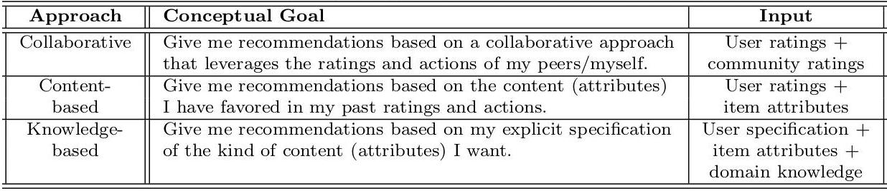
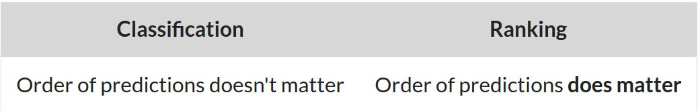
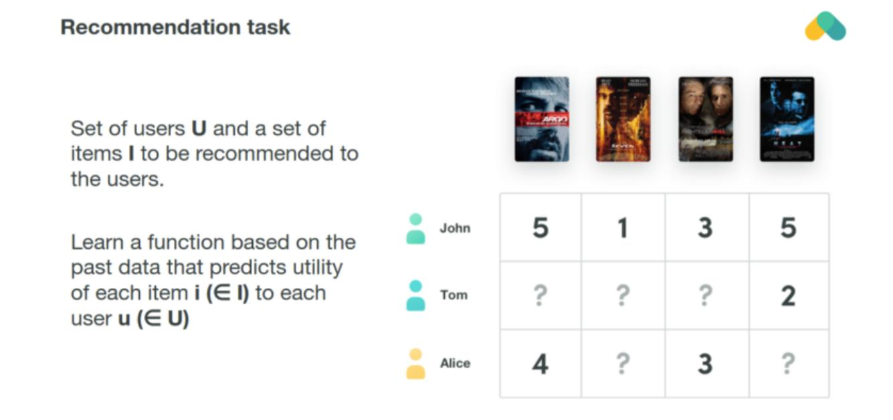
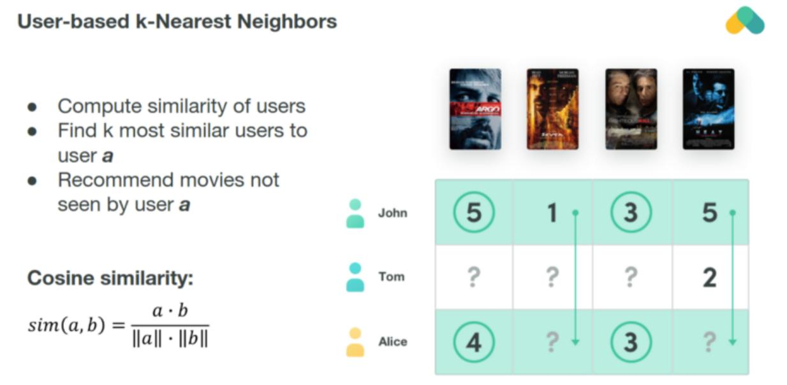
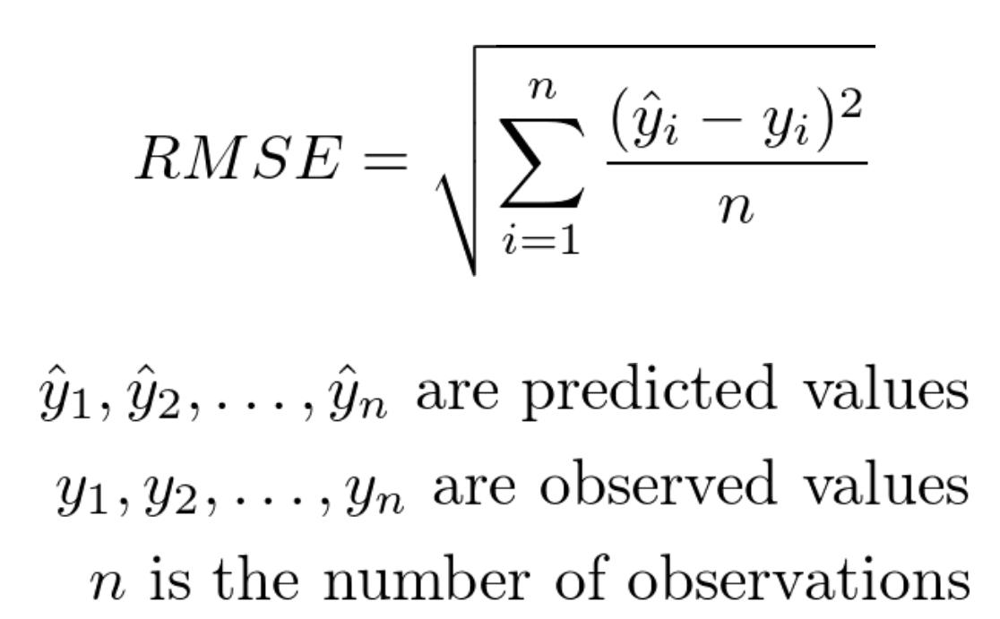
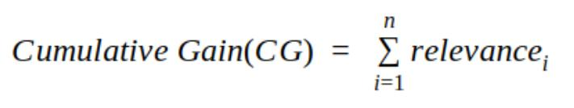
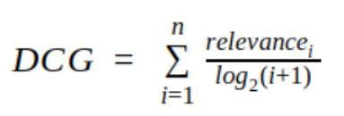
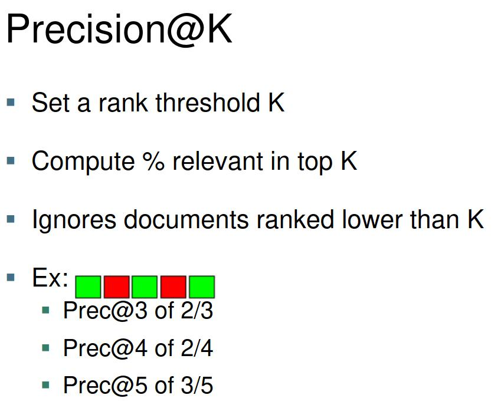

<!--ts-->
   * [Recommnedation systems approaches](#recommnedation-systems-approaches)
      * [Content based methods](#content-based-methods)
      * [Collaborative filtering methods](#collaborative-filtering-methods)
      * [Combine both approaches](#combine-both-approaches)
   * [What is a recommnedation task?](#what-is-a-recommnedation-task)
   * [Various hybridzation strategies](#various-hybridzation-strategies)
   * [Recommendation algorithms](#recommendation-algorithms)
      * [KNN](#knn)
      * [AR](#ar)
      * [MF (Matrix factorization)](#mf-matrix-factorization)
      * [Deep NN](#deep-nn)
         * [Factorization models (matrix factorization)](#factorization-models-matrix-factorization)
      * [Restricted bolzmann machines (ancient - Jeffrey hinton)](#restricted-bolzmann-machines-ancient---jeffrey-hinton)
   * [Evaluation of Recommender Systems](#evaluation-of-recommender-systems)
      * [RMSE](#rmse)
      * [Cumulative Gain(CG)](#cumulative-gaincg)
      * [Discounted Cumulative Gain(DCG)](#discounted-cumulative-gaindcg)
      * [Normalized Discounted Cumulative Gain(NDCG)](#normalized-discounted-cumulative-gainndcg)
   * [Top N accuracy metrics](#top-n-accuracy-metrics)
      * [Precision@K](#precisionk)
      * [Recall@K](#recallk)
      * [NDCG@N](#ndcgn)
      * [MAP@N](#mapn)
      * [How to measure diversity?](#how-to-measure-diversity)
         * [Enthropy](#enthropy)
         * [Gini index](#gini-index)

<!-- Added by: gil_diy, at: Thu 18 Mar 2021 10:48:37 IST -->

<!--te-->

# Recommnedation systems approaches

 <!-- style="width:400px;" -->
  

In many domains, data scientists are asked to not just predict what class/classes an example belongs to, but to rank classes according to how likely they are for a particular example.

 <!-- style="width:400px;" -->
  

## Content based methods

Content based methods are bases on **similarity of item attributes**.

## Collaborative filtering methods

* Collaborative based methods calculate **similarity from interactions**.

* Collaborative methods work with the interaction matrix that can also be called rating matrix in the rare case when users provide explicit rating of items. 

* The task of machine learning is to learn a function that predicts utility of items to each user. 

* Matrix is **typically huge, very sparse and most of values are missing**.

## Combine both approaches

In many cases where a wider variety of inputs is available, one has the flexibilty of using different types of recommender systems for the same task.
In such cases, many opportunities exist for **hybridization**, where the various aspects from different types of systems are combined to achieve the best of all worlds.
* Hybrid recommender systems are closely related to the field of ensemble analysis, in which the power of multiple types of machine learning algorithms is combined to create a more robust model.

# What is a recommnedation task?

 <!-- style="width:400px;" -->
  

Collaborative methods work with the interaction matrix that can also be called rating matrix in the rare case when users provide explicit rating of items. The task of machine learning is to learn a function that predicts utility of items to each user. Matrix is **typically huge, very sparse and most of values are missing**.

# Various hybridzation strategies 

Chpater 6

# Recommendation algorithms
## KNN

 <!-- style="width:400px;" -->
  

The simplest algorithm computes cosine or correlation similarity of rows (users) or columns (items) and recommends items that k — nearest neighbors 
enjoyed.

## AR
## MF (Matrix factorization)

 <!-- style="width:400px;" -->
  

Matrix factorization based methods attempt to reduce dimensionality of the interaction matrix and approximate it by two or more small matrices with k latent components.

[Matrix factorization - wiki](https://en.wikipedia.org/wiki/Matrix_factorization_(recommender_systems))

## Deep NN

**Advantages**

* Speed of Iteration

* Flexibilty

* powerful representation techniques

### Factorization models (matrix factorization)

Take a sparse user-item interaction matrix, and factorize it as a product of two dense matrices of user and item latent vectors.

The approach was famously introduced during the Netflix Prize contest, and still a workhorse in its more modern implicit feedback form. 

## Restricted bolzmann machines (ancient - Jeffrey hinton)

# Evaluation of Recommender Systems

 <!-- style="width:400px;" -->
  

Chapter 6

[Link](https://towardsdatascience.com/evaluate-your-recommendation-engine-using-ndcg-759a8514
52d1)

[Link](https://youtu.be/qG0wUgsEugw?t=129)

* **Precision** and **recall** are **binary metrics** used to evaluate models with **binary output**, therefore We need a way to translate our numerical problem.

* For example given a `rating of a movie` map it into `binary problem` (relevant and not relevant items)

## RMSE 

  

RMSE can be computed by comparing the predicted rating to the true rating for each user-item pair with a known label.

The problem with RMSE is since we are narrowing our focus on accuracy
we sometimes miss the point of:

* The first problem we run into is the **Prediction Diversity**, all the predictions are to similar to each other. Let's say the user liked the first harry potter movie therefore the system might recommend the other Harry potter movies which are too similar no diverse recommendation.

**We strive to a Low Error score not high ones**

* **RMSE doesn't matter in the real world**, what does matter is which movies you put in front of users in a top n recommender list and how those users react to those movies when they see them recommended.

## Cumulative Gain(CG)

 <!-- style="width:400px;" -->
  

## Discounted Cumulative Gain(DCG)

 <!-- style="width:400px;" -->
  

## Normalized Discounted Cumulative Gain(NDCG)

Depending on various factors, the number of recommendations served may vary for every user. Thus, the **DCG will vary accordingly**. We need a score which **has a proper upper and lower bounds** so that we can take a mean across all the recommendations score to report a final score. NDCG brings in this **normalization**

[Link](https://youtu.be/qG0wUgsEugw)

# Top N accuracy metrics

## Precision@K

In the context of recommendation systems we are most likely interested in recommending top-K items to the user. So it makes more sense to compute precision and recall metrics in the first K items instead of all the items. Thus the notion of precision and recall at k where k is a user definable integer that is set by the user to match the top-K recommendations objective.

Precision@K is simply the precision evaluated only p to the k-th prediction.

  

* P@10 or "Precision at 10" corresponds to the number of relevant results among the top 10 documents
* **Fails to take into account the positions of the relevant documents among the top k**

* Another shortcoming is that on a query with fewer relevant results than k, even a perfect system will have a score less than 1.

[precision-k see example](https://queirozf.com/entries/evaluation-metrics-for-ranking-problems-introduction-and-examples#precision-k)

##  Recall@K

##  NDCG@N

## MAP@N

## How to measure diversity?

### Enthropy
### Gini index

[Link](https://towardsdatascience.com/how-spotify-understands-your-music-diversity-d3bed2cc3767)

[Link](https://medium.com/nanonets/evaluating-models-using-the-top-n-accuracy-metrics-c0355b36f91b)

[Link](https://towardsdatascience.com/recommendation-systems-in-the-real-world-51e3948772f3)

[Link](https://medium.com/@m_n_malaeb/recall-and-precision-at-k-for-recommender-systems-618483226c54)

[Link](https://medium.com/recombee-blog/machine-learning-for-recommender-systems-part-1-algorithms-evaluation-and-cold-start-6f696683d0ed)

[Deep Recommendation #1](https://medium.com/recombee-blog/machine-learning-for-recommender-systems-part-1-algorithms-evaluation-and-cold-start-6f696683d0ed)

[Deep Recommendation #2](https://medium.com/recombee-blog/machine-learning-for-recommender-systems-part-2-deep-recommendation-sequence-prediction-automl-f134bc79d66b)

[evaluating-recommender-systems](http://fastml.com/evaluating-recommender-systems/)

[Great resource in kaggle](https://www.kaggle.com/gspmoreira/recommender-systems-in-python-101#Content-Based-Filtering-model)

[towardsdatascience article #1](https://towardsdatascience.com/introduction-to-recommender-systems-1-971bd274f421)

[towardsdatascience article #2](https://towardsdatascience.com/introduction-to-recommender-systems-2-deep-neural-network-based-recommendation-systems-4e4484e64746)

[github resources](https://github.com/grahamjenson/list_of_recommender_systems)

[Link](https://towardsdatascience.com/recommendation-systems-in-the-real-world-51e3948772f3)

[music-diversity](https://towardsdatascience.com/how-spotify-understands-your-music-diversity-d3bed2cc3767)

[Netflix Recommendations](https://netflixtechblog.com/netflix-recommendations-beyond-the-5-stars-part-2-d9b96aa399f5)

[Link](https://medium.com/@mark.rethana/building-a-song-recommendation-system-using-cosine-similarity-and-euclidian-distance-748fdfc832fd)

[Link](https://towardsdatascience.com/evaluation-metrics-for-recommender-systems-df56c6611093)

[Link](https://www.mdpi.com/2078-2489/11/7/369/htm)

[Link](https://medium.com/@FlorentGeerts/the-jam-experiment-how-choice-overloads-makes-consumers-buy-less-d610f8c37b9b)

[Link](https://medium.com/choice-hacking/choice-overload-why-simplicity-is-the-key-to-winning-customers-2f8e239eaba6)

[how spotify understands your music diversity](https://towardsdatascience.com/how-spotify-understands-your-music-diversity-d3bed2cc3767)

[the-paradox-of-choice-why-less-is-more-when-it-comes-to-engagement](https://medium.com/@reganyan/the-paradox-of-choice-why-less-is-more-when-it-comes-to-engagement-7c97a0d32272)

[popular-evaluation-metrics-in-recommender-systems-explained](https://medium.com/qloo/popular-evaluation-metrics-in-recommender-systems-explained-324ff2fb427d)

[Link](https://medium.com/swlh/rank-aware-recsys-evaluation-metrics-5191bba16832)

[loocv](https://machinelearningmastery.com/loocv-for-evaluating-machine-learning-algorithms/)