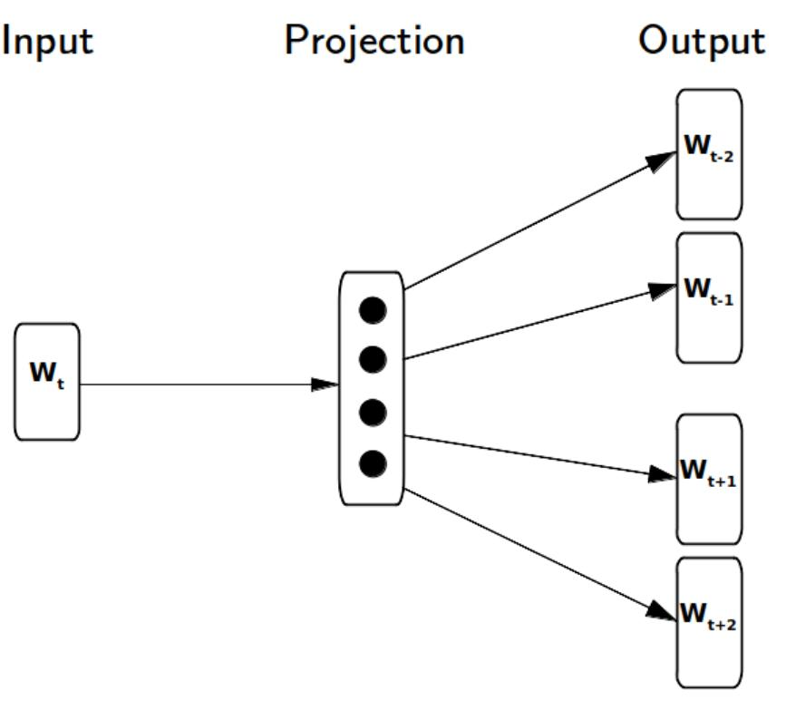
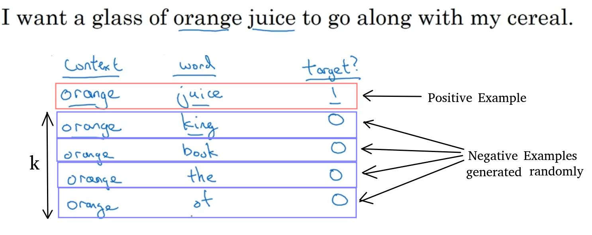

<!--ts-->
   * [Sampling](#sampling)
      * [Probability sampling](#probability-sampling)
      * [Simple Random Sampling](#simple-random-sampling)
      * [Non-probability sampling](#non-probability-sampling)
      * [Systematic sampling](#systematic-sampling)
   * [Obtain a systematic sample and save it in a new variable](#obtain-a-systematic-sample-and-save-it-in-a-new-variable)
      * [Negative sampling](#negative-sampling)
         * [Example #1: Resolving the downside of softmax is slow to compute for Skip-gram model.](#example-1-resolving-the-downside-of-softmax-is-slow-to-compute-for-skip-gram-model)
         * [Example #2: Stochastic Gradient Descent](#example-2-stochastic-gradient-descent)
      * [oversampling](#oversampling)
      * [Deal with imbalanced datasets](#deal-with-imbalanced-datasets)

<!-- Added by: gil_diy, at: Mon 07 Mar 2022 10:47:34 IST -->

<!--te-->

# Sampling

## Probability sampling

## Simple Random Sampling

```python
df.sample(n=4).sort_values(by='product_id')
```

## Non-probability sampling


## Systematic sampling

The systematic sampling method selects units based on a fixed sampling interval (i.e. every nth unit is selected from a given process or population). This sampling method tends to be more effective than the simple random sampling method.
Define systematic sampling function

```python
def systematic_sampling(df, step):
   indexes = np.arange(0,len(df),step=step)
   systematic_sample = df.iloc[indexes]
   return systematic_sample
``` 
# Obtain a systematic sample and save it in a new variable
systematic_sample = systematic_sampling(df, 3)

## Negative sampling

### Example #1: Resolving the downside of softmax is slow to compute for Skip-gram model. 

The Skip-gram model works in a way that, given an input, it **predicts the surrounding or context words**. Using this method, we can learn a hidden layer that we’ll use to calculate **how probable a word is to occur as the context of the input**:

<p align="center">
  
</p>

The Skip-gram model for training word vectors and learned about how negative sampling is used for this purpose. 
In order to **reduce the computational cost of the softmax function which is done over the entire vocabulary**, we can approximate this function by only drawing a few examples from the set of samples that do not appear in the context of the main word.

* Let's take an example, here we have generated `k` Negative examples,
we have took the word `orange` and placed next to it randomly words
so those pair of words are targeted as `0`.

<p align="center">
  
</p>

no we will create a supervised problem with the pairs of words are the input as X, 
and has to predict the target label.

[Great explanation of Negative sampling](https://youtu.be/vYTihV-9XWE)

### Example #2: Stochastic Gradient Descent


## oversampling 
 https://arxiv.org/abs/1710.05381


 ## Deal with imbalanced datasets

 Resampling with `sklearn.resample` upsampling the minority class or downsampling the majority class.