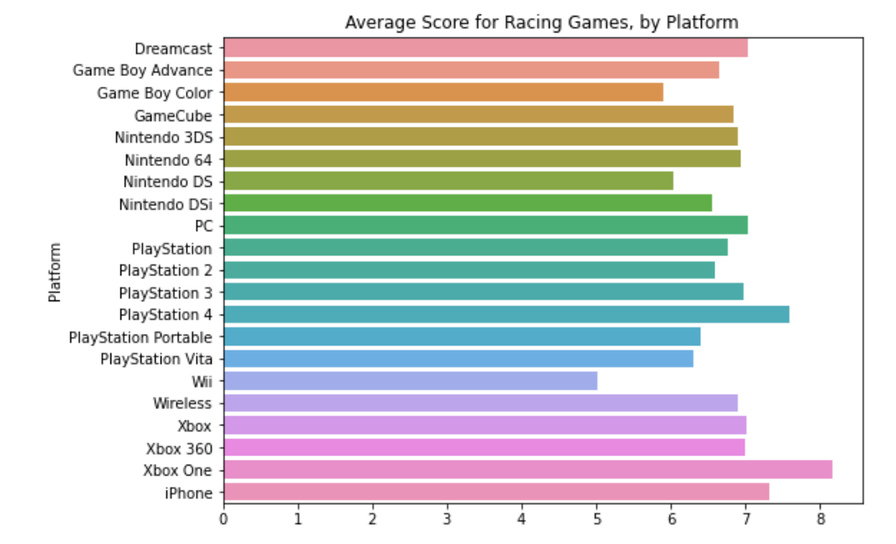
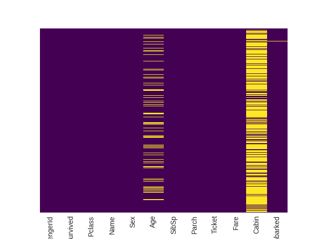
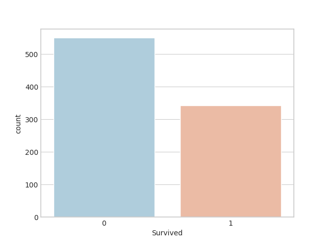
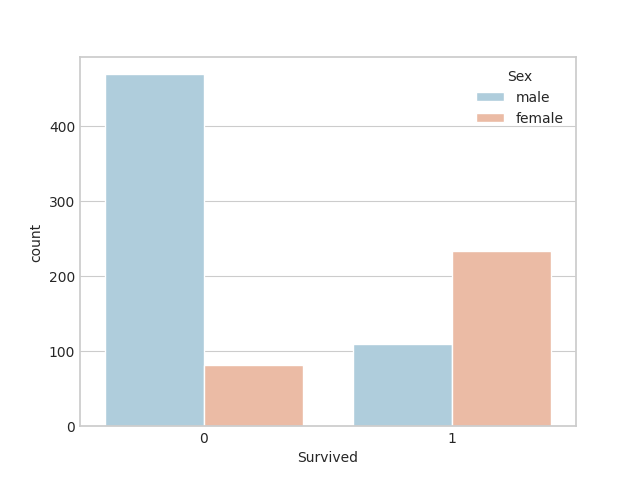
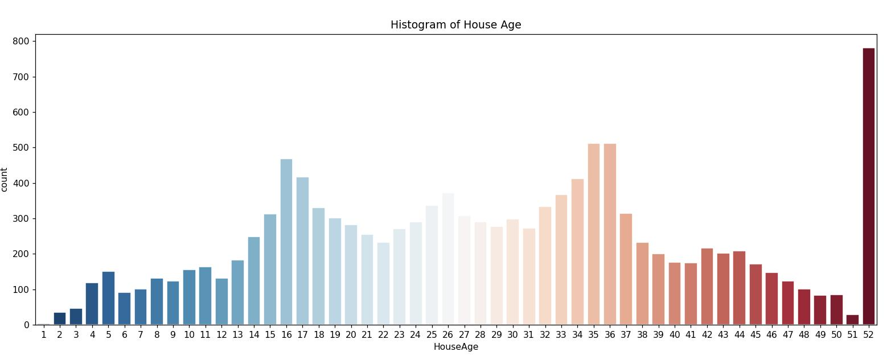
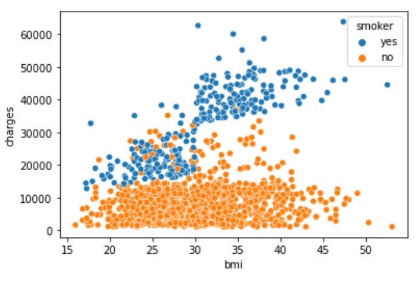
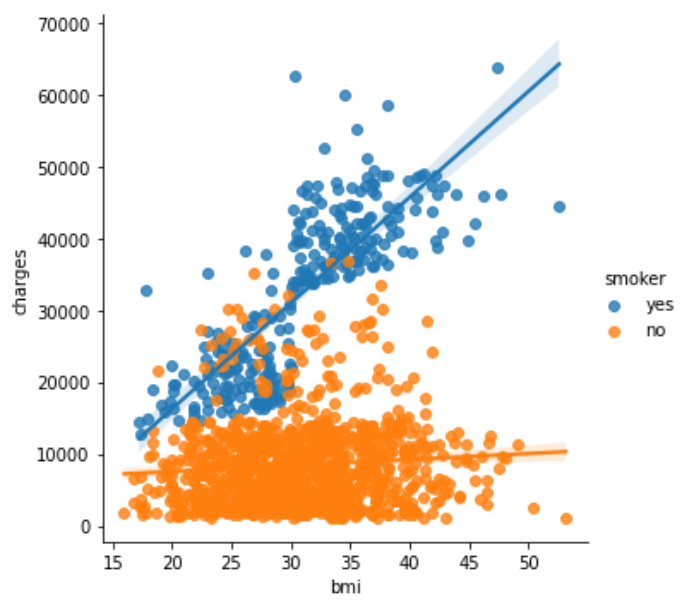
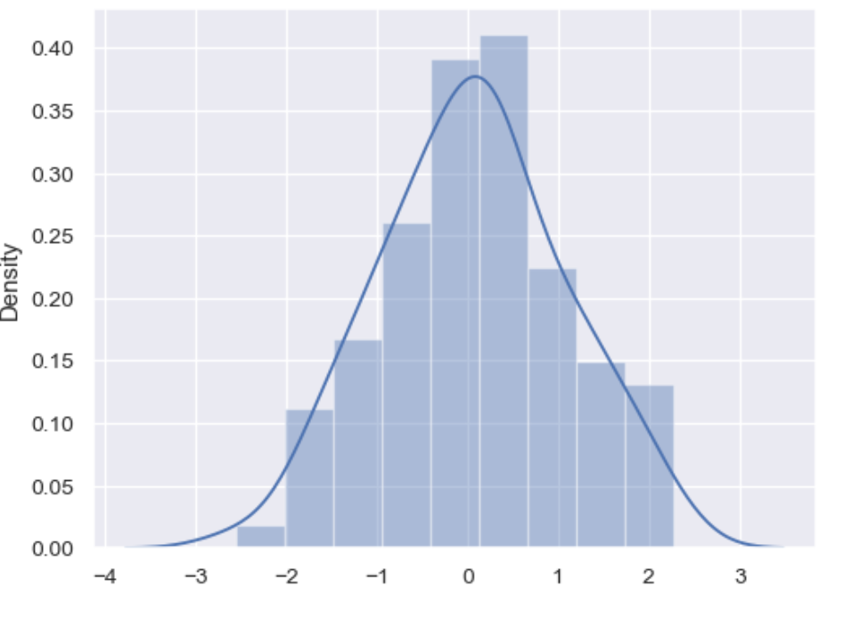

<!--ts-->
   * [seaborn: statistical data visualization](#seaborn-statistical-data-visualization)
      * [color pallete](#color-pallete)
      * [Plot line chart](#plot-line-chart)
      * [Set Title](#set-title)
      * [Set width of the figure](#set-width-of-the-figure)
      * [Add label for horizontal axes](#add-label-for-horizontal-axes)
      * [Add label for vertical axes](#add-label-for-vertical-axes)
      * [Adding legend](#adding-legend)
      * [Bar chart](#bar-chart)
      * [Heatmap](#heatmap)
      * [Set axis with formatting the decimal places](#set-axis-with-formatting-the-decimal-places)
      * [Scatter plot](#scatter-plot)
      * [Scatter plot with linear regresssion](#scatter-plot-with-linear-regresssion)
      * [Categorical scatter plot to highlight the relationship between](#categorical-scatter-plot-to-highlight-the-relationship-between)
      * [distribution plot (Histograms)](#distribution-plot-histograms)
      * [Density plots (KDE - Kernel density estimate (KDE))](#density-plots-kde---kernel-density-estimate-kde)

<!-- Added by: gil_diy, at: Wed 20 Apr 2022 09:32:50 IDT -->

<!--te-->

# seaborn: statistical data visualization

## color pallete


```python
sns.set(style='whitegrid', palette='muted', font_scale=1.2)
GIL_COLORS_PALETTE = ["#01BEFE", "#FFDD00", "#FF7D00", "#FF006D", "#ADFF02", "#8F00FF"]
sns.set_palette(sns.color_palette(GIL_COLORS_PALETTE))
```


Choose the color map available from here:

[See all colors](https://astromsshin.github.io/science/code/matplotlib_cm/index.html)

i.e:
```python
sns.heatmap(df.corr(), cmap=plt.cm.gist_stern,annot=True )
```

## Plot line chart

```python
sns.lineplot(data=financial_data)
```

## Set Title 

```python
# Add title
plt.title("Daily Global Streams of Popular Songs in 2017-2018")
```

## Set width of the figure

```python
# Set the width and height of the figure
plt.figure(figsize=(14,6))
```

## Add label for horizontal axes

```python
# Add label for horizontal axis
plt.xlabel("Date")
```

## Add label for vertical axes
```python
# Add label for vertical axis
plt.ylabel("Arrival delay (in minutes)")
```

## Adding legend

 The label to make the line appear in the legend and set its corresponding label.

```python
# Line chart showing daily global streams of 'Shape of You'
sns.lineplot(data=spotify_data['Shape of You'], label="Shape of You")

# Line chart showing daily global streams of 'Despacito'
sns.lineplot(data=spotify_data['Despacito'], label="Despacito")
```

## Bar chart

```python
sns.barplot(x=flight_data.index, y=flight_data['NK'])
```

## Heatmap

```python
# Heatmap showing average arrival delay for each airline by month
# This ensures that the values for each cell appear on the chart
sns.heatmap(data=flight_data, annot=True)
```

Example of correlation:

```python
train_dummies = pd.get_dummies(train, columns=["Title","CabinClass","Embarked"]).corr()
sns.heatmap(train_dummies.corr(), square=True, annot=False)
```

[Reference](https://www.kaggle.com/jamesmcguigan/python-titanic-exploration#Confusion-Matrix)


Another example
```python
# Set the width and height of the figure
plt.figure(figsize=(8, 6))
# Bar chart showing average score for racing games by platform
sns.barplot(x=ign_data['Racing'], y=ign_data.index)
# Add label for horizontal axis
plt.xlabel("")
# Add label for vertical axis
plt.title("Average Score for Racing Games, by Platform")
```

<p align="center"> <!-- style="width:400px;" -->
  
</p>


```python
sns.heatmap(train_df.isnull(),
            yticklabels=False,
            cbar=False,
            cmap='viridis')

plt.show()

```

<p align="center"> <!-- style="width:400px;" -->
  
</p>


```python
sns.set_style("whitegrid")
sns.countplot(x='Survived', data = train_df, palette = 'RdBu_r')
plt.show()
```
<p align="center"> <!-- style="width:400px;" -->
  
</p>


```python
sns.set_style("whitegrid")
sns.countplot(x='Survived',
              hue = 'Sex',
              data = train_df,
              palette = 'RdBu_r')
plt.show()
```

<p align="center"> <!-- style="width:400px;" -->
  
</p>

## Set axis with formatting the decimal places

```python
fig, ax1 = plt.subplots(figsize=(10, 4))
sns.set_style("whitegrid")
sns.countplot(x='HouseAge',
              data=X_train,
              palette='RdBu_r', ax=ax1).set(title='Histogram of House Age')

# Don't show decimal digits therfore I wrote zero.
ax1.set_xticklabels(['{:.0f}'.format(float(t.get_text())) for t in ax1.get_xticklabels()])
plt.show()
```


<p align="center">
  
</p>

## Scatter plot

```python
sns.scatterplot(x=insurance_data['bmi'],
	y=insurance_data['charges'],
	hue=insurance_data['smoker'])
```

<p align="center"> <!-- style="width:400px;" -->
  
</p>

## Scatter plot with linear regresssion

```python
sns.lmplot(x="bmi", y="charges", hue="smoker", data=insurance_data)
```

<p align="center"> <!-- style="width:400px;" -->
  
</p>

## Categorical scatter plot to highlight the relationship between

```python
sns.swarmplot(x=candy_data['chocolate'], y=candy_data['winpercent'])
```

## distribution plot (Histograms)

Displays a combination of statistical representations of numerical data, such as histogram, kernel density estimation

```python
import seaborn as sns, numpy as np

np.random.seed(0)
sns.set_theme() 
x = np.random.randn(100)

ax = sns.distplot(x)
```

<p align="center">
  
</p>

## Density plots (KDE - Kernel density estimate (KDE))

You can think of it as a smoothed histogram

```python
sns.kdeplot(data=iris_data['Petal Length (cm)'], shade=True)
```

## Reference

https://medium.com/the-researchers-guide/generate-publication-ready-plots-using-seaborn-library-part-1-f4c9a6d0489c