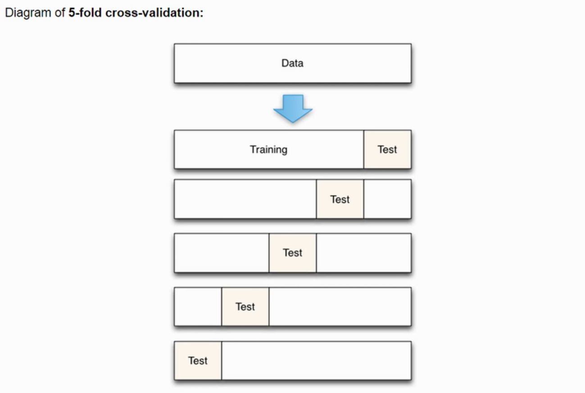

<!--ts-->
   * [scikit-learn](#scikit-learn)
      * [scikit-learn's functions](#scikit-learns-functions)
      * [Preprocessing data](#preprocessing-data)
         * [Scaler (Noramlization or Standardization)](#scaler-noramlization-or-standardization)
         * [Categorical encoding](#categorical-encoding)
            * [Label encoding](#label-encoding)
               * [Not an Ordinal variable](#not-an-ordinal-variable)
               * [Ordinal label encoding](#ordinal-label-encoding)
            * [One-Hot Encoding](#one-hot-encoding)
         * [Imputation of missing values](#imputation-of-missing-values)
            * [Missing value for numeric columns](#missing-value-for-numeric-columns)
            * [Missing value for categorical columns](#missing-value-for-categorical-columns)
         * [ColumnTransformer (Super nice)](#columntransformer-super-nice)
         * [Dimension Reduction techniques](#dimension-reduction-techniques)
            * [PCA (Principal Component Analysis)](#pca-principal-component-analysis)
      * [Splitting data](#splitting-data)
         * [Cross-validation](#cross-validation)
            * [Kfold](#kfold)
            * [cross_val_score](#cross_val_score)
         * [Stratified Shuffle Split](#stratified-shuffle-split)
         * [StratifiedKFold](#stratifiedkfold)
         * [LeaveOneOut](#leaveoneout)
      * [Pipeline](#pipeline)
      * [Feature Selection](#feature-selection)
         * [Approach 1: Drop columns with constant values (Like Person's ID)](#approach-1-drop-columns-with-constant-values-like-persons-id)
         * [Approach 2: Variance Thresold (Remove all low-variance features)](#approach-2-variance-thresold-remove-all-low-variance-features)
         * [Approach 3: Remove highly correlated features](#approach-3-remove-highly-correlated-features)
         * [Approach 4: features selection using Information Gain](#approach-4-features-selection-using-information-gain)
            * [Categorical values](#categorical-values)
            * [Numerical values](#numerical-values)
         * [Approach 5: features selection using Chi2 Statistical Analysis](#approach-5-features-selection-using-chi2-statistical-analysis)
      * [<a href="https://youtu.be/_AWQ4Myxlcg?list=PLZoTAELRMXVPgjwJ8VyRoqmfNs2CJwhVH" rel="nofollow">Link</a>](#link)
      * [models](#models)
         * [Linear Regression](#linear-regression)
         * [PassiveAggressiveClassifier](#passiveaggressiveclassifier)
         * [Logistic Regression](#logistic-regression)
         * [Multi nomial Naive Bayes](#multi-nomial-naive-bayes)
         * [SVM](#svm)
         * [KNN](#knn)
         * [Decision Tree](#decision-tree)
         * [Random Forest (Bagging techinque)](#random-forest-bagging-techinque)
         * [Adaboost (Boosting)](#adaboost-boosting)
         * [gradboost (Boosting)](#gradboost-boosting)
      * [Matrix Decomposition](#matrix-decomposition)
         * [Latent Dirichlet Allocation](#latent-dirichlet-allocation)
         * [Principal component analysis (PCA)](#principal-component-analysis-pca)
      * [metrics](#metrics)

<!-- Added by: gil_diy, at: Wed 16 Feb 2022 18:05:16 IST -->

<!--te-->

# scikit-learn

## scikit-learn's functions

[Link](https://scikit-learn.org/stable/modules/classes.html)

## Preprocessing data


### Scaler (Noramlization or Standardization)

All features are centered around zero and have variance in the same order

usualy it's called either Noramlization or Standardization

```python
from sklearn import preprocessing
import numpy as np

X_train = np.array([[ 1., -1.,  2.],
                    [ 2.,  0.,  0.],
                    [ 0.,  1., -1.]])

X_scaled = preprocessing.scale(X_train)

# Please see here: https://en.wikipedia.org/wiki/Standard_score

# Now Scaled data has zero mean and unit variance. you can check:
# X_scaled.mean(axis=0)
# X_scaled.s td(axis=0)


```

Why do we normalized?

* Avoid exploding gradient problem

* Avoid Decreasing our training speed

[Well explained](https://youtu.be/dXB-KQYkzNU?t=31)


### Categorical encoding 

**Categorical encoding** is a process of converting categories to numbers.

#### Label encoding

##### Not an Ordinal variable

```python
from sklearn.preprocessing import LabelEncoder

label_encoder = LabelEncoder()
df['fuel'] = label_encoder.fit_transform(df['fuel'])
```
##### Ordinal label encoding

**The OrdinalEncoder** - this estimator transforms each categorical feature to one new feature of integers (0 to n_categories - 1)

```python
types_of_cylinders = ['two', 'three', 'four', 'five', 'six', 'eight', 'twelve']
ordinal_encoder_for_cylinders = OrdinalEncoder(categories=[types_of_cylinders])
df["cylinders"] = ordinal_encoder_for_cylinders.fit_transform(df["cylinders"])
```

#### One-Hot Encoding

[Link](https://www.analyticsvidhya.com/blog/2020/03/one-hot-encoding-vs-label-encoding-using-scikit-learn/)


### Imputation of missing values

#### Missing value for numeric columns
For various reasons, **many real world datasets contain missing values**, often encoded as blanks, NaNs or other placeholders. Such datasets however are incompatible with scikit-learn estimators which assume that all values in an array are numerical, and that all have and hold meaning. A basic strategy to use incomplete datasets is to discard entire rows and/or columns containing missing values. However, this comes at the price of losing data which may be valuable (even though incomplete). A better strategy is to impute the missing values


```python
from sklearn.impute import SimpleImputer

imputer_mean = SimpleImputer(missing_values=np.nan, strategy='mean')

# Now let's say on columns 1,2,5 we would like to apply the imputer_mean:
X_train[:,[1,2,5]] = imputer_mean.fit_transform(X_train[:,[1,2,5]])

```

**Attention:** In case you would like to modify the type of the imputer just replace **imputer_mean**
with **imputer_median** as seen below:
```python
imputer_median = SimpleImputer(missing_values=np.nan, strategy='median')
```

moreover you can use from the `sklearn.preprocessing`:

```python
form sklearn.preprocessing import Imputer
imp = Imputer(missing_values='NaN', strategy='mean', axis=0, verbose=0, copy=True)
```

#### Missing value for categorical columns

The same way as I have written above, just place the most common value in the empty cells:

```python
imputer_categorical = SimpleImputer(missing_values=np.nan, strategy='most_frequent')
```


### ColumnTransformer (Super nice)

Explained very well here for creating a concise code neat [Link](https://www.youtube.com/watch?v=OTEokOJ12ao)

[Reference](https://machinelearningmastery.com/columntransformer-for-numerical-and-categorical-data/)


### Dimension Reduction techniques

#### PCA (Principal Component Analysis)

```python    
    scaler = StandardScaler()
    X_train = scaler.fit_transform(X_train)

    print("reduced_data.shape: ", X_train.shape)

    # PCA - for PCA for Data Visualization
    reduced_data = PCA(n_components=2).fit_transform(X_train)

    print("reduced_data.shape: ", reduced_data.shape)

    plt.figure(figsize=(8, 6))
    
    colors = {0: 'green', 1: 'black'}

    plt.scatter(reduced_data[:, 0], reduced_data[:, 1], c=Y_train_dry_or_wet.apply(lambda x: colors[x]))
    plt.xlabel('principal component 1')
    plt.ylabel('principal component 2')

    plt.show()
```


## Splitting data
### Cross-validation  

Cross-validation is an approach that you can use to estimate the performance of a machine learning algorithm with less variance than a single train-test set split.


#### Kfold


**Steps for K-folded cross-validation**

1. Split the dataset into K equal partitions (or "folds")

2. Use fold 1 as **testing set** and the union of other folds as the **training set**

3. Calculate **testing accuarcy**

4. Repeat steps 2 and 3 K times, using a **different fold** as the testing set each time.

5. Use the **average testing accuracy** as the estimate of out-of-sample accuracy.


<p align="center" style="width:500px;">
  
</p>

It works by splitting the dataset into k-parts (e.g. k = 5 or k = 10). Each split of the data is called a fold.

The algorithm is trained on **k − 1** folds with one held back and tested on the held back fold. This is repeated so that each fold of the dataset is given a chance to be the held back test set. 
After running cross-validation you **end up with k-different performance scores that you can summarize using a mean and a standard deviation**.


The result is a more reliable estimate of the performance of the algorithm on new data given your test data. It is more accurate because the algorithm is trained and evaluated multiple times on different data. The choice of k must allow the size of each test partition to be large enough to be a reasonable sample of the problem, whilst allowing enough repetitions of the train-test evaluation of the algorithm to provide a fair estimate of the algorithms performance
on unseen data.


Advantages of **cross-validation**:

* More accurate estimate of out-of-sample accuracy

* More "efficient" use of data (every observation is used for both training and testing)


Advantages of **train/test split**:

* Runs K times faster than K-fold cross-validation

* Simpler to examine the details results of testing process

A great code example which demostrates what is done under the hood can be seen below:


```python
from sklearn.model_selection import KFold

x = data.loc[:, all_columns_except_target]
y = data.loc[:, "Target"]

kf = KFold(n_splits=5, random_state=42, shuffle=True)

# Split dataset into k consecutive folds 
# Each fold is then used once as a validation while the k - 1 remaining folds form the training set.

for train_index, test_index in kf.split(x, y):
    print("bla")
```


#### cross_val_score


```python
# k-fold cross validation evaluation of xgboost model
from numpy import loadtxt
from xgboost import XGBClassifier
from sklearn.model_selection import KFold
from sklearn.model_selection import cross_val_score
# load data
dataset = loadtxt('pima-indians-diabetes.csv' , delimiter=",")
# split data into X and y
X = dataset[:,0:8]
Y = dataset[:,8]
# CV model
model = XGBClassifier()
kfold = KFold(n_splits=10, random_state=7)
results = cross_val_score(model, X, Y, cv=kfold)
print("Accuracy: %.2f%% (%.2f%%)" % (results.mean()*100, results.std()*100))
```


### Stratified Shuffle Split


Making sure the distribution of classes is done in the same manner both in the `train set` and the `testing set`. for example:

**Class 1**: 20 , **Class 2**: 40


then if we split to train and testing set with ratio 0.25, so would shoudl get:

* train: class 1 (15), class 2 (30) 

* test: class 1 (5), class 2 (10) 


The split operations returns 

```python
from sklearn.model_selection import StratifiedShuffleSplit

split = StratifiedShuffleSplit(n_splits=1, test_size=0.2, random_state=42)

for train_index, test_index in split.split(housing, housing["income_cat"]):
    strat_train_set = housing.loc[train_index]
    strat_test_set = housing.loc[test_index]
```

### StratifiedKFold

If you have many classes for a classification type predictive modeling problem or the **classes are imbalanced** (there are a lot more instances for one class than another), it can be a good idea to **create stratified folds** when performing cross-validation. 
This has the **effect of enforcing the same distribution of classes in each fold** as in the whole training dataset when performing the cross-validation evaluation.

```python
# stratified k-fold cross validation evaluation of xgboost model
from numpy import loadtxt
from xgboost import XGBClassifier
from sklearn.model_selection import StratifiedKFold
from sklearn.model_selection import cross_val_score
# load data
dataset = loadtxt('pima-indians-diabetes.csv' , delimiter=",")
# split data into X and y
X = dataset[:,0:8]
Y = dataset[:,8]
# CV model
model = XGBClassifier()
kfold = StratifiedKFold(n_splits=10, random_state=7)
results = cross_val_score(model, X, Y, cv=kfold)
print("Accuracy: %.2f%% (%.2f%%)" % (results.mean()*100, results.std()*100))
```

### LeaveOneOut

Each sample is used once as a test set while the remaining samples form the training set. 

```python
X = np.array([[1, 2], [3, 4], [5, 6]])
y = np.array([80, 66, 55])
loo = LeaveOneOut()
print(loo.get_n_splits(X))
print(loo)
for train_index, test_index in loo.split(X):
    # print("TRAIN:", train_index, "TEST:", test_index)
    X_train, X_test = X[train_index], X[test_index]
    y_train, y_test = y[train_index], y[test_index]
    print("X_train = ", X_train)
    print("X_test = ", X_test, "\ny_train = ", y_train, "y_test = ", y_test)
    print("******************************")
```

**Output:**
```
X_train =  [[3 4][5 6]], X_test = [[1 2]] , y_train = [2 3], y_test =  [1]
*****************************************************************************
X_train =  [[1 2][5 6]], X_test =  [[3 4]] , y_train = [1 3], y_test =  [2]
*****************************************************************************
X_train =  [[1 2][3 4]], X_test =  [[5 6]] , y_train = [1 2], y_test =  [3]
*****************************************************************************
```

## Pipeline

```python
y_train = normalized_df['TenYearCHD']
X_train = normalized_df.drop('TenYearCHD', axis=1)

from sklearn.pipeline import Pipeline

classifiers = [
               LogisticRegression(),
               SVC(),
               DecisionTreeClassifier(),
               KNeighborsClassifier(2)
               ]

for classifier in classifiers:
    pipe = Pipeline(steps=[('classifier', classifier)])
    pipe.fit(X_train, y_train)   
    print("The accuracy score of {0} is: {1:.2f}%".format(classifier,(pipe.score(X_test, y_test)*100)))
```

[LeaveOneOut](https://youtu.be/e0JcXMzhtdY?t=824)


[Reference1](https://youtu.be/QdBy02ExhGI)

[Reference2](https://www.youtube.com/watch?v=OFyyWcw2cyM)

[Deep Dive into pipeline](https://www.kaggle.com/baghern/a-deep-dive-into-sklearn-pipelines)

## Feature Selection

Curse of dimensionality [Link](https://en.wikipedia.org/wiki/Curse_of_dimensionality)

I'll be showing 10 different techniques of feature selections:

### Approach 1: Drop columns with constant values (Like Person's ID)

```python
import pandas as pd

df['id'].drop(axis = 0, inplace=True)
```

### Approach 2: Variance Thresold (Remove all low-variance features) 

```python
from sklearn.feature_selection import VarianceThreshold
import pandas as pd

df = pd.DataFrame({
  "feature_A": [9, 7, 8, 3, 7, 7],
  "feature_B": [1, 3, 5, 1, 2, 1],
  "feature_C": [0, 0, 0, 0, 0, 0],
  "feature_D": [1, 1, 1, 1, 1, 1]
})

# Removing all columns which their variance is less than 3
var_thres = VarianceThreshold(threshold=3)
feature_variances = var_thres.fit(df)
print(dict(zip(feature_variances.feature_names_in_, feature_variances.variances_)))

df_after_feature_selection = var_thres.fit_transform(df) # Fit to data, then transform it
print("number of columns left: ", df_after_feature_selection.shape[1])
```

### Approach 3: Remove highly correlated features

```python

# Since the correlation matrix is symmetry to the diagonal
# we will focus on half of the matrix and ignore the actual diagonal

column_idx = np.where((np.triu(mat_corr) - np.eye(mat_corr.shape[0])) > 0.8)
print()
```


### Approach 4: features selection using Information Gain

#### Categorical values


[Link](http://www.my-website.com)

#### Numerical values

```python
from sklearn.feature_selection import mutual_info_regression
# determine the mutual information
mutual_info = mutual_info_regression(X_train.fillna(0), y_train)
```

[Link](https://youtu.be/i-MF3CXWWEM?list=PLZoTAELRMXVPgjwJ8VyRoqmfNs2CJwhVH)

### Approach 5: features selection using Chi2 Statistical Analysis

```python
from sklearn.feature_selection import chi2

f_p_values=chi2(X_train,y_train)
```
[Link](https://youtu.be/_AWQ4Myxlcg?list=PLZoTAELRMXVPgjwJ8VyRoqmfNs2CJwhVH)
--------------------------------------------------------


```python
# use feature importance for feature selection
from numpy import loadtxt
from numpy import sort
from xgboost import XGBClassifier
from sklearn.model_selection import train_test_split
from sklearn.metrics import accuracy_score
from sklearn.feature_selection import SelectFromModel
# load data
dataset = loadtxt( 'pima-indians-diabetes.csv' , delimiter=",")
# split data into X and y
X = dataset[:,0:8]
Y = dataset[:,8]
# split data into train and test sets
X_train, X_test, y_train, y_test = train_test_split(X, Y, test_size=0.33, random_state=7)
# fit model on all training data
model = XGBClassifier()
model.fit(X_train, y_train)
# make predictions for test data and evaluate
predictions = model.predict(X_test)
accuracy = accuracy_score(y_test, predictions)
print("Accuracy: %.2f%%" % (accuracy * 100.0))

# Fit model using each importance as a threshold
thresholds = sort(model.feature_importances_)

for thresh in thresholds:
    # select features using threshold
    selection = SelectFromModel(model, threshold=thresh, prefit=True)
    select_X_train = selection.transform(X_train)

    # train model
    selection_model = XGBClassifier()
    selection_model.fit(select_X_train, y_train)

    # eval model
    select_X_test = selection.transform(X_test)
    predictions = selection_model.predict(select_X_test)
    accuracy = accuracy_score(y_test, predictions)

    # Output of Model Performance With Feature Subsets by Importance Scores.
    print("Thresh=%.3f, n=%d, Accuracy: %.2f%%" % (thresh, select_X_train.shape[1], accuracy*100.0))

```


## models


### Linear Regression

### PassiveAggressiveClassifier

### Logistic Regression

### Multi nomial Naive Bayes

### SVM

### KNN

### Decision Tree

### Random Forest (Bagging techinque)

### Adaboost (Boosting)

### gradboost (Boosting)

## Matrix Decomposition

### Latent Dirichlet Allocation

### Principal component analysis (PCA)


## metrics

[Link](https://scikit-learn.org/stable/modules/model_evaluation.html)