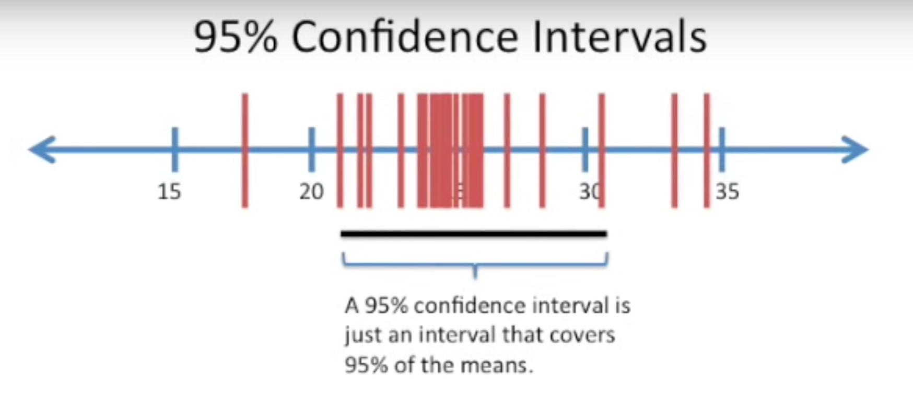

<!--ts-->
   * [Statistical Inference](#statistical-inference)
      * [Bootstrap](#bootstrap)
      * [Confidence Intervals](#confidence-intervals)

<!-- Added by: gil_diy, at: Wed 30 Mar 2022 18:40:41 IDT -->

<!--te-->

# Statistical Inference

## Bootstrap

One easy and effective way to estimate the sampling distribution of a statistic, or of
model parameters, is to draw additional samples, with replacement, from the sample
itself and recalculate the statistic or model for each resample. This procedure is called
the bootstrap, and it **does not necessarily involve any assumptions about the data or
the sample statistic being normally distributed**.

## Confidence Intervals

Frequency tables, histograms, boxplots, and standard errors are all ways to understand the potential error in a sample estimate. Confidence intervals are another.

* The bootstrap is a general tool that can be used to generate confidence intervals for
most statistics, or model parameters

* The lower the level of confidence you can tolerate, the narrower the confidence
interval will be.

  

The bootstrap is a general tool that can be used to generate confidence intervals for
most statistics, or model parameters. 

The **percentage associated with the confidence interval** is termed the **level of confidence**.

* Well explained in `page 67` from the book 

The probability question associated with a confidence interval starts out with the phrase “Given a sampling procedure and a population, what is the probability that...” To go in the opposite direc‐
tion, “Given a sample result, what is the probability that (something is true about the population)?” involves more complex calculations and deeper imponderables.