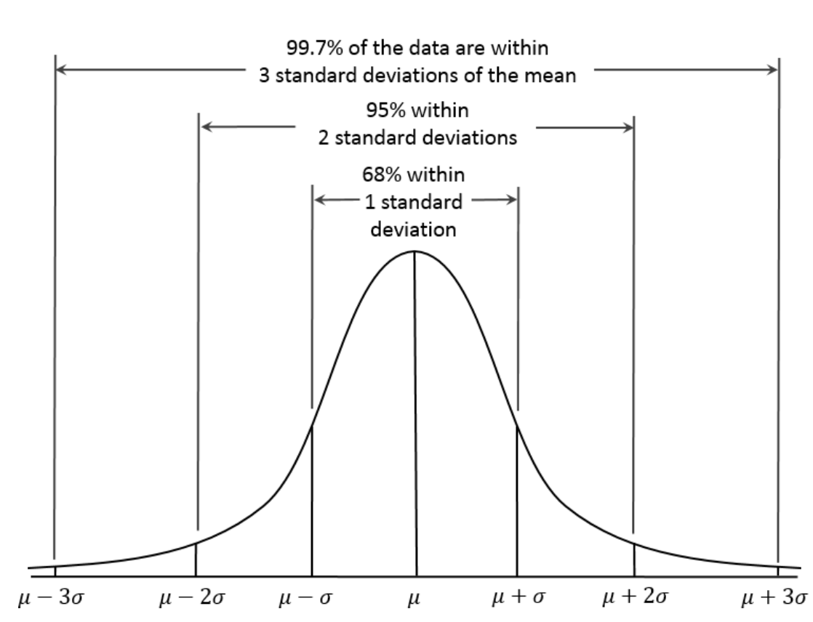

<!--ts-->
   * [Statistics](#statistics)
      * [Descriptive](#descriptive)
      * [Normal Distribution](#normal-distribution)
      * [Student's t-Distribution](#students-t-distribution)
      * [Binomial Distribution](#binomial-distribution)
      * [Poisson Distribution](#poisson-distribution)
      * [Exponential Distribution](#exponential-distribution)
      * [Weibull Distribution](#weibull-distribution)
      * [Inferential](#inferential)
         * [One Tailed and Two Tailed Tests, Critical Values, &amp; Significance Level](#one-tailed-and-two-tailed-tests-critical-values--significance-level)
         * [Hypothesis Testing Problems Z Test &amp; T Statistics One &amp; Two Tailed Test](#hypothesis-testing-problems-z-test--t-statistics-one--two-tailed-test)
         * [P-Value Method For Hypothesis Testing](#p-value-method-for-hypothesis-testing)
         * [Hypothesis Testing - Solving Problems With Proportions](#hypothesis-testing---solving-problems-with-proportions)
         * [Summary types of test](#summary-types-of-test)
            * [Hypothesis Testing](#hypothesis-testing)
            * [Chi-Square Tests](#chi-square-tests)
            * [ANOVA (Analysis Of Variance)](#anova-analysis-of-variance)
      * [QQplots (Quantile Quantile plot)](#qqplots-quantile-quantile-plot)
      * [Hypothesis Tests](#hypothesis-tests)

<!-- Added by: gil_diy, at: Thu 31 Mar 2022 10:16:32 IDT -->

<!--te-->

# Statistics

## Descriptive

1. Organizing and summarizing data using numbers & graphs

2. data Summary:
Bar Graphs, Histograms, Pir Charts, etc.
Shape of graph & skewness

3. Measures of Cental Tendency:
Mean, Median, & Mode (The number which appear most)

4. Measures of Variablity:
Range, variance & standard deviation

## Normal Distribution 

* The bell-shaped normal distribution is iconic in traditional statistics

* Standardize - Subtract the mean and divide by the standard deviation.

* Standard normal - A normal distribution with mean = 0 and standard deviation = 1.

* QQ-Plot - A plot to visualize how close a sample distribution is to a specified distribution, e.g., the normal distribution.

* While raw data is typically **NOT** normally distributed, errors often are, as are averages and totals in large samples.

* Sometimes, the distribution is highly skewed (asymmetric), such as with income data; or the distribution can be discrete, as with binomial data. Both symmetric and asymmetric distributions may have long tails. The tails of a distribution correspond to the extreme values (small and large).

<p align="center">
  
</p>

## Student's t-Distribution

The t-distribution is a normally shaped distribution, except that it is a bit thicker and longer on the tails. It is used extensively in depicting distributions of sample statistics.

The larger the sample, the more normally shaped the t-distribution becomes.


## Binomial Distribution

pmf = Probability mass function

cdf = Cumulative distribution function

```python
print(stats.binom.pmf(2, n=5, p=0.1))
print(stats.binom.cdf(2, n=5, p=0.1))
```


## Poisson Distribution

```python
sample = stats.poisson.rvs(2, size=100)

pd.Series(sample).plot.hist()
plt.show()
```

## Exponential Distribution

```python
sample = stats.expon.rvs(scale=5, size=100)

pd.Series(sample).plot.hist()
plt.show()
```

## Weibull Distribution

```python
sample = stats.weibull_min.rvs(1.5, scale=5000, size=100)

pd.Series(sample).plot.hist()
plt.show()
```

## Inferential

1. Using sample data to make an inference or draw a conclusion of the population.


2. Uses probabilty to determine how confident we can be that conclusions we make are correct.
(Confidence Intervals & Margins of Error)

For example let's say in a city the population is 100,000. Let's say we wish to make a test:
"How many people in this city like blue cars?"
How can we find an answer to this question, 
it would be unreasonable for us to ask every citizen in this city if they like blue cars, because that means you need to ask 100,000 people and that's not practical.
So instead what we could do is to take a **small sample of the population** let's say 100 people
and ask them. let's say we found out 20 people like blue cars. which means 20%.

We can use that to draw a conclusion about the population, such as 20% +- 2% (margin of error)


We can increase our confidence and get better picture of our population data and how do they like blue cars if we increase our sample size.
let's say now the population size is 1000.
let's say we found out 21 people like blue cars. which means 21%. such as: 21% +-1%. this value a better reflection of the population.


[Reference](https://www.youtube.com/watch?v=VHYOuWu9jQI)


### One Tailed and Two Tailed Tests, Critical Values, & Significance Level

[Reference](https://www.youtube.com/watch?v=XHPIEp-3yC0)

### Hypothesis Testing Problems Z Test & T Statistics One & Two Tailed Test 

[Reference](https://www.youtube.com/watch?v=zJ8e_wAWUzE)

### P-Value Method For Hypothesis Testing

[Reference](https://www.youtube.com/watch?v=8Aw45HN5lnA)


### Hypothesis Testing - Solving Problems With Proportions

Reference (https://www.youtube.com/watch?v=76VruarGn2Q)


### Summary types of test

#### Hypothesis Testing

t-test assumptions:

* The variable under study should be approximately normally distributed.
* The variable under study should have no outliers.
* The observations in the sample should be independent.

Test name | Description | Link
------------|-----------|---
One sample t-test | Test whether or not the mean of a population is equal to some value | [Link](https://www.statology.org/one-sample-t-test/)
Two sample t-test | Test whether or not the means of two populations are equal | [Link](https://www.statology.org/two-sample-t-test/)
 Two Proportion Z-Test | Suppose we want to know if there is a **difference in the proportion**  of residents who support a certain law in county A compared to the proportion who support the law in county B. | [Link](https://www.statology.org/two-proportion-z-test/ )
 Welch’s t-test | This test assumes that both groups of data are sampled from populations that follow a normal distribution, but it does not assume that those two populations have the same variance. | [Link](https://www.statology.org/welchs-t-test/)
 One Proportion Z-Test |A one proportion z-test is used to compare an observed proportion to a theoretical one. | [Link](https://www.statology.org/one-proportion-z-test/)
 Two Proportion Z-Test | Is used to test for a difference between two population proportions | [Link](https://www.statology.org/two-proportion-z-test/)

#### Chi-Square Tests

Test name | Description | Link
------------|-------|-----
 Chi-Square goodness of fit test | to determine whether or not a categorical variable follows a hypothesized distribution | [Link](https://www.statology.org/chi-square-goodness-of-fit-test/)
 Chi-Square Test of Independence | Is used to determine whether or not there is a significant association between two categorical variables |  [Link](https://www.statology.org/chi-square-test-of-independence/)
 Fisher’s Exact Test | is used to determine whether or not there is a significant association between two categorical variables | [Link](https://www.statology.org/fishers-exact-test/)

#### ANOVA (Analysis Of Variance)

Name | Description
------------|-----
One-way ANOVA | Is used to determine whether or not there is a statistically significant difference between the means of three or more independent groups. we are analyzing how one predictor variable impacts a response variable. | [Link](https://www.statology.org/one-way-anova-r/)
A two-way ANOVA | is used to determine whether or not there is a statistically significant difference between the means of three or more independent groups that have been split on two variables (sometimes called “factors”) | [Link](https://www.statology.org/two-way-anova/)

## QQplots (Quantile Quantile plot)

Give a data of 15 genes we might ask is this data is normally distributed?

## Hypothesis Tests

