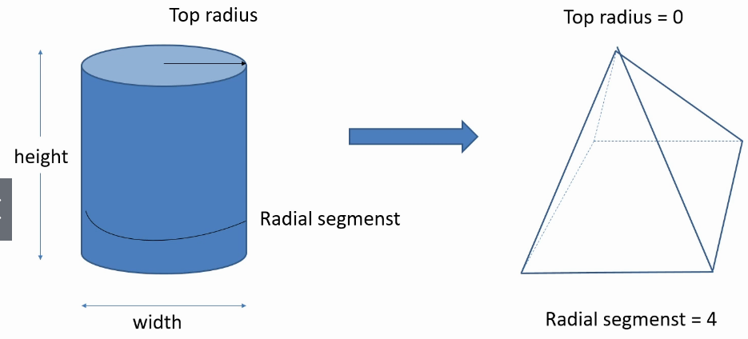

<!--ts-->
   * [three.js](#threejs)
      * [Terms](#terms)
      * [The Blueprint files](#the-blueprint-files)
      * [The Renderer](#the-renderer)
      * [The Scene](#the-scene)
         * [Add axes helper for make it easier to debug](#add-axes-helper-for-make-it-easier-to-debug)
         * [Box](#box)
         * [Sphere](#sphere)
         * [Cylinder](#cylinder)
            * [Pyramid](#pyramid)
            * [Half Sphere](#half-sphere)
         * [Torus](#torus)
            * [Arc](#arc)
            * [Flat Ring](#flat-ring)
         * [Custom Geometry](#custom-geometry)
      * [Material](#material)
         * [MeshBasicMaterial](#meshbasicmaterial)
         * [MesshNormalMaterial](#messhnormalmaterial)
      * [Camera](#camera)
         * [Perspective camera](#perspective-camera)
            * [Change the field of view as zoom in/out effect](#change-the-field-of-view-as-zoom-inout-effect)
            * [Change camera position while the camera focus on a spcific point](#change-camera-position-while-the-camera-focus-on-a-spcific-point)
         * [Orthographic camera](#orthographic-camera)
      * [User Interaction](#user-interaction)
         * [mouse events](#mouse-events)
      * [Reference](#reference)

<!-- Added by: gil_diy, at: 2020-06-06T12:28+03:00 -->

<!--te-->


# three.js

## Terms

* The action of taking a geometric shape and wrap it with a specific material is done via 
an object called **"mesh"**


## The Blueprint files

```js

let scene, camera, renderer;

// setup the environment
// initialize scene, camera, objects and renderer
let init = function(){
	// 1. create scene
	// ...

	// 2. create a location to the camera
	// ...

	// 3. create  and locate the objects on the scene
	// ...

	// 4. create and renderer
	// ...
};

// main animation loop - calls every 50-60 ms
let mainLoop = function(){
	requestAnimationFrame(mainLoop);
}

init();
mainLoop();

````


##  The Renderer
The final thing is to take the scene that shows the application, and the camera that sets the **point of view**, and locate them both on the html.

* This task is made by the renderer object.

* This object interacts with the html and enables us to see the application we've made on the browser.

## The Scene

```js
let init = function(){
	// 1. create scene
	scene = new THREE.Scene();
	scene.background = new THREE.Color(0xababab);


	// 2. create a location to the camera
	camera = new THREE.Perspective(30,
									window.innerWidth / window.innerHeight,
									1,1000
									);
	// by default the camera position is at (0,0,0)
	camera.position.z = 5; 


	// 3. create  and locate the objects on the scene
	// ...

	// 4. create and renderer
	renderer = new THREE.WebGLRenderer();
	renderer.setSize(window.innerWidth, window.innerHeight);
	document.body.appendChild(renderer.domElement);
};

// main animation loop - calls every 50-60 ms
let mainLoop = function(){
	renderer.render(scene,camera);
	requestAnimationFrame(mainLoop);
}
```

### Add axes helper for make it easier to debug

Add this into the init function:

```js
let axes = new THREE.AxesHelper(5);
scene.add(axes);
```


### Box
```js
let cube;

let createCube = function(){
	let geomtry = new THREE.BoxGeometry(1,1,1);
	let material = new THREE.MeshBasicMaterial({color: 0x00a1cb});
	cube = new THREE.Mesh(geometry.material);
	scene.add(cube)
}
```

### Sphere


The more segments there are them more rounded the object look like.
```js
let cube;

let createSphere = function(){
	let geomtry = new THREE.SphereGeometry(5,30,30);

	let material = new THREE.MeshBasicMaterial({color: 0xffffff, 
												wireframe: true});

	sphere = new THREE.Mesh(geometry.material);
	scene.add(sphere)
}
```
### Cylinder


#### Pyramid
```js
let createPyramid = function(x, y, z, width, height) {
	let geometry = new THREE.CylinderGeometry(0, width, height, 4);
	let p = new THREE.Mesh(geomtry, material);
	p.position.set(x,y,z);
	p.castShadow = true;
	p.receiveShadow = true;
	return p;
}
```

<p align="center"> <!-- style="width:400px;" -->
  
</p>


<p align="center"> <!-- style="width:400px;" -->
  
</p>


#### Half Sphere
```js
// Horizontal sweep the angle between the start to the end is called Phi
let geomtry = new THREE.SphereGeometry(5,30,30, 0, Math.PI);


// Vertical sweep, the angle between the start to the end is called Theta

let geomtry = new THREE.SphereGeometry(5,30,30, 0, 2*Math.PI, 0,Math.PI/2);
```


### Torus
```
let geomtry = new THREE.TorusGeometry(5,1,20,20)
```

#### Arc
```
let geomtry = new THREE.TorusGeometry(5,1,20,20, Math.PI)
```

#### Flat Ring
```
let geomtry = new THREE.TorusGeometry(5,1,2,20)
```
* The 2 makes it flat


### Custom Geometry

```js
let geometry = new THREE.Geometry();

// Adding 4 vertices 
geometry.vertices.push(new THREE.Vector3(3,0,0));  // vertices[0]
geometry.vertices.push(new THREE.Vector3(0,5,0));  // vertices[1]
geometry.vertices.push(new THREE.Vector3(0,0,2));  // vertices[2]
geometry.vertices.push(new THREE.Vector3(1,2,-2)); // vertices[3]

// Creating 3 faces out of the 4 vertices
geometry.faces.push(new THREE.Face3(0,1,2));  // First face
geometry.faces.push(new THREE.Face3(1,2,3));  // Second face
geometry.faces.push(new THREE.Face3(0,2,3));  // Third face

let material = new THREE.MeshBasicMaterial({color: 0xffffff, side:THREE.DoubleSide});
let shape = new THREE.Mesh(geometry, material);
scene.add(shape);

```

For updating the vertices we can write in the main loop:
```js

let mainLoop = function(){
	shape.geomtry.vertices[1].y -= 0.02;
	shape.geomtry.verticesNeedUpdate = true

	renderer.render(scene,camera);
	requestAnimationFrame(mainLoop);
}

```

## Material

Variety of materials that react to light and that would give more realistic look to our scenes.

### MeshBasicMaterial

```js
let material = THREE.MeshBasicMaterial({color: 0xff0040, transparency: true, opaciity: 0.7})
```


### MesshNormalMaterial
```js
let material = THREE.MesshNormalMaterial();
```

## Camera
### Perspective camera
This camera designed to mimic how the uman eye sees.
It gives a perspctive to the scene - closer objects woul look bigger than farther objects.


argument | meaning
------------|-----
 fov | The angle which is called field of view
 aspect | aspect ratio (angle)


```js

fov = 75
aspect = window.innerWidth / window.innerHeight
near = 1
far = 1000
let camera = new THREE.perspectiveCamera(fov, aspect, near, far);

camera.position.set(0,10,40)
```

In case you would like to change the fov in the main loop:

#### Change the field of view as zoom in/out effect
```js
let mainLoop = function(){
	camera.fov +=ADD;
	camera.updateProjectionMatrix();
	if (camera.fov > 100 || camera.fov < 50)
		ADD*=-1;

	renderer.render(scene, camera);
	requestAnimationFrame(mainLoop);
}
```
#### Change camera position while the camera focus on a spcific point

```js
let theta = 0;
let ADD = 0.01;

let mainLoop = function(){

	// Sets the location where the camera will focus on

	camera.lookat(new THREE.Vector3(0,0,0));
	camera.position.x = 40 * Math.sin(theta);
	camera.position.z = 40 * Math.cos(theta);
	theta+=ADD;

	renderer.render(scene, camera);
	requestAnimationFrame(mainLoop);
}
```

### Orthographic camera
```js
let camera = new Three.OrthographicCamera(left, right, top, bottom, near,far);
```


## User Interaction

### mouse events

 Event name | Title2
------------|-----
click | element-description
mouse move | 
mouse drag | 
mouse enter | 
mouse leave | 


```js

let onMouseClick = function(e){
	ADD *= -1;
}

let init = function(){
	...
	document.addEventListner("click", onMouseClick = false);
}


let mainLoop = function(){
	cube.roatation.x +=ADD;
	cube.roatation.y +=ADD;

	renderer.render(scene, camera);
	requestAnimationFrame(mainLoop);
}
```

## Reference

[Nice explanantion](https://hackernoon.com/introduction-to-3d-javascript-library-threejs-basics-aec33yfb)