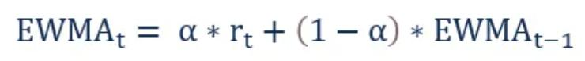
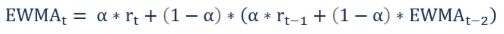
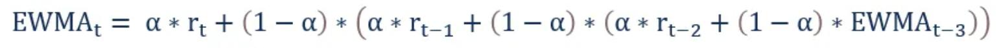

<!--ts-->
- [Time-Series](#time-series)
  - [Converting to Time-Stamp](#converting-to-time-stamp)
  - [Slicing date-time type](#slicing-date-time-type)
  - [Rolling Window Statistics](#rolling-window-statistics)
  - [Expanding Window Statistics](#expanding-window-statistics)
  - [Exponentially Weighted Moving Average (EWMA)](#exponentially-weighted-moving-average-ewma)
  - [Baseline Forecasts using darts](#baseline-forecasts-using-darts)
    - [NaiveSeasonal](#naiveseasonal)
    - [NaiveMean](#naivemean)
    - [NaiveDrift](#naivedrift)
    - [ExponentialSmoothing](#exponentialsmoothing)
    - [AutoARIMA](#autoarima)
    - [ARIMA (autoregressive integrated moving average)](#arima-autoregressive-integrated-moving-average)
    - [Theta](#theta)
    - [FFT (Fast Fourier Transform)](#fft-fast-fourier-transform)
  - [Classical Machine Learning approaches](#classical-machine-learning-approaches)
  - [Deep Learning approaches](#deep-learning-approaches)
  - [Hyper parameters with Grid search](#hyper-parameters-with-grid-search)
  - [Statsmodels](#statsmodels)
  - [Useful packages for time series](#useful-packages-for-time-series)
- [Reference](#reference)

<!-- Added by: gil_diy, at: Wed 23 Feb 2022 13:13:15 IST -->

<!--te-->

 Time-Series

# Time-Series

## Converting to Time-Stamp

```python
df['Date'] = pd.to_datetime(df['Date'], format='%d/%M/%Y')
```

## Slicing date-time type

Approach #1:

```python
df['2012-1':'2012-1-2 00:00:00', 'Date']
```


Approach #2:

```python
df['Date'].truncate(before='2013-11-01', after='2013-11-02')
```


## Rolling Window Statistics

```python
load_val = ts_data['load']
shifted = load_val.shift(1)

window = shifted.rolling(window=6)

new_dataframe = concat([window.min, window.mean(), window.max(), load_val], axis=1)
new_dataframe.columns = ['min','mean','max', 'load']

print(new_dataframe.head(10))
```

## Expanding Window Statistics

Expanding window are features that include all previous data. 

```python
load_val = ts_data['load']
window = load_val.expanding()

new_dataframe = concat([window.min(), window.mean(), window.max(), load_val.shift(-1)], axis=1)
new_dataframe.columns = ['min','mean','max', 'load+1']

print(new_dataframe.head(10))
```


## Exponentially Weighted Moving Average (EWMA)

The Exponentially Weighted Moving Average (EWMA) is a quantitative or statistical measure used to model or describe a time series. The EWMA is widely used in finance, the main applications being technical analysis and volatility modeling.

The moving average is designed as such that older observations are given lower weights. The weights fall exponentially as the data point gets older – hence the name exponentially weighted.

The only decision a user of the EWMA must make is the parameter alpha. The parameter decides how important the current observation is in the calculation of the EWMA. The higher the value of alpha, the more closely the EWMA tracks the original time series.

The window size can be of size two, current value and the previous:

<p align="center" style="width:400px;" >
  
</p>

or the window can consist of three values:

<p align="center" style="width:450px;" >
  
</p>

or the window can consist of four values:

<p align="center" style="width:500px;" >
  
</p>


[Reference](https://corporatefinanceinstitute.com/resources/knowledge/trading-investing/exponentially-weighted-moving-average-ewma/)


## Baseline Forecasts using darts
### NaiveSeasonal
### NaiveMean
### NaiveDrift
### ExponentialSmoothing
### AutoARIMA
### ARIMA (autoregressive integrated moving average)
### Theta
### FFT (Fast Fourier Transform)

## Classical Machine Learning approaches

## Deep Learning approaches

## Hyper parameters with Grid search


## Statsmodels

```python
from statsmodels.tsa.ar_model import AutoReg, ar_select_order

for t in range(test_ts.shape[0]):
   model = AutoReg(ts_data_load, 1)
   model_fit = model.fit()
   yhat = model_fit.predict
   predictions.append(yhat)
   obs = list(test_ts.iloc[t])
   # move the training window
   history.append(obs[0])
   history.pop(0)
   print(test_ts.index[t])
   print(t+1, ': predicted =', yhat, 'expected =', obs)
```

[Reference](https://machinelearningmastery.com/autoregression-models-time-series-forecasting-python/)


## Useful packages for time series


[Darts](https://github.com/unit8co/darts)

[Merlion](https://github.com/salesforce/Merlion)

[Pycaret](https://towardsdatascience.com/new-time-series-with-pycaret-4e8ce347556a)


# Reference

[Great resource](https://www.kaggle.com/competitions/amp-parkinsons-disease-progression-prediction/discussion/388550)