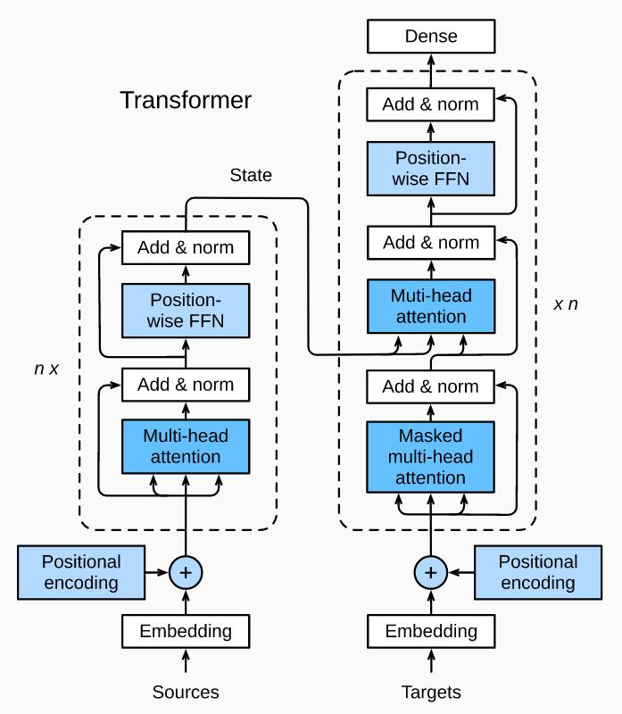
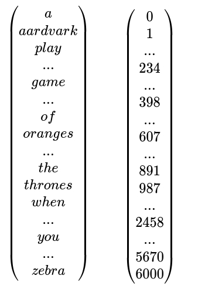
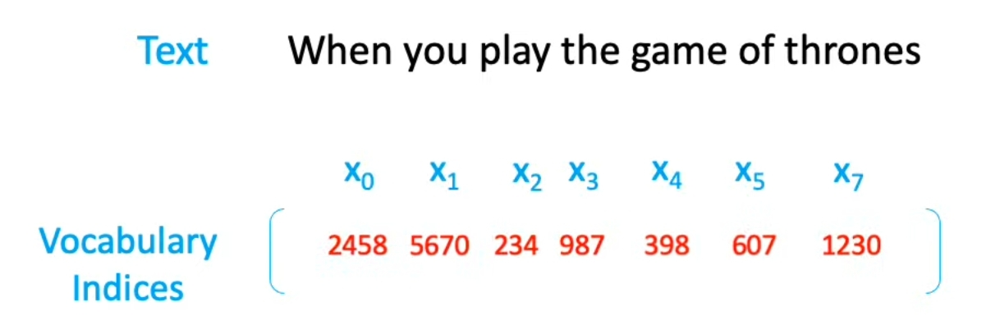
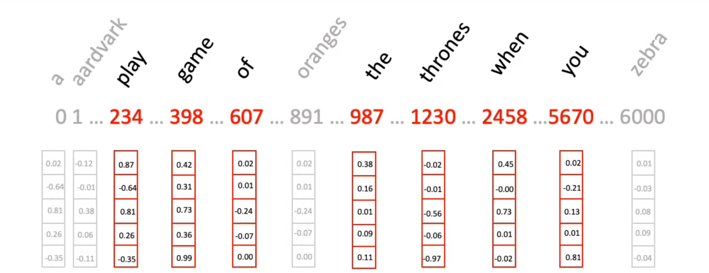
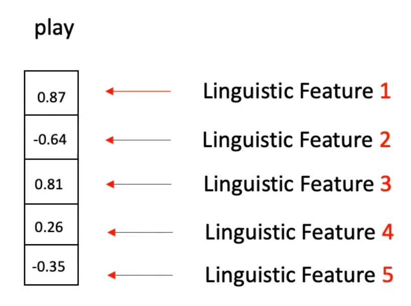

<!--ts-->
* [General Language Model](#general-language-model)
* [BERT - (Bidirectional Encoder Represetation Transformer)](#bert---bidirectional-encoder-represetation-transformer)
      * [Position embeddings](#position-embeddings)
   * [Types of Attention](#types-of-attention)
      * [Encode-Decoder Attention](#encode-decoder-attention)
      * [Encoder Self-Attention](#encoder-self-attention)
      * [Decoder Self-Attention](#decoder-self-attention)

<!-- Created by https://github.com/ekalinin/github-markdown-toc -->
<!-- Added by: gil_diy, at: Sat 25 Mar 2023 12:41:06 PM IDT -->

<!--te-->

# General Language Model

**Goal:** Build a general, pre traind language representation model.

**Why**: This model can be adapted to various NLP tasks easily, we don't have to retrain a model from scratch every time.

RNNs are models that taken an input sequence and then go through it sequenctionally, the sequential completation makes it difficult to learn long term dependencies and also difficult to paralize too so there's an added cost of complication on top of that so the solution which was presented was the transformer.

# BERT - (Bidirectional Encoder Represetation Transformer)

On October 2018 Google research team came out with BERT a pre-trained bi-directional.
tansfomer that can be fine tune to many NLP tasks.

**BERT is:**

* **Bidirectional:** BERT is naturally bidirectional.

* **Generalizable:** Pre-trained BERT model can be fine-tuned easily for downstream NLP task. like: Question & Answering, natural lanague understanding things.

* **High-Performace:** Fine-tuned BERT models beat state-of-the-art results for many NLP tasks.

* **Universal:** BERT is trained on plain text, trained on Wikipedia + Book Corpus. No special dataset needed

naturally bi-directional it's means bi-directional in a set and this allows for the best contextual representation of the word of the sentence as you will see.

The key of success of transformer is self-attention.
as you recall RNN has the problem of sequensial processing make sit difficult to learn long term dependecies long term relationships.

**The Animal didn't cross the street because it was too tired**

Self attention does is allow words to learn relationships as all other words, so using self attention the model can learn **it** here has a very strong collection with **animal**.
That helps the model learn representation .

Now the model can output the best contextual representation of the word.

  

**Input**: When you play the game of Thrones ...

First step to any machine learning is **input data processing** 
First we take all our words in our training data and create vocabulary dictionary out of it. next we assign numeric number next to each word:

  

then we pick only the words that appear in the current input text.
get fed into the transformer the cprresponding indices.

  

Now this input is passed into the embedding layer:

  

Embedding layer has an index to every word in our vocabulary, and against of those indices a vector is attached. initialy this vectors are filled up with random numbers. later during train phase...

  

* In the image above I have chosen word embedding size of 5 so that they fit my
screen.

* Just to let you know the **original transformer paper** on the other hand
went with the **embedding size of 521** so what are what embeddings well these
are just vector representation of a given word each dimension of the
word embedding tries to **capture some linguistic feature** about that word
these could be things like whether the word is verb or an entity or something else but in reality since the model decides these features itself during training .

### Position embeddings

Into word embeddings then these get passed further on to the next layer
so let us move on to the next component **position embeddings** but why do we need them?
consider this if a **LSTM** were to take up these embeddings it would do so **sequentially one embedding at a time which is why they're so slow** there is a positive side to this however since LSTM take the embeddings sequentially in their designated order they know which word came first which word came second and so on transformers on the other hand take up all embeddings at once now even though this is a huge plus and makes transformers much faster the downside is that they **lose the critical information related to word ordering in simple words** they are not aware of which word came first in the sequence and which came last now that is a problem.

  

  

## Types of Attention
### Encode-Decoder Attention
### Encoder Self-Attention
### Decoder Self-Attention
