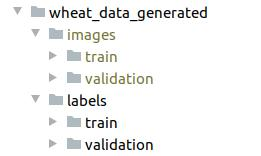

<!--ts-->
   * [YOLO](#yolo)
      * [Basic operations](#basic-operations)
         * [Recognize objects in a photo:](#recognize-objects-in-a-photo)
         * [Recognize objects in a video:](#recognize-objects-in-a-video)
         * [Changing The Detection Threshold](#changing-the-detection-threshold)
      * [Training YOLOv3/v4 model](#training-yolov3v4-model)
      * [The format of the text file is:](#the-format-of-the-text-file-is)
      * [See List of all classes pretrianed in yolov5](#see-list-of-all-classes-pretrianed-in-yolov5)
      * [Training](#training)
         * [Strart training](#strart-training)
         * [Image and labels directory structure](#image-and-labels-directory-structure)
         * [How to train Yolo with images different sizes:](#how-to-train-yolo-with-images-different-sizes)
      * [Detection (Prediction)](#detection-prediction)
         * [Filter many classes except some few builtin classes:](#filter-many-classes-except-some-few-builtin-classes)
         * [Get the bounding box of each frame:](#get-the-bounding-box-of-each-frame)
      * [Reference](#reference)

<!-- Added by: gil_diy, at: 2020-10-22T03:00+03:00 -->

<!--te-->


#  YOLO


The actual classes names appear in the file: `coco.names`

## Basic operations

### Recognize objects in a photo:
```
./darknet detect cfg/yolov4.cfg weights/yolov4.weights data/dog.jpg
```

### Recognize objects in a video:
```
./darknet detector demo cfg/coco.data cfg/yolov4.cfg weights/yolov4.weights input_video.mp4 -out_filename res.avi
```


### Changing The Detection Threshold

By default, YOLO only displays objects detected with a confidence of .25 or higher. You can change this by passing the -thresh <val> flag to the yolo command. For example, to display all detection you can set the threshold to 0:

```
./darknet detect cfg/yolov4.cfg weights/yolov4.weights data/dog.jpg -thresh 0
```

## Training YOLOv3/v4 model

[Link](https://machinelearningmastery.com/how-to-perform-object-detection-with-yolov3-in-keras/)

[Link](https://blog.paperspace.com/how-to-implement-a-yolo-object-detector-in-pytorch/)


## The format of the text file is:

```
<class number> <Cx> <Cy> <Width> <Height>
```

[Documentation - Well explained steps](https://github.com/AlexeyAB/darknet#how-to-train-to-detect-your-custom-objects)


## See List of all classes pretrianed in yolov5

```bash
cat ./yolov5/data/coco.yaml
```

## Training 

### Strart training

```bash
python ./train.py --img 1024 --batch 16 --epochs 100 --data wheat_gdrive.yaml --cfg models/yolov5s.yaml --name wheat_model
```

Int the **yaml** file in the example: **wheat_gdrive.yaml** is written the actual path for both **training set** and **validation set** :

```yaml

train: /content/drive/My Drive/Colab_Notebooks/datasets/yolov5/wheat_data_generated/images/train
val: /content/drive/My Drive/Colab_Notebooks/datasets/yolov5/wheat_data_generated/images/validation
nc: 4
names: ["class_name1",
        "class_name2",
        "class_name2",
        "class_name3"]
```

### Image and labels directory structure

**Good practice will be** split the dataset into:

*  **70% Training** 

* **20% Validation**

* **10% Testing**

Now we focus only for building a model with the **Training** and **Validation** :

<p> <!-- style="width:400px;" -->
  
</p>

Afterwards we will use the **Testing set** for checking accuracy.

### How to train Yolo with images different sizes:

[Reference](https://stackoverflow.com/questions/49450829/darknet-yolo-image-size)


## Detection (Prediction)

### Filter many classes except some few builtin classes:

lets say I would like to detect only 'car', therfore i would write:

```bash
python detect.py --source ./Before.mp4 --classes 2
```

Car is class number 2, it can be seen from coco.yaml


### Get the bounding box of each frame:

Use the `--save-txt`

```bash
python detect.py --source ./Before.mp4 --save-txt
```


## Reference

[Darknet/YOLO](https://pjreddie.com/darknet/)

[Github YOLO creator](https://github.com/pjreddie)

[YOLO demo](https://robocademy.com/2020/05/01/a-gentle-introduction-to-yolo-v4-for-object-detection-in-ubuntu-20-04/)

[Yolo v3 explained very well](https://towardsdatascience.com/yolo-v3-object-detection-53fb7d3bfe6b)


Here below is a link for a convienient way **to get various backgrounds** for the images:
[Describable Texture Dataset](https://www.robots.ox.ac.uk/~vgg/data/dtd/)

[python library for augmenting images](https://github.com/aleju/imgaug)

[Labelimg](https://github.com/tzutalin/labelImg)